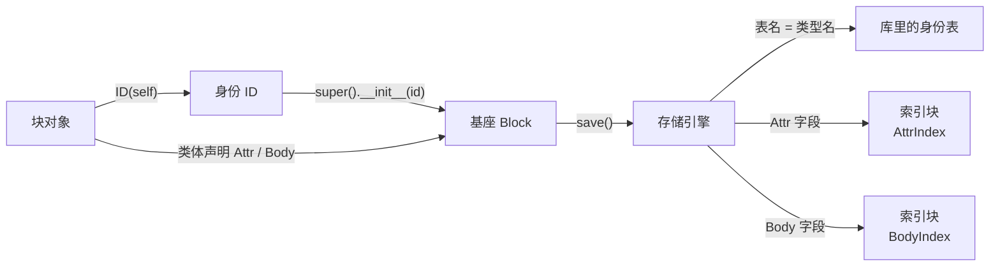

<!-- SPDX-FileCopyrightText: 2026 HanYang06 -->
<!-- SPDX-License-Identifier: Apache-2.0 -->
<!-- translation-source-hash: 8e8cdd38204e57923616c8c285d0180f5b8e6070f8ca80ea52d3d7bfd34bca67 -->
# Block Paradigm: Declaration, Identity, and Indexing

> Status: **Current** (2026-10-02, to be updated based on post-implementation results).
The placement of §1.1 and §4, as determined by the storage ruling for the same date, is changed to **attribute slot/main text slot**, **coded**;
> See the detailed criteria.

This document was originally a **handover draft** (final version dated October 1, 2026), outlining the target architecture of the “Value Paradigm.”
This paradigm has been fully implemented: the block structure, the source of identities, and the indexing scheme have all been realized as described in this paper.
Therefore, this paper is no longer about the “objective,” but rather about the **criteria and rationale**—it answers the question, “Why this particular approach?”
Which writing styles have already been rejected? Disk persistence details shall be subject to [L0 存储设计](storage-design.md).

---

## 0. One sentence

**Inheritance `Block`, field declarations are written within the class body. **Whether or not an ID determines whether it is a "block" or a "structure that exists only within the payload";
Where there is an ID, there is naturally a table. Indexes are not a database feature; instead, the kernel implements them using the same blocks.

Three criteria:

1. The criterion is applied to the value, not to the field name or the annotation.
2. **Declarations are placed within the class body**—this is where field types and landing-point declarations are both valid.
3. **If it can be calculated from the primary table, do not create a second copy.**

---

## 1. Declaration: Descriptors on the Class Body

```python
class NoteGroup(Block):
    title: str = Attr("")  # 可索引：进反表
    collapsed: bool = Attr(False)  # 可索引
    notes: list[str] = Body([])  # 进正文槽，按内容摘要去重
    groups: list[str] = Body([])
```

-On the left is the **annotation**: the field’s static type, which is only for mypy; at runtime, annotations are ignored.
-On the right are the **landing-point declarations**: `Attr(...)`/`Body(...)`; they are descriptors (`core/storage/types.py`).
-**The instance stores raw values**: Pass the value directly, without passing the declaring object.

Three semantic conditions must all be met for this formulation to hold; if even one is missing, it does not apply.

1. **A declaration in a class body is just that—a declaration**: it specifies the location, not “a single value shared by all instances”;
2. **The instance's value is stored in the instance itself**: What is being modified is this instance's list.
-- Simply return the object; any on-the-spot modifications will take effect immediately.
3. **Declarations outlive assignments**: Only the value is changed; the storage location is determined by the declaration in the class body.

**Declare the class body, not `__init__`**: Putting it in the constructor will make this instance field...
The static type becomes the declared type, and thereafter it is inconsistent with `group.title = "标题"`.

**The container’s default value is copied when the instance retrieves it for the first time**: The list defined in the class body is shared; if you simply return it as is,
It will be applied to all instances. Therefore, writing it as `Attr({})` / `Body([])` is safe.

### 1.1 Classification of Values (The Sole Criterion for Classification)

| Value | Meaning | Landing Point |
|---|---|---|
| Instance | **Engine’s external interface** | Tables exist only with it; table names are derived from class names |
| `Attr(默认值)` | **Indexable Attribute** | Attribute Slot, **and Inverted Index** |
| `Body(默认值)` | **Content Field** | Body Slot (deduplicated by content summary) |
| Other bare assignments | Ordinary properties | Property slots, **without index support** |

Class lookup follows the declarations in the class itself (traversing the Method Resolution Order, with subclasses taking precedence for methods of the same name).
Additionally, include the extra public fields on the instance (those that are directly assigned values).

**No `indexed=` sub-parameter**: Using `Attr` means "indexing is required"; there is no on/off switch.
“The statement is made but not indexed” is a false problem—don’t index it if you don’t want it indexed; a bare assignment is already written to disk.

**It is not a type criterion**: Types exist only in annotations. The write period is limited to "throw an error if it cannot be encoded into canonical CBOR."
(`AttrTypeError`), the cost is given in §5.

---

## 2. The Chain of Transmission



Two directions: **upward identity** (object → base → engine) and **upward declaration** (class body → base → engine).

This chain is **visible** in the code: the base is the receiving end (whoever passes in the ID can persist it to disk),
Rather than scanning through instances afterward to guess the landing point.

---

## 3. Identity: It is the interface of the engine.

-`ID(self)` ≡ `ID(obj.__name__)`: **The table is named after the object used for signing.**
(Obtain the class name of the holder and convert it to lowercase);
-The table name is determined solely by the class name (`Block.type_name` = `type(self).__name__.lower()`).
There is no first-class coverage, nor are there any declaration files;
-It is the **receiving end**: accept the identity; if it’s not provided, sign one on the spot ().
-**ID Optional**: The type of ID submitted is a block (registration, table creation; can be stored and queried independently);
What wasn’t passed is a structure that exists only within the payload (a value object); it is neither registered nor mapped to a database table.

The fields and mutability of `ID` are described in §4.3.

---

## 4. Attribute Slots and Body Slots

It is a **location declaration**, not a value type like a "payload pointer." It answers which side a field goes to:

-**Attribute Slot**: Stores all attributes of this block (both declarations and bare assignments are placed here), which can be overwritten in place;
-**Body Slot**: Stores the body fragments of the field, appends only, and deduplicates based on content summaries.

**Text segments are sliced according to the inherent logical order of the text itself**; the read-back sequence is determined by the segment list recorded in the index library, and no segment numbers are stored on the slots.
The main text is judged as identical based on the abstract; only the addition (**storage without generation preservation**, ruling dated 2026-10-06) is considered, while attributes are not taken into account; the two index blocks are enhancements.
-- Criteria and selection are shown in [块的组成与落点](py_core/storage/block-parts.md).

---

## 5. Index: Two Faces Implemented by the Kernel Using Blocks

**Not a database feature**: SQLite is merely the storage format for the index library; it does not perform semantic indexing on behalf of the kernel.
Reverse lookup is implemented by the kernel using **the same block**.

| Type | Positive Table (Input) | Negative Table (Output) |
|---|---|---|
| `AttrIndex` | Attribute in the attribute slot (field declared by `Attr`) | Attribute value → Block identity |
| `BodyIndex` | Block content location (abstract) | Abstract → Body position (coordinates across pack/hub) |

Three steps for pipeline fixation: **Create the forward table → Create the reverse table from the forward table → Perform a reverse lookup using the reverse table**.

-**Two indexes directly inherit `Block`**, are at the same level as each other, and also share the same path as any block: they have IDs.
So I ended up in that identity table in the database;
-**The forward table is stored in the index block, while the reverse table is not**: The reverse table is represented by `IndexEngine.search` / `count`
When reading, calculate from the positive representation (see §8.4 for the reason);
-**Two index blocks are created by the engine on demand**: A zero-parameter constructor means self-signing of the identity.
Thus, it has its own timestamp and identity, making it verifiable—just like any other block.
-**The discovery of index types relies on `manages`**, not on inheritance—both indexes directly inherit from `Block`.
If you search by inheritance, you won’t find a single result, and the entire chain will silently become invalid.

---

## 6. Converged Differences (Current Status of the Original Execution List)

Section 6 of the original document is a difference table comparing the current state with the target state, and Section 7 outlines the sequence of execution. The checklist is already completed.
Therefore, the two sections have been consolidated into the following **results table**—the left column shows the original state, while the right column shows the current state.

| Original's "Current" (2026-10-01) | Current Status |
|---|---|
| `class X(Block)`,`@dataclass` Has left the block | Stay |
| `self.id = ID()`(empty signature identity) | `self.id = ID(self)`(with holder), or a base-level signature is generated when using the no-argument constructor |
| `attr(default=…, factory=…, indexed=…)` Annotation | `Attr(...)` / `Body(...)` descriptor on the class body |
| Shape determined by zero-parameter probes + scanning **categorized by tags** | Reads **declarations on the class body** (`kinds_of`), then merges in any additional bare assignments from instances |
| Table names are derived from `cls.__name__.lower()` and then registered | Table names are computed solely from the class name (`type(self).__name__.lower()`) |
| `attrindex`: Module functions + memory `dataclass` | `AttrIndex` Blocks (with IDs, with tables, payload loaded into the table) |
| None `BodyIndex` | `BodyIndex` blocks, on the same level as `AttrIndex` |
| `indexed=` Lists which attributes are searchable | Once used, it’s enabled; no toggle |
| `tools/mypy_plugin.py` | Deleted (Retained) |
| Replace the marker with the actual default value | This step does not exist: copy the descriptor’s `__get__` default value now |
| Declarations are placed within `__init__` | Declarations are placed within the class body (for the reason in §1) |
The parameter of | `Body(...)` is the "binding target"; the parameter of | `Body(...)` is the **default value** (target point declaration).
| Index block "only in the index database, not written to the carrier" | Index blocks **are also blocks**: payload goes into the main table, identity goes into the identity table |
---

## 7. Paths That Have Been Eliminated (Relapse Prevention)

-**Class body annotation declaration (when marked)** -- Annotations within the function body will be discarded by the interpreter;
However, annotations on class bodies are safe, so the current practice is to “annotate for mypy and assign the right-hand side to the target.”
-**Used on blocks** -- it will reconstruct the class object, and the base must be traversed twice.
-**mypy plugin restores field visibility types** -- The descriptor already provides the correct static type.
-**Generic Shell** -- After the payload is expressed by `Body` declaration, the generic parameter has no carrier.
-**Payload type (Type I)** -- It does not have a separate drop point; the field is directly attached to the carrier.
-**List** -- Whether it is searchable depends on the declaration; each fact is not repeated.
-**Treat the index as a database feature** (relying on SQLite’s indexing) **or an in-memory bypass**—the index is implemented as blocks within the kernel.
-**Table structure declaration file** -- A table is created by a "type that uses an ID"; the declaration file is the second piece of evidence and inevitably leads to a fork.
-**Covered vulnerability** -- The table name has only one source.

---

## 8. The Price That Must Be Paid

-**Attributes have no runtime type checks**: Types exist only in annotations (used by mypy); at runtime, only
"Throw an error if it cannot be encoded into canonical CBOR." Trading an entire annotation system for a single set of annotations—this price is acceptable;
-**All instances must be initialized using the no-argument constructor before assignment**: Declared within the class body; in this case, parameterized constructors are not applicable.
-**Reverse table without disk spill**: To perform a query, you must first scan the primary table—what is read is the payload of the index blocks.
This is also the source of the principle that "changing a single field will not cause the reverse table to be inconsistent with the fact table."

---

## 9. Pending Items (Remaining After Convergence)

Of the three clauses in Draft §9, two have already been ruled on, leaving only one still open.

| Item | Status |
|---|---|
| Parameter semantics of `Body(...)` | **Cropped**: Default value (drop-point declaration), not the binding target |
| Is the index block written to the carrier? | **Cropped**: Yes. An index block is a block; the primary table carries its payload, and its identity is recorded in the identity table.
| The first caller of | **Cut but not wired**: `IndexEngine.search` / `count` is available; the command interface and UI**still have no entry point** (see [L0 存储设计](storage-design.md) §11) |
| `Attr` Only meaningful for scalars; containers can still be declared | **To be removed**: Searching by container can only be an "contains" query; currently, neither the implementation nor any callers exist. Should we disable the container, or add an "includes"-style query? Neither option will be persisted to disk; we can decide later.
