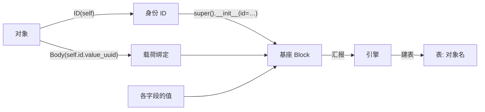

<!-- SPDX-FileCopyrightText: 2026 HanYang06 -->
<!-- SPDX-License-Identifier: Apache-2.0 -->

# 块范式：声明、身份与索引

> 状态：**草案（待实施）**。本文描述**目标形态**，不是现状——现状见 [`kernel.md`](./kernel.md)
> 与 [`storage-design.md`](./storage-design.md)。按本仓红线，"草案"意味着**不得按图索骥**：
> 开工前先读代码。
>
> 本文的用途是**交接**：把已经定下的范式写全，供新一轮对话照着执行。定稿日期 2026-10-01。

---

## 0. 一句话

**继承 `Block`，在 `__init__` 里声明字段。** 有没有 ID 决定它是"块"还是"只活在载荷里的结构"；
有 ID 就自然有表，**表名取自 ID 的名字**。索引不是数据库功能，而是内核用同样的块实现的。

三条判据：

1. **判据落在值上**，不落在字段名、也不落在注解上；
2. **绑定靠取值**——用对象上已有的值去声明另一处，不另造绑定语法；
3. **能由正表算出来的，就不写第二份**。

---

## 1. 声明：语言就是 Python 的赋值

类体注解**不可用**：`self.x: attr[str] = …` 写在函数体里时，注解会被解释器丢掉
（连求值都不发生，已实测）。故运行期的性质只能由**右侧的值**给出。

```python
Limit = conf("note.group.limit", 200, type=int, doc="组结构最大深度")

class NoteGroup(Block):
    def __init__(self) -> None:
        super().__init__(id=ID(self))          # 身份：交给基座
        self.body = Body(self.id.value_uuid)   # 载荷：绑到这份身份
        self.title: str = ""                   # 属性：就是值
        self.collapsed: bool = False
        self.notes: list[str] = []             # 容器 → 不进反表（由值决定）
        self.limit = Limit                     # 配置：模块级声明一次，构造里取值
```

**注解只给 mypy 看**：静态可见，运行期不需要它，落盘不看它。

`conf(...)` 在**模块级**声明一次、构造里取值：配置面要求"一次声明、进程内唯一"，
把声明放进 `__init__` 会在第二次构造时触发 `ConfigDuplicateError`。

### 1.1 值的分类（唯一的分类判据）

| 值 | 含义 | 落点 |
|---|---|---|
| `ID` 实例 | **引擎对外的口子** | 有它才有表；表名取自它的名字 |
| `Body` 实例 | **载荷指针** | body 记录（按内容地址去重的那一份） |
| 其余标量 | 属性 | 块记录载荷；**可进反表** |
| 其余容器 | 属性 | 块记录载荷；**不进反表**（不可哈希，按它查只能是"包含"式） |

分类读的是 `vars(obj)`——**Python 原生提供的**，不需要哨兵、不需要标记对象、
也不需要"把标记换成真实值"那一步替换。

---

## 2. 传递链



两个方向：**身份向上**（对象 → 基座 → 引擎）、**声明向上**（字段 → 基座 → 引擎）；
而载荷与引用**回指对象上已有的值**（`self.id.value_uuid`），不必另写绑定代码。

这条链要在代码里**看得见**：基座是接收端与账本（谁递了 ID 进来，谁就在册），
而不是事后扫一遍实例去猜。

---

## 3. 身份：`ID` 是引擎的口子

- `ID(self)` ≡ `ID(obj.__name__)`：**用哪个对象签的身份，表就叫那个名字**。
- **表名从 ID 取**，不再从类名推。于是"我知道哪个对象用了 ID"与"给它建表"是同一件事，
  中间不需要第二处登记。
- `Block.__init__(id=…)` 是**接收端**：收下身份、记进账本，并转交引擎。
- **ID 可选**：递了 ID 的类型是块（登记、建表、可单独落盘与查询）；
  没递的是**只活在载荷里的结构**（值对象），不登记、不建表。

---

## 4. 载荷：`Body` 是值，不是声明标记

`Body(...)` 与 `ID(...)` 同级——都是**引擎认得的值的类型**，不是一套声明语法。
它的参数是**绑定目标**，写的是对象上取得到的东西：

```python
self.body = Body(self.id.value_uuid)
```

绑定之所以顺理成章，是因为它就是一次属性访问；跨对象同理
（`other.id.value_uuid` 一样取得到，框架不区分本地与外部）。

---

## 5. 索引：内核用块实现的两个面

**不是数据库功能**：SQLite 只是块的一种存放形式，它不会替内核做语义索引。
反查由内核用**同样的块**实现。

| 类型 | 正表（输入） | 反表（输出） |
|---|---|---|
| `AttrIndex` | 块记录载荷里的属性 | 属性值 → 块身份 |
| `BodyIndex` | 块记录里的指针两列 | 内容凭证 → 块身份 |

管道固定三步：**建正表 → 由正表建反表 → 拿反表反查**。

- 两者都是 `tier=derived`（`rebuild_from` 写正表）：丢了重算即可。
- **反表不写进载体，只活在索引库**。理由：它可由正表演算，写进去就要跟着写路径维护、
  要巡检、要压实，而它的全部价值只是"查得快"。落点现成——`progress.md` 里那条预留
  「只在库里的结构（不进载体、只活在库里）」的第一个真调用方就是这两个索引。
- 两个索引块**由内核自己造**：`AttrIndex()` 自己声明 `self.id = ID(self)`，
  于是它自己就有表、有身份、可查，与任何一个块一样；内核不必为"索引"另开机制。
- 成本不对称：`AttrIndex` 的属性不在列里，只能顺扫载体；`BodyIndex` 的指针就在块表两列里，
  一次查询即可。

**调用方**：`AttrIndex` 由命令面的 `query` 使用；`BodyIndex` 的第一个真调用方是
"删除 / 压实判引用"（尚未实现）。按本仓"零调用方即脚手架"的判例，
`BodyIndex` 应当**随那条线一起落**，或先给它一个当下调用方（界面上的"这份内容被谁引用"）。

---

## 6. 与现行实现的差异（执行清单的核心）

| 现行（2026-10-01 已落） | 目标 |
|---|---|
| `class X(Block)`，`@dataclass` 已从块上退场 | 保持 |
| `self.id = ID()`（空签身份） | `self.id = ID(self)`（带持有者）；**表名取自它** |
| `attr(default=…, factory=…, indexed=…)` 标记 | 普通赋值；类型靠注解 |
| `Body(default=…, factory=…)` 声明标记 | `Body(...)` 是值（载荷指针），参数是绑定目标 |
| 形状由零参探针 + 扫 `vars()` **按标记分类** | 读 `vars()`，**按值的类型分类** |
| 表名取 `cls.__name__.lower()` | 表名取自 ID 的 `name` |
| `attrindex`：模块函数 + 内存 `dataclass` | `AttrIndex` 块（登记在册、有表、`derived`） |
| 无 | 新增同构的 `BodyIndex` 块 |
| `indexed=` 点名哪些属性可查 | 由值的性质决定（标量可查、容器不可查） |
| `tools/mypy_plugin.py` 已删 | 保持 |
| `_harvest` 把标记换成真实默认值 | 移除该步：值本来就是值 |

---

## 7. 执行顺序

1. **core / 身份**：`ID` 构造接收持有者并把对象名写进身份；表名改从 ID 取；
   `Block.__init__(id=…)` 成为接收端与账本。
2. **core / 声明**：删 `attr(...)` 标记与 `indexed=`；形状改按值的类型分类；
   `Body` 退成值。
3. **core / 索引**：`attrindex` 从"函数 + 内存对象"改成登记在册的 `AttrIndex` 块；
   新增 `BodyIndex`；两者 `derived`、只在索引库。
4. **model/note**：五个载体（`NoteData` / `NoteTag` / `NoteGroup` / `NoteAsset` / `NoteCanvas`）
   与值对象按新写法重写。
5. **命令面 / 边车**：`query` 走 `AttrIndex` 块。
6. **测试与文档**：迁移用例；回写 `kernel.md`、`storage-design.md`、`data-model.md` 与记忆。

每一步都要带测试，且**每一步结束时全绿**（本仓门禁见 `AGENTS.md` 的常用命令）。

---

## 8. 必须认下的代价

- **属性不再有运行期类型判据**：类型只活在注解里（mypy 用），写入期只剩
  "编不进 CBOR 即报错"。拿一套类型词汇表换掉一整套标记机制，这个代价认。
- **块一律零参构造再赋值**：声明在 `__init__` 里，`NoteData(title=…)` 这类带参构造不成立。
- **反表不落载体**：要查得先建——`AttrIndex` 要顺扫载体，`BodyIndex` 读块表两列即可。

---

## 9. 仍待作者裁定

1. `Body(...)` 的参数语义：本文按**绑定目标**写（另一读法是"缺省内容"）。
2. "索引 block" 是否指索引本身要**写进载体**：本文取"不写、只活在索引库"。
3. `BodyIndex` 的第一个调用方：随"删除 / 压实判引用"落，还是先接一个界面反查。

---

## 10. 已否掉的路径（防复发）

- 类体注解声明（`attr[T]`）——注解在函数体里会被解释器丢掉。
- `@dataclass` 用在块上——它会重建类对象，基座要跑两遍，且逼着登记表写幂等补丁。
- mypy 插件还原字段可见类型——`ID` / `Body` / 值的类型本身就是答案，不需要插件。
- `Block[T]` 泛型壳——载荷改由 `Body` 值表达后，泛型参数没有承载物。
- 载荷类（`NoteBody` 一类）——它没有独立落点，字段直接上载体。
- `__indexed__` 名单——可查与否由值的性质决定，一条事实不写两遍。
- 把索引当成数据库功能（靠 SQLite 的索引）或内存旁路——索引是内核用块实现的块。
