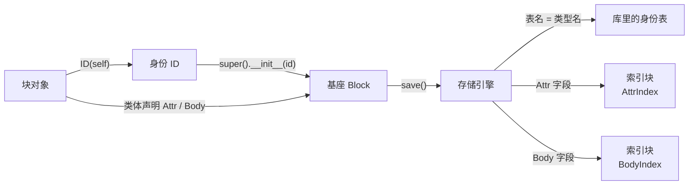

<!-- SPDX-FileCopyrightText: 2026 HanYang06 -->
<!-- SPDX-License-Identifier: Apache-2.0 -->

# 块范式：声明、身份与索引

> 状态：**现行**（2026-10-02 按落地后的实现回写）。
> **注意**：§1.1 的落点与 §4 已按同日裁定改为**属性槽 / 正文槽**（尚未落码）；
> 裁定主篇见[块的组成与落点](py_core/storage/block-parts.md)。

本文原先是一份**交接草案**（定稿 2026-10-01），描述"值范式"的目标形态。
该范式已经整条落地：块的写法、身份的来源、索引的形态都按本文实现了。
故本文不再是"目标"，而是**判据与理由**——它回答"为什么是这一套写法、
哪些写法已经被否掉"，落盘细节以 [L0 存储设计](storage-design.md) 为准。

---

## 0. 一句话

**继承 `Block`，字段声明写在类体上。** 有没有 ID 决定它是"块"还是"只活在载荷里的结构"；
有 ID 就自然有表。索引不是数据库功能，而是内核用同样的块实现的。

三条判据：

1. **判据落在值上**，不落在字段名、也不落在注解上；
2. **声明写在类体上**——那里是字段类型与落点声明同时成立的地方；
3. **能由正表算出来的，就不写第二份**。

---

## 1. 声明：类体上的描述符

```python
class NoteGroup(Block):
    title: str = Attr("")  # 可索引：进反表
    collapsed: bool = Attr(False)  # 可索引
    notes: list[str] = Body([])  # 进正文槽，按内容摘要去重
    groups: list[str] = Body([])
```

- 左边是**注解**：字段的静态类型，只给 mypy 看；运行期不认注解；
- 右边是**落点声明**：`Attr(...)` / `Body(...)`，它们是描述符（`core/storage/types.py`）；
- **实例里存的是裸值**：`group.title` 交出 `str`，不交出声明对象。

三条语义，缺一条这套写法就不成立：

1. **类体上的声明就是声明**：它描述落点，不是"所有实例共用的一份值"；
2. **实例的值存在实例自己的 `__dict__` 里**：`group.notes.append(...)` 改的是这个实例的列表
   ——`__get__` 直接把那个对象交还，就地增改原样生效；
3. **声明活得比赋值更久**：`group.notes = [...]` 只换值，落点由类体上的声明说了算。

**声明放类体、不放 `__init__`**：放进构造里，`self.title = Attr("")` 会让这个实例字段的
静态类型变成声明类型，此后 `group.title = "标题"` 与它不符。

**容器默认值在实例第一次取值时现拷一份**：类体上那个列表是共享的，直接交还它的话，
`first.notes.append(...)` 会改到所有实例。故 `Attr({})` / `Body([])` 这类写法是安全的。

### 1.1 值的分类（唯一的分类判据）

| 值 | 含义 | 落点 |
|---|---|---|
| `ID` 实例 | **引擎对外的口子** | 有它才有表；表名取自类名 |
| `Attr(默认值)` | **可索引属性** | 属性槽，**并且进反表** |
| `Body(默认值)` | **内容字段** | 正文槽（按内容摘要去重） |
| 其余裸赋值 | 普通属性 | 属性槽，**没有索引加持** |

分类读的是**类体上的声明**（`kinds_of` 按 MRO 铺一遍，同名以子类为准），
再并上实例上多出来的公开字段（那些是裸赋值）。

**没有 `indexed=` 这个副参数**：用了 `Attr` 就是"要索引"，没有开关。
"声明了却不索引"是个假问题——不要索引就不要声明，裸赋值本来就落盘。

**`Attr` 不是类型判据**：类型只活在注解里。写入期只剩"编不进 canonical CBOR 即报错"
（`AttrTypeError`），代价见 §5。

---

## 2. 传递链



两个方向：**身份向上**（对象 → 基座 → 引擎）、**声明向上**（类体 → 基座 → 引擎）。

这条链在代码里**看得见**：基座是接收端（谁递了 ID 进来，谁就能落盘），
而不是事后扫一遍实例去猜落点。

---

## 3. 身份：`ID` 是引擎的口子

- `ID(self)` ≡ `ID(obj.__name__)`：**用哪个对象签的身份，表就叫那个名字**
  （`_resolved_name` 取持有者的类名并小写）；
- **表名只由类名算出**（`Block.type_name` ＝ `type(self).__name__.lower()`），
  没有 `__table__` 一类覆盖，也没有声明文件；
- `Block.__init__(id=None)` 是**接收端**：收下身份；**不给就现签一个**（`ID(self)`）；
- **ID 可选**：递了 ID 的类型是块（登记、建表、可单独落盘与查询）；
  没递的是**只活在载荷里的结构**（值对象），不登记、不建表。

`ID` 的字段与可变性见 [L0 存储设计](storage-design.md) §4.3。

---

## 4. 属性槽与正文槽

`Body(...)` 是**落点声明**，不是"载荷指针"这种值的类型。它回答一个字段进哪一边：

- **属性槽**：装这个块的全部属性（`Attr` 声明与裸赋值都在这里），可原地覆盖；
- **正文槽**：装 `Body` 字段的正文分片，只追加，按内容摘要去重。

**正文分片按正文自身的逻辑顺序**切分；读回的顺序由索引库那一行记的段列表给出，槽上不记片号。
正文有历史（**以槽为单位**），属性不参与历史；两个索引块是增强件——判据与取舍见
[块的组成与落点](py_core/storage/block-parts.md)。

---

## 5. 索引：内核用块实现的两个面

**不是数据库功能**：SQLite 只是索引库的存放形式，它不会替内核做语义索引。
反查由内核用**同样的块**实现。

| 类型 | 正表（输入） | 反表（输出） |
|---|---|---|
| `AttrIndex` | 属性槽里的属性（`Attr` 声明的字段） | 属性值 → 块身份 |
| `BodyIndex` | 块的内容地点（摘要） | 内容凭证 → 块身份 |

管道固定三步：**建正表 → 由正表建反表 → 拿反表反查**。

- **两个索引直接继承 `Block`**，彼此平级，也与任何块同路：它们有 ID，
  于是自己就落进库里那张身份表；
- **正表存在索引块的载荷里，反表不存**：反表由 `IndexEngine.search` / `count`
  在读的时候从正表现算（理由见 [L0 存储设计](storage-design.md) §8.4）；
- **两个索引块由引擎按需造**：`AttrIndex()` 零参构造即自己签身份，
  于是它自己就有表、有身份、可查，与任何一个块一样；
- **索引类型的发现靠 `manages`**，不靠继承——两个索引都直接继承 `Block`，
  按继承找会一个都找不到，而且整条链会静默失效。

---

## 6. 已收敛的差异（原执行清单的现状）

原稿的 §6 是一张"现行 → 目标"的差异表、§7 是一份执行顺序。清单已经做完，
故两节收敛成下面这一张**结果表**——左列是当时的样子，右列是现在的样子。

| 原稿的"现行"（2026-10-01） | 现状 |
|---|---|
| `class X(Block)`，`@dataclass` 已从块上退场 | 保持 |
| `self.id = ID()`（空签身份） | `self.id = ID(self)`（带持有者），或零参构造时基座现签一个 |
| `attr(default=…, factory=…, indexed=…)` 标记 | 类体上的 `Attr(...)` / `Body(...)` 描述符 |
| 形状由零参探针 ＋ 扫 `vars()` **按标记分类** | 读**类体上的声明**（`kinds_of`），再并上实例上多出来的裸赋值 |
| 表名取 `cls.__name__.lower()` 之外再经登记 | 表名只由类名算出（`type(self).__name__.lower()`） |
| `attrindex`：模块函数 ＋ 内存 `dataclass` | `AttrIndex` 块（有 ID、有表、载荷装正表） |
| 无 `BodyIndex` | `BodyIndex` 块，与 `AttrIndex` 平级 |
| `indexed=` 点名哪些属性可查 | 用了 `Attr` 即进，没有开关 |
| `tools/mypy_plugin.py` | 已删（保持） |
| `_harvest` 把标记换成真实默认值 | 该步不存在：描述符的 `__get__` 现拷一份默认值 |
| 声明写在 `__init__` 里 | 声明写在类体上（§1 的理由） |
| `Body(...)` 的参数是"绑定目标" | `Body(...)` 的参数是**默认值**（落点声明） |
| 索引块"只在索引库、不写载体" | 索引块**也是块**：正表进载荷、身份进身份表 |
---

## 7. 已否掉的路径（防复发）

- **类体注解声明（`attr[T]` 当标记）**——注解在函数体里会被解释器丢掉；
  但类体上的注解是安全的，故现在的写法是"注解给 mypy、右值给落点"。
- **`@dataclass` 用在块上**——它会重建类对象，基座要跑两遍。
- **mypy 插件还原字段可见类型**——`Attr` / `Body` 描述符已经给出正确的静态类型。
- **`Block[T]` 泛型壳**——载荷由 `Body` 声明表达后，泛型参数没有承载物。
- **载荷类（`NoteBody` 一类）**——它没有独立落点，字段直接上载体。
- **`__indexed__` 名单**——可查与否由声明决定，一条事实不写两遍。
- **把索引当成数据库功能**（靠 SQLite 的索引）**或内存旁路**——索引是内核用块实现的块。
- **表结构声明文件**——表由"类型用了 ID"诞生；声明文件是第二份事实，必然分叉。
- **`__table__` 覆盖口子**——表名只有一处来源。

---

## 8. 必须认下的代价

- **属性没有运行期类型判据**：类型只活在注解里（mypy 用），写入期只剩
  "编不进 canonical CBOR 即报错"。拿一套注解换掉一整套标记机制，这个代价认；
- **块一律零参构造再赋值**：声明在类体上，`NoteData(title=…)` 这类带参构造不成立；
- **反表不落盘**：要查得先读遍正表——`AttrIndex` 读的是索引块的载荷。
  这也是"改一个字段不会让反表与事实不符"的来源。

---

## 9. 待裁项（收敛后剩下的）

原稿 §9 的三条已经裁定，只留一条仍开着。

| 项 | 状态 |
|---|---|
| `Body(...)` 的参数语义 | **已裁**：默认值（落点声明），不是绑定目标 |
| 索引块是否写进载体 | **已裁**：写。索引块是块，正表进它的载荷、身份进它的身份表 |
| `BodyIndex` 的第一个调用方 | **已裁、但未接线**：`IndexEngine.search` / `count` 已可用；命令面与界面**尚无入口**（见 [L0 存储设计](storage-design.md) §11） |
| `Attr` 只对标量有意义，容器仍可声明 | **待裁**：按容器查只能是"包含"式，当前既无实现也无调用方。是禁用容器的 `Attr`，还是补一条"包含"式查询，两种都不落盘，可以后定 |
