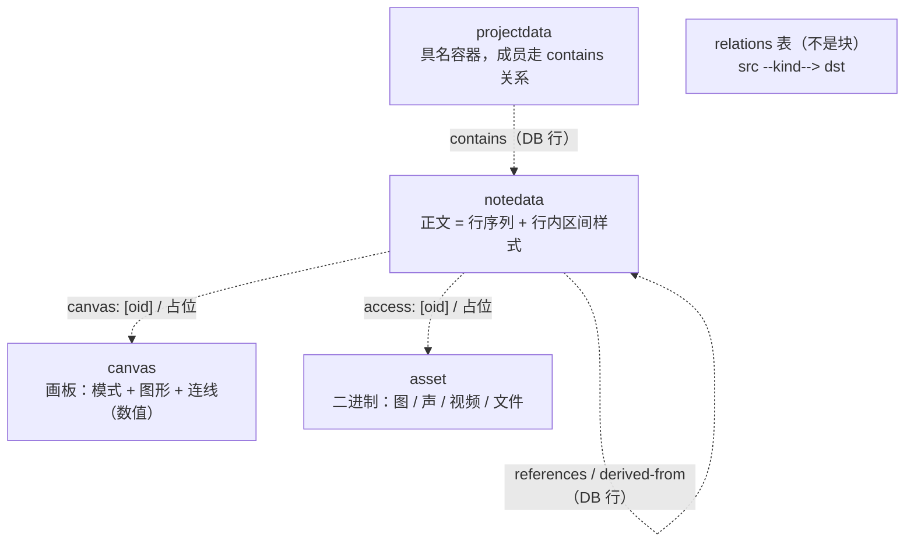

<!-- SPDX-FileCopyrightText: 2026 HanYang06 -->
<!-- SPDX-License-Identifier: Apache-2.0 -->

# 数据结构（对象模型 · 内存态 / 存储态）

> 定位：Cairn 的**对象模型总纲**——逻辑模型 + 存储态 + 内存态。
> 关系：[`storage-design.md`](./storage-design.md) 是 **L0 存储层的唯一事实来源**，本文引用它、不重复它；
> 语义与领域规则见 [`domains.md`](./domains.md)、[`note-model.md`](./note-model.md)。
> 一句话：**Cairn = 含义堆（meaning heap）**——底座只加能力、不改结构，语义往上堆。

状态：**草案 v0.4**（2026-09-17 按当时的「桶 + 块」模型重写；**2026-09-29 现状提示见下**）

> ⚠️ **现状提示（2026-09-29）**：本文写于旧的「桶 + 块」实现之上，那套实现已随
> `refactor/clean-local-code` 整条删除。读本文时按这三条对齐：
> ① **存储态以 [`storage-design.md`](./storage-design.md) 为准**——身份是 `ID`（`uuid4` ＋ `sha256`，
> 不再是 `ValueUuid` / `ValueHash`）；载体按**两数格模型** `(头格, 末格)` 定位（不再是三元组）；
> **hub** 取代"桶"；块落成**内容记录 ＋ 块记录**两条，指针在块记录的载荷里（不是 `block` / `body` 表）。
> ② **领域与界面各章是目标形态**：`feature` / `ui_tools` / `app` 当前没有代码，待重建。
> ③ 凡与代码冲突，**以代码为准**；§2 / §3 里仍未逐条核过的字段表（行 id、`body_hash`、
> `checksum` 的口径等）按"待回写"看待，具体以 [`storage-design.md`](./storage-design.md) §3 与代码为准。

> **2026-09-19 现状导引**（历史）：领域目录为 `feature/`（非 `domains/`）；五域口径统一为「`XxxData(Block)` + `Xxx(Domain)`」。

---

## 0. 一页看懂（对象拓扑）

### 0.1 两条铁律

1. **只有一个存储物种：块（Block）。**
   笔记 / 资产 / 项目 / 画板 / 索引 / 分片，最终都是块，区别只在**类型**与 `body`。
   没有"清单"、没有"空间"、没有第二种持久化对象。
2. **按性质分家。**
   **内容**（字节）进**内容记录**（载荷即 body，身份按内容签发，故同内容只存一份）；
   **描述**（标题 / 标签 / 签名）**当前尚未落地**——块的属性面随领域层重建再长，
   将来的口径是随块记录存、不参与去重；
   **结构**（关系）落**索引库的 `edge` 表**，可查询 / join。

> 判据仍是三关（见 §1）：性能、存储利用率、综合（并发 / 安全 / 扩展）。

### 0.2 块类型（世界就这么几种）


```mermaid
graph TD
    N["notedata<br/>正文 = 行序列 + 行内区间样式"]
    C["canvas<br/>画板：模式 + 图形 + 连线（数值）"]
    A["asset<br/>二进制：图 / 声 / 视频 / 文件"]
    P["projectdata<br/>具名容器，成员走 contains 关系"]
    R["relations 表（不是块）<br/>src --kind--> dst"]
    N -. "canvas: [oid] / 占位" .-> C
    N -. "access: [oid] / 占位" .-> A
    P -. "contains（DB 行）" .-> N
    N -. "references / derived-from（DB 行）" .-> N
```

- `note`：正文 = 有序行序列；画板 / 多媒体以**引用 + 占位**嵌入，不复制内容。
- `canvas`：升格为**全局内容类型**（`canvas`），内容寻址、全局去重；note 用 oid 引用。
- `asset`：二进制内容，只被引用、永不嵌套；入库先转码（草案，见 §5.3）。
- `project`：具名容器；**成员不是塞进结构，而是 DB 里的关系行**。
- 内部还有 `part` / `index`：大内容的分片与索引块，见 §6.3。

### 0.3 阅读路径

1. 本文：§2 词表 → §4 逻辑模型 → §5 对象内部 → §6 存储态 → §7 内存态。
2. 物理细节 → [`storage-design.md`](./storage-design.md)。
3. 领域语义 → [`domains.md`](./domains.md)、[`note-model.md`](./note-model.md)。
4. 代码入口 → 本文 §12 映射表。

---

## 1. 为什么单列一文

- Cairn 的对象类型会**持续增加**（今天是笔记 / 项目，后续可能是其它类型）。**底层数据结构会持续扩张**，这是最大的风险。
- 不把结构**提前定死并写清楚**，将来重构会失控——所以本文的作用是**约束**：什么可以加、怎么加、什么绝不能动。
- 判据（任何设计变更都要过这三关，缺一不可）：

| 判据 | 含义 |
|---|---|
| **性能** | 读快、写快；加载与保存在最坏情况下也要可接受 |
| **存储利用率** | 不为结构本身浪费大量空间（"占 40G、有效 20G"不可接受） |
| **综合** | 并发性、安全性、可加密性、扩展性 |

---

## 2. 词表（先统一语言）

| 词 | 英文 | 含义 |
|---|---|---|
| hub | hub | `<root>/<hub>/`：装若干载体；hub 名即地址（目录名） |
| 载体 | Pack | 追加写的载体文件，**定长格**、记录自框定；写满即封口 |
| 块 | Block | 存储单元：当前实现只有 `id` ＋ `body`；落盘成**两条记录**（内容 ＋ 块） |
| 索引库 | Index | `<root>/catalog.db`：hub 登记、身份到位置、关系边；**可重建的投影** |
| 身份 | `ID` | 两套凭证：`value_uuid`（`uuid4`，比较有效）与 `value_hash`（`sha256`，去重有效）。**身份 ≠ 内容** |
| 地址 | address | 由 body 内容算出的确定性摘要（`sha256` 十六进制）；即摘要形态 |
| checksum | — | 记录头里的载荷摘要（与身份摘要同源）；块记录载荷里的指针（`body_ref`）指向它 |
| type | — | 块类型（短名），如 `notedata`：由**程序**给出，落索引库的 `kind` 列，不落盘 |
| body | — | 块的主体内容，进**内容记录**（同内容只存一份） |
| attrs | — | 块的描述字段（标题 / 标签 / 签名）：**当前未落地**，随领域层重建再长 |
| config | — | 写入配置：**未落地**（旧 pack 那套语义已退役） |
| 关系 | edge | 一等 DB 行：`src --kind--> dst`，**不是块**（表名 `edge`） |
| 行 | line | 笔记正文的一个元素（一行 / 一块），带稳定行 id |
| 区间样式 | range style | 行内 `[start, end)` 的样式覆盖层 |
| 分片 / 索引块 | part / index | 大内容切成的块 + 聚合成一个可引用 id 的索引块（**预留**，尚未接进块面） |

> 术语以代码为准：块 = `core/storage/format/block.py` 的 `Block`，内容 = 同处的 `Body`，
> hub = `core/storage/hub.py` 的 `Hub`。

---

## 3. 分层

```
L3  领域（角色 + 规则）     note / canvas / asset / project / relation
        │  只依赖 ↓ 的公共 API
L0  核心存储（Qt-free）     Storage（引擎角色）→ BlockStore（块 ⇄ 记录）
                            → Vault（多桶）→ Bucket（载体）→ Index（索引库）
        │
物理层                      vault/<桶>/packs/*.pack（**真源**） + vault/catalog.db（投影）
```

**红线**：L0 **不认识** `note` / `project` 这些词；领域语义词只活在 L3。
没有旧稿里的 "L0.5 基板层"——正文 / 画板结构都由领域自己用 `Body` 描述。

---

## 4. 逻辑对象模型

### 4.1 平坦的块图

块之间**没有树**：一批平铺的块，彼此通过 **OID 引用** 或 **DB 关系行** 相连。

```
note ──引用（canvas / access 列表）──► canvas / asset
note ──relation(DB)──► project / note
```

- **没有递归嵌套**：不会出现"块里装块、块再装块"。
- 需要"包含"时，一律改成引用（OID）或关系（DB 行），由 DB 表达成员 / 层级。

### 4.2 内容 / 描述 / 结构（"按性质分家"落地）

| | 内容 | 描述 | 结构 |
|---|---|---|---|
| 是什么 | 字节流：正文、画板、图片 | 标题、标签、签名、`props` | 关系（成员 / 引用 / 派生） |
| 载体 | 内容记录（载荷即 body，按内容地址去重） | 块记录（**当前只有指向 body 的指针**；属性面待领域层） | 索引库的 `edge` 表 |
| 为什么 | 去重 / 传输 / 随机读 | 随块读写、不进内容面 | 索引 / 约束 / join |
| 例 | `note.body` / `asset.body` | `title` / `tags` / `signature` | `contains` / `references` / `derived-from` |

> 旧稿的 "结构数据全部进 DB" 已收窄：**只有关系进 DB**；标签 / 属性将来的口径是随块记录存，
> **当前尚未落地**（见 §0 的现状提示）。

### 4.3 type → 承载 映射（一张表，禁止造第二套类型系统）

| type | 承载 | 说明 |
|---|---|---|
| `notedata` | `NoteBody` | 笔记：正文 = 行序列；画板 / 多媒体以 oid 引用 |
| `canvas` | `CanvasBody` | 画板：模式 + 图形 + 连线（数值序列） |
| `asset` | 裸 body（bytes） | 二进制 / 大对象，入库先转码 |
| `projectdata` | 裸 body（默认空） | 具名容器；成员走 `contains` 关系 |
| `group` | 裸 body（默认空） | 组：`gid` 域身份 + 有序子项 ID 列表（笔记 / 项目 / 组），可嵌套 |
| `block` | 裸 body | 未登记 `type` 的兜底裸块 |
| `part` / `index` | 裸 body | 内部分片 / 索引块（不做块级去重） |
| —（不是块） | — | 关系：`relations` 表的一行 |

> `composition`（文档 / 博客）**不再是独立类型**：它就是"正文里放一堆引用"的 note，属于角色差异而非新物种。

### 4.4 扩展方式（"含义堆"怎么堆）

- 加**角色**：加一个 `type` 子类，自动进注册表。**不碰 `Block` 顶层字段**。
- 加**字段**：在子类用 `Attr` / `Data` 声明（落在 `attrs`）。**不碰 `Block`**。
- 加**关系**：加一个 `kind`（DB 行）。不碰底座。
- 加**行内样式 / 图元**：加一个 `Style` 字段或 `Form` 值。不碰底座。
- 只有**新的物理能力**（如新的编码 / 加密原语）才动 L0，且必须过 §1 三判据。

---

## 5. 对象内部结构

### 5.1 笔记正文 = 有序行序列 + 行内区间样式

> **已实现（M0，2026-09-17）**：`note/types.py`（`NoteBody`）、`note/edit.py`（原语）、`note/model.py`（`Style`）。
> 语义细节见 [`note-model.md`](./note-model.md) §6。

```
body  = [ {"id": 行id, "v": "一行文字", "p": {"heading": 1}}, {"id": 行id, "v": {"canvas": n}}, ... ]
style = { 行id: [ {区间(tuple): Style} ] }
```

- **一元素 = 一行 = 一段**（硬回车是段落边界；软换行只是 UI 显示）：
  顺序即位置；行序列用 list 保序（canonical CBOR 会排序 map key，dict 不能保序）。
- **`p` = 行级（段落）属性**（可缺省）：`align` / `heading` / `list` / `level` / `block` 等；
  列表序号等**算得出**的不存。没有单独的"段落"实体——段落就是行。
- **行 id 稳定**（ULID，生成即锁死）：行增删 / 重排不影响样式与版本（无下标漂移）。
- **样式是叠加层**：`{行id → 区间层}`；行内加粗只需加区间，不拆 body；后层压前层；规范化为不重叠、有序、去默认。
- **内容签名（`body.hash`）剥离行 id**：同文同样式 → 同哈希（签名 / 版本用）。
- **去重键（`checksum = body_hash`）按落盘负载算**：笔记负载含行 id，故不同行 id 的笔记不会串内容。
- **嵌入块**：画板 / 多媒体都是占位元素 `{"canvas": n}` / `{"access": n}`，`n` 指向 `note.canvas` / `note.access` 列表里的 oid。
- **长行**不设内核上限，交给 UI（超阈值关自动换行、逼硬回车）。

### 5.2 画板（Canvas）= 数值序列

> 数据模型在（`feature/canvas.py`），**编辑 UI 未实现**。

```
CanvasBody = { "m": mode, "g": [图形序列...], "l": [连线序列...] }
```

- **图形 `Graphic`** = 点路径 + 变换 + 画法：`form`（预制编号）、中心 `cx/cy`、`w/h`、`rot`、`scale`、`points`、`params`、`paint`。
- **画法 `Paint`** = 描边 / 填充 / 渐变 / 透明度 / 闭合；颜色用 32 位整数 `0xRRGGBBAA`。
- **连线 `Link`** = 图形下标 + 线型；**走线派生**，不存拐点。
- 渲染器**只认点，不认形状**：预制 `Form` 由生成器转成点（外置图形集见 `note/shapes.py` + `config/shapes.json`）。
- `mode`：`diagram`（逻辑图，语义优先）/ `sketch`（自由手绘，笔画保真）。

> 数值序列化的细节见 `canvas.py` 的 `to_seq() / from_seq()`；它是**自定义紧凑编码**，不是 CBOR map。

### 5.3 资产（Asset）：入库先转码

> 状态：**草案**——`transcode()` 目前是**恒等**（不转码），只留决策位。

- 统一编码目标：图片 → PNG/WebP；音频 → FLAC；视频暂不转码。库必须过许可关（禁 GPL/AGPL）。
- 原始编码记在 `origin_mime`；统一后的记在 `mime`。
- 分片不由资产处理：分片是**存储**的活（粒度由 `storage.block.max_bytes` 定；
  **预留**——尚未接进块面，见存储设计篇 §6.3 / §12）。

### 5.4 引用 / 嵌入（统一形态）

- note 的 `canvas: list[str]` / `access: list[str]` 存目标块的 oid，正文用占位元素指向列表下标。
- **引用不复制内容**，随被引用块自身版本走；跨对象关系另走 `Relation`（DB 行）。

### 5.5 基础图形（图元）

- 图形是**点路径**；预制 `Form`（`CIRCLE` / `ELLIPSE` / `POLYGON` / `TRAPEZOID` / `PARALLELOGRAM` / `ARROW`）
  只是点路径参数化的预设；自定义形状 = 一组点。
- **算得出来的不记录**：能由 `form + 参数` 推出的顶点一律不存。

### 5.6 组（Group）

> **已实现（数据模型，2026-09-17）**：`feature/shared/group.py`（`GroupData`）；导航树未接。

- **组是块**：有自己的稳定域 ID **`gid`**（与块的存储身份 `oid` **分开**）与 `title` / `lock`。
- **`group: list[str]`**：有序子项 ID 列表，装笔记 / 项目 / **组**——组存 `gid`，其余存 `oid`；
  顺序即显示顺序，可无限嵌套。
- **两套归属都存**：`group` 列表存**结构**（顺序），`relations` 表存 `contains` 关系（**反查**某块在哪些组）。
- `lock`：锁定后不可增删成员。`owner` / `member`：社区「有限编辑组」预埋（`User` 系统落地前用字符串）。
  `key`：访问口令，非空则进组要密码（是口令，不是加密）。
- 组不承载版本；`checksum = body_hash`（body 为空，故组间共享空内容，属预期）。

---

## 6. 存储态

> 物理细节以 [`storage-design.md`](./storage-design.md) 为准，这里只列对象模型相关。

### 6.1 块字段

```python
Block:
  id          # 稳定身份（ULID），创建即分配，**锁死**
  checksum    # = body_hash：落盘负载哈希（BLAKE3 十六进制）；桶按它去重
  type        # 承载类型（Kind.Data 的值，如 notedata）
  body        # 主体（结构化 Body / bytes / 标量）→ 进内容池
  attrs       # 描述字段（dict）→ 随块行存，**不参与去重**
  config      # 写入配置（dict）
  author / size / created / updated
```

- **body 与 attrs 分家**：同正文、不同属性（标题 / 标签 / 时间）既能共享正文、又互不污染。
- `checksum`（= `body_hash`）是落盘负载的哈希，去重键与负载口径一致；剥离行 id 的内容签名是
  `body.hash`（签名 / 版本用）。子类可覆写 `body_hash` 口径。

### 6.2 身份 vs 地址（**关键分工，别混**）

| | OID（身份） | checksum（地址） |
|---|---|---|
| 值 | 稳定、作者绑定（ULID） | 内容哈希（BLAKE3 十六进制） |
| 用于 | **谁**、版本链、可编辑对象 | **什么**、去重、内容池定位 |
| 变化 | 逻辑不变则不变 | 内容变则变 |

> **不要**试图用一个标识同时满足"稳定身份"和"内容去重"——两个目标互斥，分层解决。

### 6.3 内容记录与分片

- **内容记录**：载荷就是编码后的 body，身份按内容签发（`value_hash` 即 body 地址），
  故同 body 只存一份；块记录靠载荷里的指针（两套凭证）指向它。
- 大内容：**分片预留**（切成 `part` 块 + 一个 `index` 索引块，返回索引块 id），
  尚未接进块面，见设计篇 §5.6 与 §12。

### 6.4 索引库（catalog.db，可重建的投影）

```sql
hub(name PK, role, state, created)                          -- hub 登记（真源是 hub 目录）
block(value_uuid PK, value_hash, birth_time, name,
      body_value_uuid, body_value_hash, kind,
      hub, pack, slot_first, slot_last, size, created, updated)
body(value_uuid PK, value_hash, birth_time, name,
     hub, pack, slot_first, slot_last, size, created, updated)
edge(id PK, src_value_uuid, dst_value_uuid, kind, domain, created)   -- 关系边
meta(name PK, value)                                        -- 声明投影（开库时比对）
-- 领域业务表（如 relation）由领域经 Storage.table() 建，落同一个库
```

- **表结构由声明给出**（本体在 `config/tables.yaml`，由类型登记现算写出），
  源码内不出现建表语句；开库时对比 → 分类 → 处置，破坏性变更默认拒绝（设计篇 §8.4、§8.2.1）。
- **索引库是投影、不是真源**：真源是载体里的记录；索引丢了可顺扫重建（`patrol` / `repair`）。
- 领域类型一登记，它那张表就诞生（`core/storage/registry.py`）；上层不 import sqlite。

### 6.5 版本（**存储不承载**）

- 版本**不属于存储**（归领域）：存储不承担历史，旧稿的通用版本引擎与版本表已随重设计作废。
- 领域若要版本，自己建表或用块内容表达；存储只提供身份、位置与内容寻址。

### 6.6 加密（本地不做）

- **落盘明文**；加密只用于传输 / 服务端（见 [`access.md`](./access.md)）。
- 因此内容地址直接用明文摘要，去重没有密钥域冲突。

---

## 7. 内存态

### 7.1 运行时表示

```
Core ── Block 对象（Note / Canvas / Asset / Project）   稳定身份，按 id 取回
          ├─ body     结构化 / 裸内容
          └─ attrs    描述字段（属性）
Storage ── BlockStore ── Vault ── Bucket(packs/) + Index(catalog.db)   真源是载体
```

- 门户是 `Core`（`core/core.py`）：`put` / `get` / `drop` 经引擎交给存储角色。
- **正文整块解码**：note 规模下一次性解码无感；**不做叶 / LRU / 惰性加载那套**。

### 7.2 编辑事务

- 改内容：编辑块对象 → `core.put(block)`。body 按内容地址进内容记录；同 body 直接命中、不重存。
- 改描述（标题 / 标签）：改 `attrs` 后 `put`——**不产生版本**（存储不管版本）。
- 改结构：直接写 `relation` 行，**不产生块版本**。
- **事务尚未实现**（设计篇 §12）：当前是"先落字节、后记目录"，中途失败留孤儿字节，由重建收编。

---

## 8. 版本与垃圾回收

- 版本归领域（见 §6.5）；本节只剩**物理回收**。
- 删除（`Storage.drop`）只摘定位行；物理内容留作空洞（可能被其它块共享）。
- GC 目标：不可达内容、孤儿字节、更新留下的旧副本。**载体重压（收回空洞）尚未实现**，列为工程债。

---

## 9. 并发与一致性

| 场景 | 策略 | 状态 |
|---|---|---|
| 同进程读 | 只读已提交内容 | 已实现 |
| 同进程写 | 先落字节、后记目录 | 已实现（**无事务**，见 §12） |
| 索引库 | `catalog.db`（投影，单写） | 已实现 |
| 跨进程锁（`.lock`） | — | 未实现 |
| 同节点多作者 | 版本链 + 合并 | 预留 |
| 跨设备 | 块同步 + 合并 | 预留 |

---

## 10. 不变量（Invariants，谁都不许破）

1. **只有一个存储物种 = 块**；类型不改变存储契约。
2. **身份稳定、内容地址确定**，二者不混用（`Id` 上两套凭证并存）。
3. **id 锁死**：创建后不可改；内容摘要重算校验。
4. **版本不归存储**：存储不承担历史（归领域）。
5. **块之间不嵌套**：跨块关系走引用或 DB 关系行。
6. **真源是载体，索引库是可重建的投影**。
7. **本地不加密**；加密只在传输 / 服务端。
8. **不改块顶层字段**；扩展只走子类字段（`Attr` / `Data` / `Body`）、新 `type`、新 `kind` / `Form`。
9. L0 **不认识领域语义词**。

---

## 11. 待定 / 预留

1. 逻辑图布局算法（分层 / 力导）与"钉位"交互。
2. sketch 的笔画简化 / 压缩策略；形状识别引擎。
3. 视频转码与统一编码库的许可核实。
4. 多设备 / 多作者的合并（CRDT vs 版本链合并）。
5. 载体压实（收回删除与更新造成的空洞）。
6. 事务（一次写入同时落字节与目录行）。
7. 存储侧那些字段问题：属性（标题 / 标签）要不要投影进库；"删掉类型要不要删表"
   （设计篇 §12；影响的是"列举要不要读载荷"与"表能不能自己消失"）。

---

## 12. 速查表（术语 → 代码 → 文件）

### 12.1 L0 存储层

| 术语 | 代码对象 / 常量 | 文件 | 状态 |
|---|---|---|---|
| 引擎角色 | `Storage` | `core/storage/engine.py` | 已实现 |
| 块面（块 ⇄ 记录） | `BlockStore` | `core/storage/blocks.py` | 已实现 |
| 多桶 / 巡检 | `Vault` / `PatrolReport` / `Finding` | `core/storage/vault.py` | 已实现 |
| 桶（载体） | `Bucket` / `BucketRole` | `core/storage/vault.py` | 已实现 |
| 载体文件 | `CarrierFile` / `CarrierLayout` | `core/storage/io.py` / `carrier.py` | 已实现 |
| 记录 | `Record` / `RecordHeader` | `core/storage/record.py` | 已实现 |
| 索引库 | `Index` / `Difference` / `RebuildPlan` | `core/storage/index.py` | 已实现 |
| 表声明 | `TableSpec`（声明）/ `Column` / `RebuildTier` | `core/storage/tables.py` | 已实现 |
| 领域表句柄 | `Table` / `create_table` | `core/storage/table.py` | 已实现 |
| 块 | `Block` | `core/storage/block.py` | 已实现 |
| 属性 / 数据字段 | `Attr` / `Data` | `core/types/attr.py` | 已实现 |
| 主体容器 | `Body` / `BodyField` | `core/storage/block.py` | 已实现 |
| 确定性 CBOR | `canonical` / `decode_canonical` | `core/storage/block.py` | 已实现 |
| 身份 / 地址 | `Id` / `ValueUuid` / `ValueHash` / `SlotRange` | `core/types/id.py` | 已实现 |
| 元数据视图 / 巡检报告 | `ObjectInfo` / `VerifyReport` | `core/types/objects.py` | 已实现 |

### 12.2 L3 领域层（域 + 数据 + 共享件）

| 术语 / 角色 | 代码对象 | 类型 | 文件 | 状态 |
|---|---|---|---|---|
| 域 note | `Note`（域服务） | `Kind.Feature.Note` | `feature/note/service.py` | 已实现 |
| 数据 notedata | `NoteData` / `NoteBody`（`Style` 在 `edit/`） | `Kind.Data.Notedata` | `feature/note/data.py` | 已实现 |
| 域 project | `Project`（域服务） | `Kind.Feature.Project` | `feature/project/__init__.py` | 部分 |
| 数据 projectdata | `ProjectData` | `Kind.Data.Projectdata` | `feature/project/__init__.py` | 部分 |
| 数据 canvas | `CanvasData` / `CanvasBody` / `Graphic` / `Paint` / `Link` | `Kind.Data.Canvas` | `feature/shared/canvas.py` | 数据模型已实现（无编辑 UI） |
| 数据 asset | `AssetData` | `Kind.Data.Asset` | `feature/shared/asset.py` | 部分（转码恒等） |
| 数据 group | `GroupData` | `Kind.Data.Group` | `feature/shared/group.py` | 数据模型已实现（导航树未接） |
| 关系 | `Relation`（DB 行） | — | `feature/shared/relation.py` | 已实现 |
| 衍生关系 | `ancestors` / `descendants` / `lineage` / `derivatives` | `derived-from` | `feature/shared/provenance.py` | 已实现（由关系派生） |
| 签名 | `Signature` | — | `feature/shared/signature.py` | 已实现 |
| 类型词表 | `Kind`（`Feature` / `Data`） | — | `feature/shared/kinds.py` | 已实现 |
| 图形集 | `Form` / `build` | — | `feature/note/shapes.py` + `config/shapes.json` | 已实现 |

> `type` 现为 **`Kind.Data` 的值**（短名，如 `notedata`）；旧 `cairn.<domain>.<kind>` 命名空间已作废
> （见 [`domains.md`](./domains.md) §2）。域是管理型（无 ID），数据是块（有 ID）。

### 12.3 界面（非内核）

| 术语 | 代码对象 | 文件 | 状态 |
|---|---|---|---|
| UI 工具箱 | `Node` / `Facet` / `Session` / `Compiler` / `WindowHost` / `Theme` … | `ui_tools/` | 已实现（工具箱） |
| 应用层 | `Feature` / `build` / `NoteFacet` | `src/app/`（`win` / `linux`） | 已搭最小闭环 |
| 旧 QML / `Backend` | — | `ui/qml/`、`ui/backend.py` | **已删除**（界面待重建） |

### 12.4 实验顶层包

| 术语 | 代码 | 文件 | 状态 |
|---|---|---|---|
| P2P / 通信 | — | ~~`src/net/`~~ | **已删除**；待随新模型重设 |
| 服务端 | — | ~~`src/server/`~~ | **已删除**；待重设 |

---

## 13. 实现状态速记（本节随代码更新）

| 术语 | 归属 | 状态 |
|---|---|---|
| 行序列 + 行内区间样式 | §5.1 | **已实现**（`note/edit/`） |
| 关系落 DB（`relation` 表，一等行） | §4.3 | **已实现**（`feature/shared/relation.py`） |
| 块 / 载体 / 桶 / 多桶 / 索引库 / 巡检 | §6 | **已实现**（`core/storage/`，内核已接上新底座） |
| `Attr` / `Data` 字段描述符 + `Body` 基类 | §4.4 | **已实现**（`core/storage/block.py`） |
| 复合签名 `Signature` | §5 | **已实现**（`feature/shared/signature.py`） |
| 外置图形集 `Form` + 生成器 | §5.5 | 已实现（`feature/note/shapes.py` + `config/shapes.json`） |
| 画板（diagram / sketch）数据模型 | §5.2 | 数据模型在（`CanvasData` / `Graphic`），**无编辑 UI** |
| 逻辑图自动布局 / 连线走线 | §5.2 | 未实现 |
| 资产转码（图片 / 音频 / 视频） | §5.3 | 草案（恒等） |
| 旧 QML 编辑器（`currentBlocks`） | §5.1 | **已删除**（界面待重建，`src/app`） |
| 大正文分片（`part` / `index` 块）接笔记 | §6.3 | 未实现（设计篇 §5.6 定了粒度，块面尚未接） |
| 事务（块与领域表一起提交 / 回滚） | §7.2 | 未实现（当前"先落字节、后记目录"） |
| 载体压实（收回空洞与旧副本） | §8 | 未实现 |
| 跨进程锁 | §9 | 未实现 |
