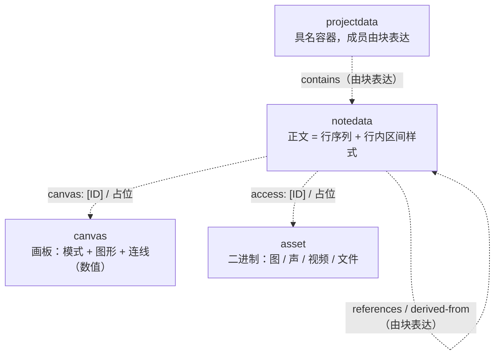

<!-- SPDX-FileCopyrightText: 2026 HanYang06 -->
<!-- SPDX-License-Identifier: Apache-2.0 -->

# 数据结构（对象模型 · 内存态 / 存储态）

> 定位：Cairn 的**对象模型总纲**，覆盖逻辑模型、存储态与内存态。
> 关系：[`storage-design.md`](./storage-design.md) 是 **L0 存储层的唯一事实来源**，本文引用它、不重复它；
> 语义与领域规则见 [`domains.md`](./domains.md)、[`note-model.md`](./note-model.md)。
> 术语「含义堆（meaning heap）」：底座只提供能力、不改变结构，领域语义在底座之上逐层增加。

状态：**草案 v0.4**

---

## 0. 对象拓扑

### 0.1 两条基本约束

1. **唯一的存储单元是块（Block）。**
   笔记 / 资产 / 项目 / 画板 / 索引 / 分片，最终都是块，区别仅在**类型**与 `body`。
   不存在"清单"、"空间"与第二种持久化对象。
2. **按性质分离。**
   **内容**（字节）写入**内容记录**（载荷即 body，身份按内容签发，故同内容只存一份）；
   **描述**（标题 / 标签 / 签名）**当前没有领域字段**——属性的承载机制已落地
   （随块记录载荷存、不参与去重，见 §2），字段随领域层重建再补；
   **结构**（关系）**由块自己表达**，库只做索引——关系索引尚未设计，**不预埋**
   （2026-09-30 裁定：没有调用方的结构属于脚手架）。

> 判据见 §1：性能、存储利用率、综合（并发 / 安全 / 扩展）。

### 0.2 块类型


```mermaid
graph TD
    N["notedata<br/>正文 = 行序列 + 行内区间样式"]
    C["canvas<br/>画板：模式 + 图形 + 连线（数值）"]
    A["asset<br/>二进制：图 / 声 / 视频 / 文件"]
    P["projectdata<br/>具名容器，成员由块表达"]
    N -. "canvas: [ID] / 占位" .-> C
    N -. "access: [ID] / 占位" .-> A
    P -. "contains（由块表达）" .-> N
    N -. "references / derived-from（由块表达）" .-> N
```

- `note`：正文 = 有序行序列；画板 / 多媒体以**引用 + 占位**嵌入，不复制内容。
- `canvas`：全局内容类型（`canvas`），内容寻址、全局去重；note 用 `ID` 引用。
- `asset`：二进制内容，只被引用、不嵌套；入库先转码（草案，见 §5.3）。
- `project`：具名容器；**成员由块自己表达**（关系索引未设计，见 §0 与存储设计篇 §12）。
- 内部还有 `part` / `index`：大内容的分片与索引块，见 §6.3。

### 0.3 阅读路径

1. 本文：§2 词表 → §4 逻辑模型 → §5 对象内部 → §6 存储态 → §7 内存态。
2. 物理细节 → [`storage-design.md`](./storage-design.md)。
3. 领域语义 → [`domains.md`](./domains.md)、[`note-model.md`](./note-model.md)。
4. 代码入口 → `py_src/core/` 与 §12。

---

## 1. 作用与判据

- Cairn 的对象类型会**持续增加**（当前是笔记与项目，后续会增加其它类型），**底层数据结构随之持续扩张**，这是本篇要约束的主要风险。
- 结构若不**提前定死并写清**，后续重构会失控；本篇的作用是**约束**：可以加什么、以何种方式加、哪些结构不得改动。
- 判据（任何设计变更都须满足以下三项，缺一不可）：

| 判据 | 含义 |
|---|---|
| **性能** | 读快、写快；加载与保存在最坏情况下也要可接受 |
| **存储利用率** | 不为结构本身浪费大量空间（"占 40G、有效 20G"不可接受） |
| **综合** | 并发性、安全性、可加密性、扩展性 |

---

## 2. 词表（先统一语言）

| 词 | 英文 | 含义 |
|---|---|---|
| hub | hub | `<root>/<hub>/`：装若干载体；hub 名即地址（目录名） |
| 载体 | Pack | 追加写的载体文件，**定长格**、记录自框定；写满即封口 |
| 块 | Block | 存储单元：当前实现只有 `id` ＋ `body`；落盘成**两条记录**（内容 ＋ 块） |
| 索引库 | Index | `<root>/catalog.db`：hub 登记、身份到位置；**可重建的投影** |
| 身份 | `ID` | 两套凭证：`value_uuid`（`uuid4`，比较有效）与 `value_hash`（`sha256`，去重有效）。**身份 ≠ 内容** |
| 地址 | address | 由 body 内容算出的确定性摘要（`sha256` 十六进制）；即摘要形态 |
| checksum | — | 记录头里的载荷摘要（与身份摘要同源）；块记录载荷里的指针（`body_ref`）指向它 |
| type | — | 块类型（短名），如 `notedata`：写时由程序给出，**随记录落盘**，索引库的 `kind` 列是它的投影 |
| body | — | 块的主体内容，进**内容记录**（同内容只存一份） |
| attrs | — | 块自己声明的属性（标题 / 标签一类）：**机制已落地**（随块记录载荷落盘、不参与去重，保留键 `\x00cairn.attrs`）；领域字段随领域层重建再补 |
| config | — | 块**没有此字段**（`Block` 只有 `id` 与 `body`）；配置由 `core/conf/` 的配置引擎承担，与块字段无关，见 [`config.md`](./config.md) |
| 关系 | relation | **由块自己表达**（块说它有哪些关系）；库只做索引，索引未设计、不预埋 |
| 行 | line | 笔记正文的一个元素（一行 / 一块），带稳定行 id |
| 区间样式 | range style | 行内 `[start, end)` 的样式覆盖层 |
| 分片 / 索引块 | part / index | 大内容切成的块 + 聚合成一个可引用 id 的索引块（**预留**，尚未接进块面；粒度见存储设计篇 §5.6、§12） |

> 术语以代码为准：块 = `core/storage/format/block.py` 的 `Block`，内容 = 同处的 `Body`，
> hub = `core/storage/hub.py` 的 `Hub`。

---

## 3. 分层

```
L3  领域（角色 + 规则）     note / canvas / asset / project / relation
        │  只依赖 ↓ 的公共 API
L0  核心存储（Qt-free）     Storage（引擎）→ Rows（行层）→ Hub（载体）→ Index（索引库）
```

- **红线**：L0 **不含** `note` / `project` 这类领域语义词，领域语义词仅出现在 L3。
  正文 / 画板结构由领域自己用 `Body` 描述，不存在"L0.5 基板层"。
- 路径约定只在 `core/init.py` 定：`<root>/catalog.db` 是索引库，`<root>/<hub>/packs/` 是载体。
- 层间关系与物理结构以 [`storage-design.md`](./storage-design.md) §2 为准，本节不重复。

---

## 4. 逻辑对象模型

### 4.1 平坦的块图

块之间**没有树**：一批平铺的块，彼此通过 **`ID` 引用**或**块表达的关系**相连。

```
note ──引用（canvas / access 列表）──► canvas / asset
note ──关系（由块表达）──► project / note
```

- **没有递归嵌套**：不存在"块里装块、块再装块"。
- 需要"包含"时，一律改成引用（`ID`）或块表达的关系；成员与层级由关系给出，
  库只做索引（索引未设计）。

### 4.2 内容 / 描述 / 结构（按性质分离的落地）

| | 内容 | 描述 | 结构 |
|---|---|---|---|
| 是什么 | 字节流：正文、画板、图片 | 标题、标签、签名、`props` | 关系（成员 / 引用 / 派生） |
| 载体 | 内容记录（载荷即 body，按内容地址去重） | 块记录（载荷 = 指向 body 的指针 ＋ 块自己声明的属性；领域字段待领域层） | **块自己表达**（索引待设计，未预埋） |
| 为什么 | 去重 / 传输 / 随机读 | 随块读写、不进内容面 | 索引 / 约束 / join |
| 例 | `note.body` / `asset.body` | `title` / `tags` / `signature` | `contains` / `references` / `derived-from` |

> **关系的口径**（2026-09-30 裁定）：**关系由块表达，库只做索引**，结构数据不进库；
> 标签 / 属性将来的口径是随块记录存，领域字段**当前尚未落地**（见 §0.1）。

### 4.3 type → 承载 映射（类型系统的唯一一张表）

| type | 承载 | 说明 |
|---|---|---|
| `notedata` | `NoteBody` | 笔记：正文 = 行序列；画板 / 多媒体以 `ID` 引用 |
| `canvas` | `CanvasBody` | 画板：模式 + 图形 + 连线（数值序列） |
| `asset` | 裸 body（bytes） | 二进制 / 大对象，入库先转码 |
| `projectdata` | 裸 body（默认空） | 具名容器；成员由块表达的关系给出（索引未设计） |
| `group` | 裸 body（默认空） | 组：`gid` 域身份 + 有序子项 ID 列表（笔记 / 项目 / 组），可嵌套 |
| `block` | 裸 body | 未登记 `type` 的兜底裸块 |
| `part` / `index` | 裸 body | 内部分片 / 索引块（不做块级去重） |
| —（不是块） | — | 关系**不是一种块型**：它由块自己表达（索引未设计） |

> `composition`（文档 / 博客）**不是独立类型**：它是由若干引用组成的 note，属于角色差异，不构成新类型。

### 4.4 扩展方式

- 加**角色**：加一个 `type` 子类，自动进注册表；**不碰 `Block` 顶层字段**。
- 加**字段**：在子类的 `__init__` 里声明（`attr(...)` 落块记录载荷的 `attrs`、`Body(...)` 落 body 记录）；**不碰 `Block`**。
- 加**关系**：关系由块自己表达，库只做索引（索引未设计、不预埋）；不碰底座。
- 加**行内样式 / 图元**：加一个 `Style` 字段或 `Form` 值；不碰底座。
- 只有**新的物理能力**（如新的编码 / 加密原语）才动 L0，且必须满足 §1 的三项判据。

---

## 5. 对象内部结构

### 5.1 笔记正文 = 有序行序列 + 行内区间样式

> 状态：**待重建**——`feature` 层（`note/types.py` / `note/edit.py` / `note/model.py`）已随
> 2026-09-29 的重建删除，`py_src/model/note/` 为占位包；行序列与区间样式的口径见
> [`note-model.md`](./note-model.md) §6。

```
body  = [ {"id": 行id, "v": "一行文字", "p": {"heading": 1}}, {"id": 行id, "v": {"canvas": n}}, ... ]
style = { 行id: [ {区间(tuple): Style} ] }
```

- **一元素 = 一行 = 一段**（硬回车是段落边界；软换行只是 UI 显示）：
  顺序即位置；行序列用 list 保序（canonical CBOR 会排序 map key，dict 不能保序）。
- **`p` = 行级（段落）属性**（可缺省）：`align` / `heading` / `list` / `level` / `block` 等；
  列表序号等**算得出**的不存。没有单独的"段落"实体——段落就是行。
- **行 id 稳定**（随机唯一、生成即锁死）：行增删 / 重排不影响样式与版本（无下标漂移）。
- **样式是叠加层**：`{行id → 区间层}`；行内加粗只需加区间，不拆 body；后层压前层；规范化为不重叠、有序、去默认。
- **内容签名剥离行 id**：同文同样式即同签名（签名 / 版本用）。
- **去重键按落盘载荷算**：笔记载荷含行 id，故行 id 不同的笔记不会互相去重。
- **嵌入块**：画板 / 多媒体都是占位元素 `{"canvas": n}` / `{"access": n}`，`n` 指向 `note.canvas` / `note.access` 列表中的 `ID`。
- **长行**不设内核上限，由界面处理：超过阈值即关闭自动换行，只接受手动换行。

### 5.2 画板（Canvas）= 数值序列

> 状态：**待重建**——数据模型原在 `feature/canvas.py`（已随 2026-09-29 删除）；**编辑界面未实现**。

```
CanvasBody = { "m": mode, "g": [图形序列...], "l": [连线序列...] }
```

- **图形 `Graphic`** = 点路径 + 变换 + 画法：`form`（预制编号）、中心 `cx/cy`、`w/h`、`rot`、`scale`、`points`、`params`、`paint`。
- **画法 `Paint`** = 描边 / 填充 / 渐变 / 透明度 / 闭合；颜色用 32 位整数 `0xRRGGBBAA`。
- **连线 `Link`** = 图形下标 + 线型；**走线派生**，不存拐点。
- 渲染器**只认点，不认形状**：预制 `Form` 由生成器转成点（图形集配置在 `config/shapes.json`，生成器随领域层重建）。
- `mode`：`diagram`（逻辑图，语义优先）/ `sketch`（自由手绘，笔画保真）。

> 数值序列化的接口（`to_seq()` / `from_seq()`）随领域层重建再落；其形态是**自定义紧凑编码**，不是 CBOR map。

### 5.3 资产（Asset）：入库先转码

> 状态：**草案**——转码尚未实现（原口径为恒等实现，只留决策位）。

- 统一编码目标：图片 → PNG/WebP；音频 → FLAC；视频暂不转码。所选库的许可须满足本仓库的传染红线（禁 GPL / AGPL）。
- 原始编码记在 `origin_mime`；统一后的记在 `mime`。
- 分片不由资产处理：分片是**存储**的粒度，由 `storage.block.max_bytes` 定；
  **预留**——尚未接进块面，见存储设计篇 §5.6 / §12。

### 5.4 引用 / 嵌入（统一形态）

- note 的 `canvas: list[str]` / `access: list[str]` 存目标块的 `ID`，正文用占位元素指向列表下标。
- **引用不复制内容**，随被引用块自身版本走；跨对象关系由块自己表达（见 §4.2）。

### 5.5 基础图形（图元）

- 图形是**点路径**；预制 `Form`（`CIRCLE` / `ELLIPSE` / `POLYGON` / `TRAPEZOID` / `PARALLELOGRAM` / `ARROW`）
  只是点路径参数化的预设；自定义形状 = 一组点。
- **算得出来的不记录**：能由 `form + 参数` 推出的顶点一律不存。

### 5.6 组（Group）

> 状态：**待重建**——数据模型原在 `feature/shared/group.py`（已随 2026-09-29 删除）；导航树未接。

- **组是块**：有自己的稳定域 ID **`gid`**（与块的存储身份 `ID` **分开**）与 `title` / `lock`。
- **`group: list[str]`**：有序子项 ID 列表，装笔记 / 项目 / **组**——组存 `gid`，其余存块的 `ID`；
  顺序即显示顺序，可无限嵌套。
- **两套归属都存**：`group` 列表存**结构**（顺序），而"某块在哪些组"靠**反查索引**——
  关系由块表达、索引尚未设计（见 §0 与存储设计篇 §12），故这一条是**意图，不是现状**。
- `lock`：锁定后不可增删成员。`owner` / `member`：社区「有限编辑组」预埋（`User` 系统落地前用字符串）。
  `key`：访问口令，非空则进组要密码（是口令，不是加密）。
- 组不承载版本；body 为空，故组间共享同一份空内容（去重口径见 §6.1）。

---

## 6. 存储态

> 物理细节以 [`storage-design.md`](./storage-design.md) 为准，这里只列对象模型相关。

### 6.1 块字段

```python
Block:                          # core/storage/format/block.py
  id          # 身份：ID 对象（value_uuid = uuid4，签发即分配，创建后不再改）
  body        # 载荷：Body 对象；内容地址由 body 字节算出（sha256 十六进制）
```

- 块字段**只有 `id` 与 `body` 两项**。`checksum` 是记录头字段（`format/record.py`，载荷摘要、
  与身份摘要同源）；`type` 随记录落盘；`attrs` 随块记录载荷落盘；其余（`config`、作者、尺寸、
  时间戳）都不是块字段。
- **body 与属性分离**：body 按内容寻址、参与去重；块自己声明的属性不参与去重，
  由块记录载荷携带（保留键 `\x00cairn.attrs`），顺扫读出载荷即得属性。
- 笔记正文的签名与去重口径（剥离行 id 的签名、含行 id 的去重键）见 [`note-model.md`](./note-model.md) §6。

### 6.2 身份与地址

| | 身份（`value_uuid`） | 地址（`value_hash`；记录头的 `checksum` 与其同源） |
|---|---|---|
| 值 | 签发时分配（`uuid4`），与内容无关 | 由内容算出的摘要（`sha256` 十六进制） |
| 用于 | **谁**、版本链、可编辑对象 | **什么**、去重、内容池定位 |
| 变化 | 逻辑不变则不变 | 内容变则变 |

> 一个标识不得同时承担"稳定身份"与"内容去重"：两个目标互斥，由 `ID` 的两套凭证分层承担。

### 6.3 内容记录与分片

- **内容记录**：载荷就是编码后的 body，身份按内容签发（`value_hash` 即 body 地址），
  故同 body 只存一份；块记录靠载荷里的指针（两套凭证）指向它。
- 大内容：**分片预留**（切成 `part` 块 + 一个 `index` 索引块，返回索引块 id），
  尚未接进块面，见设计篇 §5.6 与 §12。

### 6.4 索引库（catalog.db，可重建的投影）

```sql
hub(name PK)                                                -- hub 登记（真源是 hub 目录；只记名字）
block(name, value_uuid PK, value_hash, birth_time,
      in_hub, in_hub_pack, in_pack_slot,                    -- 身份列 = ID 的全部字段
      body_value_uuid, body_value_hash, kind)               -- 指向别处 + 类型标号
body(name, value_uuid PK, value_hash, birth_time,
     in_hub, in_hub_pack, in_pack_slot)                     -- 内容记录：只有身份列
meta(name PK, value)                                        -- 声明投影（开库时比对）
-- 索引库当前就这三张业务表 + meta。关系索引**尚未设计**（不预埋）；
-- 将来真有域表，同样经声明层建，落同一个库。
```

- **身份表里的行是 `ID` 的镜像**：`ID` 的字段有几项，表里就有几列（列名与顺序都照搬，
  含位置段三列）；表与 `ID` 之间不再有人手维护的"子集"。位置段中 `in_pack_slot`
  （一对格号）落库为文本 `头格:末格`。
- **索引只做索引**（2026-09-30 裁定）：库里每一个值都要能从载体算回来。故 `kind`
  （类型标号）随记录落盘、`name` / `birth_time` 也在记录里；位置段是唯一"索引存、记录不存"的一段，
  因为记录被扫到时它在哪里已经由扫的动作给出。

- **表结构由声明给出**（本体在 `config/tables.yaml`，由类型登记现算写出），
  源码内不出现建表语句；开库时对比 → 分类 → 处置，破坏性变更默认拒绝（设计篇 §8.4、§8.2.1）。
- **索引库是投影、不是真源**：真源是载体里的记录；索引丢了可顺扫重建（`patrol` / `repair`）。
- 领域类型一登记，它那张表就诞生（`core/storage/registry.py`）；上层不 import sqlite。

### 6.5 版本（**存储不承载**）

- 版本**不属于存储**（归领域）：存储只提供身份、位置与内容寻址，不承担历史。
- 领域若要版本，自己建表或用块内容表达；存储不提供版本表。

### 6.6 加密（本地不做）

- **落盘明文**；加密只用于传输 / 服务端（见 [`access.md`](./access.md)）。
- 因此内容地址直接用明文摘要，去重没有密钥域冲突。

---

## 7. 内存态

### 7.1 运行时表示

```
Kernel（core/init.py）── 短面 store / load / drop / locate
        │
Storage（core/storage/engine.py）── 记录（内容 ＋ 块）
        ├─ Hub（<root>/<hub>/packs/）     真源
        └─ Index（<root>/catalog.db）     投影

Block 对象（id ＋ body）── 领域侧的内存表示；属性由子类声明，编进块记录载荷
```

- 装配入口是 `Kernel`（`core/init.py`）：短面为 `store` / `load` / `drop` / `locate`；
  按地址取内容、按身份取位置等更细的面在 `Storage`（`core/storage/engine.py`）。
- **正文整块解码**：note 规模下一次性解码的开销可接受；不引入叶节点、LRU 与惰性加载。

### 7.2 编辑事务

- 改内容：由领域层编码出 body 字节后调 `Kernel.store`；body 按内容地址进内容记录，同 body 直接命中、不重存。
- 改描述（标题 / 标签）：以块自己声明的 `attrs` 落块；属性随块记录载荷存，**不产生版本**（存储不管版本，见 §6.5）。
- 改结构：改动块自己表达的关系；库只做索引（索引未设计、不预埋），存储不产生版本。
- **事务尚未实现**（设计篇 §12）：当前是"先落字节、后记目录"，中途失败留孤儿内容记录，由巡检 / 重建收编。

---

## 8. 版本与垃圾回收

- 版本归领域（见 §6.5）；本节只剩**物理回收**。
- 删除（`Storage.drop`）先在载体末尾追加一条**墓碑**，再摘索引行；旧字节留作空洞（可能被其它块共享）。
- **物理回收已实现**：`Kernel.survey` 只读勘察，`Kernel.compact` 逐份载体重写、
  抹掉墓碑、被删记录与无人引用的正文（`core/storage/compact.py`）。

---

## 9. 并发与一致性

| 场景 | 策略 | 状态 |
|---|---|---|
| 同进程读 | 只读已提交内容 | 已实现 |
| 同进程写 | 先落字节、后记目录 | 已实现（**无事务**，见 §7.2） |
| 索引库 | `catalog.db`（投影，单写） | 已实现 |
| 跨进程锁（`.lock`） | — | 未实现 |
| 同节点多作者 | 版本链 + 合并 | 预留 |
| 跨设备 | 块同步 + 合并 | 预留 |

---

## 10. 不变量（Invariants）

1. **唯一的存储单元是块**；类型不改变存储契约。
2. **身份稳定、内容地址确定**，二者不混用（`ID` 上两套凭证并存）。
3. **id 锁死**：创建后不可改；内容摘要重算校验。
4. **版本不归存储**：存储不承担历史（归领域）。
5. **块之间不嵌套**：跨块关系走引用或块表达的关系。
6. **真源是载体，索引库是可重建的投影**。
7. **本地不加密**；加密只在传输 / 服务端。
8. **不改块顶层字段**；扩展只走子类在 `__init__` 里的声明（`attr` / `Body`）、新 `type`、新关系 `kind`、新 `Form`。
9. L0 **不含领域语义词**。

---

## 11. 待定 / 预留

1. 逻辑图布局算法（分层 / 力导）与"钉位"交互。
2. sketch 的笔画简化 / 压缩策略；形状识别引擎。
3. 视频转码与统一编码库的许可核实。
4. 多设备 / 多作者的合并（CRDT vs 版本链合并）。
5. 事务（一次写入同时落字节与目录行）。
6. 存储侧的字段问题：属性（标题 / 标签）是否投影进库；删掉类型时是否删表
   （设计篇 §12；影响面为"列举是否读载荷"与"表能否自行消失"）。

---

## 12. 代码入口

- 签名与文件位置的单一事实源是代码与 [API 参考](../api/index.md)（由 docstring 生成）。
- 界面层待重建，见 [`ui-kernel.md`](./ui-kernel.md)。
- `src/net/` 与 `src/server/` 已删除、待重设，见 [`network.md`](./network.md)。
