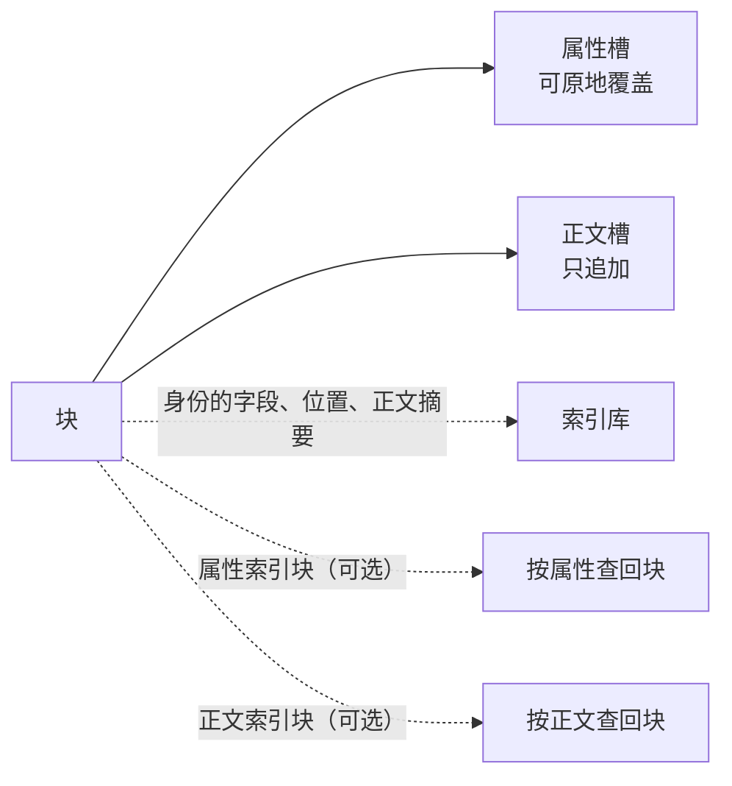

<!-- SPDX-FileCopyrightText: 2026 HanYang06 -->
<!-- SPDX-License-Identifier: Apache-2.0 -->
<!-- translation-source-hash: c8ea795704a9318e609b8e7157bef858dbbce1ab894639bb7fa5270460fed3fd -->
# Composition and Landing Point of the Block

> **Status: Current** (2026-10-02 dropped; starting 2026-10-06, no guarantee for future generations). The morphology described in this article is distinct from the two other morphologies outlined in this catalog.
> Each item is established individually.
This page is the main ruling section for the storage sublayer: [载体的字节布局](pack-format.md) and [查询链路](query-path.md)
> In the event of any conflict between this page and other documents, this page shall prevail; the list of differences is provided in §9.

## 0. One sentence

A block consists of two fields: the **attribute slot** (stores attributes, which can be overwritten in place) and the **body slot** (stores body fragments, which are appended only).
Fields marked with `ID` are indexed only; **no bytes of identity are written to the storage medium**.

## 1. Do not create new labels for classification

| Block Member | Criterion (Ready-made) | Classification |
|---|---|---|
| Class body bare assignment, ordinary property on an instance | Returns an empty string | Property |
| `Attr(...)` Declaration | `kind_of` Return `attr` | Property, plus an additional property index block |
| `Body(...)` Disclaimer | `kind_of` Back `body` | Main Text |
| `ID` | Issued by the caller | **Not a landing point**; it is the source of that row in the index library |

Class-read class-body declarations and instance fields (`kinds_of` / `kind_of`) do not introduce a second criterion.

## 2. What to put in the library, what to put on the carrier

| Content | Destination | Bytes on the carrier |
|---|---|---|
| `name` / `value_uuid` / `birth_time` | Index Database | **Zero** |
| `in_hub` / `in_hub_pack` / `in_pack_slot` | Index Database (**True Source**) | **Zero** |
| Document Abstract (Current One) | Index Database | **Zero** |
| Attribute Value | Attribute Slot (Carrier) | The Value Itself |
| Text Chunk | Text Slot (Container) | The Chunk Itself |
| Primary Table Index | Index Block (Container), Entry in the Database | Primary Table Row |

Fixed division of responsibilities: The index database stores identity, location, and document abstracts, serving as the sole source for these three; the storage medium stores values, serving as the sole source for values.**
If either one is missing, you won’t be able to retrieve the block. Two changes in caliber are directly derived from the “Ku is the authoritative perspective”:

1. **Carrier does not record identity**: Records are self-contained; identity travels with the record; activity is determined by on‑board self‑identification; the entire system is decommissioned.
2. **The database has another column that does not belong to `ID`**: The abstract of the main text is stored in the database but not in the identity table; therefore, there is one identity table.
**Exactly seven columns** (1/2/3/4/5/
(0/1).

**"Which slots are attribute slots" not in the library** (Revised ruling on 2026-10-02): **Slot numbers are only meaningful within the pack.**
The body of a block reference may reside in another pack, or even another hub; **inter-pack associations can only be expressed using summaries, not slot numbers**.
Attribute slots and text slots are distinguished by the **slot head type** (`pack.ATTR_SLOT`/`pack.BODY_SLOT`).
Each grid on the carrier already has writing in it. Therefore, the column labeled `attr_in_pack_slot` is not present in the table.

The old caliber that is hereby invalidated:

-"Even if the entire library is deleted, the system must still function correctly" (§1) is invalidated;
-Sequential sweep reconstruction and cold start ([查询链路](query-path.md)) are invalidated;
-When reading by identity, the forward sweep and subsequent read-back verification are invalidated.
-Change “The identity table must have a rebuild entry if it is missing a column” to **migration will be provided with each version update**.

**Incompatible with old libraries and legacy media**: When the format or library structure changes, refuse to open it and do not write compatibility code.
Migration is only provided with version updates; any damage caused by user-initiated modifications during non-version update periods shall be the user’s responsibility.

## 3. Position Segment: Curry's True Source, Covering All Slots

-It is placed in the index database, overwriting all slots (both attribute slots and body slots) occupied by that block itself.
The library represents the authoritative perspective; its location should be taken as the standard. **When quoting text from elsewhere, those cells are not included**—they reside in someone else’s pack.
-**All slots of a block fall within the same carrier** (Ruling dated 2026-10-07): During write operations, only one carrier is selected at a time; the block itself…
That priority is derived from the **write result**, not guessed. Only one carrier name remains available across carriers.
And that name can only be guessed—thus, one does not cross.
-The shape is a list of segments: `[n, n, (start, end), ...]`. **Record a single number in one cell; record a continuous segment as a range.**
-The order of writing carries semantic meaning: the main content segment comes first, followed by the attribute segment (multiple groups are allowed; within each group, adjacent segments are combined into one).
**Groups are not merged with each other**), so the column for Curry is written in its original order and is not rearranged.
-**"What is in each cell?" answered by the slot header**: The types of attribute slots and content slots are written on the header of each cell.
(`pack.ATTR_SLOT` / `pack.BODY_SLOT`), when reading a block, perform slot-head sorting as needed. **Curry doesn’t have a separate category for it**:
Slot numbers are only meaningful within a pack, and "inter-pack associations can only be represented using summaries"—expressed as a column of coordinates within the pack.
Regarding cross-pack matters, the reading side can only make an educated guess (revised ruling dated October 2, 2026).
-The four normalization rules (**ascending order, non-overlapping, adjacent merge, and minimum number of segments**) are used for **reclamation convergence and diagnosis**.
It’s not about the rules for side placement.
-Dispersed forms are considered **pending tasks for recycling**; recycling is performed by grouping, with adjacent items within each group merged into a single segment, while no merging occurs between different groups.
-Changing the main text once also changes this line.

**Encoding and Parsing**: The segment list uses **a text encoding** (one number per cell, with consecutive numbers written as `起-止` and separated by commas),
The read side has only one parsing function; the column labeled "Main Text Abstract" is actually the abstract itself (in lowercase hexadecimal).
ASCII), read it and go `parse_body`, regardless of the encoding and decoding of the segment.

## 4. Attribute Slots

-All attributes of a single block are, by default, packed into **one slot**; if they don’t fit, they will occupy **multiple slots** (multiple attribute slots).
-**If a single attribute value exceeds the field length, an error shall be reported**; silent truncation is not permitted.
-Attribute slots are **overwritten in place**; this version **does not include shadow slots or crash recovery** (see §7, Clause 5).
-Fields declared in the declaration are placed in a separate attribute index block; bare assignments are only written to disk and are not included in the index.

## 5. The Main Slot and Its Abstract

-The body fragments of the "装" field, **appended only**.
-**Shards are split according to the logical order of the document itself**; the read-back order is determined by the segment list in the corresponding row within the index, and **no shard number is recorded on the slot**.
-**Do not modify the original text in place**: Create a new slot, load the new text into it, and replace the “Abstract” column in the library with the abstract from this new entry.
The main text is deemed identical based on a summary of the entire content; if a match is found, the same main text is reused, and the slot is not written repeatedly.
-**Curry only has the summary of the current document** (that column): It also serves as the answer to “Which document is the main text?”
It is also the associated credential when reading the main text in reference blocks.
-**Storage Not Guaranteed Across Generations** (Ruling dated October 6, 2026): As soon as that column is modified, the previous main text immediately disappears from the live data, and the next garbage collection will remove it.
It can be reclaimed immediately; if you need to preserve the history or enable rollbacks, the upper layer should maintain its own references.
-Only update that column when the main text content has actually changed: saving the same main text again will not create a new slot, and the abstract will remain unchanged.
-Attributes not participating: Attribute slots are overwritten in place.

**Two runtime states** (prefix members on `Block`, `_`; **do not generate library columns, nor do they create additional slots**);
When loaded, it is pushed out from the row in the library plus the slot head; after landing on the board, it is rewritten based on the results of this run.

| `_inline_body` | Meaning | `_body_hash` |
|---|---|---|
| `False` | The main content is in **this block** (the body slot is located within this block) | The abstract of this main content |
| `True` | This block contains **no** main text; the main text is referenced elsewhere. | **Reference Document**: Use this to consult the main text index and locate the corresponding document. |

The external pronunciation is `block.body_hash` and `block.body_is_ref` (the latter being `_inline_body`);
There is only one write entry (`Block.stamp_body`); the engine calls it once after loading and once after writing to disk.

**Two writing paths**:

-**Miss** (no entry with the same digest on the disk): Write to the body slot + write an index entry mapping "digest → location"
+ Change the column for Curry to reflect this summary;
-**Hit** (for positions with the same summary): **Do not write to the body slot**; this block only occupies the attribute slot, and that column is changed to reflect this summary.
--namely, the **reference type**; the position in the main text is indicated by that line's index.

**Two read paths**: If the block’s position segment contains a body slot, it is self-contained and reads the cells within that block; otherwise, it is a reference type.
Retrieve the line number from the main text index using the abstract, then read the corresponding line. If no match is found, report "reference invalid" and do not return a partial result.

## 6. Two Index Blocks: Enhancements

| Index Block | Purpose | Consequences of Absence |
|---|---|---|
| `AttrIndex` | Retrieve block by attribute value | Lost attribute-based search |
| `BodyIndex` | Retrieve its location (coordinates across packs/hubs) by searching the text body abstract | Loss of text-based search; degrading deduplication performance |

**They do not add new features; they simply replace “scanning the entire database each time” with “querying a single table”:** The rows of the main table fall into the slots of the carrier,
The reverse table is computed from the forward table (`IndexEngine.records`) and is not written to disk.

**In the main text index, that line reads "Abstract → Location," not "Which block mentions it"**: The location is
**hub name + carrier name + segment list**, and **not "the block that owns it"**. The reason is that the position cannot be attached to the block—
That section was deleted, so the block that was still referencing this main text has been broken. Therefore, “who is using it” is determined by calculating the summary of each block’s column on the fly.
(`IndexEngine.holders`), does not write to disk. **There is no `value_uuid` in the position line** (nor is there a `issuer`).

Removing two index blocks does not result in data loss: attribute-based queries become unavailable, and write deduplication degrades to “writing to a new slot every time.”
The cost is that the same text will be stored in multiple copies on the disk.

**Several implementation details** (as of the current state, evidenced by the code): The library's identity table **happens to have exactly seven columns** (the six fields of `ID` +
The write order of the position segment is semantically meaningful (the main content slot comes first, followed by the attribute slot).
The normal form is used solely for recovery convergence and diagnostics. See the detailed rules in §8.1, §8.4, and §8.6.

-Deduplication applies only to the content of `Body`. **1. Naked assignments and asset-type binaries (such as videos) are not deduplicated.
After the hit, **this block does not write to the body slot** (reference type); the position of the main content remains in the original copy—
**Cross-hub references should also follow this approach**: No longer copy a duplicate to the target hub (revised ruling dated 2026-10-02).
-**Legitimate entry**: The index block itself is also a block, serving as both the entry point into the index library and the primary table on the storage medium.
This does not fall under the category of “writing the index into the database.”
-The criterion for when an index block is full is taken from the configuration, but the block itself can override it using `max_bytes` within its class body.

## 7. Rules

1. **Save only the fields that have been modified in a single write operation** (choose from attributes, body content, or indexes), without rewriting the entire block.
The main text is placed according to the position indicated by the abstract; if there are enough attribute slots, it overwrites them in place; otherwise, it occupies additional slots (still within its own block’s storage area).
2. **Prerequisite for slot reuse**: There must be no rows in the index database, and no primary table rows in the index, pointing to that slot.
Violating this precondition results in reading data from other blocks without triggering an error. **This clause on the main text slot has been relaxed**:
Deduplication itself enables multiple blocks to share the same body text.
3. **“Is the true source written to the index database?”**: Write it every time it’s modified; **“Which fields are attributes” should not be listed separately**,
Answer based on the type of groove.
4. **Write Deduplication Pass `BodyIndex`**: If the main text abstract is matched, then **do not write to the body slot**; this block only occupies the attribute slot.
No separate deduplication mechanism is implemented; the entire database is not scanned.
5. **Attribute slots are overwritten in place, with no safety measures for storage** (Ruling dated 2026-10-06): No shadow slots, double buffering, or write-ahead logging are implemented.
Crash recovery is handled by the upper layer.
6. **Append only to the main text slot**: When editing the main text, a new slot is created; previously edited cells are not modified in place; **after the new slot is finalized, the previous version of the main text...**
Immediately no longer in the living mouth**--storage does not guarantee future generations.
7. **Only one carrier per block** (Ruling dated October 7, 2026): This time, all the slots that need to be written should be appended to its own entry.
The carrier name for the library is derived from the write result. Recycling follows the same path: **one source carrier is moved into exactly one target carrier**.

## 8. Configuration

| Key | Meaning | Unboxing Value |
|---|---|---|
| `core.storage.slot.max.byte.b` | Grid length step: 1 byte per unit | 512 |
| `core.storage.slot.max.byte.kb` | Block size: 1024 bytes per unit | 0 |
| `core.storage.pack.max.byte` | End-of-file marker (bytes) | 2 GiB |
| `core.storage.hub.default` | Default hub name | `main` |
| `core.storage.index.max.byte` | Maximum volume of an index block (bytes) | 64 MiB |
| `core.storage.gc.auto.byte` | Threshold for automatic recycling (in bytes); i.e., no automatic recycling | 0 |

-Key names are prefixed with `<层>.<域>.<对象>.<属性>`, and the layer prefix matches the package in which the declaration is located (the declaration is in `core/storage/conf.py`).
-The grid length is obtained by adding the two levels together; the “Tera,” “Giga,” and “Peta” levels are cleared.
-The grid length is specified in the header of the carrier file; during reading, always refer to the file header and disregard any configuration settings.
-Recycling has two triggers: **manual recycling** and **automatic recycling** (triggered when `core.storage.gc.auto.byte` is reached);
The manual side is at the module level, and the criterion function on the automatic side has already been coded.
But **it is not connected to the backend**.
-The sealing line remains a strategic guideline, not a rigid upper limit, but it also serves as the natural upper bound for single-block size: a block does not span across carriers.
How to handle cases where the data cannot fit into a single carrier remains to be determined—see §10.

## 9. Differences from the Previous Standard

| Old definition | Current definition |
|---|---|
| Identity written on the carrier (record header/identity frame) | **No identity written on the carrier** |
| The position is either a pair of “head slot and tail slot,” or a single “group head slot.” | The position is a **segment list** that covers all slots; the writing side is divided into two groups, and the order carries semantic meaning.
| Frame, frame table, information cell/data cell, version group, submission cell | Cancel all; cells only have attribute slots and content slots |
| Data field self-declaration (32 bytes) | Cancel; retain only the slot header (16 bytes, see [载体的字节布局](pack-format.md)) |
| Tombstone | Cancel; deleting removes that line from the index |
| Text history sorted by “block generation” | By **abstract**: a new slot is created for each modified segment; the “library” column is replaced with the new abstract, and similarity is determined based on the abstract of the entire document. |
| Curry keeps a summary chain (one per generation) | Curry only retains the **current summary**; it **does not preserve historical generations**—if history is needed, the upper layer must retain the references itself.
| Attribute participates in history | Attribute does not participate in history, overwrites in place |
| The database also has a list of attribute slots (`attr_in_pack_slot`) and two columns for the main text history | The database additionally includes a column titled “Main Text Abstract” (`body`), making a total of exactly seven columns; which cells correspond to the attribute slots is determined by the slot headers |
| The body position is recorded in the position segment of the block that references it; when crossing a hub, a copy is made | **The body position is recorded in the position row of the body index** (coordinates across packs/hubs); when crossing a hub, it is referenced directly without copying |
| Old Repository: Rebuild Entry | Old Repository: Disabled; Migration Provided with Version Updates |
| `core.storage.slot.max.byte` Five gears | Only leave `b` / `kb` two gears |
| The kernel does not have a built-in mechanism for segmenting the main body | **Main-body slot as segmentation mechanism** |

The original “Formats and Binary Formats” page has been deleted; the portions that still hold true (fixed-length formats and arithmetic addressing, as well as constant-time format-number-to-address mapping) have been retained.
Merged into [载体的字节布局](pack-format.md).

## 10. Pending Review

| Item | Status |
|---|---|
| Word to be added for the grid length configuration key | To be determined (current key is `core.storage.slot.max.byte.{b,kb}`) |
| `core.storage.gc.auto.byte`'s unboxing value | To be determined |
| `birth_time` Whether to round to integers | To be determined (currently a text column; integer ordering is required for list page sorting and pagination) |
| Handling of single items exceeding a single carrier’s capacity (splitting/dedicated carrier/error reporting) | To be determined (2026-10-07: the underlying rule is set to “no cross-carrier”) |
