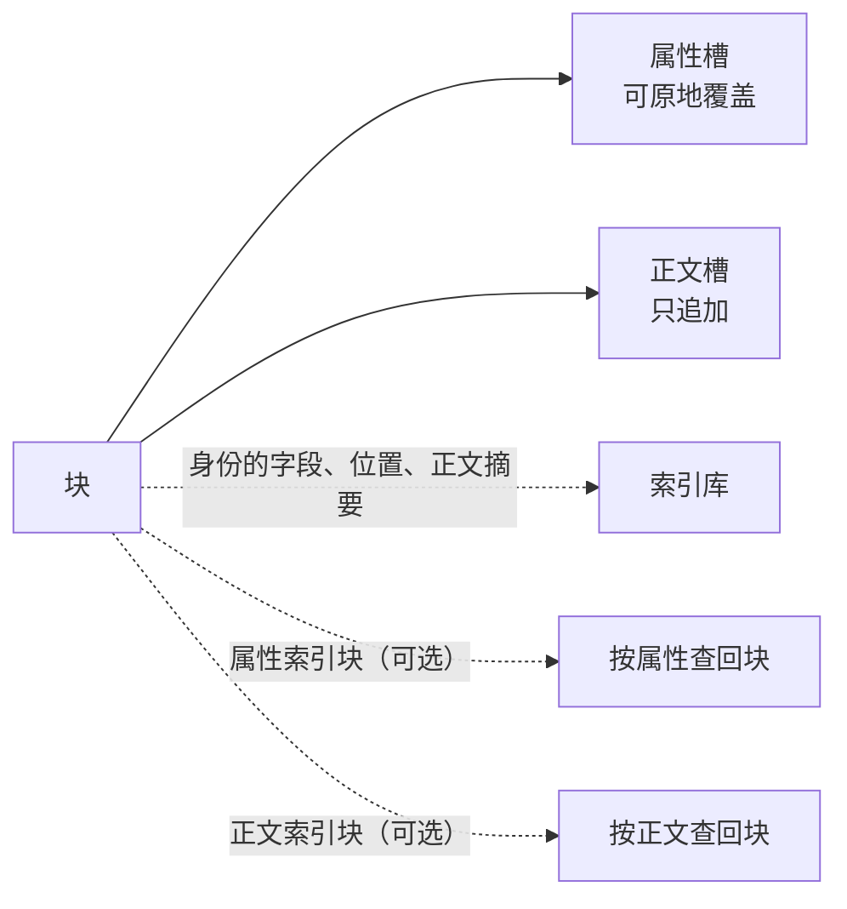

<!-- SPDX-FileCopyrightText: 2026 HanYang06 -->
<!-- SPDX-License-Identifier: Apache-2.0 -->

# 块的组成与落点

> **状态：现状**（2026-10-02 落码；2026-10-06 起**不保世代**）。本文与本目录另两篇描述的形态在
> `py_src/core/storage/` 里逐条成立。
> 本页是存储子层的裁定主篇：[载体的字节布局](pack-format.md) 与[查询链路](query-path.md)
> 中与本页冲突的部分以本页为准，差异清单见 §9。

## 0. 一句话

块由两个域组成：**属性槽**（放属性，可原地覆盖）与**正文槽**（放正文分片，只追加）。
`ID` 的字段只进索引库，**载体上不写一个字节的身份**。

## 1. 分类不新造标记

| Block 的成员 | 判据（现成） | 归类 |
|---|---|---|
| 类体裸赋值、实例上的普通属性 | `kind_of` 返回空串 | 属性 |
| `Attr(...)` 声明 | `kind_of` 返回 `attr` | 属性，并额外进属性索引块 |
| `Body(...)` 声明 | `kind_of` 返回 `body` | 正文 |
| `ID` | 由调用方签发 | **不是落点**；它是索引库那一行的来路 |

分类读类体声明与实例字段（`kinds_of` / `kind_of`），不引入第二个判据。

## 2. 库里放什么，载体上放什么

| 内容 | 落点 | 载体上的字节 |
|---|---|---|
| `name` / `value_uuid` / `birth_time` | 索引库 | **零** |
| `in_hub` / `in_hub_pack` / `in_pack_slot` | 索引库（**真源**） | **零** |
| 正文摘要（当前那一份） | 索引库 | **零** |
| 属性值 | 属性槽（载体） | 值本身 |
| 正文分片 | 正文槽（载体） | 分片本身 |
| 索引正表 | 索引块（载体），入口在库 | 正表行 |

分工定死：**索引库装身份、位置与正文摘要，是这三样的唯一来源；载体装值，是值的唯一来源。**
二者缺一，块都取不回来。由「库是权威视角」直接得到两条口径变化：

1. **载体不写身份**：记录自框定、身份随记录走、按格自我标识判活，整套退役；
2. **库另有一列不属于 `ID` 的字段**：正文摘要在库而不在身份上，故一张身份表
   **恰好七列**（`name` / `value_uuid` / `birth_time` / `in_hub` / `in_hub_pack` /
   `in_pack_slot` / `body`）。

**"哪几格是属性槽"不进库**（2026-10-02 修正裁定）：**槽号只在 pack 内有意义**，
而一个块引用的正文可能在别的 pack、甚至别的 hub；**越 pack 的关联只能用摘要，不能用槽号**。
属性槽与正文槽靠**槽头种类**分辨（`pack.ATTR_SLOT` / `pack.BODY_SLOT`），
载体上每一格本来就写着。故库里没有 `attr_in_pack_slot` 那一列。

由此作废的旧口径：

- 「把库整个删掉，系统仍必须正确」（[L0 存储设计](../../storage-design.md) §一）作废；
- 顺扫重建与冷启动（[查询链路](query-path.md)）作废；
- 按身份读取时的顺扫回退与读回核对作废；
- 「身份表少一列必须有重建入口」改为**随版本更新提供迁移**。

**不兼容旧库与老载体**：格式或库结构变更时**拒开**，不写兼容代码。
迁移只随版本更新提供；非版本更新期间自行改动造成的损坏，由使用者负责。

## 3. 位置段：库里的真源，覆盖全部槽

- `in_pack_slot` 落在索引库，覆盖该块**自己**占用的**全部槽**（属性槽与正文槽）。
  库是权威视角，位置以它为准。**引用别处的正文时，那几格不在其中**——它们在别人的 pack 里。
- 形状为段列表：`[n, n, (start, end), ...]`。**单格记一个数，连续的一段记一个区间。**
- **写侧的次序有语义**：正文槽一段在前、属性槽一段在后（`ID.place` 收多组，组内相邻者并段、
  **组与组之间不并**），故库里那一列按原次序写，不归位。
- **"哪一格是什么"由槽头回答**：属性槽与正文槽的种类写在每一格的槽头上
  （`pack.ATTR_SLOT` / `pack.BODY_SLOT`），读一个块时按需读槽头分拣。**库里不为它单列一列**：
  槽号只在 pack 内有意义，而"越 pack 的关联只能用摘要"——用一列 pack 内坐标去表达
  跨 pack 的事，读侧只能猜（2026-10-02 修正裁定）。
- 规范形四条（**升序、不重叠、相邻合并、段数最少**）用于**回收收敛与诊断**，
  不是写侧的摆放规则。
- 零散形合法，属**回收的待办**；回收按分组收敛（组内相邻者并段，组与组之间不并）。
- 改一次正文即改这一行。

**编码与解析**：段列表用**一种文本编码**（单格一个数、连续一段写 `起-止`，以逗号分隔），
读侧只有一个解析函数 `parse_segments`；正文摘要那一列**就是摘要本身**（小写十六进制
ASCII），读它走 `parse_body`，与段的编解码无关。

## 4. 属性槽

- 一个块的全部属性默认装进**一格**；装不下即占**多格**（多属性槽）。
- **单个属性值超过格长即报错**，不得静默截断。
- 属性槽**原地覆盖**；本版本**不设影子格与崩溃恢复**（见 §7 第 5 条）。
- `Attr(...)` 声明的字段另进属性索引块；裸赋值只落盘，不进索引。

## 5. 正文槽与它的摘要

- 装 `Body` 字段的正文分片，**只追加**。
- **分片按正文自身的逻辑顺序切分**；读回的顺序由库里那一行的段列表给出，**槽上不记片号**。
- **改一段正文不原地改**：**新建一组槽**装新的正文，并把库里那一列换成新那份的**摘要**。
  正文按**整份内容的摘要**判同，命中即复用同一份正文，不重复写槽。
- **库里只有当前一份的摘要**（`body` 那一列）：它同时是"正文是哪一份"的答案，
  也是引用型块读正文时的关联凭证。
- **存储不保世代**（2026-10-06 裁定）：那一列一改，上一份正文当即不在活口里，下一趟回收
  即可收走；要留历史、要回滚，由上层自己留引用。
- 只有正文确实换了内容才动那一列：同一份正文再存一次，不产生新槽，摘要也不变。
- 属性不参与：属性槽原地覆盖。

**两个运行时状态**（`Block` 上的 `_` 前缀成员，**不落成库的列、也不落成额外的槽**；
载入时由库里那一行＋槽头推出来，落盘之后按这一趟的结果改写）：

| `_inline_body` | 意思 | `_body_hash` |
|---|---|---|
| `False` | 正文内容在**本块**（本块位置段里有 body 槽） | 这份正文自己的摘要 |
| `True` | 本块**没有**正文内容，正文关联在别处 | **关联凭证**：拿它查正文索引定位那份正文 |

对外读法是 `block.body_hash` 与 `block.body_is_ref`（后者即 `_inline_body`）；
写入口只有一处（`Block.stamp_body`），引擎在载入与落盘之后各调一次。

**两条写路**：

- **未命中**（盘上还没有同摘要的位置）：写 body 槽 ＋ 写一条"摘要 → 位置"的索引行
  ＋ 把库里那一列改成该摘要；
- **命中**（已有同摘要的位置）：**不写 body 槽**，本块只占属性槽，那一列改成该摘要
  ——即**引用型**，正文的位置由那一行索引给出。

**两条读路**：本块位置段里有 body 槽即自带、读本块那几格；没有即引用型，
拿摘要查正文索引的位置行再读（查不到即报"引用已失效"，不返回半截）。

## 6. 两个索引块：增强件

| 索引块 | 用途 | 缺位后果 |
|---|---|---|
| `AttrIndex` | 按属性值查回块 | 丧失按属性查 |
| `BodyIndex` | 按正文摘要查回**它的位置**（跨 pack / hub 的坐标） | 丧失按正文查，写入去重退化 |

**它们不新增功能，只把「每次扫全库」换成「查一张表」**：正表行落在载体的槽上，
反表由正表现算（`IndexEngine.records`），不落盘。

**正文索引的那一行是"摘要 → 位置"，不是"哪个块提过它"**：位置是
**hub 名 ＋ 载体名 ＋ 段列表**，而**不是"拥有它的那个块"**。理由是位置不能挂在块身上——
那一块被删了，还在引用这份正文的块就断了。故"谁在用它"由扫各块那一列的摘要**现算**
（`IndexEngine.holders`），不落盘。**位置行里没有 `value_uuid`**（也没有 `issuer`）。

去掉两个索引块，数据不丢：按属性查用不了，写入去重退化为「每次都写新槽」，
代价是同样的正文会在盘上多留几份。

**实现上的几处补充**（属现状，以代码为证）：库的身份表**恰好七列**（`ID` 的六个字段 ＋
`body`）；位置段的**写侧次序有语义**（正文槽一段在前、属性槽一段在后），
规范形只用于回收收敛与诊断。细则见 [L0 存储设计](../../storage-design.md) §8.1、§8.4、§8.6。

- **去重只针对 `Body` 的内容。** `Attr`、裸赋值与资产类二进制（如视频）不作去重。
  命中之后**本块不写 body 槽**（引用型），正文的位置仍在原来那一份上——
  **跨 hub 也照这样引用**：不再复制一份到目标 hub（2026-10-02 修正裁定）。
- **入口合法**：索引块自身也是块，其 `ID` 进索引库、正表在载体。
  这一条不属于「把索引写进库」。
- 索引块写满的判据取配置面 `index.max.byte`，块自己可以在类体上用 `max_bytes` 覆盖它。

## 7. 规矩

1. **一次保存只写它动过的域**（属性 / 正文 / 索引三选几），不重写整块。
   正文按摘要查 `BodyIndex` 的位置行，属性编出来与库里记的那几格逐字节比。
2. **槽复用的前提**：索引库中没有任何一行、索引中没有任何一条正表行指着该槽。
   违反该前提即读到其他块的数据，且不报错。**正文槽上这一条被放宽**：
   去重本身就是让若干块共用同一份正文。
3. **`in_pack_slot` 是真源写在索引库**：改一次，写一次；**"哪几格是属性"不另列一列**，
   由槽头种类回答。
4. **写入去重走 `BodyIndex`**：按正文摘要命中即**不写 body 槽**、本块只占属性槽，
   不另设去重机制，不扫全库。
5. **属性槽原地覆盖，存储不做安全**（2026-10-06 裁定）：不设影子格、双缓冲与写前日志，
   崩溃恢复由上层自行解决。
6. **正文槽只追加**：改正文即写新槽，写过的那一格不再原地改；**上一份正文在新槽落定之后
   立即不在活口里**——存储不保世代。

## 8. 配置

| 键 | 含义 | 开箱值 |
|---|---|---|
| `slot.max.byte.b` | 格长档位：每单位 1 字节 | 512 |
| `slot.max.byte.kb` | 格长档位：每单位 1024 字节 | 0 |
| `pack.max.byte` | 封口线（字节） | 2 GiB |
| `hub.default` | 默认 hub 名 | `main` |
| `index.max.byte` | 一个索引块的体积上限（字节） | 64 MiB |
| `gc.auto.byte` | 自动回收的阈值（字节）；`0` 即不自动回收 | 0 |

- 格长按两档**相加**得出；**兆 / 吉 / 太三档清掉**。
- 格长写在载体文件头，读侧一律以文件头为准，不看配置。
- 回收有两个触发点：**手动回收**与**自动回收**（达到 `gc.auto.byte` 即触发）；
  手动那一头是模块级 `sweep(engine)`，自动那一头的判据函数 `reclaimable_bytes(engine)` 已落码，
  但**没有接线到后台**。

## 9. 与旧口径的差异

| 旧口径 | 现行口径 |
|---|---|
| 载体上写身份（记录头 / 身份帧） | **载体不写身份** |
| 位置是「头格与末格」一对，或「组首格」一个数 | 位置是**段列表**，覆盖全部槽；写侧分两组、次序有语义 |
| 帧、帧表、信息格 / 数据格、版本组、提交格 | 全部取消；格的形态只有属性槽与正文槽 |
| 数据格自报归属（32 字节） | 取消；只留槽头（16 字节，见[载体的字节布局](pack-format.md)） |
| 墓碑 | 取消；删除即摘掉索引库那一行 |
| 正文历史按「块的一代」 | 按**摘要**：改一段即写新槽、把库里那一列换成新摘要，按整份内容的摘要判同 |
| 库里留摘要链（`body_history`，一个世代一条） | 库里只留**当前一份**摘要（`body`）；**不保世代**，要历史由上层自己留引用 |
| 属性参与历史 | 属性不参与历史，原地覆盖 |
| 库另有属性槽段列表（`attr_in_pack_slot`）与正文历史两列 | 库另有**正文摘要**一列（`body`），**恰好七列**；「哪几格是属性槽」由槽头回答 |
| 正文位置记在引用它的那个块的位置段里、跨 hub 时复制一份 | **正文位置记在正文索引的位置行里**（跨 pack/hub 的坐标）；跨 hub 直接引用，不复制 |
| 旧库：重建入口 | 旧库：拒开；迁移随版本更新提供 |
| `slot.max.byte` 五档 | 只留 `b` / `kb` 两档 |
| 内核不为正文分片内置机制 | **正文槽即分片机制** |

原「格与二进制格式」页已删除：其中仍然成立的部分（定长格与算术定位、格号到地址为常数时间）
并入[载体的字节布局](pack-format.md)。

## 10. 待裁

| 项 | 状态 |
|---|---|
| 格长配置键该补的词 | 待定（现有键为 `slot.max.byte.{b,kb}`） |
| `gc.auto.byte` 的开箱值 | 待定 |
| `birth_time` 是否落整数列 | 待定（现为文本列，列表页排序与分页需要整数序） |
