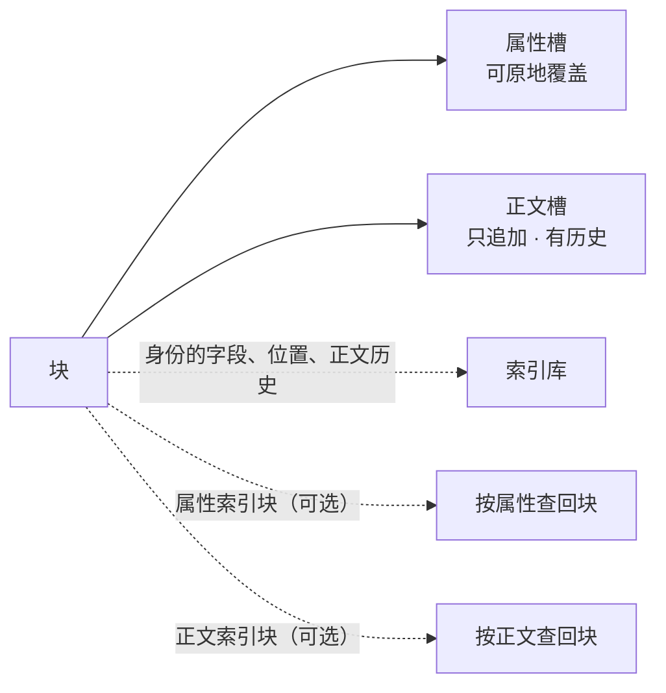

<!-- SPDX-FileCopyrightText: 2026 HanYang06 -->
<!-- SPDX-License-Identifier: Apache-2.0 -->

# 块的组成与落点

> **状态：裁定**（2026-10-02）。方向已定，**尚未落码**；与代码冲突时以代码为准。
> 本页是存储子层的裁定主篇：[载体的字节布局](pack-format.md) 与[查询链路](query-path.md)
> 中与本页冲突的部分以本页为准，差异清单见 §9。

## 0. 一句话

块由两个域组成：**属性槽**（放属性，可原地覆盖）与**正文槽**（放正文分片，只追加）。
`ID` 的字段只进索引库，**载体上不写一个字节的身份**。

## 1. 分类不新造标记

| Block 的成员 | 判据（现成） | 归类 |
|---|---|---|
| 类体裸赋值、实例上的普通属性 | `kind_of` 返回空串 | 属性 |
| `Attr(...)` 声明 | `kind_of` 返回 `attr` | 属性，并额外进属性索引块 |
| `Body(...)` 声明 | `kind_of` 返回 `body` | 正文 |
| `ID` | 由调用方签发 | **不是落点**；它是索引库那一行的来路 |

分类读类体声明与实例字段（`kinds_of` / `kind_of`），不引入第二个判据。

## 2. 库里放什么，载体上放什么

| 内容 | 落点 | 载体上的字节 |
|---|---|---|
| `name` / `value_uuid` / `birth_time` | 索引库 | **零** |
| `in_hub` / `in_hub_pack` / `in_pack_slot` | 索引库（**真源**） | **零** |
| 正文历史（世代 → 段列表） | 索引库 | **零** |
| 属性值 | 属性槽（载体） | 值本身 |
| 正文分片 | 正文槽（载体） | 分片本身 |
| 索引正表 | 索引块（载体），入口在库 | 正表行 |

分工定死：**索引库装身份、位置与正文历史，是这三样的唯一来源；载体装值，是值的唯一来源。**
二者缺一，块都取不回来。由「库是权威视角」直接得到两条口径变化：

1. **载体不写身份**：记录自框定、身份随记录走、按格自我标识判活，整套退役；
2. **库的列不再等于 `ID` 的字段**：正文历史是库的一列，而 `ID` 上没有它。

由此作废的旧口径：

- 「把库整个删掉，系统仍必须正确」（[L0 存储设计](../../storage-design.md) §一）作废；
- 顺扫重建与冷启动（[查询链路](query-path.md)）作废；
- 按身份读取时的顺扫回退与读回核对作废；
- 「身份表少一列必须有重建入口」改为**随版本更新提供迁移**。

**不兼容旧库与老载体**：格式或库结构变更时**拒开**，不写兼容代码。
迁移只随版本更新提供；非版本更新期间自行改动造成的损坏，由使用者负责。

## 3. 位置段：库里的真源，覆盖全部槽

- `in_pack_slot` 落在索引库，覆盖该块占用的**全部槽**（属性槽与正文槽）。
  库是权威视角，位置以它为准。
- 形状为段列表：`[n, n, (start, end), ...]`。**单格记一个数，连续的一段记一个区间。**
- 规范形四条：**升序、不重叠、相邻合并、段数最少**。
- 零散形合法，属**回收的待办**；收敛成整段由回收负责。
- 改一次正文即改这一行。

**编码与解析**：段列表与正文历史用**同一种文本编码**（单格与区间两种形态都能表示），
读侧**只有一个解析函数**——当前实现里的两个解析点必须合并为一个。

## 4. 属性槽

- 一个块的全部属性默认装进**一格**；装不下即占**多格**（多属性槽）。
- **单个属性值超过格长即报错**，不得静默截断。
- 属性槽**原地覆盖**；本版本**不设影子格与崩溃恢复**（见 §7 第 5 条）。
- `Attr(...)` 声明的字段另进属性索引块；裸赋值只落盘，不进索引。

## 5. 正文槽与历史

- 装 `Body` 字段的正文分片，**只追加**。
- **分片按正文自身的逻辑顺序切分**；读回的顺序由库里那一行的段列表给出，**槽上不记片号**。
- **历史以槽为单位**：修改一段正文时不原地改，而是**新建一个槽并复制原内容、施加增量**，
  再把关联指到新槽。改一个槽记一条关联，改两个记两条，逐条记录。
- 历史关联（世代 → 段列表）记在索引库；**当前世代**由位置段给出。
- 保留世代数由配置给（`body.history.depth`），不得写成常数。
- 属性不参与历史。

## 6. 两个索引块：增强件

| 索引块 | 用途 | 缺位后果 |
|---|---|---|
| `AttrIndex` | 按属性值查回块 | 丧失按属性查 |
| `BodyIndex` | 按正文查回块；其引用数即去重判据 | 丧失按正文查，写入去重退化 |

**它们不新增功能，只把「每次扫全库」换成「查一张表」。**

| 状态 | 索引行 | 去重判据 | 按属性查 |
|---|---|---|---|
| 无索引块 | 不写 | 全库扫 | 全库扫 |
| 当前实现 | 写 | 全库扫 | 查表 |
| 落码目标 | 写 | 查表 | 查表 |

去掉两个索引块，数据不丢：全部功能仍然成立，代价是每次查询与每次保存都要扫全库。

- **去重只针对 `Body` 的内容。** `Attr`、裸赋值与资产类二进制（如视频）不作去重。
- **入口合法**：索引块自身也是块，其 `ID` 进索引库、正表在载体。
  这一条不属于「把索引写进库」。
- 索引块写满的判据取配置面 `index.max.byte`，不新增机制。

## 7. 规矩

1. **一次保存只写它动过的域**（属性 / 正文 / 索引三选几），不重写整块。
2. **槽复用的前提**：索引库中没有任何一行、索引中没有任何一条正表行指着该槽。
   违反该前提即读到其他块的数据，且不报错。
3. **`in_pack_slot` 是真源写在索引库**：改一次，写一次。
4. **写入去重走 `BodyIndex`**：按正文摘要命中即引用同一份正文，不另设去重机制，不扫全库。
5. **属性槽原地覆盖**：本版本不设影子格、双缓冲与写前日志，即不设崩溃恢复路径。
6. **正文槽只追加**：旧世代在新槽落定并通过校验之前不得被回收。

## 8. 配置

| 键 | 含义 | 开箱值 |
|---|---|---|
| `slot.max.byte.b` | 格长档位：每单位 1 字节 | 512 |
| `slot.max.byte.kb` | 格长档位：每单位 1024 字节 | 0 |
| `pack.max.byte` | 封口线（字节） | 2 GiB |
| `hub.default` | 默认 hub 名 | `main` |
| `index.max.byte` | 一个索引块的体积上限（字节） | 64 MiB |
| `body.history.depth` | 正文保留世代数 | 1 |
| `gc.auto.byte` | 自动回收的阈值（字节）；`0` 即不自动回收 | 0 |

- 格长按两档**相加**得出；**兆 / 吉 / 太三档清掉**。
- 格长写在载体文件头，读侧一律以文件头为准，不看配置。
- 回收有两个触发点：**手动回收**与**自动回收**（达到 `gc.auto.byte` 即触发）。

## 9. 与旧口径的差异

| 旧口径 | 本裁定 |
|---|---|
| 载体上写身份（记录头 / 身份帧） | **载体不写身份** |
| 位置是「头格与末格」一对，或「组首格」一个数 | 位置是**段列表**，覆盖全部槽 |
| 帧、帧表、信息格 / 数据格、版本组、提交格 | 全部取消；格的形态只有属性槽与正文槽 |
| 数据格自报归属（32 字节） | 取消；只留槽头（16 字节，见[载体的字节布局](pack-format.md)） |
| 墓碑 | 取消；删除即摘掉索引库那一行 |
| 正文历史按「块的一代」 | 按**槽**：改一段即新建一个槽 |
| 属性参与历史 | 属性不参与历史，原地覆盖 |
| 库的列 = `ID` 的字段 | 库另有正文历史一列；库是权威视角 |
| 旧库：重建入口 | 旧库：拒开；迁移随版本更新提供 |
| `slot.max.byte` 五档 | 只留 `b` / `kb` 两档 |
| 内核不为正文分片内置机制 | **正文槽即分片机制** |

原「格与二进制格式」页已删除：其中仍然成立的部分（定长格与算术定位、格号到地址为常数时间）
并入[载体的字节布局](pack-format.md)。

## 10. 待裁

| 项 | 状态 |
|---|---|
| 格长配置键该补的词 | 待定（现有键为 `slot.max.byte.{b,kb}`） |
| `body.history.depth` 与 `gc.auto.byte` 的开箱值 | 待定 |
| 正文历史关联落库的字段名与序列化 | 待定（备选：改为载体上的一条链，代价是槽头加「上一代」指针） |
| `birth_time` 是否落整数列 | 待定（列表页排序与分页需要） |
