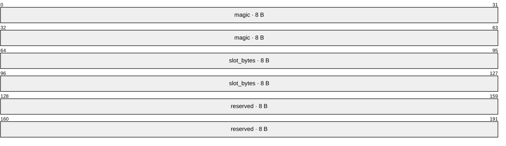
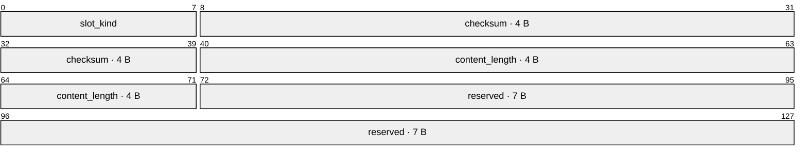

<!-- SPDX-FileCopyrightText: 2026 HanYang06 -->
<!-- SPDX-License-Identifier: Apache-2.0 -->
<!-- translation-source-hash: a42825471c7a7bb8875cb44b667d33cb278a198b92948fd595d8befb2b1aaf6e -->
# Byte layout of the carrier

> **Status: Current Situation** (2026-10-02, out of stock). This page replaces the previous page `slot.md` and the content of the old version of this page:
The carrier does not indicate identity; slots are categorized into only two types: attributes and body text.
> The domain partitioning and criteria for blocks are shown in [块的组成与落点](block-parts.md).

**Map-Reading Convention**: The numbers in the diagram represent bit ranges (one byte equals eight bits), arranged from left to right according to their offset.

## 0. One sentence

One carrier = **file header + a sequence of fixed-length slots**; each slot = **slot header + content**.
A block consists of **attribute slots** and **body slots**; fields marked with `ID` are only indexed and do not occupy any storage space on the carrier.

## 1. A Carrier


The grid number is calculated starting from the file header, with each grid having the same length; therefore, converting the grid number to a byte address is done through arithmetic rather than by looking up a table.

```text
地址 = 24 + 格号 × 格长
```

**Cell address computation is constant time**: Given a cell index, the address can be computed on the spot—no table lookups, no directory scans, and no reading from other cells.

## 2. File Header (24 Bytes)



| Field | Bytes | Meaning |
|---|---|---|
| `magic` | 8 | Magic number `CairnPk2`, with the last digits being the **layout version number**; if they do not match, an error is reported—no inference is performed, nor is it treated as “no carrier present here.” |
| `slot_bytes` | 8 | **Grid length**. Always refer to the reading side; do not consider the configuration.
| `reserved` | 8 | Reserved, write zero |

## 3. Slot Header (16 bytes)

First count the required items, then allocate 50% as a reserve:

| Item | Number of Bytes | Purpose |
|---|---|---|
| Slot Type | 1 | Distinguishing between attribute slots and body slots |
| Checksum | 4 | CRC32, verify this field |
| Content Length | 4 | Actual number of bytes in the content |
| **Total Required Items** | **9** | Sum of the Three Items |
| Reserved | 7 | Approximately 50% margin |
| **Slot Head** | **16** | Total Required Items Plus Reserves |



| Field | Bytes | Meaning |
|---|---|---|
| `slot_kind` | 1 | Slot type: attribute slot or body slot |
| `checksum` | 4 | crc32, verify this field |
| `content_length` | 4 | The actual number of bytes occupied by the content |
| `reserved` | 7 | Reserved |

The content length records the actual length of the content, so the available space per cell is **cell length minus 16 bytes**.

## 4. Two Types of Slots

| Slot | What to load | Writing style |
|---|---|---|
| **Attribute Slot** | All attributes of a block | Can be overwritten in place |
| **Main Content Slot** | Main Content Fragment | Append Only |

Main text **segmented in logical order**. The order of the shards is determined by the segment list in the **index library row**.
**Do not record the slot number, generation number, or affiliation.**

-Attribute slot in-place overwrite: The slot has a fixed length; the overwrite occurs within the same slot, and the position remains unchanged; the attribute is not recorded in the history.
-The main text slot only appends; once a cell has been written to, it is no longer modified in place. Each time the main text is updated, the corresponding column in the index database is replaced with the new abstract.
The old one has become a dead slot and will be reclaimed when garbage collection runs (***storage is not guaranteed across generations***, ruling dated 2026-10-06).
-The current text is provided by the index library column (**only a summary, no generations**); see the criteria.
§3, §5.

**All slots of a block fall within the same carrier** (Ruling dated 2026-10-07): During write operations, only one carrier is selected at a time (with priority given to the carrier that contains the block itself).
The carrier name of a block is derived from its write result—therefore, a single block does not span multiple carriers.

## 5. Configuration: Two gear positions for grid length

| Key | Unit | Meaning |
|---|---|---|
| `core.storage.slot.max.byte.b` | 1 byte/unit | One division of the grid length |
| `core.storage.slot.max.byte.kb` | 1024 bytes/unit | One step of grid length |

The sum of the two settings gives the grid length; the Zhao, Ji, and Tai settings are cleared.
**The grid length is written in the file header; during reading, always refer to the file header and disregard any configuration settings.**

## 6. Invariants

| Invariant | Meaning |
|---|---|
| The grid length remains constant within the carrier | Therefore, arithmetic addressing always holds true |
| Accessing a cell by address is constant time | No table lookup, no directory scan, no reading of other cells |
| File-level addresses consist only of cell numbers | Slot heads describe only their own cells and do not constitute a second set of file-level locators |
| Main content slot only appends | Already written chunks are not rewritten |
| Attribute slot in-place overwrite | The overwrite occurs within the same cell, with the position remaining unchanged |
| A block’s slot does not span carriers | During writing, only one carrier is selected at a time (with priority given to the block’s own carrier); the carrier name in the library is derived from the write result |

## 7. Obsolete Old Caliber

All items in the following table have been invalidated (storage ruling dated 2026-10-02, with code expiration on the same day); they are listed here solely to avoid confusion with the current standards.
The calibers that replace them are specified in §§2 through 6 and §0.

| Voided Item | Reason for Voiding |
|---|---|
| Frame and Frame Table | No further divisions within a cell; one cell consists of **header + content** |
| Distinction between Information Cells and Data Cells | Cell types are classified by content: **Attribute Slots** and **Body Slots** |
| Identity Frame | The carrier does not store a single byte of identity data; identity fields are only indexed. |
| Attribute Frame | The entire attribute is placed into the attribute slot, overwriting any existing content in place |
| Data grid index frame | The order of the text fragments is determined by the segment list in that row of the index database |
| Positive table row frame | The frame layer does not exist; the content of the positive table is mapped to the slots of the carrier. |
| Version Group and Generation Number | No generation number is recorded on the chain; the ledger only contains the **current single** summary, with no generations (ruling dated 2026-10-06) |
| Submission Grid | Invalidated together with the version group; no cross-grid submission markers exist |
| Data header: 32 bytes, including the attribution three fields (`owner_uuid` / `field_index` / `fragment_index`) | Slot header: 16 bytes, containing only the slot type, checksum, and content length; the attribution is not included in the carrier |
| Record header and record self-enclosure | The record concept is invalidated; the boundaries of the field are determined by the field length in the file header. |
| Tombstone | This ruling does not include a deletion mark on the medium |

## 8. Adjacent Pages

-[块的组成与落点](block-parts.md): Block partitioning, segment list, main text summary, and six rules.
-[L0 存储设计](../../storage-design.md): Layering on the carrier (hub/index repository/recycling).
