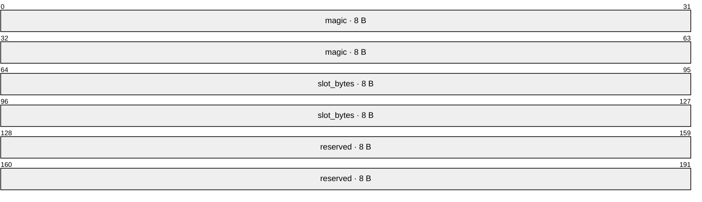
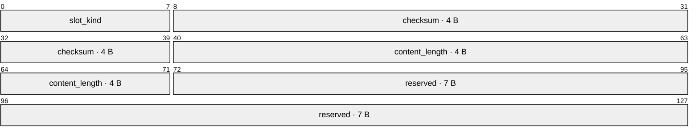

<!-- SPDX-FileCopyrightText: 2026 HanYang06 -->
<!-- SPDX-License-Identifier: Apache-2.0 -->

# 载体的字节布局

> **状态：现状**（2026-10-02 落码）。本页取代旧页 `slot.md` 与本页旧版的内容：
> 载体上不写身份，槽只分属性与正文两类。
> 块的分域与判据见[块的组成与落点](block-parts.md)。

**读图约定**：图中的数字是**位**区间（一字节八位），按偏移从左到右排列。

## 0. 一句话

一个载体 = **文件头 ＋ 一串定长格**；每格 = **槽头 ＋ 内容**。
块由**属性槽**与**正文槽**组成；`ID` 的字段只进索引库，**载体上不写一个字节的身份**。

## 1. 一个载体


格从文件头之后起算，每格长度相同，故格号到字节地址是算术，不查表：

```text
地址 = 24 + 格号 × 格长
```

**格号到地址是常数时间**：给一个格号，地址当场算出；不查表、不扫目录、不读别的格。

## 2. 文件头（24 字节）



| 字段 | 字节数 | 含义 |
|---|---|---|
| `magic` | 8 | 魔数 `CairnPk2`，末位是**布局版本号**；不符即报错，不推断、也不当作「此处没有载体」 |
| `slot_bytes` | 8 | **格长**。读侧一律以此为准，不看配置 |
| `reserved` | 8 | 预留，写零 |

## 3. 槽头（16 字节）

先数必需项，再按 50% 预留：

| 项 | 字节数 | 用途 |
|---|---|---|
| 槽种类 | 1 | 区分属性槽与正文槽 |
| 校验和 | 4 | crc32，校验这一格 |
| 内容长度 | 4 | 内容的实际字节数 |
| **必需项合计** | **9** | 三项之和 |
| 预留 | 7 | 约 50% 的余量 |
| **槽头** | **16** | 必需项合计加预留 |



| 字段 | 字节数 | 含义 |
|---|---|---|
| `slot_kind` | 1 | 槽种类：属性槽或正文槽 |
| `checksum` | 4 | crc32，校验这一格 |
| `content_length` | 4 | 内容实际占用的字节数 |
| `reserved` | 7 | 预留 |

内容长度记内容的实际长度，故一格的可用内容为**格长减 16 字节**。

## 4. 两类槽

| 槽 | 装什么 | 写法 |
|---|---|---|
| **属性槽** | 一个块的全部属性 | 可原地覆盖 |
| **正文槽** | 正文分片 | 只追加 |

正文**按逻辑顺序分片**。分片的顺序由**索引库那一行**的段列表给出；
**槽上不记片号、不记世代号、不记归属**。

- 属性槽原地覆盖：格定长，覆盖发生在同一格内，位置不变；属性不进历史。
- 正文槽只追加，旧分片留在载体上；改一次正文即改索引库那一行。
- 正文的历史与当前世代由索引库给出，判据见[块的组成与落点](block-parts.md) §3、§5。

## 5. 配置：格长的两档

| 键 | 单位 | 含义 |
|---|---|---|
| `slot.max.byte.b` | 1 字节/单位 | 格长的一档 |
| `slot.max.byte.kb` | 1024 字节/单位 | 格长的一档 |

两档相加即为格长；兆、吉、太三档清掉。
**格长写在文件头，读侧一律以文件头为准，不看配置。**

## 6. 不变量

| 不变量 | 含义 |
|---|---|
| 格长在载体内部不变 | 故算术定位永远成立 |
| 格号到地址为常数时间 | 不查表、不扫目录、不读别的格 |
| 文件级地址只有格号 | 槽头只描述本格，不构成第二套文件级定位 |
| 正文槽只追加 | 已写的分片不被改写 |
| 属性槽原地覆盖 | 覆盖发生在同一格内，位置不变 |

## 7. 作废的旧口径

下表各项**均已作废**（2026-10-02 的存储裁定，同日落码），列在这里只为不与现行口径混淆；
取代它们的口径见 §2 至 §6 与[块的组成与落点](block-parts.md)。

| 作废项 | 作废理由 |
|---|---|
| 帧与帧表 | 格内不再分条；一格就是**槽头 ＋ 内容** |
| 信息格 / 数据格之分 | 格改按内容分：**属性槽**与**正文槽** |
| 身份帧 | 载体上不写一个字节的身份，身份的字段只进索引库 |
| 属性帧 | 属性整体放进属性槽，可原地覆盖 |
| 数据格索引帧 | 正文分片的顺序由索引库那一行的段列表给出 |
| 正表行帧 | 帧这一层不存在；正表按块的内容落在载体的槽上 |
| 版本组与世代号 | 槽上不记世代号；世代的判据在索引库 |
| 提交格 | 随版本组一并作废，不存在跨格的提交标记 |
| 数据格头 32 字节与归属三字段（`owner_uuid` / `field_index` / `fragment_index`） | 槽头定 16 字节，只留槽种类、校验和、内容长度；归属不进载体 |
| 记录头与记录自框定 | 记录概念作废；格的边界由文件头的格长定出 |
| 墓碑 | 本裁定不设载体上的删除标记 |

## 8. 相邻页

- [块的组成与落点](block-parts.md)：块的分域、段列表、历史视图与六条规矩。
- [L0 存储设计](../../storage-design.md)：载体之上的分层（hub / 索引库 / 回收）。
