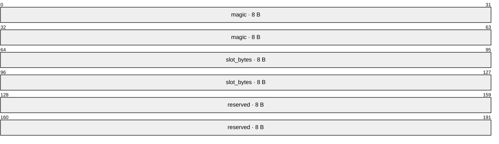
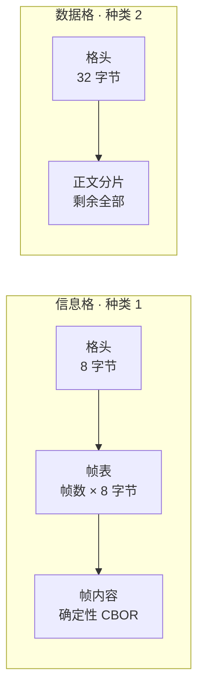
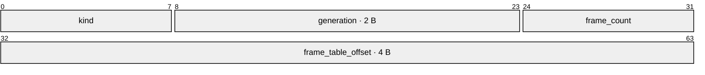
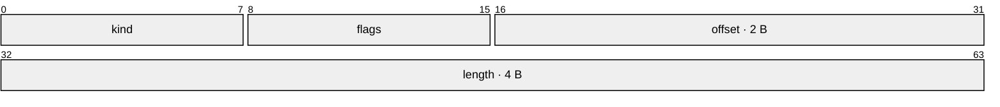
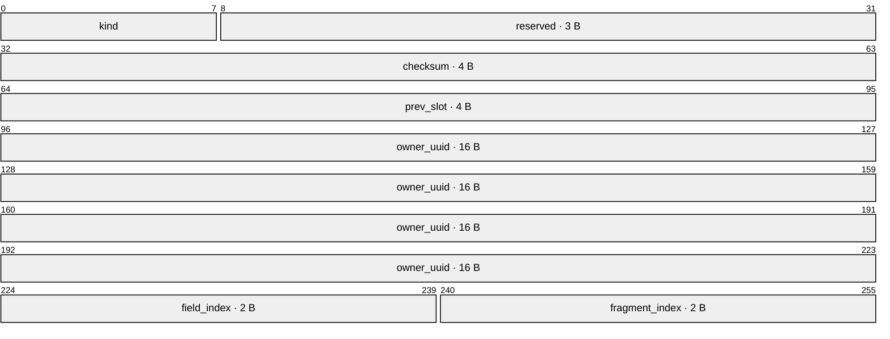
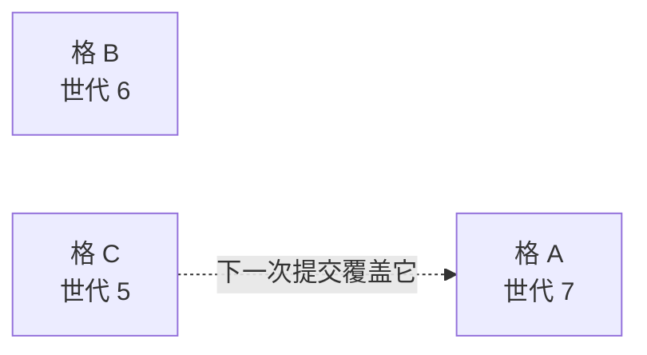

<!-- SPDX-FileCopyrightText: 2026 HanYang06 -->
<!-- SPDX-License-Identifier: Apache-2.0 -->

# 载体的字节布局

> **状态：草案**（2026-10-02）。方向已定，**尚未落码**；与代码冲突时以代码为准。
> 这一页只回答一件事：**它长什么样。** 为什么这么放、判据与取舍见[格与二进制格式](slot.md)。

**读图约定**：图中的数字是**位**区间（一字节八位），按偏移从左到右排列。

## 1. 一个载体


格从文件头之后起算，每格 `slot_bytes` 字节。**格号到地址是算术**，不查表：

```text
地址 = 24 + 格号 × slot_bytes
```

## 2. 载体文件头（24 字节）



| 字段 | 含义 |
|---|---|
| `magic` | 魔数，末位是布局版本号 |
| `slot_bytes` | 格长。**读侧一律以此为准**，不看配置 |
| `reserved` | 预留 |

## 3. 两类格



### 3.1 信息格头（8 字节）



| 字段 | 含义 |
|---|---|
| `kind` | 格种类，信息格记 1 |
| `generation` | 提交序号。**读时取校验通过且序号最大的那一格** |
| `frame_count` | 本格帧数 |
| `frame_table_offset` | 帧表位置，自格首起算 |

### 3.2 帧头（8 字节）



| 字段 | 含义 |
|---|---|
| `kind` | 帧种类（见下表） |
| `flags` | 预留 |
| `offset` | 帧内容位置，自格首起算。两字节，故**格长上限 64 KB** |
| `length` | 帧内容长度 |

### 3.3 三个帧种类

| 帧 | 装什么 |
|---|---|
| 身份帧 | 分配凭证、名字、签发时刻 |
| 属性帧 | 一个字段一帧：字段序号、值 |
| 数据格索引帧 | 一串区间：载体名、首格、格数 |
| 正表行帧 | 索引块专用：一条正表行（字段、值、目标） |

## 4. 数据格头（32 字节）



| 字段 | 含义 |
|---|---|
| `kind` | 格种类，数据格记 2 |
| `checksum` | crc32，校验这一格 |
| `prev_slot` | 自报前驱格号，用于校验与抢救 |
| `owner_uuid` | 归属：这份分片属于谁 |
| `field_index` | 归属：哪个字段 |
| `fragment_index` | 归属：第几片 |

归属四字段（含种类）让"这一格属于谁"能从载体上算回来，故**库里的区间清单是纯投影**；
读某一格时核对归属与校验和即可，无须重算全库。

## 5. 版本组



- **写**：目标格 ＝ 组内（最大有效世代 mod N）的下一格，世代号加一；
- **读**：取"校验通过且世代号最大"的那一格；
- 组首格是**稳定地址**（块建好后不再变），故提交不必写库。

## 6. 不变量

| 不变量 | 含义 |
|---|---|
| 格号到地址为常数时间 | 不查表、不扫目录、不读别的格 |
| 格长载体内部不变 | 故算术定位永远成立 |
| 文件级地址只有格号 | 帧的槽内偏移是格内容的自我描述 |
| 数据格不可变、只追加 | 信息格在版本组内原地覆盖 |
| 提交不写库 | 库里的位置是纯投影，读时以载体为准 |
| 重建与压实是显式动作 | 不在交互路径上 |
