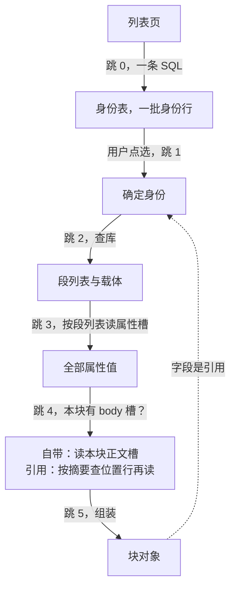

<!-- SPDX-FileCopyrightText: 2026 HanYang06 -->
<!-- SPDX-License-Identifier: Apache-2.0 -->
<!-- translation-source-hash: 304034c8905286061050bc793feee8301cbbbda905b2e6b0278434f75b16632c -->
# Query Link

> **Status: Current Situation** (2026-10-02, out of stock). This page only answers one question:
> Which action should we start with, which hops are involved, what information is obtained at each hop, and what to do in case of failure.**
> The definitions of bytes and slots are given in [载体的字节布局](pack-format.md); the composition of blocks is described in [块的组成与落点](block-parts.md).

## 0. Trigger Point

| Trigger | Starting Point | Why Start Here |
|---|---|---|
| Go to list page | Jump 0: Library | You must first obtain the "list of options" before you can decide "which one to view" |
| Open an item | Jump to 1: Confirm Identity | Selecting it confirms that identity |
| Search by attribute or by tag | Index block | Searching by value is the responsibility of the index, not the database |
| Expand Citation | Content Credential in the Field | The citation points to another piece of content, with a back-and-forth jump |

**Lookup index blocks by value**: Two index blocks are **enhancements**, and the primary table rows are mapped to slots on the carrier. When querying by (column, value)
Read the primary table rows in each index block one by one (read and filter on the fly); upon a hit, follow the pointers in the row.
Return to the identity table row, then read the attribute slot and the body slot using the segment list; if the index block is missing, the value cannot be found.
**Data is not lost.** **The line in the main text index does not contain `value_uuid`**: It answers the question “Where is this main text?”
Therefore, it provides a coordinate (hub name + carrier name + segment list), not a block reference.



## 1. Hop-by-Hop

### Jump to 0 list page: First SQL statement

A single query retrieves one page of identity information: identifier, name, issuance time, carrier, and segment list. **This jump only affects the stack pointer; it does not read the operand.**

```sql
SELECT value_uuid, name, birth_time, in_hub, in_hub_pack, in_pack_slot
FROM notedata
ORDER BY birth_time DESC
LIMIT 50;
```

!!! note "About 'join'"
    库的形状是**一个类型一张身份表**，类型之间没有关联表（关系表已裁），
    故第一跳是单表查询。库给身份与位置，**属性值只在载体的属性槽里**：
    列表能直接显示的只有库里那几列（名字、签发时刻这几项），要显示属性即读属性槽。

### Step 1: Verify Identity

When the user selects a row, they obtain a verified identity (credential + name + issuance time). From then on, all self-identifications are based on this identity.

### Jump 2: Search the database by identity

Use the identity assignment credential to query the corresponding row in that table, and retrieve the **segment list** along with its associated storage medium.
This jump is **the entire reason Curry exists**: without it, his positioning would be reduced to a mere sweep across the entire court.

### Jump 3 Read Attribute Slot

Read the slots occupied by this block according to the segment list, **separate the attribute slots based on the slot headers** (the main text slot and similar types will be processed in the next step), and extract all attribute values.
The attribute value is directly available; there is no need to read other slots on the carrier.

### Jump to 4, read the main text

**First, check whether there is a body slot in this position segment** (only consider the slot header):

-**Yes (built-in)**: Reads the corresponding text slots in paragraph list order. It can be read in one sitting.
You can also retrieve one segment first and then continue reading subsequent segments in list order; there are no segment numbers on the slot, so it does not rely on in-slot pointers.
-**None (Reference Type)**: This block contains no main text; the main text is referenced elsewhere. Take Curry's row.
The abstract of that entry (i.e., the current text), use it to look up the **position line** in the main-text index—
The location line provides the hub name, carrier name, and a list of segments (**coordinates spanning packs and hubs**); use this information to read the corresponding main text.
If the index does not contain that row, it reports "reference is invalid" and does not return a partial result.

### Jump 5 Assembly and Reference Expansion

Assemble the identity, attributes, and body into a block object and return it to the caller. If the field contains a reference (the content credential is not local),
Jump back by reference to step 2 and repeat: **Jump as many times as the number of levels of reference**. The loop and depth are managed by the domain side.
(Visit set or depth limit); the storage engine only guarantees a single hop.

## 2. Dependency and Failure Semantics of Each Hop

| Jump | Dependency | Failure Semantics |
|---|---|---|
| 0 | Index database | Database or table does not exist: explicit error reported, **no silent fallback** |
| 1 | - | - |
| 2 | Index database | The row does not exist in the database: an explicit "object not found" error is reported; **no silent fallback** |
| 3 | Carrier | Attribute slots cannot be read, validation fails: explicit error reported, **no silent fallback** |
| 4 | Storage + Index Database | If even one chunk of the main text is missing or fails verification: report “reference invalid,” **do not return a partial result**; if it is a reference type but the corresponding chunk is not found in the main-text index, the same rule applies.
| 5 | - | The referenced content has been garbage-collected: reports "reference is invalid," does not return a null value |

## 3. Library Loss and Reconstruction

The index database is the true source of identity and location; there is no path to fully reconstruct it from the carrier.**
Library loss equals identity and location loss: When enabled, it directly reads the existing library without performing a full library scan.
In the current implementation, there is no caching layer—each hop directly queries the database and reads the slot.

## 4. Pending裁

1. **Column type of `birth_time`**: Currently set to text; lexicographical order differs from numerical order.
It will be sorted incorrectly when values with different numbers of digits appear. If you want the list page to be sorted and paginated within the library,
It (as well as integer fields such as the genitive case) should be implemented as an integer column.
2. **Pagination criteria**: Should pagination be based on the issuance time, or on names or tags? The latter requires integration with an in-memory index.
3. **Scope of conversation caching**: one page, one article, or the most recent few articles; it only affects speed and does not impact correctness.
4. **Cache Size Limit**: On low-memory machines, memory is a strict constraint; the index cache must have an upper limit and a defined eviction policy.
Whether the limit is based on the number of entries or the number of bytes has not yet been decided.
