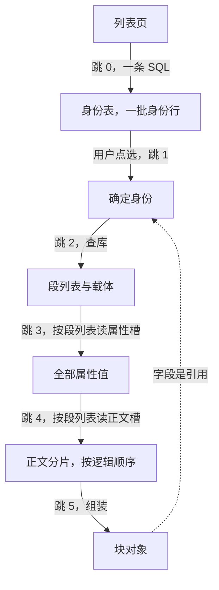

<!-- SPDX-FileCopyrightText: 2026 HanYang06 -->
<!-- SPDX-License-Identifier: Apache-2.0 -->

# 查询链路

> **状态：现状**（2026-10-02 落码）。本页只回答一件事：
> **从哪个动作开始查、经过哪几跳、每一跳拿到什么、失败怎么办。**
> 字节与槽的定义见[载体的字节布局](pack-format.md)；块的组成见[块的组成与落点](block-parts.md)。

## 0. 触发点

| 触发 | 起点 | 为什么从这里开始 |
|---|---|---|
| 进入列表页 | 跳 0：库 | 要先拿到"有哪些"，才知道"要看哪一个" |
| 点开一条 | 跳 1：确定身份 | 点选即是对一个身份的确认 |
| 按属性或按标签查 | 索引块 | 按值查是索引的职责，不落在库上 |
| 展开引用 | 字段里的内容凭证 | 引用指向另一份内容，跳回跳 2 |

**按值查走索引块**：两个索引块是**增强件**，正表行落在载体的槽上。按（列，值）查时
逐个索引块读它槽里的正表行（`read_index_rows` 现读现筛），命中后顺着行里的
`value_uuid` 回到身份表那一行，再按段列表读属性槽与正文槽；索引块缺失即按值查不到，
**数据不丢**。



## 1. 逐跳

### 跳 0 列表页：第一条 SQL

一次查询取回一页身份：标识、名字、签发时刻、载体与段列表。**这一跳只碰库，不读载体。**

```sql
SELECT value_uuid, name, birth_time, in_hub, in_hub_pack, in_pack_slot
FROM notedata
ORDER BY birth_time DESC
LIMIT 50;
```

!!! note "关于「join」"
    库的形状是**一个类型一张身份表**，类型之间没有关联表（关系表已裁），
    故第一跳是单表查询。库给身份与位置，**属性值只在载体的属性槽里**：
    列表能直接显示的只有库里那几列（名字、签发时刻这几项），要显示属性即读属性槽。

### 跳 1 确定身份

用户点选一行，得到确定身份（分配凭证 ＋ 名字 ＋ 签发时刻）。此后一切定位都从这个身份出发。

### 跳 2 按身份查库

用身份的分配凭证查它那张表的行，取出**段列表**与所在载体。
这一跳是**库里存在的全部理由**：没有它，定位只能顺扫全库。

### 跳 3 读属性槽

按段列表读该块的**属性槽**，取出全部属性值。属性值直接可用，不必读载体上的其他槽。

### 跳 4 读正文

按段列表顺序读**正文槽**：可以一次读完，也可以先取一段、再按段列表顺序续读片段。
顺读的顺序由库里那份段列表给出，槽上无片号，不依赖格内指针。

### 跳 5 组装与引用展开

把身份、属性、正文组装成块对象交还调用方。字段里若含引用（内容凭证不在本地），
按引用回到跳 2 再走一遍：**几级引用就跳几次**。循环与深度由领域一侧负责
（访问集或深度上限），存储引擎只保证一跳。

## 2. 每一跳的依赖与失败语义

| 跳 | 依赖 | 失败语义 |
|---|---|---|
| 0 | 索引库 | 库不在或表不在：显式报错，**不静默回退** |
| 1 | — | — |
| 2 | 索引库 | 库里没有这一行：显式报"对象不在"，**不静默回退** |
| 3 | 载体 | 属性槽读不出、校验不过：显式报错，**不静默回退** |
| 4 | 载体 | 正文分片缺一片或校验不过：报"正文不完整"，**不返回半截** |
| 5 | — | 引用指向的内容已被回收：报"引用已失效"，不返回空值 |

## 3. 库丢失与重建

**索引库是身份与位置的真源，没有从载体全量重建这条路径。**
库丢失即身份与位置丢失：打开时直接读现成的库，不做全库顺扫。
当前实现里没有任何缓存层——每一跳都现查库、现读槽。

## 4. 待裁

1. **`birth_time` 的列类型**：现为文本，字典序与数字序不一致，
   `ORDER BY birth_time DESC` 在出现不同位数的值时会排错。若要列表页在库里排序与分页，
   它（以及格号一类的整数字段）应当落成整数列。
2. **分页口径**：按签发时刻翻页，还是按名字或标签翻页；后者要接到内存索引上。
3. **会话缓存的作用域**：一页、一篇，还是最近若干篇；它只影响快慢，不影响正确性。
4. **缓存的上限**：弱机器上内存是硬约束，索引缓存要有上限与淘汰口径；
   上限按条目数还是按字节数，尚未定。
