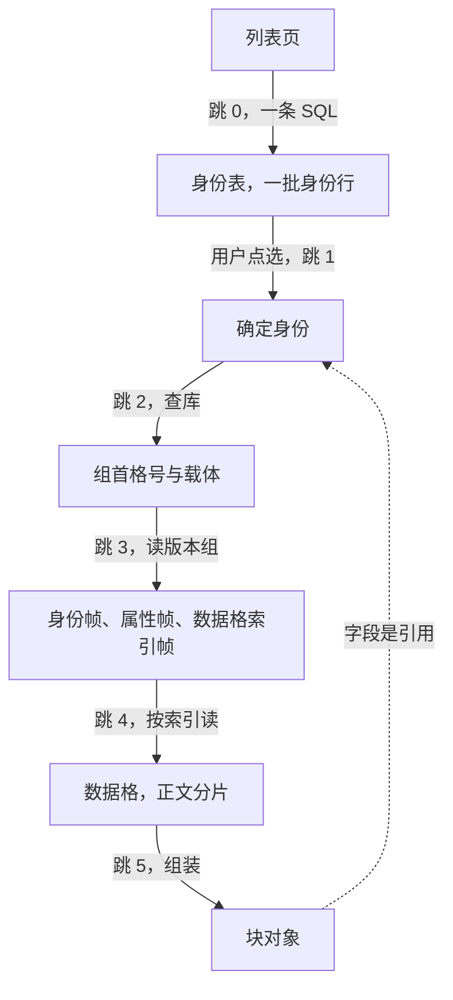
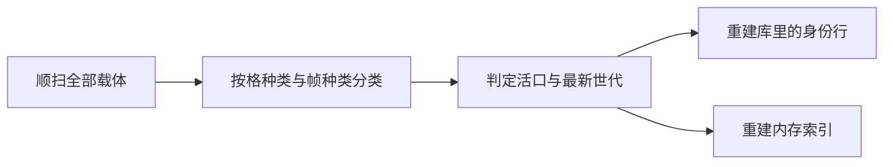

<!-- SPDX-FileCopyrightText: 2026 HanYang06 -->
<!-- SPDX-License-Identifier: Apache-2.0 -->

# 查询链路

> **状态：草案**（2026-10-02）。方向已定，**尚未落码**；与代码冲突时以代码为准。
> 本篇只回答一件事：**从哪个动作开始查、经过哪几跳、每一跳拿到什么、失败怎么办。**
> 字节与格的定义见[格与二进制格式](slot.md)。

## 0. 触发点

| 触发 | 起点 | 为什么从这里开始 |
|---|---|---|
| 进入列表页 | 跳 0：库 | 要先拿到"有哪些"，才知道"要看哪一个" |
| 点开一条 | 跳 1：确定身份 | 点选即是对一个身份的确认 |
| 按属性或按标签查 | 索引块 | 按值查是索引的职责，不落在库上 |

**按值查走索引块**：索引块是"身份为 `attrindex` / `bodyindex` 的块"，它的信息格里装的是
正表行帧。打开时把索引帧装载成内存表（不是打开时全库重算），命中后按地址读属性帧与
数据格核对；索引块缺失、或核对不上，才回落到顺扫重建。**索引是投影，丢了只是变慢。**
| 展开引用 | 字段里的内容凭证 | 引用指向另一份内容，跳回跳 3 |
| 冷启动 | 顺扫 | 索引与库都是投影，从载体重建 |



## 1. 逐跳

### 跳 0 列表页：第一条 SQL

一次查询取回一页身份：标识、名字、签发时刻、载体与格号。**这一跳只碰库，不读载体。**

```sql
SELECT value_uuid, name, birth_time, in_hub, in_hub_pack, in_pack_slot
FROM notedata
ORDER BY birth_time DESC
LIMIT 50;
```

!!! note "关于「join」"
    库的形状是**一个类型一张身份表**，类型之间没有关联表（关系表已裁），
    故第一跳是单表查询。真正的"联接"发生在库与内存之间：**库给身份，
    内存索引给属性**——列表要显示的名字从这里补，不再读载体。

### 跳 1 确定身份

用户点选一行，得到确定身份（分配凭证 ＋ 名字 ＋ 签发时刻）。此后一切定位都从这个身份出发。

### 跳 2 按身份查库

用身份的分配凭证查它那张表的行，取出组首格号与所在载体。
这一跳是**库里存在的全部理由**：没有它，定位只能顺扫全库。

### 跳 3 读版本组

按组首格与深度 N 读出该组的若干格，取"校验通过且世代号最大"的那一代，解析三类帧：

- **身份帧**：核对格里的凭证与要找的一致。**不一致即报错**，不再回退；
- **属性帧**：字段值直接可用，不必读载体上的其他格；
- **数据格索引帧**：交出全部正文分片的区间。

### 跳 4 读正文

按数据格索引取正文：可以一次读完，也可以先取一片、再按索引顺序续读。
续读的顺序由内存索引给出，不依赖格内指针。

### 跳 5 组装与引用展开

把身份、属性、正文组装成块对象交还调用方。字段里若含引用（内容凭证不在本地），
按引用回到跳 3 再走一遍：**几级引用就跳几次**。循环与深度由领域一侧负责
（访问集或深度上限），存储引擎只保证一跳。

## 2. 每一跳的依赖与失败语义

| 跳 | 依赖 | 失败语义 |
|---|---|---|
| 0 | 索引库 | 库不在或表不在：回退顺扫，仍拿得到身份 |
| 1 | — | — |
| 2 | 索引库 | 库里没有这一行：回退顺扫；顺扫也找不到即报"对象不在" |
| 3 | 载体 | 格读不出来、校验不过、或**身份不符**：显式报错，**不静默回退** |
| 4 | 载体 | 分片缺失或校验不过：报"正文不完整"，**不返回半截** |
| 5 | — | 引用指向的内容已被回收：报"引用已失效"，不返回空值 |

## 3. 冷启动

库与内存索引都是投影，第一跳缺失时按同一条链路重建：



顺扫不依赖任何索引，它是"库丢了不是数据丢失"这条承诺的兑现方式。

**常态不重建。** 打开时直接读现成的索引与位置，不做全库顺扫；内存里只保有上限的缓存，
不是全量常驻。重建是**显式动作**，分块、可中断、有进度——它是异常路径上的补救，
不是每次启动的例行开销。

## 4. 待裁

1. **`birth_time` 的列类型**：现为文本，字典序与数字序不一致，
   `ORDER BY birth_time DESC` 在出现不同位数的值时会排错。若要列表页在库里排序与分页，
   它（以及格号一类的整数字段）应当落成整数列。
2. **分页口径**：按签发时刻翻页，还是按名字或标签翻页；后者要接到内存索引上。
3. **会话缓存的作用域**：一页、一篇，还是最近若干篇；它只影响快慢，不影响正确性。
4. **缓存的上限**：弱机器上内存是硬约束，索引缓存要有上限与淘汰口径；
   上限按条目数还是按字节数，尚未定。
