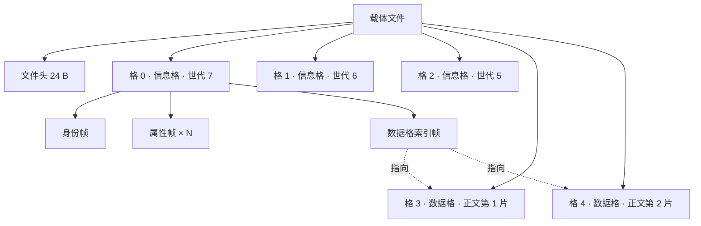
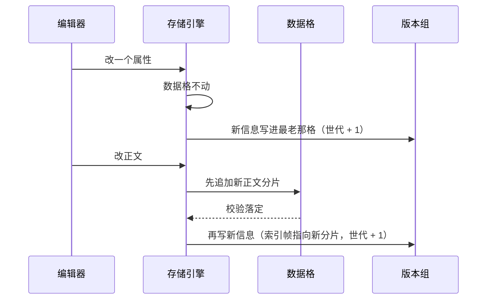
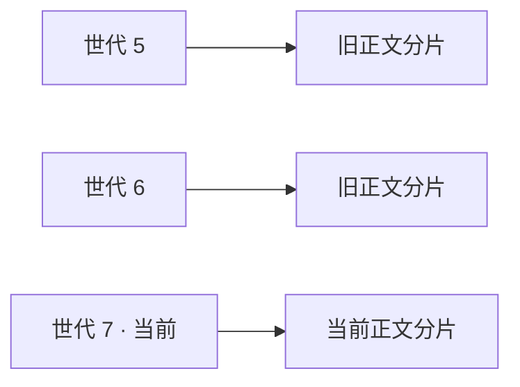

<!-- SPDX-FileCopyrightText: 2026 HanYang06 -->
<!-- SPDX-License-Identifier: Apache-2.0 -->

# 格与二进制格式

> **状态：草案**（2026-10-02）。方向已定，**尚未落码**；与代码冲突时以代码为准。
> 本篇讲结构与判据；**逐字段的字节图在[载体的字节布局](pack-format.md)**。
> 载体之上的分层（hub / 索引库 / 回收）见 [L0 存储设计](../../storage-design.md)；
> 块与字段声明见[块范式](../../block-model.md)。

## 0. 一句话

格（slot）是载体的**分配与定位单位**，帧（frame）是**改动单位**，数据格是**正文单位**。
一个块 = **一个版本组**（若干信息格）＋ **若干个数据格**。

## 1. 名词

| 词 | 指什么 |
|---|---|
| 载体 | 一个文件：文件头 ＋ 一串等长格 |
| 格 | 等长的分配单位。格长写在载体文件头里，故同一个库中可有不同格长 |
| 帧 | 格内的一条自描述条目，带种类与长度 |
| 信息格 | 装帧的格：身份帧、属性帧、数据格索引帧 |
| 数据格 | 只装正文分片的格。**不可变** |
| 版本组 | 同一块的 N 个信息格，连续分配，交替覆盖 |
| 世代号 | 一次提交的序号。读时取"校验通过且序号最大"的那一代 |
| 组首格 | 版本组的第一格。库里只记它，**此后不再改动** |

## 2. 静态结构



**文件级地址永远只有格号**：格号乘以格长加文件头长度即为字节偏移，不需要读盘、不需要索引。
帧在格内的偏移只由该格自己的帧表解释，它是**格内容的自我描述**，不构成第二套文件级定位口径。

## 3. 载体文件头与格头

三处头的**逐字段字节图**在[载体的字节布局](pack-format.md)：载体文件头 24 字节、
信息格头 8 字节、帧头 8 字节、数据格头 32 字节。本节只讲结构与判据，不复刻偏移表。

数据格**不携带身份段**——身份只在信息格的身份帧里出现一次；归属字段记的是
"这一片属于谁"，它使库里的区间清单成为纯投影。

两条判据把"要不要给每格存地址"这件事定死：

1. **定长配算术，变长才配目录。** 格长写在文件头里，故"格号到字节偏移"是算术，
   不需要任何表；只有当尺寸不定时（消息队列的条目、文件系统的文件）才必须落一张位置目录。
   格是定长的，故**每格的物理地址不进任何表**。
2. **文件头保持定长。** 头部若需要增长，不要把目录塞进头里——头里放它的位置与长度，
   目录另设区域；否则头会变成一份需要原子维护、且一经损坏整包不可读的日志。

### 3.1 格号到地址必须是常数时间

```text
地址 = 文件头长度 + 格号 × 格长
```

这是**硬要求，不是优化**：给一个格号，地址当场算出，不查表、不扫目录、不读别的格。
它保证整条读路径没有任何一处"现算一大片"。为此三条禁令：

1. 格长在一个载体内部**绝不允许变化**——写在文件头，任何一格都不例外；
2. 一片正文必须占整数格（不足补零），故不存在按内容长度伸缩的格；
3. **目录不得出现在读路径上**：任何"找某一格"都只能靠算术；目录只许用于重建与预热，
   且它若存在也只能是派生数据。

将来若引入变长条目，一律放进格的**内容**里（格内帧表），不得改变格本身的尺寸。

槽内偏移是两字节，故**格长上限为 64 KB**；配置面那五档里超过这一档的部分要据此收下来，
或由装配时校验拒绝（`slot.max.byte` 的吉字节与太字节两档与这一条冲突）。

## 4. 帧

帧头（8 字节）：种类 1、保留 1、槽内偏移 2、长度 4。
帧内容按种类解释，一律用确定性 CBOR（同一逻辑内容必须编出同一段字节）。

| 帧种类 | 装什么 |
|---|---|
| 身份帧 | 两套凭证、名字、签发时刻 |
| 属性帧 | 一个字段一份：字段名 ＋ 值 |
| 数据格索引帧 | 一串区间：载体名、首格、格数 |
| 正表行帧 | 索引块专用：一条正表行（字段、值、目标） |

## 4.1 位置段与 ID

身份里承载位置的三项**全部保留**，只改第三项的形状与含义：

| 字段 | 处置 | 含义 |
|---|---|---|
| `in_hub` | 留 | hub 目录名 |
| `in_hub_pack` | 留 | 载体名 |
| `in_pack_slot` | 留，**含义改** | 从"头格与末格"一对，改为**组首格一个数** |

**组首格取载体内序列（格号），不取摘要。** 四条理由：

1. 定长格之下，格号乘以格长加文件头长度即为偏移，定位是算术，不需要任何表；
2. 摘要作地址会逼出一张"摘要到位置"的解引用表，那张表要么落在库里（一格一行，
   即滥用），要么又得先找到它，递归不收敛；
3. 摘要作地址等于把分块级去重引进来，而分片边界一变则地址全废；
4. 格号是载体自描述的（格长写在文件头里），摘要不是。

序列的代价必须一并认下：**压实与搬移会重编号，故所有引用都要扶正**——ID 里的组首格、
信息格里的数据格索引帧、落盘索引表里的块到数据格区间，三处都要由回收统一处理。

组首格是稳定地址：块建好之后它不再变化，故**创建之后库里的身份行几乎不再改写**，
提交只写载体。这一条同时把并发写的一处竞争去掉了。

### 4.2 身份字段与摘要的去向

身份的字段收敛为三项：`name`、`value_uuid`、`birth_time`；位置三项照上表。
**`value_hash` 从身份的字段清单里去掉**（2026-10-02 定）。

理由：分配凭证与摘要凭证服务的是两件事。`value_uuid` 服务"是谁"，随机百二十二位，
空间约 5.3 乘十的三十六次方，生成一万亿个的碰撞概率约 9.4 乘十的负十四次方，
无须协调即全球唯一，故跨库合并不会撞；摘要服务"是哪一份内容"，它属于内容，不属于身份。

**摘要不消失，只搬家**：

| 原来 | 现在 |
|---|---|
| 身份上的 `value_hash` | 删除该字段 |
| 内容记录的载荷摘要（去重与定位） | 数据格头记分片摘要；数据格索引帧与引用帧记整份正文摘要 |
| 墓碑认载荷摘要 | 墓碑认身份（先前已定） |
| 顺扫判活按载荷摘要比对 | 改为按身份比对 |

连带三件事：

1. **块身份彻底稳定**：不再有任何编辑会改变它，`ID.bind` 的改绑语义随之退役；
   `ID.of`、`ID.same_content`、`bound`、`EMPTY_HASH` 一并退出。
2. **身份表少一列**：`ensure_table` 用的是 `CREATE TABLE IF NOT EXISTS`，不会删列，
   故必须有**重建入口**——否则老库写入会当场报"没有这一列"。
3. 分配凭证按现状落成三十六字符文本；若要省字节可改落十六字节二进制，
   但那会破"库里的行是身份字段的镜像、一律文本"这条口径，取舍另定。

### 4.3 数据格自报归属

数据格头在种类、校验和、前驱格号之外，再带归属三项：目标凭证十六字节、字段序号两字节、
分片序号两字节，归属三项共二十字节；连同格种类、校验和与前驱格号，
数据格头合计三十二字节，占 512 字节格的百分之六点二五。

它买到三件事：

1. **归属可以从载体顺扫算回来**，于是库里的区间清单是纯投影，丢了可以重建；
2. **库里现成的清单可以被信任**，读某一格时核对归属与校验和即可，无须重算全库；
3. **孤儿数据格自证为孤儿**，回收不必先读块的信息格。

一句话：**不重算不等于不核对。** 核对是每格一次很便宜的本地位运算，重算全库则不是。

**常态路径不重算**：打开时直接读现成的索引与位置；内存里的索引是**有上限的缓存**，
不是全量常驻；全量重建与压实都是显式、可分块、可中断、有进度的动作
（沿用回收那套 `should_stop` 与 `on_progress` 口径）。

## 5. 版本组：一次提交怎么落

版本组是 N 个连续的信息格。库里只记组首格，因此**提交不需要写库**，
判"哪一代最新"也不靠外部指针，而是靠格自己：


写入：

```text
g    = 组内校验通过者的最大世代号
目标 = 组内 (g mod N) 的下一格        # 即最老的那一格
一、先写不可变部分（新数据格）并校验落定
二、把新信息写进目标格，世代号 = g + 1，算校验和
三、按策略落盘
```

读取：

```text
逐个读组内 N 格 → 取「校验通过且世代号最大」的那一格
```

信息一格装不下时，一代占 M 格；**第一格为提交格**：总校验和与世代号写在它头上，
且规定**最后写它**——提交格没写成，整代不算数，自动回落上一代。

## 6. 崩溃矩阵

| 崩在哪 | 结果 |
|---|---|
| 数据格写到一半 | 该片校验不过，不算数；信息格未动，仍读到旧正文；孤儿格等下趟回收 |
| 数据格写完、信息格未写 | 同上（孤儿格） |
| 版本组目标格写一半 | 该格校验不过，回落到上一代：块状态是上一次成功提交 |
| 组内其余格 | 未被触碰 |
| 库里那一行 | 全程未改动，故不存在"库与载体各说一套" |
| 回收重写到一半 | 旧载体仍在，两处内容逐字相同；下一趟回收收拾 |

## 7. 两种编辑的写入面



改属性的写入面为**一格**，与改多少次无关；改正文的写入面为新正文本身，旧分片成为孤儿。

## 8. 容量账（格长 512 B，环深 N=3，一代信息占 1 格）

| 正文 | 正文格 | 版本组格 | 合计格 | 512 MB 载体（104.8 万格）装几篇 | 元数据 / 正文 |
|---|---|---|---|---|---|
| 1 KB | 2 | 3 | 5 | 209,715 | 150% |
| 4 KB | 8 | 3 | 11 | 95,325 | 38% |
| 10 KB | 20 | 3 | 23 | 45,590 | 15% |
| 30 KB | 59 | 3 | 62 | 16,911 | 5% |
| 100 KB | 200 | 3 | 203 | 5,166 | 1.5% |
| 1 MB | 2,048 | 3 | 2,051 | 511 | 0.15% |

两条结论：正文在 10 KB 以上时元数据占比低于 15%；**纯属性块与索引块反过来**——
它们的信息才是主体，环深应当配 1 至 2，而不是与正文块同深。

### 8.1 以本仓文档为样本的实测

样本取 `docs/**/*.md`（手写事实源，共 16 篇，合计 155 KB）：最小 2,220 B、
中位 4,905 B、均值 9,893 B、最大 45,452 B；其中四分之一超过 10 KB。

| 正文 | 数据格 | 元数据 | 合计格 | 利用率 | 现行实现合计格 | 现行 / 新 |
|---|---|---|---|---|---|---|
| 512 B | 1 | 3 | 4 | 42% | 12 | 3.0 倍 |
| 2 KB | 4 | 3 | 7 | 66% | 18 | 2.6 倍 |
| 8 KB | 16 | 3 | 19 | 86% | 41 | 2.2 倍 |
| 20 KB | 40 | 3 | 43 | 92% | 88 | 2.0 倍 |
| 60 KB | 118 | 3 | 121 | 97% | 244 | 2.0 倍 |
| 200 KB | 391 | 3 | 394 | 99% | 791 | 2.0 倍 |

逐篇合计：占用 184 KB，其中有用 160 KB，**整体利用率 87%**；最低的一篇（2,220 B）为 63%，
即元数据在小块上才是主体。载体容量按本仓均值折算：每块 23 格，
一个 512 MB 载体（104.8 万格）装 **45,590 块**；最大的一篇每块 92 格，装 11,397 块。

**结论：正文越大利用率越健康，元数据的代价集中在 5 KB 以下的小块**，
故小块（纯属性块、索引块）应当配浅环深。现行实现同一份内容要占两倍以上的格，
原因是正文在内容记录与块记录里各存一份，且每个字段各占一条索引记录。

## 9. 与回收的关系：历史窗口即活口范围



窗口内每一代指向的数据格都算活口。回收塌缩到最新世代时，被丢弃的世代所指向的数据格成为孤儿，
一并收走；此后历史不可回溯，**以最新为准**。用户发起回收前必须先告知这一点。

## 10. 配置

| 键 | 含义 | 开箱值 |
|---|---|---|
| `slot.version.depth` | 版本组深度（每块的保留世代数） | 3 |
| `slot.max.byte.{b,kb,mb,gb,tb}` | 格长（五档相加，沿用现状） | 512 B |

类体可覆盖深度，做法沿用 `Block.max_bytes` 的既有先例：类上声明者优先，不声明则取配置值。

## 11. 与旧口径的差异

| 旧口径 | 新口径 |
|---|---|
| 载体是追加写 | **数据格只追加；信息格在版本组内原地覆盖** |
| 一条记录自框定，顺扫即得全部 | 格自框定、帧自描述；一个块由版本组与数据格共同重建 |
| 删除落一条墓碑 | 删除写一个作废世代；墓碑机制取消 |
| 位置是"头格与末格"一对 | 位置是组首格一个数；正文位置在数据格索引帧里 |
| 记录头携带完整身份 | 只有身份帧携带身份；数据格不携带 |

## 12. 索引块：保留，换个形态

**属性索引与内容索引不退役。** 退役它们等于"查属性只能全扫"，与"打开不扫全库、
不许卡一下"直接冲突——这一条先前写错了，此处更正。

新形态与今天同路：**索引块就是"身份为 `attrindex` 或 `bodyindex` 的块"**，
与任何块一样有身份、有表、有版本组；区别只在它的信息格里装的是**正表行帧**
（一条正表行一帧：字段、值、目标）。

权责分清楚：

| | 是什么 | 丢了会怎样 |
|---|---|---|
| 属性帧、数据格归属 | **真源** | 数据丢失 |
| 索引帧 | **可重建的物化投影** | 只是变慢，顺扫可重建 |

所以先前的"同一事实两个写入者"这条担忧收回：**只有真源才谈得上权威**；
真源加一份可重建的投影是标准的物化，不是第二个事实源。写入时把变更的正表行
追加成帧（同"字段与目标"最后一条说了算），读取时先查索引、命中后按地址读真源并核对。

于是索引仍只有两处：载体上的索引块（物化）、内存里由它装载的表（缓存）。
库里依旧只剩身份与位置，任何业务值都不进库。

## 13. 已定与待裁

**已定（格式）**

- 定长格与算术定位；格号到地址为常数时间（§3.1 三条禁令）。
- 数据格不可变、只追加；信息格在版本组内原地覆盖；版本组连续 N 格，位置记组首格，取载体内序列。
- 提交靠"世代号加校验和取最大者"判最新，**提交不写库**；回收塌缩到最新世代并回收其数据格。
- 身份只留分配凭证与签发时刻；摘要移出身份，落在数据格头、数据格索引帧与引用帧。
- 数据格头自报归属，故库里那份清单是**纯投影且可以被信任**，而核对始终在每格本地完成。
- 数据格的位置用区间清单表示（`Extent`：载体名、首格、格数），清单的真源在信息格的数据格索引帧。
- 引用形状取"载体加格号"；帧序号只在格内部使用。
- 独立索引块**保留**，形态改为"身份为 `attrindex` / `bodyindex` 的块"，帧为正表行帧；
  它是可重建的物化投影，真源是属性帧与数据格归属（§12）。库里只剩身份与位置。

**已定（工程口径）**

- 能预计算的都在写入路径算完并落下；读路径只取用与便宜核对（§4.3）。
- 打开不扫全库；重建是显式、可分块、可中断、有进度的动作。
- 索引缓存按**字节数**设上限，不是全量常驻。
- `birth_time` 与格号落成整数列，供列表页在库内排序与分页。

**已定（位置与回收）**

- `in_pack_slot` 只放组首格，**不携带区间清单**；完整清单的真源在信息格的数据格索引帧。
- **不设载体级稀疏目录**：打开需要的是"块到组首格"，库里已有现成的；
  载体级目录会是同一事实的第二份，而重建路径本来就全扫。
- 已删格优先复用；空闲区间**不落盘**，由顺扫派生、常驻内存、写入时增量维护。
- 复用优先、压实按需（空洞率高或用户显式发起）；只要求**同块的数据格相互靠近**，不要求全库连续。

**命名**

- `Slot` ＝ 一格本身（曾经"一条记录占的那一段"的含义随记录概念一起退役）；
- `Frame` ＝ 格内条目；`Extent` ＝ 一段连续格（载体名、首格、格数）。
- 三者各领一词，不再让 `Slot` 同时指两件事。

**已定（分层）**

- 格的形态变化**不外溢**：领域层、界面层与业务命令面都不得出现"格"这个概念。
  上层的接口只有四样——身份、位置（库里的行）、块对象（属性与正文）、声明（`Attr` / `Body`）。
  格号只许出现在诊断面（`locate` / `record` / `stats`）与存储层内部。

**待裁**：仅剩缓存上限的具体数值（量级 64 MB）与稀疏采样是否用于重建预热。
