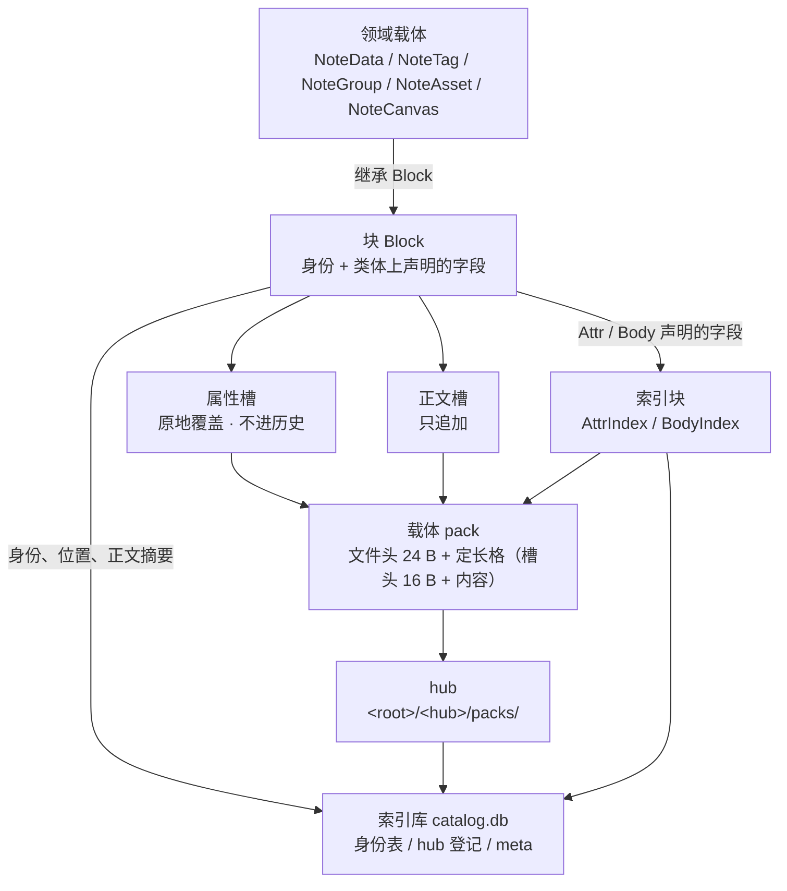
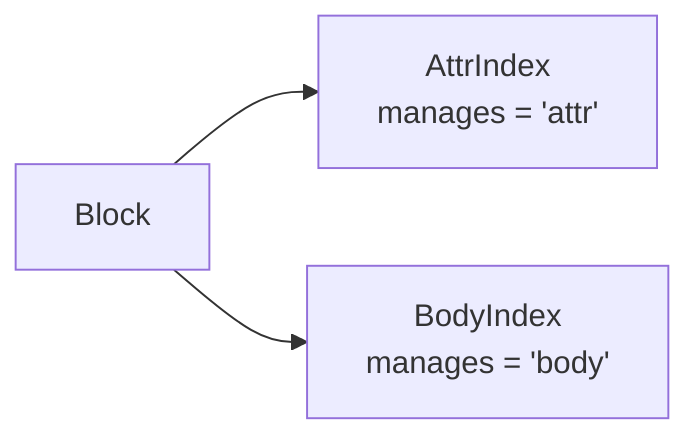

<!-- SPDX-FileCopyrightText: 2026 HanYang06 -->
<!-- SPDX-License-Identifier: Apache-2.0 -->
<!-- translation-source-hash: a95c8e0602604a8d800b3487a87ddb82cfe2832aa426b1d553ae53983a68e68d -->
# L0 · Storage Design

The lowest-level storage of Cairn. This document is the **single source of truth for L0 storage**; the previous version has been deleted.
The upper layers (domain model, services, and interfaces) are built on top of this document.

> **Status: Current Situation** (2026-10-02, out of stock). The morphological features described in this paper hold true item by item in `py_src/core/storage/`.
> Corresponds one-to-one with the code; this document only describes the current standards, while the old behavior prior to code implementation is covered in §12.
> See the detailed criteria in [块的组成与落点](py_core/storage/block-parts.md),
> The per-field byte map is shown in [载体的字节布局](py_core/storage/pack-format.md).

The specifications and implementation details are as follows:

| Item in the article | Implementation location |
|---|---|
| Carrier: file header, slot header, two types of slots, append write, in-place overwrite | `py_src/core/storage/pack.py` |
| hub: Select active carriers, seal and replace portions | `py_src/core/storage/hub.py` |
| Storage engine: block↔Slot | `py_src/core/storage/engine.py` |
| Index Database and Identity | `py_src/core/storage/db/` |
| Two Types of Index Blocks | `py_src/core/storage/index/` |
| Field paragraph declaration | `py_src/core/storage/types.py` |
| Configuration declaration for the storage layer | `py_src/core/storage/conf.py` |
| Byte Recycling | `py_src/core/storage/gc.py` |
| Kernel assembly and command surface | `py_src/core/init.py`, `py_src/core/api.py` |

**Unimplemented items** (§11 listed in full): the normalized byte-level representation of the domain payload (`py_src/model/note/format/`),
Explicit entry points for cross-database transactions, backups, refusal to open accounts, and migrations.

Authority sequence: ().

## 0. One sentence

**Block inheritance `Block`, fields are declared at the class body level; a block occupies both the property slot and the body slot; identity, position, and body summary.
Only enters the index library; index blocks directly inherit `Block` and are on the same level as any other block; bytes are reclaimed through compaction.**

Each of the four floors is responsible for the floor below, plus two additional auxiliary areas:

| Layer | What it manages | Implementation location |
|---|---|---|
| Carrier | A single file: file header, slot header, two types of slots, append write | `pack.py` |
| hub | A directory: select active carriers, seal and replace the copy | `hub.py` |
| Storage Engine | Block↔Queue: allocation, encoding, disk writing, read-back | `engine.py` |
| (Auxiliary) Database Engine | Index Database: One identity table per type, registration, | |
| (Auxiliary) Index | Two types of index blocks: `AttrIndex`(Attribute), `BodyIndex`(Content) | `index/` |

It follows the same path as Layer 4 (**hub/pack/slot**), but uses a different set of criteria; it is another deterministic form of the engine.
The entry point is at the module level (§8.6).

The **decisive change** in this version compared to the previous one (storage ruling dated 2026-10-02):

1. **Field declarations are written within the class body**: (indexable, reverse index supported),
(Enter the main text slot), bare assignment (still written to disk, without any indexing support).
**There is no `indexed=` switch**—if you use `Attr`, indexing is required.
2. **Table names are derived solely from class names**: No underscores, no overridden methods.
3. **No table structure declaration file**: `config/tables.yaml` / `type.yml` will no longer be read or written.
The structure of the library is determined by whether this type uses an ID.
4. **Index blocks share the same path as any other block**:/and `BodyIndex` directly inherit from `Block`, each having its own identity table.
5. **The main dial rests in the carrier’s slot, and the auxiliary dial is calculated on the fly during reading**: The auxiliary dial **does not return to zero** (§8.4).
6. **The index database represents the authoritative perspective**: it stores identity, location, and abstracts of the full text; the storage medium only holds attribute values and text fragments.
**The carrier does not carry a single byte of identity.**
7. **Delete = Remove the line from the index library**; bytes are reclaimed through compaction (§8.6).
8. **The kernel no longer has `store` / `patrol` / `repair` / `compact` / `reindex` / `survey` / `locate`**:
Writing is initiated by the block itself (`block.save()`); the command interface handles reading and diagnostics; recycling is performed at the module level `sweep(engine)`.

## 1. Glossary

The definition of the term shall be based on this document and the code; see also the summary table [术语表](../reference/glossary.md).

| Term | Meaning |
|---|---|
| **vault** | The root directory; contains an index database and several hub directories |
| **hub** | `<root>/<hub>/packs/`, contains several carriers; `packs/` the presence of which serves as the criterion for determining “this directory is a hub” |
| **Carrier Pack** | An appended file; fixed-length format; a new pack is started once the current one reaches the end-of-file marker. |
| **Slot** | A unit of equal-length allocation and positioning within a carrier; **one slot occupies exactly one grid** |
| **Slot head** | 16 bytes at the beginning of each slot: Slot type 1 + CRC32 checksum 4 + Content length 4 + Reserved 7 |
| **Attribute Slot** | Equips all attributes of a single block; **can overwrite in place**, attributes are not recorded in the history |
| **Main Text Slot** | Equips main text fragments; **appends only**—once a slot is written, it is no longer modified in place |
| **Location Segment** | `in_pack_slot`: A list of segments that cover all slots occupied by this block itself. The order of writing has semantic meaning—text slots precede attribute slots; the normalized form (ascending order, non-overlapping, adjacent segments merged, and minimal number of segments) is used for recovery convergence and diagnosis.
| **Abstract of the Main Text** | `body`:**The abstract of the current main text** (one, not a series); the location of the main text is indicated by the line number in the main-text index. **Storage Not Guaranteed Across Generations** (Ruling dated October 6, 2026) |
| **Built-in/Referenced** | A block has two runtime states: if the location segment contains a body slot, it is **built-in** (the content is within the block itself); otherwise, it is **referenced** (the abstract is used to look up the full-text index for positioning). |
| **Block** | The foundation of a storage unit: it only has a table and can be persisted to disk and read back once its ID is obtained. |
| **ID** | Identity itself: `name` / `value_uuid` / `birth_time` + Location segment (`db/id.py`). **It is established across packs and hubs**, while the slot number is only meaningful within a single pack.
| **Identity Table** | The table in the database that stores instances of a type identified by an ID; the table name is the same as the type name, and it has exactly seven columns: six identity fields + `body` |
| **Index** | Contains identity, location, and abstracts of the text; provides entry points to two types of indexes; **it represents the authoritative perspective.** |

## 2. Layering and Overall Structure



**Red line**: L0 does not recognize these words: `note`/`project`. Storage only recognizes IDs, bytes, and blocks.
Domain semantics exist only within domain classes and aggregates.

**Two engines with non-overlapping responsibilities**:

-**Storage engine** (`engine.py`) is carrier-oriented: it manages the hub, writes bytes, and reads bytes; it has no knowledge of databases.
-**Database engine** (`db/engine.py`) for index databases: manage rows, create tables, and query locations by identity.
**Don't recognize slot / pack/hub.**

The two are connected only through "identity."

## 3. Field Landing Points

Which side the field goes to is determined by the declaration on the **class body** (`storage/types.py`). Three criteria:

| Writing style | Endpoint |
|---|---|
| `title: str = Attr("")` | Enter the **attribute slot**, and also enter the attribute index block (which allows you to look up the block using its value) |
| `lines: list[str] = Body([])` | Enter the **main content slot** (compare by value, remove duplicates and proceed to `BodyIndex`) |
| `self.title = ""`(bare assignment) | Still goes into the attribute slot, **without any indexing support** |

```python
class Note(Block):
    title: str = Attr("")  # 声明在类体上
    lines: list[str] = Body([])


note.title = "标题"  # 实例里存的是裸值
assert note.title == "标题"  # 读出来也是裸值
```

Three semantic conditions must all be met for this formulation to hold; if even one is missing, it does not apply.

1. **A declaration in a class body is just that—a declaration**: it specifies the location, not “a single value shared by all instances”;
2. **The instance's value is stored in the instance itself**: What is being modified is this instance's list.
It neither contaminates the class attributes nor leaks to other instances (the container’s default value is copied only when the instance is first accessed).
3. **Declarations outlive assignments**: Only the value changes; the storage location is still determined by the declaration in the class body.

**``Attr`` and ``Body`` are descriptors, not type predicates**: Types only exist in annotations (used by mypy); at runtime, annotations are ignored.
Only scalars are meaningful—containers are not hashable, so looking up by them can only be an “contains” check.

**The declaration must be placed within the class body, not outside it**: If you place it inside the constructor, the static type of that instance field will become the declared type.
Thereafter, it is inconsistent with it.

**Regular assignment still persists to disk**: It will merge any additional public fields from the instance (excluding those starting with `_` and `id`).
Therefore, the claim that “it is declared but not indexed” is a false problem— if you don’t want it indexed, then don’t declare it. Conversely, **undeclared fields that have not been explicitly assigned a value also**
List of fields to be written to disk**: All declarations must be extracted (extracting their values will trigger the descriptor to provide the default value); otherwise, fields with default values will be entirely omitted.

## 4. Blocks and Identity

### 4.1 Foundation:

```python
self.id = ID(self)  # 调用方签发身份
note = Note(self.id)  # 递给基座
note.title = "标题"
note.save()  # 引擎接手：分配、编码、落盘、回填位置段
```

**The identity is provided by the caller**, and there are only two paths, both documented in one place:

-Self-sign, then hand it over to the base;
-Or slip the signed one in (`Note(self.id)`).

**The no-argument constructor is also a block**: It will automatically generate its own empty parameter list ().
The approach being taken is this: the index block signs its own identity, so it is naturally stored in the database and has a corresponding table.

**Without an ID, there is nothing**: Objects without an ID are not stored in the database, no table is created for them, and no relationships are established.

The capability at the top (1/2/3/4) is connected to the library via a single wire at the module level.
(`bind(engine)`): **One process per engine**—if another library is linked, an error occurs; simply unlink it.
The reason is that the engine (which library, which hub) is a runtime‑level fact, whereas class definitions are resolved at import time.

### 4.2 Table Name

**The table name is determined solely by the class name**: `type(self).__name__.lower()`. A → B.

There is no second loophole: **no first-class coverage** is provided, nor are there any declaration files.
The identity’s name (`ID.name`) shares the same origin as its resolver (`ID(self)`).

Domain-specific types begin with the **domain name** (`NoteData` → `notedata`), so `project` can be implemented there.
The two tables use identically named concepts but are unrelated, so there will be no conflicts.

### 4.3 Fields of `ID`

| Field | When Determined | Afterward |
|---|---|---|
| `value_uuid` | **Creation Moment**(`uuid4()`) | Locked (Read-Only Property) |
| `birth_time` | **Creation Time** (Unix nanoseconds) | Locked (read-only property) |
| `name` | The moment it is decrypted by the holder | Locked down |
| `in_hub` / `in_hub_pack` / `in_pack_slot` | After completion, the library records it | **Editable**—the location segment is stored in the library and recorded each time it is modified |

Curry also has a **separate column** of fields that do not belong to `ID`, which are carried along by the identity itself: `body` (current body abstract, §8.1).

**"Which cells are attribute slots" is not a column in the library** (Ruling amended on 2026-10-02): **Slot numbers are only meaningful within a pack.**
However, the associations of "the more packed (or even the more hub-like)" can only be represented using summaries, not slot numbers. Attribute slots and body text slots are distinguished by the **type of slot head**.
(`pack.ATTR_SLOT` / `pack.BODY_SLOT`), each grid on the carrier already has text written in it.

**Identity has only one source**: It is issued and assigned, and is independent of the content. **Abstract form does not constitute identity**:
For identical content, the responsibility lies with the abstract on the main text side (the line containing the main text’s abstract plus `BodyIndex`), not with the identity.

**It is not equal to any "creation time"**: it is only equal to the moment this ID was issued.
Field names (such as `NoteData.created`) are a different matter; see §6.4.

**The position segment is the true source**: It is stored in the library, and no byte on the storage medium carries it.
**Modify the main text once to update this line**; during loading, the engine will overwrite the value in the library into the ID passed down by the caller (`engine._place`).

**The order of writing has semantic meaning**: The segments are arranged in two groups, with the "main content slot" preceding the "attribute slot."
(`ID.place` Collect multiple groups: merge adjacent segments within each group, but do not merge between groups), therefore, the process of arranging them into standard form is **not a rule for side placement**--
It is adjusted separately during the recovery convergence position phase and during diagnostics. Canonical form (ascending order, non-overlapping, adjacent segments merged, minimum number of segments)
It is a guarantee that “the same batch of slots has only one valid representation,” not a sorting requirement during writing.

**Identity field not stored on the carrier**: The carrier does not contain any bytes of the identity; the identity is only stored in that single row of the index database.

According to the identity, only the library path is followed: if the object is not found, report "object not found". Old accounting system (with two sets of vouchers coexisting,
The part related to identity and persistence has been deprecated and now follows the carrier’s byte structure; see §12 for the list.

### 4.4 Invariants

1. **The table name is always the lowercase version of the class name**, calculated once and with no other sources.
2. **Identity is determined solely by `value_uuid`**: `name` and `birth_time` are its ancillary facts.
3. **Only when Curry has that line can it be read back**: If the line is missing, it immediately reports “object not found,” leaving no fallback option for a sequential scan.
4. **If you modify a field in the same block and save it again, the container’s identity remains unchanged**: attributes go into the attribute slot, and the main content goes into a new slot.
Identity does not change with the payload.
5. **Fallback to generic type for unknown types**: When the class cannot be found based on the table name, a generic block is used; the attributes remain fully populated, but the class’s behavior methods are unavailable.

## 5. Case and Carrier

### 5.1 Layout

```text
vault/
  catalog.db                 # 索引库（唯一）
  <hub>/
    packs/
      <随机名>               # 载体：文件头 24 B + 一串定长格；写满封口线即换份
```

The filename is a random string (without any semantic meaning or sequential numbering); the container name represents the answer to “which file,” and its true origin lies within the file system itself.

### 5.2 Lattices and Arithmetic Positioning

The model consists of a single rule: **the carrier is a sequence of equally sized cells, with each cell serving as a slot, and the slot dimensions are measured from the cell boundaries**.

-A slot occupies **exactly one grid**: slot header 16 bytes + content (§5.4);
A block’s location segment specifies all the grid cells it occupies.
-Byte address **determined by arithmetic**: `地址 = 24 + 格号 × 格长`(`slot.offset_of`);
**The grid number is counted starting from after the file header**, so the file header does not need to be aligned to a full grid. **Address calculation from a grid cell is constant time**:
Provide a grid number, and the address will be calculated on the spot—no need to consult a table, scan a directory, or refer to any other grid.
-**No second set of reference points for positioning**: There is no "grid offset"—the slot’s starting point lies exactly on the grid boundary.
-**Writing discipline**: After filling one cell, pad any remaining empty space within the cell with zeros so that the next cell starts at the boundary of the grid.
If the tail end of a carrier is not a complete grid, it must be rejected without exception (as this indicates damage or external alteration, and the starting point for continuation should not be inferred).
-**Clear cost**: Each cell’s content area is 16 bytes shorter than the cell’s length; if it doesn’t fill up, the remaining space is left empty. Therefore, the grid length is "space waste" and
The trade-off between the number of slots—smaller slots result in less waste per slot but more slots; larger slots have the opposite effect.

**The main text is segmented in logical order**, and the read-back sequence is determined by the segment list within the library; no segment numbers are recorded on the slots.

It is the "read-out slot": **it only holds the slot type and its contents, without any mutable state**—any state cached on it.
It will merge with the file fork, and no error will be reported—only the data read out will be incorrect. Therefore, positioning and read/write operations are uniformly handled in real time.

### 5.3 Carrier File Header

The file begins with a fixed-length container header (24 bytes: magic number 8 + record length 8 + reserved 8):

| Field | Function |
|---|---|
| Magic number | `CairnPk2`(the last digit is the layout version number); if it does not match, an error is reported; no inference is made, nor is it treated as "no carrier present here" |
| Grid Length | The grid length of this carrier; **thus, the carrier is self-describing**—the address can be computed solely from this file. |
| Reserved | Set to zero (its content is not validated during read operations), reserved for future field additions |

Grid length varies with the carrier (rather than being globally unique): Different batches of carriers may have different grid lengths, while each individual carrier can still support precise arithmetic addressing.
**Write once, read from the file header**—a single configuration change will not cause misalignment of data already written to disk.

### 5.4 Slot Head

Byte layout of the slot (all lengths are in bytes):

```text
+-------------+--------------+------------------+----------+----------------+
| 槽种类 (1)   | crc32 (4)    | 内容长度 (4)      | 预留 (7)  | 内容 (余下)     |
+-------------+--------------+------------------+----------+----------------+
```

| Field | Function |
|---|---|
| Slot Type | Distinguishes between attribute slots and body slots |
| Checksum | `crc32`, check this cell |
| Content Length | The actual number of bytes in the content; therefore, the usable content per cell is the cell length minus 16 bytes. |
| Reserved | 7 bytes, approximately 50% margin |

Four Agreements:

1. **Slot header fixed length: 16 bytes** (required fields: 9 + reserved: 7): The required fields are slot type, checksum, and content length;
Leave those 7 bytes as they are—write zeros there; only by writing zeros can it be interpreted as “this section is not yet used.”
2. **Checksum does not handle content addressing**: Content deduplication is the responsibility of `BodyIndex`; these two tasks should not be handled by the same component.
If the checksum does not match, an error is reported; incorrect data will not be passed on as valid.
3. **Do not record identity on the carrier**: Do not include generation numbers, batch numbers, or affiliation information on the slot; identity-related fields are only entered into the index database.
4. **The header is located before the content**, so the content area starts at the 16th byte after the grid boundary. Unwritten grid types read as slot 0 and empty content.
It’s not wrong— it means “this square is still empty.”

**Length and field definitions shall be subject to [载体的字节布局](py_core/storage/pack-format.md).**

### 5.5 Sealing and Active Carriers

-**Sealing is a strategy, not a status**: No sealing marks should be left in the document—“sealed” simply means that the medium has reached the sealing threshold.
Therefore, the revised sealing line will not exhibit “discrepancies between markings and facts”;
-The criterion is "there isn’t enough space left for the next cell" (`Pack.sealed`), not "the length has reached the sealing line":
Each slot occupies one grid, so if there are still grids left, they should not be sealed.
-**Active carrier = the fullest container with available space** (`Hub.active`); if there are none, it’s `None`—a new one is created upon writing.
This criterion does not depend on timestamps, nor does it rely on the order of carrier names (which are randomized);
-**Judge first, then write**: First check whether the active carrier is sealed; if it is, immediately open a new one on the spot.
Don’t shove this slot into that full one.

### 5.6 Configuration Parameters

The keys for the storage layer are declared in `core/storage/conf.py`, while those for the kernel itself are in `core/params.py`.
**Key name: `<层>.<域>.<对象>.<属性>`**: Stores these five groups that begin with `core.storage.`, with the layer prefix matching the package where the declaration is located.
Consistency; **literal keys and default values are hard-coded in the declaration** (the static part of OnConf relies on AST to recognize literals, see §2).
The values and the disk-write criteria are shown in [配置引擎](py_core/config.md) and [配置项参考](../reference/config.md).

| Key | Unboxing Value | Meaning | Status |
|---|---|---|---|
| `core.storage.slot.max.byte.b` | 512 | **Grid Length Step**: 1 byte per unit | Implemented |
| `core.storage.slot.max.byte.kb` | 0 | **Grid Length Step**: 1,024 bytes per unit | Implemented |
| `core.storage.pack.max.byte` | 2 GiB | **Sealing line**: When a single carrier reaches this capacity, a new one is started; a block does not span carriers, so this also serves as the natural upper limit for a single block’s size | Implemented |
| `core.storage.hub.default` | `main` | **Default hub name**: If no specific hub is specified, messages are sent to this one | Implemented |
| `core.storage.index.max.byte` | 64 MiB | **Maximum size of an index block**: When this limit is reached, the engine automatically allocates the next block | Implemented |
| `core.storage.gc.auto.byte` | 0 | **Threshold for automatic recycling** (in bytes); i.e., no automatic recycling | Implemented (both the judgment function and the threshold are present; the automatic side is not yet connected—see §8.6) |
| `core.log.level` | `WARNING` | Kernel log level (a key internal to the kernel itself, not part of the storage layer) | Implemented |

Four Agreements:

1. **Add the two values; if omitted, assume zero; if both are omitted, it’s an error**: The addition is used to represent the value precisely as an integer—only provide a “megabyte with a decimal.”
You’ll inevitably run into floating-point arithmetic, and since the grid spacing is a **fundamental property**, floating-point errors will directly propagate into the offset calculations.
**Clear the three tiers: Zhao/Ji/Tai**;
2. **The grid length is written in the header of the carrier file; on the reading side, the file header always takes precedence**, and the configuration is ignored. The configuration only determines what is written when a new carrier is created.
3. **The remaining keys are policies, not formatting directives**: They only determine “when to switch files, switch blocks, or initiate recycling.”
Changing the size will not cause any misalignment of the bytes that have already been written to disk. Therefore, they read the current value and do not cache it.
The strategy value is determined during assembly: Construct the configuration surface once and read it once.
4. **Format constants (magic numbers, file header length, slot header layout) are deliberately not moved into the configuration**: they remain in the implementation.
(`pack.py` of `MAGIC`/`HEADER_SIZE`).

## 6. Storage Engine

### 6.1 One block occupies the attribute slot and the body slot

```python
identity = block.id
fields = _fields_of(block)  # 声明字段 + 实例上多出来的
attrs = encode_attrs(_attrs_of(block, fields))  # 属性：一个块的全部属性
target = target_hub.carrier(prefer)  # 一个块只挑一份载体：块自己那一份优先
attr_slot = target.append(ATTR_SLOT, attrs)  # 属性槽，可原地覆盖
body_slot = target.append(BODY_SLOT, fragment)  # 正文槽，只追加
identity.place([body_slot], [attr_slot], hub=hub_name, pack=target.name)  # 正文组在前
index.put(identity.name, identity.to_row())  # 库是真源
```

-**Attribute Slots**: All of a block’s attributes are, by default, stored in **one slot**; if they don’t all fit, they will occupy **multiple slots** (multiple attribute slots).
Can **overwrite in place**, and the attribute will not be recorded in the history. If there are enough slots, overwrite in place; only allocate additional slots if there aren’t enough.
-**Body Slot**: Stores the body fragments of the field, **appended only**;
-**Write the entire position segment at once**: Write to all slots occupied by this block in a single write operation; write again whenever changes are made.
The writing order is “main text slot first, attribute slot second,” but which slot is for attributes and which is for the main text?
Answered by the type of groove head **(§8.1)**. **When quoting text from elsewhere, those cells are not within the position range of this block.**
They are in other packs, and their locations are recorded on the line of the main index.
-**All slots of a block fall on the same carrier** (Ruling dated 2026-10-07): On the write side, only one carrier is selected at a time (the block’s own carrier).
(Priority), all the slots to be written this time will be appended to it; **the carrier name is derived from the write result**, not guessed. Therefore, a block does not span carriers.

**Content is segmented in logical order**: The order of the segments is determined by the segment list in the corresponding row of the index; no segment numbers are recorded on the slots.
Therefore, even if a piece of content is associated with two different field names, it is still considered a single instance—content identity is determined by its value, while the field name merely serves as a means of storage.
Extract the values of those fields from the main text based on their positions, and arrange them in field order.

**Attribute slot self-sufficiency**: For each completed attribute, add an additional `"body": true` marker to the main text field.
The location must be stored together with the value—assigning a value in one step will overwrite the declaration of `Body(...)`.
If you don’t clarify this, you won’t know which fields to populate with the values from the main text slot during the read-back process.

**Standardized encoding is required**: Both attributes and the body shall be encoded using canonical CBOR, ensuring that map keys are ordered by length and
byte order arrangement); otherwise, the same content will produce different byte sequences, rendering both equality checks and deduplication ineffective.

### 6.2 Encoding of Slot Contents

**The slot itself carries the slot type, so a separate namespace is not needed in the payload**: Previously, this relied on reserved keys for differentiation.
“Is this a property or part of the main content?” and both types of content are mixed within the same append stream; now, the distinction is determined by the carrier.
(Attribute slot/Text slot, §5.4): The payload only carries its own data.

| Content | Encoding | Shape |
|---|---|---|
| Attribute Slot | `encode_attrs` | Mapping: Field Name → `{"v": 值}`, Only leave the `{"body": true}` marker for the main text field |
| Main slot | `encode_attrs` | Mapping: `{"cairn.body": [正文那几个字段的值，按字段次序]}`, then slice by grid length |
| Index primary table row | `encode_index_row` | Mapping: `field` / `value_uuid` (**only for the attribute path**)/ `value` / `hub` / `pack` / `segments`, plus schema flag `cairn.index.row` |

**Index rows and attribute maps are distinguished by their content**: Both are CBOR maps, so the map in a regular table row includes a schema tag.
(`INDEX_ROW_SCHEMA = "cairn.index.row"`); It has the prefix `cairn.` followed by a dot, so the business field name cannot be equal to it.
In the attributes, the `"body": true` marker works the same way as the lowercase `"v"` key: assigning a value in one step overwrites the declaration of `Body(...)`.
The landing point must be stored together with its value.

**Do not include the block name in the payload**: Including it would cause the “same set of attributes” to be interpreted as two separate byte sequences due to different class names, effectively fragmenting the equality check based on the class name.
The type of the block is determined by the class that invokes it (`type(self).__name__.lower()`).

### 6.3 Readback

• In the "Search by Identity" row → Retrieve segment list and body abstract → Read attribute slot →
**Does this block’s position segment contain a body slot?** (Slot type determination): If yes, read the main text slot of this block; if no, take the abstract from that column.
Check the location, then read → create an object → fill in the fields.

**If Curry does not have this line, it reports "object not found"**: No longer verify identity; no longer revert to sequential scanning.
The index repository represents the authoritative perspective; during the read process, **nothing is created**—if the repository is missing, the hub is missing, or the carrier is missing, each will report its own error.
Don’t sneakily add an empty one on top.

**The caller provides it** (which is `NoteData`): All full positions are of the same type with the same name.
(Each of the two files contains one `NoteData`), and if you guess based on the table name, you might pick the wrong one. Only when no class is provided will it search for registered classes by table name;
If nothing can be found, just use a generic block—that’s the fallback path for “reading back unrecognized types.”

**The retrieved fields are raw values**: When declaring a field, it is `block.title` rather than the declared object.

**The current main text is provided by the column labeled "Curry"**: That column contains only one abstract, and whether it is included natively or as a citation depends on whether the position segment includes a "body" slot.
Distinguish; the last entry on the disk—this old standard has been invalidated.

### 6.4 Division of Responsibilities Between Domain Fields and Identity Fields

The `NoteData` on the `created` / `updated` is the **field value**, which is stamped only at the moment the block is **self-signed**.
(The no-argument constructor performs self-signing). When the identity is passed in by the caller, it must be used as-is without overwriting the value that was read.

**Cannot exceed this position**: It is equal to the time when this ID was issued, regardless of how many times the main text has been modified.
Therefore, it cannot serve as the “creation time” and does not change when saved.

### 6.5 Delete the Selected Line

**Delete = Remove that line from the index**, and no longer append any markers to the carrier.

-Curry’s line is for “asking for directions based on identity”: leaving it in would cause the deleted blocks to be read back in again, so it has been removed;
-**No markings on the carrier**: No ownership is recorded on the slot; after deletion, the carrier bytes no longer belong to any block.
-After a row is removed, the slot number of that block cannot be recovered: which slot belongs to whom is determined by the position segment of that row in the database.
When you remove one, those slots are just left as empty bytes.

Two consequences must be clearly stated:

1. **Recycling can no longer focus solely on the carrier**: There isn’t a single byte on the carrier that indicates “these slots still count.”
Therefore, **recovery is performed according to the storage bin receiving hopper** (§8.6);
2. **Prerequisite for slot reuse**: Before a slot is occupied by a new block, there must be no rows in the index database and no entries in the index.
The main table row points to it; if this rule is violated, data from other blocks will be read without triggering an error. **On the main text slot, this premise has been relaxed**:
Deduplication itself causes two blocks to point to the same text slot (§8.4); therefore, “the number of lines pointing to it is greater than one” is precisely the reason it remains active.

Deletion means that the data is **semantically no longer present**, not that the bytes have disappeared; actually erasing the bytes requires a garbage collection pass (§8.6).
**Deletion does not reclaim space**: Only a single row is removed, so the container file will not become smaller even after "many rows have been deleted".
Until someone initiates it.

### 6.6 The Main Text and Its Abstract

-**Do not modify the original text in place**: Create a new slot containing the revised text, and update the corresponding column in the database to reflect the summary of this new version.
The main text is judged as a match based on the **summary of the entire content**: the line where the hit `BodyIndex` occurs does not include the body slot (citation type).
The position of the main text is specified by that line (§8.4);
-**Curry only has the current summary**: That column is a single summary—not a chain, nor a generation.
It serves both as the answer to “Which is the main text?” and as the **associated credential** when reading the main text in a citation block.
**Position segment does not contribute to it**: The main content may reside in this block, or it may be located in another pack or another hub.
-**Storage Not Guaranteed Across Generations** (Ruling dated October 6, 2026): Once that column is modified, the previous main text immediately becomes a dead slot, and the next garbage collection will reclaim it.
It can be collected immediately. If you need to preserve history or support rollbacks, let the upper layer manage the references—storage should only handle "recording and modification."
-**Two runtime states of a block** (no columns are dropped into the library, no additional slots are created; during loading, they are pushed out by the library rows and slot headers):
If it is false, the main text is within **this block**; this is the abstract of this very piece of text.
If true, it means this block contains no main text and is an **associated voucher**.
-**Only update that column when the main text content is actually changed**: Saving the same main text again does not create a new slot, and the abstract remains unchanged.
-**Write-and-freeze**: Before a new slot is finalized and passes validation, neither the position segment nor the corresponding column summary may point to it.
-Attributes do not participate: Attribute slots are overwritten in place, with each change affecting only that single slot.

### 6.7 Writing Path Events

After placing the piece on the board, send `object.put`(`data`) along with the piece’s name and its position; after removing it, send `object.deleted`.
The bus is optional: **If you don’t provide it, no one will listen, but the writing still holds true**—notification should not be a prerequisite for successful writing.
The event log currently contains only these two entries (`core/event/catalog.py`).

## 7. hub

-The hub is a directory under Kugen, containing `packs/`;
-The criterion is shape, not “whether it’s a directory”: only direct child directories with `packs/` count as hubs.
There will be other things under Kugan as well; just refer to the directory, and assume that the hub will pull them in.
-**Do not create a hub for read paths**: If the directory does not exist, immediately report an error; never silently create an empty one at the top—this could lead to data loss.
Disguised as "this place was empty to begin with." Establishment is an explicit action (`Hub.create`, idempotent);
-The **hub name is the directory name**, and it’s also the corresponding entry in the identity. **The hub does not hold an ID**:
It is a container, and its identifier is its name.
-**The hub is stateless and has no configuration of its own**: The grid length follows the carrier (encoded in the file header), and the sealing line policy is determined based on the current value each time data is written.
Therefore, this layer can be moved anywhere and still function correctly; it knows its location without needing an index.
-**It doesn’t write a single byte itself**: Writing is the NIC’s responsibility; the hub merely forwards the requests.
The criterion is straightforward: within the entire storage, only `pack.py` opens the carrier file in write mode;
-An error is reported if the directory contains anything other than the carrier (this includes temporary files, manually placed documentation, and subdirectories):
The criterion is whether the file header can identify this as a carrier, not whether “it is a file.” Skipping is the inspection strategy.
It’s not on this floor—just say so if you see it on this floor.
-**Multiple hubs appear to the upper layer as a single group**: The engine only needs to respond with “Which hub does this identity belong to?”

## 8. Index Repository and Index

### 8.1 The library's structure has only one entry point: ID

**With an ID, a proper identity table is created; without an ID, that table is naturally not created.**

The shape of the library is fixed; there are only three options:

| Items in the closet | Source |
|---|---|
| One **identity table** for each type of ID (`notedata` / `attrindex` / `notegroup` …) | Table name = Type name; the table has exactly seven columns: `name` / `value_uuid` / `birth_time` / `in_hub` / `in_hub_pack` / `in_pack_slot` / `body` |
| `hub` Registration | The directory is a fact; registration is a column in the database |
| `meta` | For library’s own use (indicates that this library belongs to this design) |

**One more column than the number of fields in `ID`**: As many columns as there are identity fields, **plus one more `body`**--
It is a fact that it is in the library, but it is not in the fields of `ID`. The list is calculated by `db/engine.py` of `columns_of()` in real time.
(`*ID_FIELDS, BODY_FIELD`),**exactly seven columns**, with no second column list.

**"Which slots are attribute slots" do not enter the library** (Revised Ruling, 2026-10-02): It was once listed as a separate column.
(`attr_in_pack_slot`), and the mistake lies in **using pack-relative coordinates to describe relationships across packs**--
Slot numbers are only meaningful within a pack; the body of a block reference may reside in another pack, or even another hub.
Therefore, the association of "yue pack" can only use the abstract and cannot use the slot number. The difference between attribute slots and text slots lies in the **slot headers**.
(`pack.ATTR_SLOT` / `pack.BODY_SLOT`, §5.4), each cell on the carrier already has text written in it;
When reading a block, slot headers are sorted on demand; splitting remains valid at all times—this includes after recycling, relocation, and renumbering.

**All column types are treated as text**: Names, hub names, and carrier names are strings by nature;
It is an integer, but the completed text does not affect queries based on "value equality."
The text encoding for the position segment is `pack_segments_ordered`(one number per cell, continuous segment written as `起-止`, in the original order),
For parsing purposes, `parse_segments`;`body` represents the digest itself (lowercase hexadecimal ASCII); therefore, this column is both copyable and readable.
Plain text, read it and move on `parse_body`(if the format is incorrect, discard it; if there’s no visible content, treat it as “no body”). Both belong to `db/id.py`.

**Anchoring is about "whether the ID is valid," not "whether it's a block":** It’s just a contract.
Therefore, since it was inherited and an ID was used, there is a `notedata` table in the library; `attrindex` follows exactly the same path as it.

**Payload not stored in the repository**: Both the main content and attribute values are located within the carrier’s slots. The library only answers three things--
“Where is this identity located?”, “Which document contains its main text?”, and, as provided by the index block, “Who can be found using this value?”

**The repository represents the authoritative perspective and does not include a path for recalculating from the carrier**: If the repository is lost, the identity, location, and abstract of the content are also lost.
Not a single bit on the carrier can bring them back. When opened, it directly reads the pre-built library without performing a full-scan of the entire database.
Currently, there is no caching layer either—every hop involves directly querying the database and reading the slot on the fly.

**No more table schema declaration files**: Tables are created by the fact that "types use IDs," not by file declarations.
Files of type `config/tables.yaml` and `type.yml` are **no longer read or written**.

### 8.2 Rejection and Migration

-**Reject if the database does not exist or the schema does not match**: Throw an error; do not create the database, add missing rows, or infer the schema.
The criterion is an explicit error (`IndexNotFoundError` / `IndexSchemaError`), not a silent fallback.
-**Old carriers are also rejected**: If the magic number is not `CairnPk2`, an error is reported; no inference is performed, nor is it treated as "no carrier present here";
-**Incompatible even if the database schema changes**: The new code only recognizes column `body`; it neither reads nor acknowledges column `body_history` in the old database.
(An error is reported directly if a column is missing), without creating a compatibility branch that recognizes both types of columns;
-**Migration is only provided with version updates**: Any damage caused by user-initiated modifications outside of official version updates shall be the user’s responsibility.
Do not write compatibility code: Compatibility branches will result in two sets of implementation approaches coexisting for the long term.
-**The sweep is still running, but it only serves diagnostic purposes**: It outputs the results of analyzing each cell individually.
All read-side positioning no longer goes through it. **The exact number of blocks is provided by the library**—the library represents the authoritative perspective (§8.1).

**This path does not involve recalculating from the carrier**: There is no “clear and rescan, then complete the library” operation, nor does anyone take the opportunity during garbage collection to correct the index library.
Missing library means missing data, and the error "object not found" is reported.

### 8.3 Two Types of Index Blocks



Two indexes directly inherit `Block`**, are at the same level as each other, and also share the same path as any block: they have IDs.
Therefore, I ended up in that identity table in the database—“the more indexes there are, the harder it becomes to locate them when querying,” and this is precisely why.

**There’s no second rule to remember regarding inheritance**; share common logic in module-level functions.
Don’t introduce an intermediate base class—otherwise, you’ll end up with an extra layer of inheritance that exists solely to hold code.

Each index block declares only one thing:

| Statement | Meaning |
|---|---|
| `manages` | Which type of landing point does it handle (`'attr'` / `'body'`); the engine uses it to determine which columns are included in this type of index |

**How the main table’s header row looks is determined by the engine** (`Engine.lay_index_row`), and it splits into two paths:

| Index | A few items in the row |
|---|---|
| Attribute Index | `field` / `value_uuid` / `value` / `hub` / `pack` / `segments` -- Answers "Does this column of this block equal this value?", thus enabling a smooth return to that block |
| Text Index | `field` / `value` / `hub` / `pack` / `segments` -- Answer to "Where is this text?", **do not record which block owns it** |

Therefore, in the engine, there is no rule to determine whether a field should be indexed—once it is declared as `Attr` / `Body`, it is included.
Which type of index is applied to which column is determined by the index block itself. There is also a `holds` class method on it.
(Default empty mapping), no call sites currently.

**Identity according to the standard usage of blocks**:

```python
class AttrIndex(Block):
    def __init__(self, id: ID | None = None) -> None:
        self.id = ID(self) if id is None else id
        super().__init__(self.id)
```

**These two lines are essential conditions**: without them, the rule "a table exists only if it has an ID" cannot hold, and the index blocks will not be inserted into the database.
That would result in “not knowing where it is when searching the index.” The engine only creates an empty index block when necessary (`AttrIndex()`).
Use its identity to write to disk and register.

**The two index blocks are enhancements**: they do not add new functionality; they merely replace “scanning the entire database each time” with “querying a single table.”

| Index Block | Purpose | Consequences of Absence |
|---|---|---|
| `AttrIndex` | Retrieve block by attribute value | Lost attribute-based search |
| `BodyIndex` | Retrieve its location (coordinates across packs/hubs) by searching the main text summary | Losing the ability to search by the main text causes deduplication to degrade into “writing a new slot every time” |

**Absence de slot reverts to writing to a new slot, with no data loss**: Remove `BodyIndex`; if deduplication fails, write to a new slot each time.
A reverse lookup based on the main text also yields no results (§8.4). The criterion for determining when an index block is full is taken from the configuration `core.storage.index.max.byte`.
The block can override it (the `_active_index` of `index/index.py`) using the `max_bytes` on the class body.

**The discovery of index types relies on `manages`, not on inheritance**: The criterion for `index.owners()` is
"It declares which type of fields it manages." Searching by inheritance yields no results (both indexes directly inherit `Block`).
Moreover, the entire index chain will **silently become invalid**—the table won’t be created, and rows won’t be written; you’ll simply be unable to retrieve any data.
To this end, a runtime import was used, with the rationale documented in that function’s docstring.

### 8.4 Positive Table and Negative Table

| | What is it | Who holds it |
|---|---|---|
| **Primary Table** | A certain column in a block equals a specific value (one row) | **Index Block Payload** (stored) |
| **Inverse Table** | Value → Which Blocks | **Computed On-the-Fly**, Not Stored |

**Why not store the reverse table**: The stored reverse table would need to be incrementally maintained along the write path, and when there’s a mismatch, it **does not throw an error**.
It just can’t be found. The reverse side, when flipped from the front side, always yields the same answer—consistent and stable.

One positive table row **one slot**, compiled into a mapping.
?
(**The line containing the main text does not include `value_uuid`**), plus the mode indicator `cairn.index.row` (§6.2):
With the type name (used for criteria to avoid conflicts with `1` and `True`), `segments` refers to the cell where the value of that column is located.
Therefore, the write path only appends data and never modifies it—thereby eliminating the risk of “missing a single modification.”

**Block Merging**: Indexes of the same type can consist of multiple blocks (when one block is full, the next one is opened), and only when combined do they form the complete primary table.
(`Engine.read_index_rows`). If the same block in the same column has been written to multiple times, **keep every single write**:
The reverse table is "value → which blocks"; the identities of the blocks are different from those associated with the value written at that time, so both rows must be counted.
Deduplication is performed based on three criteria: column, value, and block identity. **Deleted lines will be filtered out**: That line is no longer in the repository.
It cannot retrieve any data, so it is not included in the reverse table. **The line in the main text index does not contain any blocks**, so it is not subject to filtering at this level—
Is that main text still there? It is determined by the summary in Curry’s column and `gc`.

**Deduplication applies only to the content of `Body`**, proceed with `BodyIndex`:
2. Naked assignments and asset-type binaries (such as videos) are not deduplicated. Write deduplication walk `BodyIndex`--
If a hit is found based on the document abstract, the body slot is not written; this block only occupies the attribute slot (reference type), does not implement a separate deduplication mechanism, and does not scan the entire database.

**After a hit, the main text remains on the original copy**: The position row records **coordinates across packs/hubs** (hub name +
(Carrier name + segment list), therefore, **reuse across hubs involves direct referencing**, rather than "copying the original content verbatim into the target hub" --
All slots of a block therefore **do not need** to be located on the same hub; there is only one copy of the same content on the disk (revised ruling dated 2026-10-02).

**"Who is using it" calculation now**: The location row does not record "which block owns it"—if that block is deleted,
The block that was still referencing this main text has been broken. Therefore, “There are still a few blocks requesting this main text,” as indicated by the summary in the column for scanning each block.
Currently calculated (`IndexEngine.holders`), **not written to disk**.

Usage (all on `IndexEngine`):

| Method | What to do |
|---|---|
| `records` | Retrieve all primary table rows for a given index category (merging multiple blocks) |
| `search` | Flip out **rows** based on (column, value) (the block identity in the attribute column is within the row, while the main text column provides the position) |
| `holders` | **Who is requesting this main text**: Calculate the summary for each block in that column on the spot |
| `count` | Count how many primary table rows point to a given value (the count for the **attribute index** route) |
| `field_names` | Which columns can be queried in this type of index? |

**The main table row is placed in the carrier’s slot, and the engine writes to it** (when it’s full, it automatically continues to the next block);
Reverse records are computed on the fly during reading and are not written to disk.

### 8.5 Boundaries of Two Auxiliary Points

-**The database engine doesn’t know about slots, packs, or hubs**: it only answers “Where is this identity?”;
-**The index block is unaware of the semantic meaning of the content**: Each row it receives represents "a single row from a specific block within a particular index";
-**The engine does not include any code to determine "which fields should or should not be indexed"**: which fields go into which type of index,
Determined by the index block itself (the method of class `holds` currently has no call sites).

### 8.6 Byte Reclamation

The entry point is `core/storage/gc.py`'s **`sweep(engine)`**, returning a `SweepReport`.
(The two sets of numbers, one before and one after: number of carriers, number of slots, total number of bytes, plus `reclaimed` and `cancelled`.)
It is **neither on the command line nor on `Kernel`**: Recycling is a database-wide operation that is explicitly initiated by the caller.

**It is another deterministic form of the engine**: following the same slot/pack/hub pathway, but with a different set of criteria—
Writing follows the rule “write it in and it’s saved,” while retrieval is based on “which row in the database does it point to.” Therefore, it does not introduce a new mechanism:
Use `pack.scan` for reading, and use `pack.write_at` for writing (place the active groove according to the pre-calculated position); write the position segments following the engine’s standard.

**Collect live tanks by library**, not according to the markings on the carriers. Open-ended checklist (`gc._live_slots`) collects two items:

| Slot | The meaning of being alive |
|---|---|
| Attribute Slot | There is a row in the library, and that row’s position segment points to it |
| Main slot (built-in) | There is one row in the library, and that row’s position segment contains the body slot |
| Main Text Slot (Quotation) | **A summary reference from a specific row and column to the corresponding main text**: Retrieve the coordinates from the row in the main text index that corresponds to that summary; those cells are treated as open-ended. |
| The row where the text index is located | The slot occupied by the row itself remains valid (it is a slot in the index block); the row itself is retained when “Is there still a row within this text?” points to this text. |
| Slot in the index block | On the same path as any other block: the index block itself also has a row in the library, pointing to its slot, which is the active entry. |

**There is a second source for open-ended clauses** (revised ruling dated October 2, 2026): **the main-text location cited by the abstract in Curry’s column.**
The reason is the same as “position rows are not attached to blocks”—when a certain block is deleted, the main text index row and the main text slot **remain**.
It remains active as long as there are references to it within the thread; **the line is only removed when no one else needs it** (along with its main content slot).
The position row contains derived coordinates rather than the content itself, so removing it does not result in data loss.

Six calibers:

1. **There are two sources for the live references**: the line segments where Curry’s footnotes appear, and **the main-text locations cited in the summary column of each line**.
There is no single byte on the storage medium that explicitly indicates “these slots still count,” so recycling cannot be limited to scanning only the storage medium.
2. **Scan only once at the beginning**: Retrieve all rows and all slots from the entire database in a single pass; thereafter, all liveness checks, rewrites, and numeric reporting operations will be performed on this single copy.
When scanning is performed separately, "inconsistent results may occur between the two scans"; however, this inconsistency does not trigger an error—only a few extra or fewer cells are deleted.
3. **Non-Protected Generations** (Ruling dated 2026-10-06): The live reference only considers the summary in the **current** column—whenever that column is modified, the previous version of the main text…
If it’s not in the live account right away, it can be withdrawn on the next transaction. Let the upper echelons preserve their own history by citing it; the boundary on the side that writes prefaces remains.
(Only after the new slot is finalized do we modify the line for Curry, so the worst-case scenario is that “both versions coexist”);
4. **The selection of the carrier is handled by the recycler themselves**: It refers to a **new document** (`Hub.new_pack`) and does not involve the selection process of `hub.active`—
If you let the hub make the selection, it will pick those old carriers that haven’t been fully cleaned, writing the new slots back into the files awaiting recycling.
**One live slot from a source carrier is moved into exactly one target carrier** (Ruling dated 2026-10-07): All slots in a block come from the same source.
The source carriers were therefore kept together even after being moved;
**The carrier without a dead slot remains stationary**; otherwise, each collection pass would require copying the entire database.
5. **Failure mid-process without corrupting the repository**: The new bytes are written to disk and verified before the old data is deleted; therefore, the worst-case scenario is that both the new and old copies coexist.
“Taking up one unit of space,” while the two entries are identical word for word—Curry’s line points to the newer one; reading either yields the same answer.
On the next collection run, collect all the slots that don’t have any items in them.
6. **Scattered segments converge by group**: After moving, the position segments are re-laid out according to the agreement on the writing side (`gc._rehome` of
(): Adjacent elements within a group are combined into a single segment; **segments between different groups are not merged**, so after grouping is complete, it remains as
"Main text slot one, attribute slot one"; **The lines of the main text index are rewritten according to the new coordinates** (`gc._rehome_body`)--
It doesn’t move; it only changes the coordinates of its answer, so there isn’t a single extra slot in the index block. The scattered single frames thus converge.
However, two adjacent segments will not be merged into a single segment.

**Two trigger points**: **Manual recycling** and **automatic recycling** (triggered when the configured threshold is reached);
This key is set to `0`, meaning automatic recycling is disabled. The manual side is at the module level; on the automatic side is the **decision criterion function**.
It is `reclaimable_bytes(engine)` (dead-zone byte count, using the same criteria as `sweep`), but it **is not connected to the backend**:
No one checks it regularly, nor does anyone initiate garbage collection when the threshold is reached (§11).

**Can be stopped**: Ask once before each hub starts; if it returns true, stop.
**The previously processed hubs remain unchanged**; report the progress after each hub is processed.

## 9. Kernel Assembly and Command Interface

### 9.1 What

Only do four things:

1. **Path conventions**: Under the root directory, specify which path corresponds to the index repository (`catalog.db`) and which to the storage medium (`<hub>/packs/`).
These two items are to be written only once in the `core/storage/`; no second copy is required for this module.
2. **Connect the capabilities**: Only then will there be a place to save the data.
**One process, one thread**, so `close()` untie it;
3. **Log the events**: Generate a log (§9.3) — subscribe to all events in the subscription directory and route them according to the dispatch table.
Diagnosis/Dumps/Feedback. **Subscription only occurs at this single point**; whether to persist to disk depends solely on whether the caller provides a storage location.
4. **Handle failures**: Connect the event bus’s failure hook to logging—errors in the notification layer should not affect the write path.

Two entry points: ① Database creation (**what is created is a directory, not an index database**—the index database is created by the engine during the first...
(It will be opened only when you actually need to use it), `Kernel.open(root)` Open existing library (an error will be reported if the library root is not found);
Both can be optionally assigned to `event_log=` (the destination of the event log) and `logger=`.

The attributes are only `root` / `catalog_path` / `engine` / `bus` / `event_log` (with an additional `logger`).

**None `store` / `load` / `patrol` / `repair` / `reindex` / `survey` / `compact` / `locate`
These methods: writing is initiated by the block itself (`block.save()`), and reading is initiated by the block itself (`Note.fetch(identity)`).
The entire database’s diagnostics are performed via the command line, and recycling is handled by `gc.sweep`.

### 9.2 Command Line

The one is **reading and diagnosis**, and the method table contains only seven entries:

| Method | Parameter | Returns |
|---|---|---|
| `tables` | - | Identity table name (excluding `hub` / `meta`) |
| `hubs` | - | Registered hub name |
| `rows` | `table` | A row from a certain identity table (identity, location segment, text abstract) |
| `locate` | `uuid` | Which table, hub, carrier, or segment list does this identity belong to; if none, then `None` |
| `record` | `uuid` | The original text of each slot in this block (base64): slot number, slot type, length, content, along with identity, segment list, and main text summary |
| `stats` | - | Full database count: total slots/attribute slots/content slots/empty slots/number of identity rows/hub count |
| `delete` | `uuid` | Have you really removed one? |

**The result must be contained within a JSON field**, so this side only returns four pieces of information: identity, location, count, and the original slot content (base64-encoded).
It is the responsibility of the domain format layer (`model/note/format/`) to decompose the payload into a domain structure.
It hasn’t been implemented yet, so I won’t pretend to have figured it out here.

**There is no `store` in the command layer**: Writes are initiated by the domain layer itself; we must not bypass the domain layer simply because a `store` is placed in the command layer.
That way, the question of “who decides the landing point” is resolved. Deletion is an exception: it’s a whole-database operation, so it falls under this category.
**Recycling and index queries are also not on the command line**: `gc.sweep`, `gc.reclaimable_bytes`, and
Currently, only the library-level entry point is available (§11).

### 9.3 Event Logs

The **only place where the event is subscribed** is during assembly: subscribe to `catalog.ALL`.
According to the routing table (event type → severity + destination), each event is sent to three destinations:

| Destination | What is it | Switch |
|---|---|---|
| Diagnosis | Fold into one line and hand it to the recorder `cairn.events` | Assign a level to the triage form, `core.log.level` indicate whether or not to speak |
| Write to disk | Append as a single-line JSON (JSON Lines) to the file | **Only create the file if the caller provides the write path; otherwise, do not create the file.** |
| Feedback | Push to the callback upon registration (sidecar notification frames are handled via this channel) | Takes effect upon registration; stops when unregistered |

Four criteria:

1. **The routing table and the event catalog share the same source**: The key set of `ROUTES` is equal to `catalog.ALL`, and is intercepted by the use case;
Adding an event but failing to register it falls under the category of faults where something is missed in the record but no error is reported.
2. **The logging layer never propagates errors back**: Any failures at this layer are only logged for diagnostic purposes; they do not propagate back to the publisher, nor do they trigger any events (otherwise it would create a self-reinforcing loop).
3. **Fixed execution order**: Diagnosis → Disk write → Feedback; does not rely on the iteration order of `set`.
4. **Synchronous write, one event per line, no rotation**: Events are triggered synchronously along the write path, so they are also written to disk synchronously.
Rotation and the upper limit have no callers yet; no pre-embedding is performed.

**Event logs are not stored**: They are append-only text files that do not enter the data store, do not create tables, and do not consume any IDs.
Therefore, the principle that “events are not stored” still holds (see `core/event/events.py`).
The facts at the mechanism level (which library was modified and to what state at which point in time) are recorded here; **business semantics** (who modified which piece of data and to what state).
It is a domain activity log, belonging to the domain layer; the two belong to different layers and do not substitute for each other.

Line buffering is intentional (each line is flushed immediately upon being written, without any additional processing): the value of logs lies in their ability to be read even after the fact.
Moreover, each event being synchronized to disk once can significantly slow down the write path.

## 10. Horizontal Constraints

### Version 10.1, history, and security are not stored.

Storage only manages IDs, addresses, and bytes, **only performing "recording and modification"** (Ruling dated October 6, 2026): Write it in and it’s saved; modify it when instructed,
If they want it deleted, then delete it. **It does not preserve generations, maintain a historical record, support rollbacks, or provide crash recovery**—the main content only keeps a summary of the current version.
(§6.6), attribute slots are overwritten in place, with no shadow slots, double buffering, or write-ahead logging.
Historical, replay, and change descriptions at the business-semantic level, along with the requirement for security, are all handled by upper-layer policies and are **not persisted in storage**.
Storage does not introduce any new tables, columns, or mechanisms as a result.

### 10.2 The physical address is the true source in the library

-**Position (`in_hub` / `in_hub_pack` / `in_pack_slot`) is only written in the library**:
Not a single byte on the carrier is allocated to it; who owns the slot is determined by the segment list in that line of the kernel.
-**The location segment covers all slots occupied by the block itself**, and its structure is a list of segments; modifying the main text once modifies this line.
**"Which columns are attributes" is answered by the slot head** (§8.1), not by the columns in the library;
-**All slots of a block are in the same carrier** (Ruling dated 2026-10-07): The carrier name appears only once; if it spans multiple carriers, only
One name is acceptable, while the other can only be guessed. Recycle according to the same path (one source carrier → one target carrier);
-**The carrier’s name appears only once in the library**: that is the entry where **this block’s own slot** is located;
**Text quoted from elsewhere is not included in this entry**—its coordinates are recorded on the line for the main-text index (one entry each for the hub name and the carrier name).
Direct reference across hubs, without making a copy (§8.4);
-**The library is the sole source of location**: If that line—“object not found”—is absent from the library, there is no fallback option for a sweep search (§6.3);
-**The carrier side address consists only of the slot number**: The address is calculated on the spot.
The groove head only describes the main profile and does not constitute a secondary positioning.

### 10.3 Failure Handling

Failures must be explicitly thrown; disk write failures must not be interpreted as successes. Storage must not mask systemic errors.
Read path **does not create anything**: If the carrier is missing, the hub is missing, or the library is missing, each should report its own error instead of silently adding an empty placeholder on top.

Abnormality classification by layer (`core/exc.py`):

| Class | Base Class | Members |
|---|---|---|
| Identifier | `CairnError` + `ValueError` | `InvalidIdError` |
| Storage | `StorageError` | `AttrTypeError` / `SlotFormatError` / `SlotError` / `SlotTooLargeError` / `SlotSizeError` / `HubNotFoundError` / `HubShapeError` / `IndexNotFoundError` / `IndexSchemaError` / `ObjectNotFoundError` |
| Configuration | `ConfigError` | `ConfigTypeError` / `ConfigDuplicateError` / `ConfigKeyError` / `ConfigFileError` / `ConfigReferenceError` |
| Command Line | `CallError` | `UnknownMethodError` / `InvalidParamsError` |

### 10.4 Project Discipline

-**The same fact must not have two writers**: The write-back format for the carrier and the index must be unique.
-Do not store what can be derived; do not write down what can be computed; do not memorize what can be scanned.
-**One process, one thread**: The capability of which library to connect to is determined once during assembly and does not silently switch libraries.

### 10.5 Local, No Encryption

**All data written to disk is in plaintext**; no encryption is performed locally or at rest. Encryption applies only to **transmission and remote replicas**.
Since the plaintext is stored on disk, content deduplication is performed directly based on the plaintext; thus, there is no key-domain collision during deduplication—this represents a clear local-priority trade-off.

## 11. Unsettled and Reserved

The following items **currently have no code** (or only shapes) and must not be used as if they were implemented.

| Item | Current Status |
|---|---|
| **Normalized byte layer of the domain payload** | `py_src/model/note/format/` **None.** I can’t define a dataclass, so when I put an object in `NoteData.lines`, it **can’t be stored**; today, only scalar properties and plain JSON values (such as `dict[str, list[str]]` from `NoteTag.entries`) can be serialized and deserialized.
| **Command-Side Contract** | The command side delivers the **base64-encoded original content of each slot** along with the total count for the entire repository; it does not include the domain structure. The remaining aspects of the "command-side contract" (versioning, capability negotiation) are yet to be determined. |
| **Cross-DB Transactions** | Each block’s allocated slots are **irrevocably committed**: a mid-process failure will leave orphaned content slots—harmless (as no row points to them), but they consume space and will be reclaimed in the next cleanup pass. |
| **Inspection/Backup** | There are no such entry points as `patrol`, `repair`, or `reindex`, nor is there an action called “clear and rescan, then complete the repository”: the index repository represents the authoritative view, and if a repository is missing, it will report “object not found” (§8.2). The repository is the only true source, so there’s no need for a backup at this time.
| **Recycled scheduling** | The manual side is already usable (§8.6), but there is **no trigger point**: it is not included in the seven methods of the command interface; on the automatic side, the decision function `reclaimable_bytes(engine)` has been implemented, yet it is **not connected to the background process** (no one queries it periodically). It is not yet determined who will initiate the recall and when.
| **Multimodal Binary Channel** | Asset sharding (the list of `NoteAsset`’s `chunks`) is designed only for shapes; the implementation of how to embed large binaries into the carrier has not been finalized. The dataclass in `NoteLine.data` is similarly constrained by the lack of a normalized byte layer. |
| **Query surface of the index** | `IndexEngine.search` / `count` / `field_names` Available, but **no command-line entry**: the interface path for querying blocks by value has not yet been implemented |
| **Hub Merging and Short-Lived Hubs** | None: Currently, multiple hubs are merely grouped together; there is no mirroring, origin rewriting, or destruction. |
| **Cross-device field** | The ID does not have fields such as `issuer` / `in_net_ip` |
| **Search** | None. Indexes are derived data; any third-party libraries used must comply with licensing requirements (MIT, BSD, or Apache licenses are permitted; GPL and AGPL are prohibited).

## 12. The Cut Decision

The following concepts **do not exist** in this design and must not be reintroduced:

| Ruled | Reason |
|---|---|
| **The corpus is the projection ("the portion reconstructed from the carrier")** | The corpus represents the **authoritative perspective**: it contains identity, location, and abstracts of the text, and it is the sole source of these three elements. |
| **Library Reconstruction from the Carrier/Cold Start** | Not a single byte of identity remains on the carrier; a full scan cannot recover it; if the library is lost, the data is missing. |
| **Sequential scan rollback when reading by identity** | Only one source is retained for the same item; rollback causes “reading old bytes” and “object not found” to be conflated into a single outcome. |
| **Deletion mark on the carrier** | Deletion means removing that line from the index; no marks are left on the carrier |
| **Frame and Frame Table, Information Cell/Data Cell, Identity Frame, Attribute Frame, Data Cell Index Frame, Main Table Row Frame** | Cells come in only two types: **attribute slots** and **body slots**; no further subdivisions within the cells.
| **Version Group and Generation Number (on the slot)** | The criteria for determining the generation are in the index database; the generation number is not recorded on the slot. |
| **Main Text Digest Chain and Retained Generations** (`body_history` / `body.history.depth`) | The column for Curry only stores the **current digest**: storage does not retain generations (ruling dated October 6, 2026). If the chain is kept in the cache, eviction must be managed at the write path; missing a single eviction does not result in an error—it merely leaves a few extra or fewer generations. Maintaining historical references should be handled by the upper layer itself.
| **Crash Recovery** (Shadow Slots/Double Buffering/Write-Ahead Logging) | Storage only performs "record and modify": attribute slots are overwritten in place. If an overwrite is interrupted halfway, it leaves behind a partially updated slot, and this inconsistency is **invisible to the read side** (the CRC32 checksum only verifies that individual slot itself). Security must be handled by the upper layers themselves.
| **Committing Scope** | Invalidated together with the version group; no cross-scope commit markers exist |
| **Data header: 32 bytes, including the attribution three fields** (A/B/C) | Slot header: fixed at 16 bytes, containing only slot type, checksum, and content length; attribution is not included in the payload |
| **Record Header and Record Self-Frame** | The record concept is obsolete; the boundaries of the frame are defined by the frame length in the file header. |
| **Identity Segment Ingestion Carrier** | The carrier does not write any bytes of the identity; the identity field is only ingested into the index database. |
| **The position is a pair of “head slot and tail slot”** | The position segment is a list of segments, covering all slots occupied by the block; four canonical forms (§3) |
| **One block per carrier** | A single block selects only one carrier (prioritizing the carrier to which the block itself belongs), and its value is taken from the write result; there is only one carrier name, so when a block spans carriers, only one name remains available, and that name can only be guessed (ruling dated October 7, 2026) |
| **`ID.value_hash`** | Identity converges to `name` / `value_uuid` / `birth_time`; the abstract form does not belong to the identity |
| **`ID.of` / `ID.bind` / `ID.bound` / `ID.same_content` / `EMPTY_HASH`** | To be retired together with `value_hash`: The similarities and differences on the main text side are determined by the positions of the abstract and `BodyIndex`. |
| **`attr_in_pack_slot` That column** | The difference between the attribute slot and the body slot lies in the **slot header** (each cell on the carrier already has its label); using a column of pack-relative coordinates to indicate “which cells are attributes” treats the contents within the pack as coordinates that span across packs (revised ruling on 2026-10-02) |
| **Copy the body across hubs** | The body’s location is recorded in the row of the body index as a coordinate that spans packs and hubs; therefore, it can be directly referenced across hubs. Copying creates two separate copies of the same content, but there is no definitive answer as to which copy should be considered authoritative. |
| **Content Records and Block Records** | A single attribute slot stores all attributes, while the body slot stores text fragments; there are no records that consist of a “pointer plus attributes.” |
| **`core.storage.slot.max.byte.{mb,gb,tb}`** | Grid length is limited to only two settings: `b` and `kb`; grid length represents the upper bound of wasted space within a grid, and settings above the megabyte level are unnecessary. |
| **Table Schema Declaration File** (`config/tables.yaml` / `type.yml`) | A table is created by the fact that a "type uses an ID"; it is not declared by a file. Even if a declaration file is written, the system won’t read it—this is precisely where the “files and code saying different things” problem originates.
| **Type Registration Table** (`registry.py`) | The list of a class’s subclasses can be computed at runtime (`Block.__subclasses__()`), so there is no need to maintain a separate registration.
| **`__table__` Coverage gap** | The table name is derived solely from the class name, representing a single source; two gaps will inevitably lead to a fork. |
| **`attr(...)` Marker + `indexed=` Switch** | The landing point is declared by the `Attr` / `Body` descriptor on the class body; using `Attr` means it will be indexed—“declared but not indexed” is a false issue. |
| **`core/attr/`** | Move the field declaration to `core/storage/types.py`—it describes the storage location, not the property semantics. |
| **`core.storage.format/`** | Identity in `db/id.py`, payload in `db/payload.py`, bytes in `pack.py`: the bytes of a layer are contained within that layer’s module; no separate “format” package is created. |
| **`carrier.py` / `rows.py`** | The carrier is `pack.py`; the row layer is merged into `db/engine.py`'s `Index` (it was originally only responsible for rows) |
| **`patrol()` / `repair()`** | No callers (the diagnostic entry has been taken over by the command interface), and the service mechanisms they rely on (`FindKind` six types of discovery) have also been deprecated along with the old format |
| **`compact()` / `survey()`** | Delete along with compaction: Rebuild this path into the `sweep` form (§8.6), changing the entry point from “kernel method” to “module-level function – a report object” |
| **`budget.exhausted` Event** | The quota/tier system no longer exists |
| **1/2/3/4** | None of them have a throw point. The exception layer should only declare exceptions that are actually thrown at the current level; layers that do not yet have any throw points should not preemptively declare exceptions.
| **`tools/mypy_plugin.py`** | The visibility type of the field is specified by the `Attr` / `Body` descriptor itself; no plugin is required. |
| **`adopt()` / `install_core_types()`** | Items are automatically added to the inventory based on whether they have an ID; no explicit adoption action is required. |
| **Manual version number** (block format number and pattern number of each field structure) | Marking without a read point; the release itself constitutes a change event. The last digit of the carrier magic number is the layout version number; that’s a formatting detail—two different matters.
| **Type Code Table (Integer Enum)** | The type is specified by the class name; duplicates allowed |
| **Table** | Carrier metadata is derived from the file system and the file header |
| **Independent content pool table** | Content similarity determination is handled by the summary and the position row, so there is no need to create a separate table. |
| **One hub, one repository** | Small repository size; a single repository is sufficient; one repository per `catalog.db` |
| **SQL for Built-in Source Tables** | The table creation statement is dynamically generated from the identity field; there is no separate column list. |
| **"Cell Offset" in the ID** | Each slot occupies one cell, and the slot’s starting point lies on the cell boundary (§5.2) |
| **`record` Single Table + `name` Discriminant Column** | One type, one table; the discriminant is based on the pattern label for the slot head and load (§6.2) |
| **Compatibility code for old libraries and legacy media** | Incompatible. If the index database is missing, reject opening (A); if the magic number is incorrect, report an error (B)—in both cases, **report an error**, do not silently ignore it, nor treat it as “no medium present here.” Migration is provided only with version updates (§8.2) |

## 13. See also

-The convergence process and criteria of the block paradigm:
-Current state/Intended state comparison for each page:
-Kernel assembly and command surface signing:
-Configuration interface: [配置引擎](py_core/config.md), [配置项参考](../reference/config.md)
-Term: [术语表](../reference/glossary.md)
