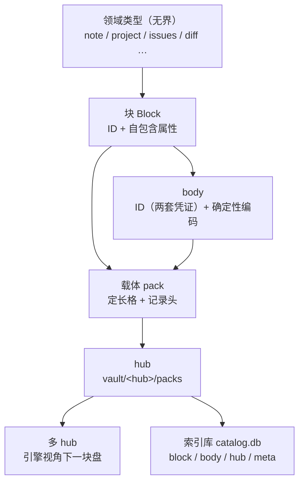

<!-- SPDX-FileCopyrightText: 2026 HanYang06 -->
<!-- SPDX-License-Identifier: Apache-2.0 -->

# L0 · 存储设计（Storage Design）

> Cairn 的最底层存储。本文是 **L0 存储的唯一事实来源**；旧篇 `storage.md` 已删除，
> [`data-model.md`](./data-model.md) 的存储态章节已按本文回写。
> 上层（领域模型、服务、界面）建立在本文之上。

状态：**已落地**（2026-09-28 设计定稿；2026-09-29 按重建后的实现回写；
2026-09-30 按"一名一表 + 表自诞生"回写；2026-09-30 按"身份列 = `ID` 的全部字段"回写）。
口径与实现一一对应：格模型（§5）、记录头（§5.3）、索引库表与表自诞生（§8）、
巡检与处置（§8.7）都在 `py_src/core/storage/` 里；未做的只有 §12 列的那些。
权威顺序：`代码 > docs/architecture/<具体篇> > <总纲篇> > 记忆 / 其它`（`docs/architecture/index.md`）。

## 0. 摘要

**块只承载身份与自包含属性，body 是块携带的载荷，hub 把记录装进定长格的载体，索引库只回答定位，多 hub 只是分组。**

| 层 | 职责 |
|---|---|
| ID | 身份与位置：它是什么、在哪儿、何时签发 |
| 块 | 身份 + 自包含属性；body 由块记录携带的**地址指针**一跳取到 |
| 载体 | 定长格的追加写文件；记录自带总长与校验和 |
| hub | 一个目录，装若干载体 |
| 多 hub | hub 的集合；引擎视角下只有一块盘 |
| 索引库 | 唯一的 `catalog.db`：hub 登记、身份到位置的定位；表结构由声明编译；**内核态可扫载体重建，领域态逐表判档、含不可重建表** |

本文相对旧篇的**决定性变动**：

1. **版本不属于存储**。存储只管 ID、地址、字节；版本归领域。
2. **载体记录自带总长与校验和**，并带 ID 两套凭证：丢索引库也能重建。
3. **物理坐标由格算术推出**，**不作为事实**存进库（索引里那一份是投影，重扫即得）。
4. **一个 vault 一个索引库**，不再一 hub 一库；hub 名是库里的一列。
5. **表声明化为配置**：有哪些表、每张表有哪些列，写在声明里；源码内不得出现建表 SQL（DDL）。
6. **物理地址只存在于可重建的索引投影中**，不进入 ID 与块记录。
7. 索引库裁到内核表（`block` / `body` / `hub`）加索引库自用的 `meta`，
   以及按需诞生的域表；`packs` / `body_type` / 版本表一律不保留。
8. **表由类型诞生**（2026-09-30）：谁用了 ID，谁就登记一次；表的形状由登记表现算、
   写进声明文件、再由那份文件建库——**没有"手工建表"这一步**（§8.2）。

## 1. 词汇表

| 术语 | 含义 |
|---|---|
| **vault** | 库根目录；内含一个索引库与若干 hub 目录 |
| **hub** | `vault/<hub>/`，装若干载体；当前只在 vault 目录内（代码里曾叫 bucket） |
| **载体 Pack** | 一个追加写的文件；定长格；写满封口 |
| **格 Slot** | 载体内的定长分配与定位单位；一条记录至少占一格（代码标识符仍用 `slot`） |
| **块 Block** | 存储单元：身份加自包含属性；承载类型由继承类给出 |
| **body** | 块的载荷；内容寻址；不需要 ID |
| **ID** | body 的身份凭证（两套：分配形态与摘要形态），非裸字符串 |
| **地址 address** | 由 body 内容算出的确定性摘要，回答"是哪份内容"；即摘要形态凭证 |
| **索引库 Index** | `catalog.db`；身份到位置的定位；派生自载体 |
| **表声明** | 描述一张表的结构（表名、列、类型、约束、索引、重建档）的声明；建表由其编译 |
| **记录头** | 载体中每条记录的起始区段：总长与校验和（其后是 ID 段与载荷）；格区间不落盘，由起点与总长推出 |

## 2. 分层与总体结构



**红线**：L0 不认识 `note` / `project` 这些词。领域语义词只存在于 L3；存储只认 ID、地址与字节。

**层间关系**：索引库是 **hub 的实现组件**，不是与 hub 并列的一层。由此，多 hub 对引擎只是分组，
引擎只需回答"这个 ID 在哪个 hub"，不需要管理多个库。


## 3. ID

### 3.1 定位

ID 是一个对象，不是单个字段：它记录**身份与位置**，不记录**内容**。

### 3.2 字段全集

字段不止于标识本身：ID 记录它是什么、在哪儿、何时签发。下表为**字段全集**
（即 `py_src/core/storage/format/id.py` 的 `ID`），逐项给出去留判据。

**身份段**

ID 的本体为**两套凭证，各有其作用，并存不取其一**：一套是签发时分配的唯一标识，一套是由内容算出的摘要。
两者都可用于标识与引用，互不替代：分配形态回答"由谁签发"，摘要形态回答"是哪份内容"。
派生与分配两种来源并存，是本层刻意的语义设计。

| 字段 | 含义 | 比较 | 去重 | 必需 |
|---|---|---|---|---|
| `value_uuid` | 唯一标识形态：签发时分配，与内容无关 | 有效 | **无效**（每次签发都不同） | 是 |
| `value_hash` | 摘要形态：由内容算出，同内容同值 | 无效（同内容同值，不可比） | **有效**（同内容即同值） | 是 |
| `name` | 名字；由**所在容器**得出：在 body 里叫 body ID，在块里叫块 ID | — | — | 否（可为空） |
| `birth_time` | **ID 自身**被签发的时间点（unix 纳秒） | — | — | 是 |

两个算法都收在 `format/id.py` 的 `new_uuid()` 与 `digest()` 两处：2026-09-29 裁定取
**`uuid4` + `sha256`**（理由：内核不需要"ID 按时间有序"，时间戳另有 `birth_time`）。
将来换算法只动这两个函数。

**位置段**（回答"在哪儿"）

| 字段 | 含义 | 必需 |
|---|---|---|
| `in_hub` | 在哪个 hub（目录名） | 否（写入后回填） |
| `in_hub_pack` | 在哪个载体文件 | 否（写入后回填） |
| `in_pack_slot` | 格区间：`(头格, 末格)`，闭区间 | 否（写入后回填） |

**来源段**（跨设备预留，当前未落地）：`issuer`（谁签发）与 `in_net_ip`（在哪台机器）见 §3.4。

三条语义：

- `birth_time` **不等于**块的创建时间、对象的创建时间、数据的创建时间；它只等于 ID 被建立的时间点。
- 字段并非每一项都在某条代码路径上有读点。**调试、日志与排查是人眼读点**，同样构成保留理由；
  判据是"它是否与 ID 相关"，不是"它是否在关键路径上被读取"。
- 位置段可以比"在哪儿"所需的最小集**更全**。冗余在这里是有意为之：它使 ID 具备自描述与可观测性。
  §3.3 第 6 条给出冗余的边界——冗余只允许出现在 ID 对象内，不允许进入库与载体。

### 3.2.1 ID 的持有者

**ID 的持有者是载荷与块**：内容记录持有 body 的 ID，块记录持有块自己的 ID；ID 不下沉到更细的结构里。

| 对象 | 身份 | 记录里放什么 |
|---|---|---|
| 内容记录 | body 的 ID（摘要形态即内容地址，同内容只存一份） | 载荷就是 body 字节本身 |
| 块记录 | 块自己的 ID（摘要形态是该记录**自身载荷**的摘要） | 载荷是**指向 body 的指针**，外加块自己声明的属性 |

**指向体在哪一格**（2026-09-28 按落地情形修正，2026-09-29 按实现复核）：块记录的 `value_hash`
**恒为该记录自身载荷的摘要**——记录层的自校验即如此要求（`Record.decode` 会当场核对，§5.3），
故它无法同时承载 body 的摘要。原稿写作"一格两用"（指向身份 ＋ 内容判重），现改为
**ID 管自身、载荷管指针**：块记录的载荷里带指向 body 的**两套凭证**，
去重与反查仍走 `value_hash`（内容记录的身份就是该地址）。

**这个指针带两样凭证**（`{"value_uuid": …, "value_hash": …}`，2026-09-30 定）：只带摘要时，
"这份内容被哪些块引用"只写得出一半——另一半（分配形态）是 body 自己的身份，丢了它就没法
从块指向"那一份 body 记录"，只能指向"那份内容"。而块表的指针是**两列**
（`body_value_uuid` / `body_value_hash`，§8.2），故它必须两样都拿得到。

**这个指针用保留键**（`\x00cairn.body_ref`，带不可打印前缀）：内容记录的载荷就是业务 body，
而 body 由领域决定——若拿一个业务可能用到的普通键当判据，一份形如
`{"body_ref": …}` 的正文就会被误判成块记录，去重失效、列举整体报错。
前缀即"业务数据不可能占用"的命名空间。判据落在 `format/block.py` 的 `body_ref_of()`：
带这个键、且键下是**两套凭证**才算块载荷，只带一半的一律当内容读。

**指针在载荷里不影响可重建**：顺扫读出载荷即得指针（含两套凭证），故档一（§8.5）照旧成立。

**块自己声明的属性也在同一个载荷里**（保留键 `\x00cairn.attrs`，2026-09-30 定）：
属性是块声明的小字段（如笔记的标题），它**不进 body**——body 是主体内容、按地址去重，
属性进入 body 会使去重粒度变细；它也**不靠索引库的列承载**，因为库只是索引。
故属性与指针同处一层，顺扫即可还原，档一照旧成立。载荷里没有这个键即"这块没有属性"，
不构成坏记录；判据仍只有一条（带 `\x00cairn.body_ref` 且键下是两套凭证）。

### 3.3 不变量

1. **ID 承载身份与位置**。其中摘要形态与内容寻址共用同一口径（内容变则它变）；
   **位置段是投影**：它写在 ID 对象与索引里，不进载体记录，重扫即得（§9.2）。
2. **全局统一**：hub 的数量不影响 ID 的形态与有效性。
3. **身份稳定**：内容变化不改变 ID；引用、关系、将来的合并裁决都以它为依据。
4. **同一 ID 恒解析为同一类型**。类型标号（`kind`）在写的时候由程序给出，
   并**随记录一起落盘**（保留键，§5.3）：故"ID 到类型"的对应关系不依赖索引库，
   重扫即可复原（类型继承机制随领域层重建再定）。
5. **不认识的 ID 一律降级读回**（按未知类型还原为裸数据），不抛错、不丢弃：
   扫描、重建与合并都依赖它，一处抛错即断整条链。
6. **冗余的边界**：ID 对象内的字段允许冗余与可推导值（用于自描述、日志与排查）；
   但库与载体**只持久化推不出来的那些**（§3.5），可推导值不落盘。

### 3.4 预留

- ID 的**完整体制**（编码形态、各类作用域的边界）为后续专项；本文只锁定 §3.5 的持久化子集
  与 §3.3 的不变量。**算法已裁定**（§3.2：`uuid4` + `sha256`）。
- `issuer`（谁签发）在多端同步上线后承担来源区分职责；**当前未落地**（`ID` 上没有这个字段）。
- `in_net_ip` 及后续可能出现的网络字段为**跨设备预留**，当前未落地、不落盘（§3.5），
  网络与联邦设计成稿时一并定义。
- 路径类字段（载体所在路径、文件路径 / 名称）**不设**：它们由"hub 目录 + 载体名"推出，
  落进 ID 只会多一份会不一致的拷贝。

### 3.5 落盘口径：记录带什么、索引带什么

字段全集用于 ID 对象本身（自描述、可观测）。**索引只做索引**（2026-09-30 裁定）：
库里的每一个值都必须能从载体算回来，故载体记录头带上"索引里有、又推不出来"的那几项，
推得出来的（位置段）一律不写：

| 位置 | 载体记录头取用 | 索引库取用 |
|---|---|---|
| hub | 不写（记录就在这个目录的这个文件里） | `in_hub` 列 |
| 载体 | 不写（同上） | `in_hub_pack` 列 |
| 格区间 | 不写（由起点与总长推出） | `in_pack_slot` 列 |
| ID 两套凭证 | `value_uuid` + `value_hash` | 同名的两列 |
| 名字 / 签发时刻 | `name` / `birth_time` | 同名两列 |
| 类型标号 | 保留键 `\x00cairn.kind` | `kind` 列 |

由此同时成立两条：**载体记录头只写推不出来的那几项**（总长、校验和、ID 的落盘部分、类型标号，见 §5.3）；
**索引库里的身份列一个不少**——`ID` 的字段有几项，表里就有几列（§8.1.1）。
位置段是唯一"索引存、记录不存"的一段：记录被扫到时，它在哪里已经由**扫描这一动作**给出。

本节的判据：**索引里出现一个推不回来的值，索引就不再是索引**。
`kind` 曾只存在于索引行，索引一重扫，全库的块便无从判断类型——该裁定即为消除这一缺口。


## 4. 块与 body

### 4.1 类型无界

`Block` 的子类**数量不设上限**：note block、project block、issues block、diff block 等，
形态由继承层级声明；存储不依赖子类数量与新增速度。

此处"子块"指**类型继承的无界**，**不是块嵌套**。跨块引用由块自己表达（关系索引尚未设计，§12），块内不装块。

### 4.2 属性自包含

块自身承载列表与筛选所需的一切：类型、标题、标签、时间。因此**索引库不必为每种类型建表**，
也不必复制块内数据。领域表的数量天然很少——只有确实需要可查询面的对象才建表（关系、将来的检索）。

### 4.3 body 的自由与约束

body 的承载结构**不收窄**：字符串、列表、字典，以及文本化与二进制化形态。
自由的对象是**结构**，不是**字节**：任何 body 类型都必须提供**确定性规范化**，
否则同一逻辑内容会算出不同地址，去重失效、占用回升。

规范化必须满足：同一逻辑内容恒得同一摘要；编码与实现无关；版本可辨。

### 4.4 body 与 ID

body 由**地址**定位，同时**持有 ID**（§3.2.1）：
摘要形态使同内容可判重，唯一标识形态使同内容也能被区分与引用。
故 body 不因"靠地址定位"而失去身份；相反，地址本身就是它两套凭证之一。

块**持有自己的 ID**，并在载荷里携带指向 body 的**两套凭证**（指针）与**自己声明的属性**，
理由与分量见 §3.2.1。**块身份随载荷**：同一份 body 配上不同属性就是两个块，
而内容面仍按地址去重，故只多一条块记录，内容不多存一份。

于是**一个块落成两条记录**（落地见 ``py_src/core/storage/engine.py`` 的 `Storage`）：
内容记录（载荷即 body 字节，身份按内容签发，故同内容只存一份）与块记录
（载荷是指向 body 的指针加块自己的属性，身份是块自己的）。读回时两条记录拼接：
块身份 → 读块记录 → 取指针与属性 → 按地址读内容记录。

## 5. 载体与格

### 5.1 布局

```
vault/
  catalog.db                 # 索引库（唯一）
  <hub>/
    packs/
      <随机名>               # 载体：追加写；定长格；写满封口
```

文件名为随机串（无语义、无顺序号）；载体名是"在哪个文件"的答案，其真源是文件系统本身。

### 5.2 定长格与算术寻址

模型只有一条：**载体是一串等大的格，记录从格边界开始写，按需占用连续的多个格**。
一条记录的位置就是它占的**头一格与末一格**两个数字（代码里是 `SlotRange(first, last)`，闭区间）：

- 格长固定（配置键 `storage.pack.slot_bytes`，默认 512 B），故字节偏移**由算术得出**：
  `偏移 = 文件头长度 + 头格 × 格长`。**格号自文件头之后起算**，故文件头不必凑成整格；
- **定位没有第二套口径**：不存在"格内偏移"这一概念——记录起点就在格边界上，
  这正是"两个数字即精确位置"的前提；
- **写入纪律**：写完一条记录，末格空着的部分补零，使下一格重新落在格边界；
  载体尾部若不是整格，一律拒写（那是残写或外来改动，不推断续写起点）；
- **代价明确**：一条记录至少占一格，格尾写不满就空着。故**格长是"空间浪费"与"格号数量"
  之间的交换**——格小则每条浪费小、格号多；格大则相反（取值见 §5.6）；
- 由此得到一条设计边界：**物理坐标是投影，不是事实**。压缩、合并与搬移只改"抽象地址到物理坐标"的映射，
  不改记录所携带的任何内容。

> 2026-09-29 裁定：原稿的"紧凑排布 ＋ 三元组 `(起始格, 格数, 格内偏移)`"**作废**。
> 三数那套要为"格对齐值 vs 实际占用"备两套口径，落盘值与实际占用会不一致；两数模型无此成本，
> 代价是每条记录至少占一格——取舍见上一条。

### 5.3 记录头

载体中每条记录的结构如下（长度均指字节）::

    +----------------+------------------+---------------------+----------------+
    | total_len (4)  | checksum (64)    | id (canonical CBOR) | payload (rest) |
    +----------------+------------------+---------------------+----------------+
     大端无符号        摘要十六进制        落盘部分，长度自报        记录内容

头的**三项语义**（**落盘的只有前两项**：总长与校验和，其后是 ID 段与载荷）：

| 字段 | 作用 |
|---|---|
| 总长 | 自框定：记录无需外部索引即可切出，故顺扫即可重建 |
| 校验和 | 载荷的摘要凭证；自校验，且与 ID 的内容凭证同源 |
| ID 段 | 身份与描述：装 ID 的落盘部分（两套凭证、名字、签发时刻）与类型标号；位置不入记录（§3.5） |

四条约定：

1. **总长在最前**：故记录自框定，顺扫一遍即得全部 `(ID, 载荷)`；
2. **ID 段装 ID 的落盘部分**（§3.5）：两套凭证、`name`、`birth_time`；
   位置段不进来——它由"在哪个载体的哪一格被扫到"给出；
3. **校验和覆盖载荷**：一次比较同时验"读到的是不是原文"与"ID 声明的内容与实际内容是否一致"；
4. **类型标号由记录自报**（保留键 `\x00cairn.kind`）：它属于记录而不属于内容——
   同一段 body 字节可以被不同类型的块用（内容按地址去重），写进载荷会使去重粒度变细。
   索引里的 `kind` 列因此是它的投影。

**格区间同样不落盘**：它由记录的起点与总长推出（§5.2），索引里那一份是投影。

记录头使**载体自描述**：内核态下索引库丢失后，扫描载体即可重建（域介入后的范围见 §8.5）。
这是档一可重建成立的前提。


### 5.4 封口与目录

- 写满即封口；
- **封口不留标记**：没有封印字节、也没有封口文件——"已封口"就是"该载体已达到封口线"。
  故封口是**策略判断**，不是落盘状态：配置变更后判定随之变更，也不会出现"标记与事实不符"；
- **活跃载体＝有空间的最满者**（一个都没有就新开一个）。写入纪律是"写到满才换"，
  故这个判据不依赖时间戳，也不依赖载体名顺序（名字是随机的，见 §5.1）；
  封口线被调大后可能不止一个载体有空间，此时按同一判据仍只有一个答案；
- 封口线只管**换不换文件**，不构成硬上限：单条记录大于封口线时仍完整写入
  （否则大记录永远写不进去）。格长则是格式事实，写在文件头里（§5.5）；
- **不设封口目录**：记录自框定（总长在最前），故顺扫即可重建定位，
  目录只是"少读一遍"的性能优化，不承担"能不能读出来"的职责；
- 将来若确需加速，目录写入**文件尾**（追加写模型下文件头无法就地增长），
  且必须**可重建**：目录与记录不一致时以记录为准。该优化列为**预留**（§12）。

### 5.5 载体文件头

文件开头是定长的载体文件头（当前 24 字节：魔数 8 ＋ 格长 8 ＋ 预留 8）：

| 字段 | 作用 |
|---|---|
| 魔数 | 认得出"这是载体、且是第 1 版布局"（末位带版本号）；不符即报错，不作推断 |
| 格长 | 该载体的格长（代码里是 `slot_bytes`）；**故载体自描述**，仅凭该文件即可算偏移 |
| 预留 | 置零；将来加字段不必改已有布局（读取时不校验它的内容） |

格长随载体走（而非全局唯一）：不同批次的载体可以不同格长，而每个载体自身仍可精确算术定位。
**写入时定、读取时从文件头读**——这条与 §5.6 第 2 条互为因果，是"物理坐标只是投影"的前提。

### 5.6 配置参数

| 键 | 默认 | 含义 |
|---|---|---|
| `storage.pack.max_bytes` | 2 GiB | **封口线**：单个载体写满这个字节数即换新载体 |
| `storage.pack.slot_bytes` | 512 B | **格长**：定长分配与定位单位 |
| `storage.block.max_bytes` | 1 MiB | 分片粒度：单块超过即切片（**未落地**） |

四条约定：

1. **封口线与格长是两个独立参数**。封口线只决定"何时换文件"，格长只决定"如何定位"；
   不从封口线推格长（否则改一次容量参数就改掉落盘布局）；
2. **格长只在建载体时读一次**，随后写进载体文件头；**读取永远从文件头读**。
   否则改一次配置，已落盘载体的偏移会全部错位；
3. **格长要小**：两数模型下一条记录至少占一格（§5.2），格长即每条记录的平均浪费上限——
   格长 64 KiB、记录 200 字节时浪费 99%；格长 512 B 时平均浪费 256 B；
4. **不设"每载体最多多少块"**：容量由格计量，块数是派生视图；再设一个参数即多一处自相矛盾。

**格式常量不进配置**：载体魔数、文件头长度、记录头布局属于改动即坏库或换格式的常量，
它们留在实现处（`py_src/core/storage/carrier.py`）。配置里不得出现代码不读的键：那样的键使配置与实际行为不一致。

上表三个值由**配置声明**给出（`py_src/core/storage/conf.py`：`storage.pack.slot_bytes` 默认 512 B、
`storage.pack.max_bytes` 默认 2 GiB、`storage.block.max_bytes` 默认 1 MiB，均为预留的分片粒度），
默认值直接引用 `hub.py` 的 `DEFAULT_SLOT_BYTES` / `DEFAULT_MAX_BYTES`，一份事实两处引用；
内核装配时由 `core/init.py` 的 `_policy_from_config()` 取值组成 **`PackPolicy`** 传进 hub。
取值与落盘口径见 [`config.md`](./config.md)；具体取值仍待实测（§12）。

## 6. hub

- hub 是 `vault/` 下的一个目录，内含 `packs/`；
- **判据是形状，不是"是个目录"**：vault 下带 `packs/` 的直接子目录才算 hub；
  vault 下的其余目录不属 hub，登记与读取均按此判据；
- **当前 hub 只在 vault 目录内**，不预留外部形态（换盘、远端等），需要时再作增量设计；
- hub 名进入 ID 的 `in_hub`；索引库中 hub 名是 `hub` 表的主键、块行与内容行里的一列；
- **hub 名就是 hub 的地址**（目录名）：取普通名字（`main`）或取 ID 形态，对路径式查询没有区别——
  先查 hub、再按格区间读记录，两跳都是查表。hub **不持有 ID**：ID 属于载荷与块（§3.2.1），
  hub 是容器，它的标识就是它的名字；
- hub 目录本身即 hub 的存在证明，索引库的 `hub` 表是**登记**而非真源；登记一旦写下，
  再取同一个 hub **不改写**它（登记记录的是首次出现的时刻与形态，改形态是显式动作）；
- **hub 没有自己的配置**：格长随载体走（写进文件头，§5.5），封口线是策略（每次写入按当前值判）。
  故 hub 这一层是无状态的：目录移动到任何位置均成立，索引库丢了也能顺扫回来；
- **读路径不建 hub**：目录不存在即报错，不新建空 hub——空 hub 会使"目录缺失"
  与"此处本就为空"无法区分。

## 7. 多 hub

- 物理上是多个 hub，**引擎视角下只有一块盘**：引擎只需回答"这个 ID 在哪个 hub"；
- **同一个 vault 只有一个索引库**。索引库的承载量与其体量相称（定位行），
  按 hub 切分为多个库文件不带来收益；
- **路由**（已落地）：写入按 hub 名分组，读取按记录行里的 hub 名开 hub——故多 hub 对上层
  只是**一次分组**，此后全是"按格区间读记录"这一件事；
- **登记对账**（已落地）：目录是事实、登记是投影。目录里有的补登记；
  登记里有的、目录里没有的**只报告不删**（与"多出的列不静默删除"同一口径）；
- **合并**：以源 hub 的载体为真源，把记录镜像进目标 hub。内容面天然幂等（同地址只存一份）；
  身份面若同一 ID 在两侧同时存在，按 `birth_time` 裁决取较新者；语义冲突交回领域处理
  （存储不承载版本，见 §9）；
- **短时并发**：并发以**短命 hub**承接，事件结束后合并回主 hub 并销毁短命 hub。
  短命 hub 若不在合并后销毁，文件数将随并发次数单调上升，与"控制文件数"的目标相反。

**合并与短命 hub 列为未来项，短期不做**（并发承接不是当前瓶颈，"文件数随并发次数上升"
在没有并发写入之前不会出现）。落地时"角色 / 状态"这类事实的真源放在
**hub 目录里**（如一个标记文件），索引再投影它——**索引不得存推不回来的值**（§3.5）。
合并期 hub 归属的改写随之一并推后，两种取法与各自的代价记在 §12。


## 8. 索引库

### 8.1 定位

索引库只承担**索引**职责，不承担数据职责。一次查询交出 ID，其后所有工作在块上完成。故库内只保留
可被快速筛选的值，正文、样式、图形、资产一律不进库。

### 8.1.1 库里只放 ID 的面

**库里只放"ID 的面"——身份、指针、标签、地址；一切内容的载荷都不放。**
判据是**该值换一台机器是否仍成立**：绝对位置一律化成
"名字 + 数字"再存，于是库本身是**可搬的**。

一列的值只有五种来路（声明里写 `from:`，不写就是绑定）：

| 来路 | 是什么 | 例 |
|---|---|---|
| **绑定**（identity） | `ID` 的字段，**列名就是字段名**；类型由 `ID` 推出，声明里不写 | `value_uuid` / `value_hash` / `birth_time` / `name` / `in_hub` / `in_hub_pack` / `in_pack_slot` |
| **引用**（ref） | 值是**另一个 ID** 的字段（指向别处） | `id(body).value_uuid` / `id(body).value_hash`（块指向内容） |
| **观测**（store） | 存储层顺扫载体时可读出的值 | `kind` / `hub.name` |
| **程序**（prog） | 写的时候由程序给出，记录里没有 | **当前无**（历史条目见 §12 的 `edge` 表） |
| **派生**（digest） | 由本表其它列算出的摘要 | **当前无** |

> 程序与派生两档的词汇留着：域表将来需要"写时给出"或"由别的列算出"的列时，
> 它们各自有明确来路，不必临时发明第三套写法。

**能绑的字段就是 `ID` 的全部字段**（`format/id.py` 的 `ID_FIELDS`，由 `ID` 的字段现算，
不另抄一份子集）：两套凭证、签发时刻、名字，以及位置段三列。**位置段也绑**——
`in_hub` 那类字段不是"推导面"：要从载体推出某条记录的位置，前提是**先扫一遍全库**，
而索引库存在的意义正是省掉这一遍。`ID` 加字段，表里就多一列，没有第二处要改。
**语法上写不出** `block.title` 这种"别的对象的字段"：能指的只有 ID，这就是"去数据库化"。

列的**生命周期分四类**，压实回收要动的只有第四类：

| 类别 | 谁决定 | 变更时机 |
|---|---|---|
| 身份（`name` / 两套凭证 / `birth_time`） | ID 自己 | 永不变（`birth_time` 一写定即不改） |
| 标签（`kind`） | 程序 | 只在明确改标签时 |
| 指针 / 引用（`body.value_*`） | 别处的 ID | 引用关系变时 |
| **地址（`in_hub` / `in_hub_pack` / `in_pack_slot`）** | 字节所在位置 | **迁移一次变一次**（压实 / 迁移） |

### 8.1.2 两类表：主语是不是一个 ID

| 类 | 判据 | 例 |
|---|---|---|
| **身份表** | 主语是 ID；主键是 `value_uuid`，**一张表一个类型** | `block`（块记录）、`body`（内容记录） |
| **登记表** | 主语不是 ID（真源在文件系统） | `hub`（一列绑定都写不出来） |

**关系不在这两类里**（2026-09-30 定）：关系由**块自己表达**，库这边只做索引，
而关系索引表按"没有调用方就不预埋"的口径**尚未设计**（§12）。

**名字是表的坐标，不是行里的字符串**（2026-09-30 裁定）：`id(block).…` 指向 `block` 那张表，
`id(body).…` 指向 `body` 那张表。**有多少个"用 ID 绑字段的类型"，就有多少张身份表**——
它们是必然的索引表，不是可选的组织方式。故身份表**没有判别列**：主键就是 `value_uuid`，
一个凭证只落在一张表里。

**表的诞生由类型登记**（§8.2.1）：类型定义时登记一次（谁用了 ID、有哪些 ID 字段），
表的列由登记表现算，故"加一个类型"就等于"多一张表"，无需手写建表语句。

**绑定列默认建索引**（不含主键那一列）：能绑的列就是"能拿它当查询词"的列，
不该由第二处声明决定；想额外加索引再写 `indexes:`。

### 8.1.3 `id(名字).字段`：指向别处只有这一种写法

绑定列在声明文件里就是一句话（下面是**块指向内容**那条指针，它是内核现用的一例）：

```yaml
- name: block
  columns:
    - id().value_uuid                  # 本行主语的字段
    - id(body).value_uuid              # 指向别处：body 那张表的同一个字段
    - id(body).value_hash
    - { name: kind, from: store, type: text }
```

**两个含义**：`id(src)` 指向 src 那张表（＝建立一条指向它的引用），`.value_uuid` 取它那个字段。
解析不用正则——一个 `partition('.')` 切字段、括号里切名字。

**省掉的三样**：`type` 与 `doc` 随 `ID` 的字段走（抄一份就是第二份事实）；列名就是字段名
（不必写 `name:`）；值也不用写（点号后即字段名）。**名字不写**（`id().value_uuid`）＝ 本行主语那个 ID。
非绑定列（观测 / 程序 / 派生）才需要映射加 `from:` 标明来路。

**库内的列名**：本行主语的字段取**裸字段名**（`value_uuid` / `value_hash` / `name` / `birth_time`）；
指向别处的加前缀（`id(body).value_uuid` → **`body_value_uuid`**），以免同一张表内两个 ID 的同名字段重名。

提一个名字就等于**建立一条指向它的引用**，取它的字段就是**从那张表取值**——
"表"与"引用"是同一件事的两种说法。所以指向别处**没有专属语法**：

- 1:N 指向：在身份表里加一列 `id(别的名字).字段`（内核的 `block → body` 就是这一形）；
- M:N / 多端结构：开一张表，两端各一列 `id(…).value_uuid` 加一个 `kind`，**基数由主键定**；
- **关系不走这条路**（2026-09-30 定）：**关系由块自己表达**，库只做索引，
  "关系索引表"尚未设计、不预埋（§12）。上面两条只用于**域表的建表**，不适用于关系。

### 8.1.4 三级查找：绑定列 → 二级索引 → 物理面

| 级 | 在哪找 | 能做什么 |
|---|---|---|
| ① 绑定列 | 库里那一列 | **能当谓词**（一次命中 / 一次索引扫） |
| ①.5 二级索引 | 同一张列上的索引（**数据库自己维护**） | 让非主键的 ID 字段也能当谓词，不必扫全表 |
| ② 物理面 | 载体的记录载荷 | **值本身**；只能按对象取 |

两级查找不冲突，因为**载荷永远是事实源、绑定列是它的物化缓存**：写的时候先落载荷、列跟着写；
读取时列值不一致则回退到②，以载荷为准；巡检补列（只补不删）。
**②在结构上必然存在**：`kind` 曾由程序给出、记录里没有，故它只存在于索引库——
2026-09-30 起类型标号随记录落盘（§5.3），这一条缺口已经消掉。

二级索引只是"哪些行"的加速器，从不成为第二个事实源——它只使**候选集稍旧**，不改变数据本身。

### 8.2 表

**声明是本体**（本体是 `config/tables.yaml`，由代码写出来、由代码读回去；§8.2.1），
下面只是速览::

    block    name | value_uuid PK | value_hash | birth_time | in_hub | in_hub_pack |
             in_pack_slot | body_value_uuid | body_value_hash | kind
    body     name | value_uuid PK | value_hash | birth_time | in_hub | in_hub_pack |
             in_pack_slot
    hub      name PK
    meta     name PK | value          # 索引库自用：存声明签名（§8.6）

- 两张身份表的**身份列就是 `ID` 的字段**（`ID_FIELDS`，顺序即 `ID` 的声明顺序）：
  库里的行是 ID 的镜像，故不存在某字段无法入库的情况。位置段存成三列，其中
  `in_pack_slot`（一对格号）落库时写成文本 `头格:末格`（`rows.py` 负责换写）。
- `block`：**块的身份表**。在身份列之外只有三样：**指向 body 的两列**
  （`body_value_uuid` / `body_value_hash`，指针只带两套凭证，故落成两列不合成一列）
  与类型标号 `kind`（由记录自报，索引里那一列是它的投影）。
- `body`：**内容记录的身份表**。只有身份列——**没有 `kind`**：内容记录不带类型标号。
  它的位置顺块指针跳一次即得，而这里仍存一份，理由是**每条载体记录都要有一行**：
  档一重建、巡检与压实回收都以"盘上有哪些记录"为真源（§8.5）。
- `hub`：**登记表**，**只有名字**——它回答"存在过哪些 hub"，真源是那些目录（扫一遍即得）。
  角色、状态、第一次见到的时刻都推不出来，故不进表（§3.5：索引不得存推不回来的值）。
  短命 hub 与合并落地时，那些事实的真源要放在 **hub 目录里**（如一个标记文件），再由索引投影。
- **关系索引表：当前没有**（2026-09-30 删）。原 `edge` 表零调用方，且形状按
  "关系是一等 DB 行"设计——现行关系口径是"**关系由块自己表达、库只做索引**"。
  领域产生关系时按当时的需要再行设计，届时才称关系索引（§12）。
- `meta`：**索引库自用表**，不属任何声明集（开库流程自己保证它存在），但它的建表语句
  同样由声明编译（`tables.META_TABLE_SPEC`）——"源码内不得出现建表 SQL"这条同样适用。
  声明里占用这个名字会被 `Declaration` 直接拒绝。
- 域表：确实需要可查询面者按需声明（关系已在其一；检索为其二），走同一套声明机制。

索引：绑定列与引用列**默认各有一个索引**（`TableSpec.resolved_indexes()` 兜底补上），
故声明文件里只写"额外的"那些；两张身份表因此按各自的 ID 字段与位置段各得一索引。
索引名由**表名与列组合**推出（`idx_<表>_<列>`，列按名排序），不手写，避免漂移。
带表名是必须的：SQLite 的索引名**整库唯一**，只由列组合推出时两张表声明同一列组合即重名，
后一条 `CREATE INDEX IF NOT EXISTS` 按名字判定为已存在而**静默跳过**——声明的唯一性随之落空，
比对又始终报"缺索引"，开库被持续阻断。带表名仍不足以保证唯一（表名与列名同用 `_` 分隔，
表 `a` 的列 `b, c` 与表 `a_b` 的列 `c` 同名），故解析口另做一次**跨表唯一性**校验。

### 8.2.1 表的诞生：类型登记 → 声明文件 → 库

**没有"手工建表"这一步。**

```
类型定义（class Block / class NoteData(Block)）
    │  __init_subclass__ 收到通知
    ▼
登记表（REGISTRY：这个类型叫什么、用哪张表、持有哪些 ID 字段）      storage/registry.py
    │  由登记表现算列与主键
    ▼
表声明（TableSpec）                                              storage/tablegen.py
    │  写进声明文件（文件不在就生成、少表少列就补、已有内容不改）
    ▼
config/tables.yaml  ──►  开库对齐（建表 / 补列 / 比对）           storage/index.py
```

四条口径：

1. **名字就是表的坐标**：`Body` → `body`、`Block` → `block`、领域类 `NoteData` → `notedata`。
   子类**不会**继承父类的表名——继承来的 `__table__` 不算，本类自己写下的才算；
   否则"每个类型一张表"不成立。要改名就在本类写一行 `__table__ = "…"`。
2. **登记是投影的输入，不是投影本身**：`config/tables.yaml` 是**按登记表现算出来的**那份文件，
   再由它建库——故手工修改文件后声明照旧进库，该步骤不会被跳过。
3. **文件只追加不覆写**：登记表里有、文件里没有的表与列补进去；已有的表与列不作改动，
   手工添加的列也不删除。换形状留下的旧表（`record`）由调用方在 `Kernel` 里**点名淘汰**，
   不按推测执行——删表是有后果的动作。
4. **开库时先对文件、再看库**：装配内核那一步先跑一次投影（幂等），
   于是"代码加了类型、库没这张表"的分叉在一次运行内即收敛。

**代价**：声明文件因此是**派生 + 手改**混合的产物，手工添加的列在下一轮仍被保留；
引擎不解析其语义，它只是一列数据。

### 8.3 索引

按入口职责建立：绑定列与引用列默认各得一个索引（§8.2），即按签发时刻、按地址
（`value_hash` 反查）、按位置段与按指针查询；属性的速查由内存倒排承担
（`storage/attrindex.py`，纯派生、不落盘）。

### 8.4 表声明

- **表的建立由配置声明**，源码内**不得出现建表 SQL**：声明的数据模型在 `core/storage/tables.py`
  （表名 / 列 / 类型 / 约束 / 默认值 / 索引 / 重建档 / 说明），建表与建索引语句由其
  **编译**（`TableSpec.ddl()`）——方言只出现在编译器一处；
  后来加上的列由 `TableSpec.add_column_ddl()` 编译成 `ALTER TABLE … ADD COLUMN` 补齐
  （`CREATE TABLE IF NOT EXISTS` 对已存在的表是空操作，补不了列）；补不上的列
  （主键 / UNIQUE / NOT NULL 无默认值）按**破坏性差异**处置，须显式授权重建；
- **类型词汇中立**：只认文本 / 整数 / 实数 / 二进制 / 布尔五种，加新类型要过声明层，
  于是"能不能落盘"是设计问题，而不是由一句 SQL 决定；
- **登记即事实、重复即报错**：同名表声明重复且内容不一致直接抛错，不静默覆盖；
- **代码是声明本体、文件是它的投影**（§8.2.1）：表声明的本体在**类型登记**里——
  一个类型定义一次，它的表就诞生一次；`config/tables.yaml` 是这份登记算出来的文件
  （一项一张表，可手工编写与修改），代码只负责**读、校验、编译**。
  故本节的"可手工编写"与"由代码写出"并不矛盾：**文件是投影，本体在类型登记**；
- 声明分布遵循"各管各的"：内核那两张类型表由内核的两个类型诞生，域表由域自己的类型诞生；
- **建表只在开库与挂载时进行**，不在读写路径上，避免热路径反复执行 DDL 与提交；
- **对比与判定**：声明与实际不一致时按差异分类处置——缺失即建，**缺列即补**
  （`ALTER TABLE … ADD COLUMN`；补不上的列按重建处置），索引不符即建索引、
  **同名不同定义（唯一性变化）即拆掉重建**，多出的未声明列与未声明的表只告警、**不静默删除**；
  比对**不只看列型**：主键 / 非空 / 默认值同样比，漂移即"容器级不兼容"（须重建，见下条）；
  列级 `UNIQUE` 由声明的索引那一侧比（它才是唯一性的实际载体）；
- **破坏性动作必须显式授权**：重建**默认拒绝**（报错并列出待重建的表），
  调用方须显式给出 `RebuildPlan(tables=…, reason=…)` 才执行；授权未覆盖到的表同样拒绝；
- **重建不丢数据**：处置时旧表**改名隔离**为 `<表>__dropped_<时刻>`，不删除——
  "数据由调用方搬运"在实现里没有落点（调用方拿不到旧行），改一次列型就等于整张表消失；
  档三（真源在库内）更是只能靠备份。隔离表随后按"库里有、声明没有"处置，即**只告警不删**；
  表内容由调用方按声明重建，或从备份恢复；
- **用户可加不可改**：允许新增列、新增索引与默认值；改类型、改约束、改主键、删带约束的列一律拒绝启动。
  破坏性变更只来自发版本身；
- 领域表按需**增量构建**：领域把自身所需的类型登记出来，那张表就诞生，由存储按上述流程对齐。

### 8.5 可重建的范围（分档）

**"可重建"是逐表的性质，不是索引库整体的性质。** 索引库随领域介入而改变性质，
故必须分档说明，不得笼统宣称"纯投影"。**每条表声明都必须写明自己的重建档**：
写不出重建来源的表就是不可重建表，必须纳入备份（声明层会直接拒绝含糊的档）。

**表级只有两项**（代码里的 `Tier`）：`DERIVED`（可重建，**必须**写明来源）与
`SOURCE`（真源在库内，**禁止**写来源——可重建与真源不可兼得，必须明说）。
下面说的"档二"是**领域介入后整库的性质**，不是第三种表：
领域表照样落进这两项之一，含糊的声明在解析口就被拦下。

**档一 · 内核纯净态 · 可重建**（表级 `DERIVED`）
内核自有表与由载体派生的行：hub 登记、块与内容的定位（`block` / `body`）与索引库自用的 `meta`。
重建路径：遍历 vault 下的 hub → 扫描各 hub 载体 → 读记录头 → 重建。此档损坏可由重建修复。

**档二 · 领域加持态 · 大部分不可重建**（整库性质，不是表级档）
一旦领域挂载，索引库即增量加入领域专项表。这些表与物理存储**可以没有对应关系**，
其中来源于载体的部分可由载体重算（声明为 `DERIVED`），而**真源就在库内的部分无法由载体推出**
（声明为 `SOURCE`）。此档一旦损坏且无备份，即为**永久性损失**，重建不成立。

**档三 · 备份**
领域态下"库可重建"不成立，故**备份是必需能力**，而不是可选项。

**归属判定表**

| 表 | 可重建 | 重建来源 |
|---|---|---|
| `hub` | 是（`DERIVED`） | hub 目录（§6） |
| `block` / `body` | 是（`DERIVED`） | 载体记录头（身份字段与类型标号都在记录里） |
| `meta` | 是（`DERIVED`） | 当前表声明（由程序给出） |
| 领域专项表 | 逐表而定 | 声明其重建档与来源 |
| 真源在库内的表 | **否**（`SOURCE`） | 无；只能靠备份 |

**两条硬规约**

1. **逐表声明重建档**：新增任何表，声明中必须写明它属于哪一项、重建来源是什么。
   写不出重建来源的表，即为不可重建表，纳入备份范围。
2. **可重建不得覆盖真源**：同一事实若已有真源（载体或块），库内那一份只能是派生。
   反之，库内可以存在真源，但它就丧失了可重建性——两者不可兼得，必须明说。

**档一重建是"每一列都能顺扫回来"**（2026-09-30 起）：两张身份表的身份字段、类型标号与
格区间都在记录里，故索引库丢了可以纯重扫补齐；**进哪张表由载荷判断**——带指针的进 `block`，
其余进 `body`（判据落在载荷上，故类型为空也认得出）。落地见 `py_src/core/storage/rows.py`
的 `rebuild()`，口径是**只补缺行**：已有行一律不动（清空重扫要走显式授权）。

例外须写明：hub 当前只在 vault 目录内，故 hub 登记可扫描回来；一旦引入 vault 外的 hub 形态，
必须另有一份清单兜底，否则档一也将出现例外（§6）。


### 8.6 数据库配置

**库里有哪些表、每张表有哪些列，全部由声明给出**，不硬编码于读写路径。

> **现状（2026-09-30）**：声明本体已经是 `config/tables.yaml`（**由代码写出来**，见 §8.2.1），
> 路径取自配置根（环境变量 `CAIRN_CONFIG` / 仓根下的 `config/`）；文件名是
> `registry.TABLES_FILENAME` 这个常量，**不再是一个配置键**——这份文件由代码写、又被代码读，
> 它不是"可以调整的参数"。解析与编译在 `py_src/core/storage/{tables,tablegen}.py`，
> 开库比对与处置在 `index.py`。

**声明面**分三处，遵循"各管各的"：

| 声明面 | 内容 | 归属 |
|---|---|---|
| 内核表 | `block` / `body`（类型派生）＋ `hub`（不由类型诞生） | 存储自己 |
| 索引库自用表 | `meta`（不属任何声明集，由开库流程保证） | 存储自己 |
| 领域表 | 领域自己的类型一登记，那张表就诞生 | 领域（走同一条路） |

**位置约定**：标量配置收在**单文件** `config/settings.json`；
表声明的本体放独立文件 `config/tables.yaml`（名字由常量给出，见上）。

**声明内容**（每条表声明）：表名、`doc`、`tier`（重建档）、`owner`（归属）、
`rebuild_from`（重建来源）、`columns`、`indexes`、`primary_key`。

**类型词汇中立**：只认有限的几个类型名（文本 / 整数 / 实数 / 二进制 / 布尔）与有限的约束开关
（主键 / 唯一 / 非空 / 默认值）。建表语句由声明**编译生成**，故源码内不出现方言与建表语句。
时间不另立类型：一律是整数（unix 毫秒），与全库口径一致。

**校验在解析口**：未知项、非法标识符、非法类型、重复表名或列名、缺必填项、
`SOURCE` 档写了重建来源、声明占用 `meta` 这个名字——一律报错，不静默忽略。

**该口径不限制可扩展性**：解析器与编译器里**没有任何表名或列名的硬编码**，
加一张表、加一列都只是改声明。

**开库时的比对**（落地见 `index.py` 的 `Index.open`）：

- 库内 `meta` 存一份声明的**规范化描述**（`Declaration.signature()`，列与索引按名排序、**不含 `doc`**
  ——改一句注释不影响开库）；
- 开库时先看、再比、后处置：缺表即建、缺列即补、索引缺失即建、同名索引定义变了即拆掉重建、
  多出的表 / 列 / 索引**只告警不删**；
- 容器级漂移（列型 / 非空 / 主键 / 默认值 / 列级唯一）**默认拒绝**，须开库时给出
  `RebuildPlan(tables=…, reason=…)` 且覆盖每一张待重建的表；重建**改名隔离不删**
  （`<表>__dropped_<时刻>`），隔离表随后按"多出的表"只告警；
- **登记语义**：对齐全过程是"先比对、处置完再重写登记"。于是声明变了**不阻断开库**，
  只报告 `declaration_drift`（否则增加一张领域表即无法开库）；真正中断的只有
  "改不动且未授权"的破坏性差异。库与当前声明对不上时，这一条是排查的入口。
- 两处差异分属两套口径：开库对齐的 `Difference`（声明 vs 实际结构）与
  巡检的 `Find`（库 vs 真源数据）互不通用，见 §8.7。

### 8.7 巡检与处置

- **巡检**（`patrol()`）：比对索引库与其声称的真源（hub 目录、载体、记录头），
  **只报告、不动库**。两个方向都比——盘上有、库里没有，与库里有、盘上读不出来，
  是两种不同的差异，处置方式也不同；
- **分类即处置依据**：可按"能否由重建修复"分成两类，因为档一的重建口径是**以载体为真源**
  （§8.5）。发现分**六类**（代码里是 `FindKind`）：

  | 发现 | 含义 | 可否由重建修复 |
  |---|---|---|
  | `unregistered_hub` | hub 目录在、登记缺 | 可（补登记） |
  | `missing_row` | 盘上有记录、库里没有行 | 可（按记录补行） |
  | `misplaced` | 行在、摘要对得上，但坐标与载体里的实际位置不符 | 可（只改坐标） |
  | `missing_record` | 行在、盘上读不出来（载体缺失，或盘上只有摘要不符的其他版本） | **否**：内容已丢失 |
  | `missing_hub` | 登记或行指向的目录缺 | **否**：hub 已丢失 |
  | `corrupt_carrier` | 载体读不到底（截断 / 校验失败） | **否**：坏点位置须人工判定 |

- **一致要两项都对**：位置（hub / 载体 / 格区间）与**摘要凭证**
  同时与该身份的某次出现相符，才算"行指向的字节还在"。只比位置会漏掉这一种：
  索引行被改坏时，位置可能照样落在该身份的另一份副本上，而那份副本的内容与行声明的摘要不符——
  "库里声称的那份内容在不在盘上"正是巡检要回答的问题；
- **处置**（`repair()`）：只动"可修复"那一列，且**只补不删**；补行时**发现里带哪种行就补哪种**
  （§3.2.1 的判据），不由 `detail` 文本反推该进哪张表；
  不可修复项一律不碰——删行等于抹去"数据已丢失"这一事实，只能报告，交由备份与人工；
- **两张身份表各比一遍**：块行与内容行都参与"库 ↔ 盘"的比对，各报各的 `missing_record`；
  只比一张会漏掉"内容还在、块行缺失"这种不完整状态；
- **同一身份在盘上出现多次不算差异**：更新留下的旧副本要等压实回收（§12），
  它不影响"行指向的那一份是否成立"；行指向的那一份确实缺失，才报 `missing_record`；
- **坏点即停属于重建，不属于巡检**：重建取到部分结果即视为失败，故遇错即抛；
  巡检须继续扫完其余载体，其余坏点的完整分布正是它要回答的问题，故**按载体捕捉、其余照扫**；
- 巡检的覆盖面受重建档约束：`SOURCE` 档的表不参与"与真源比对"，因为无真源可比。


## 9. 横向规约

### 9.1 版本不属于存储

存储只管 ID、地址与字节。历史、回放、压实是领域策略，**不进存储**。
内容变化的记录由领域承担；存储不因此新增表、列或机制。

### 9.2 物理地址的归属

- 进入载体记录的只能是**推不出来的那些**：两套凭证、名字、签发时刻与记录自报的类型标号（§3.5）。
  **位置段不进记录**——记录被扫到时，它在哪儿已经由扫描这一动作给出；
- **位置（`in_hub` / `in_hub_pack` / `in_pack_slot`）是投影**。它写在 ID 对象与索引行上，
  但盘上没有任何一份字节依赖它；布局变动（压实、搬移）即重写，不作为事实被信任。

### 9.3 失败处理

失败必须显式抛出，不得把落盘失败读成成功。存储不得吞掉机制性错误。

### 9.4 工程纪律

- 记录与索引的重建口径必须唯一：同一事实不得存在两个写入者。
- 能派生的不存，能算的不写，能扫的不记。

### 9.5 本地不加密

**落盘一律明文**，本机不加密、不做静态加密；加密只作用于**传输与远端副本**
（见 [`access.md`](./access.md) 的档位与信任模型）。既然明文落盘，内容地址就直接用明文摘要，
去重不存在密钥域冲突——这是本地优先的明确取舍：本机磁盘上的内容**不设静态防护**。

### 9.6 旧格式不兼容

本设计**不兼容旧格式**（§10）：旧格式的库不被读取，且**并非静默忽略**，两道入口都报错：

- **索引库**：开库前先判它是否属于本设计的库——既没有 `meta` 表、也没有任何声明过的表，即拒开
  （`IndexSchemaError`），避免将他人的 sqlite 文件当作本库；
- **载体**：文件头魔数不符即报错（`RecordFormatError` → `HubShapeError`），不作推断，
  也不当作"此处没有载体"。载体属于本设计、仅索引丢失时照旧打开——
  那正是档一可重建要支持的场景。

## 10. 已裁剪的决定

以下概念在本设计中**不存在**，不得重新引入：

| 已裁 | 理由 |
|---|---|
| 存储承载版本（版本引擎、版本表、保留窗） | 版本归领域；存储不承担历史 |
| 手工版本号（块格式号与各域结构的模式号） | 无读点的标记；发版本身即变更事件 |
| 类型码表（整数枚举） | 类型由程序给出，重复 |
| `packs` 表 | 载体元信息可由文件系统与记录头得出 |
| 独立的内容池表 | 地址到位置的映射即去重池，无需另立 |
| 库中存物理坐标作为事实 | 物理坐标是投影 |
| 一 hub 一库 | 库体量小，单库即可；一个 vault 一个库 |
| 源码内建表 SQL | 表的建立由声明给出；声明内容为表、列、类型、约束与索引 |
| 载体中的类型标号 | 类型由程序给出；不认识的 ID 降级读回 |
| 块嵌套 | 跨块引用由块自己表达（关系索引尚未设计） |
| ID 内承载内容或地址 | ID 不承载**物理坐标**；摘要形态是两套凭证之一，与内容寻址同源 |
| 单一身份本体 | 两套凭证并存：分配形态与摘要形态，各有其作用 |
| ID 里的"格内偏移" | 两数格模型下记录起点就在格边界上（§5.2） |
| `record` 单表 + `name` 判别列 | 名字是表的坐标，不是行里的字符串；一张表一个类型（§8.1.2） |

## 11. 落地顺序（代码）

**现状（2026-09-30）**：从基础类型到内核接线的各片均已落地，按片推进、每片可单独回退，
模块在 `py_src/core/storage/` 与 `py_src/core/init.py`——身份与记录（`format/`）、
载体读写（`carrier.py`）、hub 与多 hub（`hub.py`）、索引库（`tables.py` / `index.py`）、
行层与重建（`rows.py`）、存储引擎（`engine.py`）、巡检与处置（`patrol.py`）、
内核接线（`core/init.py`）、表自诞生（`registry.py` / `tablegen.py`，§8.2.1）。
**未来项**：合并与短命 hub（镜像、归属改写、销毁），短期不做（见 §7、§12）。

## 12. 待定与预留

| 项 | 状态 |
|---|---|
| 格长与载体字节上限的具体取值 | 待定（由实测确定；当前默认值声明于 `core/storage/conf.py`，引用 `hub.py` 的 `DEFAULT_*`） |
| 摘块与巡检的相互作用 | **已落地**：`drop` 先写墓碑、再摘定位行（`engine.py`）；巡检认识墓碑，不再把被删记录报成 `missing_row`，处置也就不会把它补回。墓碑与旧字节的空间由压实回收（见下） |
| 封口目录（加速定位用；记录已自框定，故属优化而非必需） | 预留 |
| 合并与短命 hub（承接并发写入，合并后销毁） | **未来项，短期不做**（见 §7） |
| 合并期 hub 归属的改写（改写为目标 hub / 保留源 hub） | 随合并一并推后，动工前不裁定，以免取舍固化成数据格式。改写为目标 hub：路由与记录实际位置始终一致，代价是一次归属改写；保留源 hub：与"记录仍在源 hub"的事实相符，代价是目标 hub 内留有指向源 hub 的行，销毁源 hub 前须搬完归属 |
| 关系索引表（`edge`）的存废 | **已裁（2026-09-30）**：**删**。它零调用方、形状按"关系是一等 DB 行"设计，
  而口径已改为"关系由块表达、库只做索引"。关系落地时按那时的需要重设，不预埋 |
| 权威重建（清空重扫） | **已解**（2026-09-30）：类型标号随记录落盘（§5.3），故清空重扫不再丢类型；
  索引库是纯投影，"备份必需"这一条对 `block` / `body` 不再成立 |
| 内容表的身份列 | **已裁（2026-09-30）**：存。理由是"每条载体记录都要有一行"——档一、巡检与压实回收都以盘为真源 |
| 身份列是否逐列照搬 `ID` | **已裁（2026-09-30）**：是。表的身份列 = `ID_FIELDS`（含位置段三列），由 `ID` 的字段现算，不再另立一套列名，也不再挑子集 |
| 属性（标题 / 标签）是否投影进库 | 待定（字段问题）：不投影则列举块要读回每条记录；投影则多一列或一张派生表 |
| 表的诞生是否要覆盖"删掉类型也要删表" | 待定：当前是**只增不减**（人不点名淘汰就不动旧表），删表属破坏性动作，须显式授权 |
| 备份（库内不可重建部分的备份方式与时机） | 预留（领域态落地前必须补） |
| 关系（块的表达方式与索引的建立） | **预留（等调用方）**：现在没有任何领域产生关系，**不预埋**——没有调用方的结构就是脚手架。口径已定：**关系由块自己表达，库只做索引**；索引的形状等有真实需要时再设计 |
| 只在库里的结构（不进载体的表） | 预留（等真实需求）：开关**放在表声明上**（即 `tier: source`），**不做成块里的字段**——那个字段本身要落盘，而它恰恰不落盘。真要做需配三样：不经载体的写入口、巡检/重建知道跳过它、备份覆盖它。**判据：能用块表达的一律用块**，只有"推不出来又必须跨块查"的结构才配一张库内真源表 |
| ID 的编码形态与作用域边界 | 预留（专项）：**算法已裁定**为 `uuid4` + `sha256`（§3.2） |
| 跨设备字段（`issuer` / `in_net_ip` 及后续） | 预留（网络与联邦成稿时定义；当前未落地） |
| 检索 | 预留：索引为派生投影（重建档随表声明）；引第三方库须过许可关（MIT / BSD / Apache，禁 GPL / AGPL） |
| hub 的 vault 外形态 | 预留（需要时增量设计） |
| 压缩与空洞回收 | **已落地**：`core/storage/compact.py`（`PackPlan` / `SurveyReport` / `CompactReport`），入口 `Kernel.survey()` / `Kernel.compact()`；更新与摘块留下的**旧字节**由压实回收 |
| 事务（一次写入同时落字节与目录行） | 预留：当前是"两条记录各自提交"，中途失败留孤儿内容记录，无害且可由档一重建核对 |
| 大正文分片（`part` / `index` 块） | 预留：粒度已定（`storage.block.max_bytes`），块面尚未接 |
| 每 hub 一份配置 | **已裁**：格长随载体（§5.5）、封口线是策略（§5.4），hub 不需要自己那份配置 |
| 索引库结构版本号 | **已裁**：库与程序的脱节由**声明比对**发现（§8.6），不需要另立版本数字 |
| `record` 单表 | **已裁（2026-09-30）**：拆成 `block` / `body` 两张；旧库拒开（不兼容旧格式，§9.6） |
