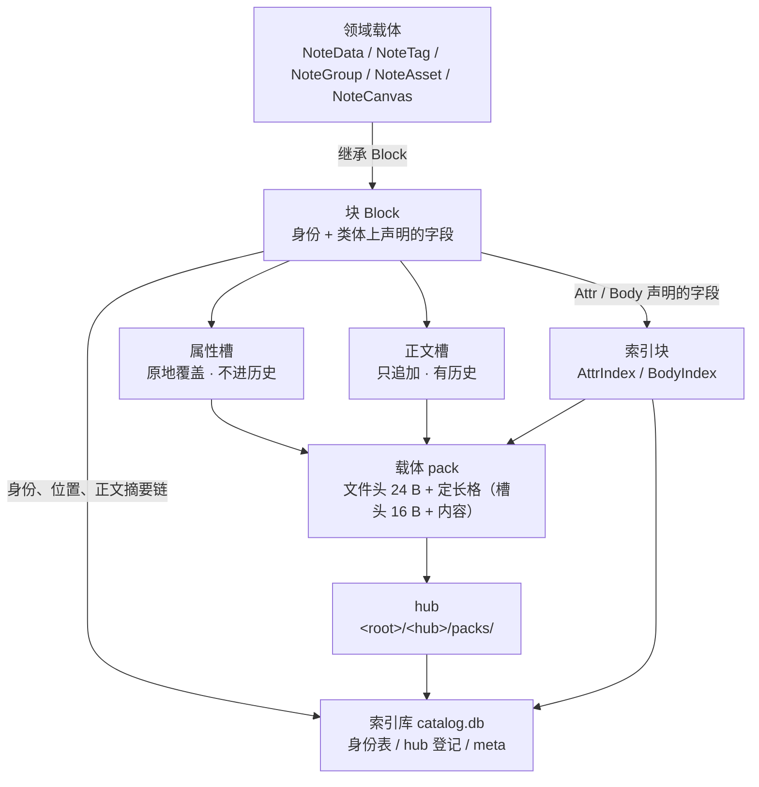
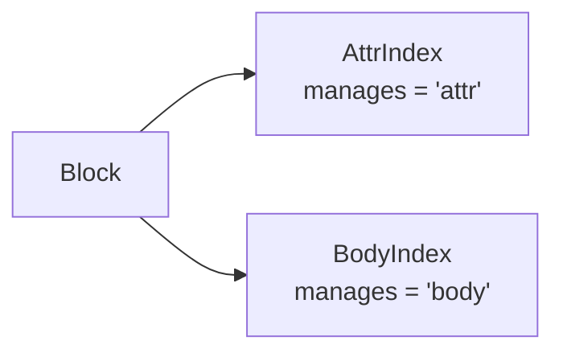

<!-- SPDX-FileCopyrightText: 2026 HanYang06 -->
<!-- SPDX-License-Identifier: Apache-2.0 -->

# L0 · 存储设计（Storage Design）

> Cairn 的最底层存储。本文是 **L0 存储的唯一事实来源**；旧篇 `storage.md` 已删除。
> 上层（领域模型、服务、界面）建立在本文之上。

> **状态：现状**（2026-10-02 落码）。本文描述的形态在 `py_src/core/storage/` 里逐条成立，
> 与代码一一对应；本文只写现行口径，落码之前的旧行为见 §12。
> 细判据见[块的组成与落点](py_core/storage/block-parts.md)，
> 逐字段的字节图见[载体的字节布局](py_core/storage/pack-format.md)。

口径与实现处如下：

| 篇中的东西 | 实现处 |
|---|---|
| 载体：文件头、槽头、两类槽、追加写、原地覆盖 | `py_src/core/storage/pack.py` |
| hub：挑活跃载体、封口换份 | `py_src/core/storage/hub.py` |
| 存储引擎：块 ↔ 槽 | `py_src/core/storage/engine.py` |
| 索引库与身份 | `py_src/core/storage/db/` |
| 两类索引块 | `py_src/core/storage/index/` |
| 字段落点声明 | `py_src/core/storage/types.py` |
| 存储那一层的配置声明 | `py_src/core/storage/conf.py` |
| 字节回收 | `py_src/core/storage/gc.py` |
| 内核装配与命令面 | `py_src/core/init.py`、`py_src/core/api.py` |

**未落地项**（§11 列全）：领域载荷的规范化字节层（`py_src/model/note/format/`）、
跨行事务、备份、拒开与迁移的显式入口。

权威顺序：`代码 > docs/architecture/<具体篇> > <总纲篇> > 记忆 / 其它`（[架构索引](index.md)）。

## 0. 一句话

**块继承 `Block`，字段在类体上声明落点；一个块占属性槽与正文槽；身份、位置与正文摘要链
只进索引库；索引块直接继承 `Block`，与任何块平级；字节由回收收敛。**

四层各管下一层，外加两处辅助：

| 层 | 管什么 | 实现处 |
|---|---|---|
| 载体 | 一个文件：文件头、槽头、两类槽、追加写 | `pack.py` |
| hub | 一个目录：挑活跃载体、封口换份 | `hub.py` |
| 存储引擎 | 块 ↔ 槽：分配、编码、落盘、读回 | `engine.py` |
| （辅助）数据库引擎 | 索引库：一个类型一张身份表、`hub` 登记、`meta` | `db/` |
| （辅助）索引 | 两类索引块：`AttrIndex`（属性）、`BodyIndex`（内容） | `index/` |

`gc.py` 与四层走**同一条路**（hub / pack / slot），只是换一套判据；它是引擎的另一种确定性形态，
入口是模块级的 `sweep(engine)`（§8.6）。

本文相对上一版的**决定性变动**（2026-10-02 存储裁定）：

1. **字段声明写在类体上**：`title: str = Attr("")`（可索引，进反表）、
   `lines: list[str] = Body([])`（进正文槽）、裸赋值（照样落盘，没有索引加持）。
   **没有 `indexed=` 这个开关**——用了 `Attr` 就是要索引。
2. **表名只由类名算出**（`type(self).__name__.lower()`）：没有 `__table__`，没有覆盖口子。
3. **没有表结构声明文件**：`config/tables.yaml` / `type.yml` 不再被读写。
   库的结构由"这个类型用没用 ID"决定。
4. **索引块与任何块同路**：`AttrIndex` / `BodyIndex` 直接继承 `Block`，各有自己的身份表。
5. **正表落在载体的槽上，反表在读的时候现算**：反表**不落盘**（§8.4）。
6. **索引库是权威视角**：装身份、位置与正文摘要链；载体只装属性值与正文分片，
   **载体上不写一个字节的身份**。
7. **删除 = 摘掉索引库那一行**；字节由回收收敛（`sweep`，§8.6）。
8. **内核不再有 `store` / `patrol` / `repair` / `compact` / `reindex` / `survey` / `locate`**：
   写由块自己发起（`block.save()`），命令面是读与诊断；回收是模块级的 `sweep(engine)`。

## 1. 词汇表

词的定义以本文与代码为准；简表另见[术语表](../reference/glossary.md)。

| 术语 | 含义 |
|---|---|
| **vault** | 库根目录；内含一个索引库与若干 hub 目录 |
| **hub** | `<root>/<hub>/packs/`，装若干载体；`packs/` 的存在即"这个目录算 hub"的判据 |
| **载体 Pack** | 一个追加写的文件；定长格；写满封口线即换新的一份 |
| **格 Slot** | 载体内的等长分配与定位单位；**一个槽占恰好一格** |
| **槽头 slot head** | 每格开头 16 字节：槽种类 1 ＋ crc32 校验和 4 ＋ 内容长度 4 ＋ 预留 7 |
| **属性槽** | 装一个块的全部属性；**可原地覆盖**，属性不进历史 |
| **正文槽** | 装正文分片；**只追加**，有历史 |
| **位置段** | `in_pack_slot`：覆盖该块**自己**占用**全部槽**的段列表。写侧的次序有语义——正文槽一段在前、属性槽一段在后；规范形（升序、不重叠、相邻合并、段数最少）用于回收收敛与诊断 |
| **正文摘要链** | `body_history`：一个世代一条**摘要**，**最新那一代就是当前用的那份正文的摘要**；正文的位置由正文索引的位置行给出 |
| **自带 / 引用** | 块的两个运行时状态：位置段里有 body 槽即**自带**（内容在本块），没有即**引用型**（拿摘要查正文索引定位） |
| **块 Block** | 存储单元的基座：拿到 ID 才有表、才能落盘与读回 |
| **ID** | 身份本身：`name` / `value_uuid` / `birth_time` ＋ 位置段（`db/id.py`）。**它跨 pack、跨 hub 成立**，而槽号只在 pack 内有意义 |
| **身份表** | 一个用了 ID 的类型在库里占的那张表；表名＝类型名，列恰好七列：六个身份字段 ＋ `body_history` |
| **索引库 Index** | `<root>/catalog.db`；装身份、位置与正文摘要链，加两类索引的入口；**它是权威视角** |

## 2. 分层与总体结构



**红线**：L0 不认识 `note` / `project` 这些词。存储只认 ID、字节与格；
领域语义只活在领域类与载荷里。

**两个引擎，分工不重叠**：

- **存储引擎**（`engine.py`）面向载体：管 hub、写字节、读字节，**不认识数据库**；
- **数据库引擎**（`db/engine.py`）面向索引库：管行、建表、按身份查位置，
  **不认识 slot / pack / hub**。

两者只经"身份"接头。

## 3. 字段的落点

字段进哪一边，由**类体上的声明**定（`storage/types.py`）。三条判据：

| 写法 | 落点 |
|---|---|
| `title: str = Attr("")` | 进**属性槽**，**并且进属性索引块**（能按它的值查回块） |
| `lines: list[str] = Body([])` | 进**正文槽**（按值判同，去重走 `BodyIndex`） |
| `self.title = ""`（裸赋值） | 照样进属性槽，**没有索引加持** |

```python
class Note(Block):
    title: str = Attr("")  # 声明在类体上
    lines: list[str] = Body([])


note.title = "标题"  # 实例里存的是裸值
assert note.title == "标题"  # 读出来也是裸值
```

三条语义，缺一条这套写法就不成立：

1. **类体上的声明就是声明**：它描述落点，不是"所有实例共用的一份值"；
2. **实例的值存在实例自己的 `__dict__` 里**：`note.lines.append(...)` 改的是这个实例的列表，
   既不污染类属性，也不串到别的实例（容器默认值在实例第一次取值时现拷一份）；
3. **声明活得比赋值更久**：`note.lines = [...]` 只换值，落点仍由类体上的声明说了算。

**`Attr` 与 `Body` 是描述符，不是类型判据**：类型只活在注解里（mypy 用），运行期不认注解。
`Attr` 只对标量有意义——容器不可哈希，按它查只能是"包含"式。

**声明必须放类体、不放 `__init__`**：放进构造里，那个实例字段的静态类型会变成声明类型，
此后 `note.title = "标题"` 与它不符。

**普通赋值照样落盘**：`_fields_of` 会并上实例多出来的公开字段（`_` 开头与 `id` 除外），
故"声明了却不索引"是个假问题——不要索引就不要声明。反过来，**没显式赋过值的声明字段也在
落盘之列**：声明一律取出（取值即触发描述符给出那份默认值），否则"带默认值就存"的字段会被整个漏掉。

## 4. 块与身份

### 4.1 基座：`Block`

```python
self.id = ID(self)  # 调用方签发身份
note = Note(self.id)  # 递给基座
note.title = "标题"
note.save()  # 引擎接手：分配、编码、落盘、回填位置段
```

**身份由调用方给**，只有两条路，都写在 `Block.__init__` 一处：

- `self.id = ID(self)` 自签，再 `super().__init__(self.id)` 递给基座；
- 或把签好的递进来（`Note(self.id)`）。

**零参构造也是一个块**：`Block.__init__(id=None)` 会自己现签一个（`ID(self)`）。
`AttrIndex()` / `BodyIndex()` 走的就是这条路——索引块自己签身份，于是它自然进库、有表。

**没有 ID 就没有一切**：不递 ID 的对象不入库、不建表、不产生任何关系。

`Block` 上的能力（`save` / `fetch` / `find` / `delete`）经模块级的一根线接到库上
（`bind(engine)`）：**一个进程接一个引擎**，绑了别的库即报错，`close()` 解开。
理由是引擎（哪个库根、哪个 hub）是**运行时**的事实，而类定义在 import 时就发生了。

### 4.2 表名

**表名只由类名算出**：`type(self).__name__.lower()`。`class NoteData` → `notedata`。

没有第二个口子：**不提供 `__table__` 一类覆盖**，也没有声明文件。
身份的名字（`ID.name`）与它同一个来源（`ID(self)` 解析持有者）。

领域专属的类型以**域名开头**（`NoteData` → `notedata`），故 `project` 那边可以做出
同名概念而互不相干，两张表不会撞。

### 4.3 `ID` 的字段

| 字段 | 何时定 | 之后 |
|---|---|---|
| `value_uuid` | **创建那一刻**（`uuid4()`） | 锁死（只读属性） |
| `birth_time` | **创建那一刻**（unix 纳秒） | 锁死（只读属性） |
| `name` | 由持有者解析出来那一刻 | 锁死 |
| `in_hub` / `in_hub_pack` / `in_pack_slot` | 写完由库记下 | **可改**——位置段记在库里，改一次写一次 |

库里另有**一列**不属于 `ID` 的字段，由身份自己带上：`body_history`（正文摘要链，§8.1）。

**"哪几格是属性槽"不是库的一列**（2026-10-02 修正裁定）：**槽号只在 pack 内有意义**，
而"越 pack（甚至越 hub）的关联只能用摘要，不能用槽号"。属性槽与正文槽靠**槽头种类**分辨
（`pack.ATTR_SLOT` / `pack.BODY_SLOT`），载体上每一格本来就写着。

**身份只有一条来源**：`value_uuid` 由签发分配，与内容无关。**摘要形态不属于身份**：
同内容判同由正文那一侧的摘要负责（摘要链 ＋ `BodyIndex` 的位置行），不由身份负责。

**`birth_time` 不等于任何"创建时间"**：它只等于这个 ID 被签发的时刻。
领域字段（如 `NoteData.created`）是另一回事，见 §6.4。

**位置段就是真源**：它记在库里，载体上没有任何一份字节承载它。
**改一次正文即改这一行**，加载时引擎把库里的值回填到调用方递进来的那个 ID 上（`engine._place`）。

**写侧的次序有语义**：`in_pack_slot` 的段按"正文槽在前、属性槽在后"两组铺开
（`ID.place` 收多组：组内相邻者并段、组与组之间不并），故归位成规范形这件事**不是写侧的摆放规则**——
它在回收收敛位置段与诊断时另调 `canonical_segments`。规范形（升序、不重叠、相邻合并、段数最少）
是"同一批槽只有一种写法"的保证，不是写入时的排序要求。

**身份字段不落载体**：载体上没有一个字节的身份，身份只进索引库那一行。

按身份读回只走库这一条路：行不在即报"对象不在"。旧口径（两套凭证并存、
`value_hash` 也进身份、`ID` 的落盘部分随载体字节走）已作废，清单见 §12。

### 4.4 不变量

1. **表名恒等于类名的小写形态**，一处算出，无第二来源。
2. **身份由 `value_uuid` 单独确定**：`name` 与 `birth_time` 是它的附属事实。
3. **库里有那一行才能读回**：行不在即报"对象不在"，没有顺扫这条退路。
4. **同一个块改了字段再存一次，容器身份不变**：属性进属性槽，正文进新槽，
   身份不随载荷而变。
5. **不认识的类型降级读回**：按表名找不到类时用通用块，属性照旧齐全，只是没有那个类的行为方法。

## 5. 载体与格

### 5.1 布局

```text
vault/
  catalog.db                 # 索引库（唯一）
  <hub>/
    packs/
      <随机名>               # 载体：文件头 24 B + 一串定长格；写满封口线即换份
```

文件名是随机串（无语义、无顺序号）；载体名是"在哪个文件"的答案，其真源是文件系统本身。

### 5.2 格与算术定位

模型只有一条：**载体是一串等大的格，每格即一个槽，槽从格边界起算**。

- 一个槽占**恰好一格**：槽头 16 字节 ＋ 内容（§5.4）；
  一个块的位置段给出它占用的**全部格号**；
- 字节地址**由算术得出**：`地址 = 24 + 格号 × 格长`（`slot.offset_of`）；
  **格号自文件头之后起算**，故文件头不必凑成整格。**格号到地址是常数时间**：
  给一个格号，地址当场算出，不查表、不扫目录、不读别的格；
- **定位没有第二套口径**：不存在"格内偏移"——槽的起点就在格边界上；
- **写入纪律**：写完一格，格内未用的部分补零，使下一格重新落在格边界；
  载体尾部若不是整格，一律拒写（那是残写或外来改动，不推断续写起点）；
- **代价明确**：一格的内容区为格长减 16 字节，装不满就空着。故**格长是"空间浪费"与
  "槽数量"之间的交换**——格小则每格浪费小、槽多；格大则相反。

**正文分片按逻辑顺序切片**，读回的顺序由库里的段列表给出，槽上不记片号。

`Slot` 是"读出的一格"：**它只持有槽种类与内容，不带可变状态**——任何缓存在它上面的状态
都会与文件分叉，而且不报错——只是读出来不对。故定位与读写一律现走 `Pack`。

### 5.3 载体文件头

文件开头是定长的载体文件头（24 字节：魔数 8 ＋ 格长 8 ＋ 预留 8）：

| 字段 | 作用 |
|---|---|
| 魔数 | `CairnPk2`（末位是布局版本号）；不符即报错，不作推断，也不当作"此处没有载体" |
| 格长 | 该载体的格长；**故载体自描述**，仅凭该文件即可算地址 |
| 预留 | 置零（读取时不校验它的内容），留给将来加字段 |

格长随载体走（而非全局唯一）：不同批次的载体可以不同格长，而每个载体自身仍可精确算术定位。
**写入时定、读取时从文件头读**——改一次配置不会让已落盘的载体错位。

### 5.4 槽头

槽头的字节布局（长度均指字节）：

```text
+-------------+--------------+------------------+----------+----------------+
| 槽种类 (1)   | crc32 (4)    | 内容长度 (4)      | 预留 (7)  | 内容 (余下)     |
+-------------+--------------+------------------+----------+----------------+
```

| 字段 | 作用 |
|---|---|
| 槽种类 | 区分属性槽与正文槽 |
| 校验和 | `crc32`，校验这一格 |
| 内容长度 | 内容的实际字节数，故一格的可用内容为格长减 16 字节 |
| 预留 | 7 字节，约 50% 的余量 |

四条约定：

1. **槽头定长 16 字节**（必需项 9 ＋ 预留 7）：必需项是槽种类、校验和、内容长度；
   预留那 7 字节**如实写零**，写零才有"这一段还没用"的读法；
2. **校验和不承担内容寻址**：内容判同由 `BodyIndex` 负责，两件事不该由一处兼职；
   校验和不符即报错，不把错的内容当成对的交出去；
3. **载体上不写身份**：槽上不记世代号、不记片号、不记归属；身份的字段只进索引库；
4. **槽头在内容之前**，故内容区自格边界之后第 16 字节起算。没写过的格读出槽种类 0 与空内容，
   不算错——那是"这一格还空着"。

**长度与字段定义以[载体的字节布局](py_core/storage/pack-format.md) 为准。**

### 5.5 封口与活跃载体

- **封口是策略，不是状态**：文件里不留任何封印标记——"已封口"就是"这个载体达到了封口线"。
  故改封口线不会出现"标记与事实不符"；
- **判据是"剩下的地方装不下下一格"**（`Pack.sealed`），不是"长度达到了封口线"：
  一个槽占一格，故还剩格子就不该封；
- **活跃载体＝有空间的最满者**（`Hub.active`）；一份都没有就是 `None`，写入时新开一份。
  这个判据不依赖时间戳，也不依赖载体名的顺序（名字是随机的）；
- **先判再写**：`Hub.append` 先看活跃载体是否封口，封了就当场另开一份，
  不把这个槽塞进那份满载的。

### 5.6 配置参数

存储那一层的键在 `core/storage/conf.py` 声明，内核自身那条在 `core/params.py`。
取值与落盘口径见[配置引擎](py_core/config.md)与[配置项参考](../reference/config.md)。

| 键 | 开箱值 | 含义 | 现状 |
|---|---|---|---|
| `slot.max.byte.b` | 512 | **格长档位**：每单位 1 字节 | 已实现 |
| `slot.max.byte.kb` | 0 | **格长档位**：每单位 1024 字节 | 已实现 |
| `pack.max.byte` | 2 GiB | **封口线**：单个载体写满这个数即换新的一份 | 已实现 |
| `hub.default` | `main` | **默认 hub 名**：写入不点名就进这一个 | 已实现 |
| `index.max.byte` | 64 MiB | **一个索引块的上限**：写到这个数由引擎自动续下一块 | 已实现 |
| `body.history.depth` | 1 | **正文保留世代数**（数的是总共几代，当前世代占其中一代） | 已实现 |
| `gc.auto.byte` | 0 | **自动回收的阈值**（字节）；`0` 即不自动回收 | 已实现（判据函数与阈值都在，自动那一头未接线，见 §8.6） |
| `core.log.level` | `WARNING` | 内核日志级别（内核自身的键，不属存储那一层） | 已实现 |

四条约定：

1. **两档相加，不写即零，全不写即错**：相加是为了用整数精确表示——只给一个"带小数的兆"
   就得碰浮点，而格长是**格式事实**，浮点误差会直接错位到偏移算术里。
   **兆 / 吉 / 太三档清掉**；
2. **格长写在载体文件头，读侧一律以文件头为准**，不看配置；配置只决定新建载体时写什么；
3. **其余各键是策略，不是格式事实**：它们只决定"什么时候换文件 / 换块 / 回收"，
   改大改小都不会让已落盘的字节错位。故它们读的是当前值，不缓存；
   策略值在装配时定下：`Engine` 构造一次读一次配置面；
4. **格式常量（魔数、文件头长度、槽头布局）故意不进配置**：它们留在实现处
   （`pack.py` 的 `MAGIC` / `HEADER_SIZE`）。

## 6. 存储引擎

### 6.1 一个块占属性槽与正文槽

```python
identity = block.id
fields = _fields_of(block)  # 声明字段 + 实例上多出来的
attrs = encode_attrs(_attrs_of(block, fields))  # 属性：一个块的全部属性
attr_slot = target_hub.append(ATTR_SLOT, attrs)  # 属性槽，可原地覆盖
body_slot = target_hub.append(BODY_SLOT, fragment)  # 正文槽，只追加
in_pack_slot = segments_of(attr_slot, body_slot)  # 段列表：覆盖全部槽
index.put(identity.name, identity_row(identity, in_pack_slot, history))  # 库是真源
```

- **属性槽**：一个块的全部属性默认装进**一格**；装不下即占**多格**（多属性槽），
  可**原地覆盖**，属性不进历史。格数够就原地覆盖，非到格数都不够才另占几格；
- **正文槽**：装 `Body` 字段的正文分片，**只追加**；
- **位置段一次写全**：`in_pack_slot` 覆盖该块**自己**占用的全部槽，改一次写一次；
  **写侧的次序是"正文槽一段在前、属性槽一段在后"**，而**哪一格是属性、哪一格是正文
  由槽头种类回答**（§8.1）。**引用别处的正文时，那几格不在本块的位置段里**——
  它们在别人的 pack 里，位置记在正文索引的位置行上。

**内容按逻辑顺序分片**：分片的顺序由库里那一行的段列表给出，槽上不记片号。
故一份正文挂在两个不同名字的字段上，仍然只算一份内容——内容的判同取自值，字段名只是装载方式；
`_body_of` 按落点取出正文那几个字段的值，依字段次序排。

**属性槽自足**：每个属性落成 `{"v": 值}`，正文字段再加一个 `"body": true` 标记。
落点必须与值一起存下来——赋值一步就会覆盖 `Body(...)` 的声明，
不分清就不知道回读时该往哪几个字段填正文槽里的值。

**规范化编码是必须的**：属性与正文都用 canonical CBOR 编（`cbor2` 保证映射键按长度与
字节序排），否则同一份内容会算出不同字节，判同与去重一起失效。

### 6.2 槽内容的编码

**槽头自己带着槽种类，故载荷里不需要一套命名空间**：从前要靠保留键分辨
"这一条是属性还是正文"，而两种内容混在同一条追加流里；现在判别落在载体上
（属性槽 / 正文槽，§5.4），载荷只装它自己那点东西。

| 内容 | 编码 | 形状 |
|---|---|---|
| 属性槽 | `encode_attrs` | 映射：字段名 → `{"v": 值}`，正文字段只留 `{"body": true}` 一个标记 |
| 正文槽 | `encode_attrs` | 映射：`{"cairn.body": [正文那几个字段的值，按字段次序]}`，再按格长切片 |
| 索引正表行 | `encode_index_row` | 映射：`field` / `issuer` / `value_uuid` / `value` / `hub` / `pack` / `slots`，外加模式标记 `cairn.index.row` |

**索引行与属性映射靠内容区分**：两者都是 CBOR 映射，故正表行的映射里带一个模式标记
（`INDEX_ROW_SCHEMA = "cairn.index.row"`）；它带 `cairn.` 前缀与一个点，业务字段名不可能等于它。
属性里那个 `"body": true` 标记与小写 `"v"` 键同理：赋值一步就覆盖了 `Body(...)` 的声明，
落点必须与值一起存下来。

**块名不写进载荷**：写进去会让"同一份属性"因类名不同而算出两段字节，判同被类名切碎。
块的类型由调用它的那个类给出（`type(self).__name__.lower()`）。

### 6.3 读回

`Engine.load(identity, owner=...)`：按身份查库那一行 → 取段列表与正文摘要链 → 读属性槽 →
**本块位置段里有没有 body 槽**（槽头判种类）：有即读本块的正文槽，没有即拿最新那一代摘要
查 `BodyIndex` 的位置行再读 → 造对象 → 填字段。

**库里没有这一行即报"对象不在"**：不再核对身份、不再回退顺扫。
索引库是权威视角，读路径**不建东西**——库不在、hub 不在、载体不在都各自报错，
不悄悄补一个空的顶上。

**`owner` 由调用方给**（`NoteData.fetch()` 就是 `NoteData`）：名字相同的类型满仓都是
（两个文件各有一个 `NoteData`），按表名去猜会挑错那一个。不给才按表名找注册过的类；
都找不到就用一个通用块——那是"不认识的类型降级读回"那条路。

**取回来的字段是裸值**：声明 `Attr("标题")` 的字段，`block.title` 是 `"标题"` 而不是声明对象。

**当前世代由位置段给出**：库里那一行同时记着全部世代，读回哪一代由位置段说了算；
"盘上最后写的那一条"这条旧口径已作废。

### 6.4 领域字段与身份字段的分工

`NoteData` 上的 `created` / `updated` 是**字段值**，只在块**自签身份**那一刻盖上
（零参构造算自签）。身份由调用方递进来时一律照用，不覆盖读回来的值。

**`birth_time` 顶不了这个位置**：它等于这个 ID 被签发的时刻，与正文改了几次无关，
故当不了"创建时间"，也不随保存而变。

### 6.5 删除即摘行

**删除 = 摘掉索引库那一行**，不再往载体追加任何标记。

- 库里那一行是给"按身份问路"用的：留着它就会把已删的块又读回来，故摘掉；
- **载体上不留标记**：槽上不记归属，删后的载体字节不再属于任何块；
- 摘行之后**取不回该块的格号**：一个槽属于谁由库里那一行的位置段给出，
  行一摘，那些槽就只是空着的字节。

两个后果必须写清：

1. **回收不再能只看载体**：载体上没有一处字节说明"这些槽还算数"，
   故**回收按库收活槽**（§8.6）；
2. **槽复用的前提**：一个槽被新块占用之前，索引库中不得有任何一行、索引中不得有任何一条
   正表行指着它；违反即读到其他块的数据，且不报错。**正文槽上这条前提被放宽**：
   去重本身就是让两个块指着同一格正文槽（§8.4），故"指着它的行数大于一"正是它活着的理由。

删除是**语义上不再存在**，不是字节消失；真正抹掉字节要走一趟回收（§8.6）。
**删除本身不回收空间**：只摘掉一行，故"删了很多"之后载体文件不会变小，
直到有人发起 `sweep`。

### 6.6 正文槽的世代

- **改一段正文不原地改**：新建一组槽装新的正文，新那份的**摘要前插**进摘要链。
  正文按**整份内容的摘要**判同：命中 `BodyIndex` 的位置行即**不写 body 槽**（引用型），
  正文的位置由那一行给出（§8.4）；
- **摘要链记在索引库**：`body_history` 那一列，一个世代一条摘要，**按新到旧排列**；
  **最新那一代就是当前用的那份正文的摘要**——它既是"正文是哪一份"的答案，
  也是引用型块读正文时的**关联凭证**。**位置段不再为它出力**：正文可能在本块，
  也可能在别的 pack、别的 hub；
- **块的两个运行时状态**（不落成库的列、不落成额外的槽；载入时由库行与槽头推出来）：
  `_inline_body` 为假即正文在**本块**、`_body_hash` 是这份正文自己的摘要；
  为真即本块没有正文内容、`_body_hash` 是**关联凭证**；
- **保留世代数取配置** `body.history.depth`，不得写成常数；`depth` 数的是**总共保留几代**
  （最新那一代即当前用的那份），故开箱值 1 只留一条；
- **只有正文确实换了内容才动链**：同一份正文再存一次不产生新槽，也不多记一代；
- **写序定死**：新槽落定并通过校验之前，位置段与摘要链不得指过去；
  旧世代在新槽落定并通过校验之前不得被回收；
- 属性不参与历史：属性槽原地覆盖，改一次不记一代。

### 6.7 写路径的事件

落盘之后发 `object.put`（`data` 带表名与位置段）、摘掉之后发 `object.deleted`。
总线是可选的：**不给就没人在听，写照样成立**——通知不该成为写成功的前提。
事件目录当前只有这两条（`core/event/catalog.py`）。

## 7. hub

- hub 是库根下的一个目录，内含 `packs/`；
- **判据是形状，不是"是个目录"**：带 `packs/` 的直接子目录才算 hub。
  库根下还会有别的东西，见目录就当 hub 会把它们卷进来；
- **读路径不建 hub**：目录不在即报错，绝不悄悄建一个空的顶上——那会把"数据没了"
  伪装成"这里本来就是空的"。建立是显式动作（`Hub.create`，幂等）；
- **hub 名就是目录名**，也是身份里 `in_hub` 那一项。**hub 不持有 ID**：
  它是容器，它的标识就是它的名字；
- **hub 无状态、无自己的配置**：格长随载体走（写在文件头里），封口线是每次写入按当前值判的策略。
  故这一层挪到哪儿都成立，它不需要索引库也知道自己在哪儿；
- **它自己一行字节都不写**：写是 `Pack` 的事，hub 只把请求转过去。
  判据很直白：整个存储里只有 `pack.py` 以写方式打开载体文件；
- **`packs/` 里混着不是载体的东西即报错**（临时文件、人手工放的说明、子目录都算）：
  判据是**文件头认不认得出这是载体**，不是"它是不是一个文件"。跳过是巡检的策略，
  不是这一层的——这一层看见了就说；
- **多 hub 对上层只是一次分组**：引擎只需回答"这个身份在哪个 hub"。

## 8. 索引库与索引

### 8.1 库的结构只有一条来路：ID

**用了 ID，库里就产生一张真正意义上的身份表；不用 ID，那张表自然不产生。**

库的形状定死了，就三样：

| 库里的东西 | 来路 |
|---|---|
| 每个用 ID 的类型一张**身份表**（`notedata` / `attrindex` / `notegroup` …） | 表名 = 类型名；列恰好七列：`name` / `value_uuid` / `birth_time` / `in_hub` / `in_hub_pack` / `in_pack_slot` / `body_history` |
| `hub` 登记 | 目录是事实，登记是库的一列 |
| `meta` | 库自用（记录本库属于本设计） |

**列比 `ID` 的字段多一列**：身份字段有几个就有几列，**另加 `body_history`**——
它是库的事实，而 `ID` 的字段里没有它。列清单由 `db/engine.py` 的 `columns_of()` 现算
（`*ID_FIELDS, BODY_HISTORY_FIELD`），**恰好七列**，没有第二份列清单。

**"哪几格是属性槽"不进库**（2026-10-02 修正裁定）：它曾经单列一列
（`attr_in_pack_slot`），而那错在**用 pack 内坐标表达跨 pack 的事**——
槽号只在 pack 内有意义，一个块引用的正文可能在别的 pack、甚至别的 hub，
故"越 pack 的关联只能用摘要，不能用槽号"。属性槽与正文槽的区别落在**槽头上**
（`pack.ATTR_SLOT` / `pack.BODY_SLOT`，§5.4），载体上每一格本来就写着；
读一个块时按需读槽头分拣，**切分在任何时候都成立**——包括回收搬动、重新编号之后。

**列类型一律按文本落**：`value_uuid`、名字、hub 名、载体名本来就是字符串；
`birth_time` 是整数，但落成文本不影响"按值相等"的查询。
位置段的文本编码是 `pack_segments_ordered`（单格一个数、连续一段写 `起-止`，次序照原样），
解析用 `parse_segments`；`body_history` 另用一层 **JSON 数组**
（一个世代一条摘要，按新到旧），因为摘要本身就是十六进制 ASCII，故这一列是可抄可读的纯文本。
两层都归 `db/id.py`。

**锚定是"用没用 ID"，不是"是不是 Block"**：`Block` 只是契约。
故 `NoteData` 继承了它、又用了 ID，库里就有一张 `notedata` 表；`attrindex` 与它完全同路。

**载荷不进库**：正文、属性值都在载体的槽里。库只回答三件事——
"这个身份在哪儿"、"它的正文是哪一份、经过哪几代"，以及由索引块提供的"按这个值能查到谁"。

**库是权威视角，没有从载体重算这条路径**：库丢了即身份、位置与正文摘要链丢失，
载体上没有一个字节能把它们算回来。打开时直接读现成的库，不做全库顺扫；
当前也没有缓存层——每一跳都现查库、现读槽。

**不再有表结构声明文件**：表由"类型用了 ID"这件事诞生，不由文件声明。
`config/tables.yaml` 与 `type.yml` 一类文件**不再被读写**。

### 8.2 拒开与迁移

- **库不在或结构不符即拒开**：报错，不建库、不补行、不猜结构。
  判据是显式错误（`IndexNotFoundError` / `IndexSchemaError`），不是静默兜底；
- **老载体同样拒开**：魔数不是 `CairnPk2` 即报错，不推断、也不当作"此处没有载体"；
- **迁移只随版本更新提供**：非版本更新期间自行改动造成的损坏，由使用者负责。
  不写兼容代码：兼容分支会让两套口径长期并存；
- **顺扫仍在，但它只服务诊断**：`Engine.scan()` 交出逐个格解析的结果，
  读侧的一切定位都不再经过它。**精确的块数由库给出**——库是权威视角（§8.1）。

**没有从载体重算这条路径**：没有"清空重扫、把库补齐"这条动作，也没有谁在回收时顺带扶正索引库。
库缺失即数据缺失，报"对象不在"。

### 8.3 两类索引块



两个索引**直接继承 `Block`**，彼此平级，也与任何块同路：它们有 ID，
因此自己就落进库里那张身份表——"索引一多，查它的时候得知道它搁哪儿"靠的就是这一条。

**继承关系没有第二条要记**；共用逻辑放在 `index/index.py` 的模块级函数上，
不放一个中间基类——那会多出一层"只为放代码而存在"的继承。

每个索引块自己只声明一样：

| 声明 | 含义 |
|---|---|
| `manages` | 它管哪一类落点（`'attr'` / `'body'`）；引擎按它决定哪些列进这一类索引 |

**正表那一行长什么样由引擎写**（`Engine.lay_index_row`），分两路：

| 索引 | 行里那几项 |
|---|---|
| 属性索引 | `field` / `value_uuid` / `value` / `hub` / `pack` / `segments` —— 答"这个块的这一列等于这个值"，故要能顺 `value_uuid` 回到那个块 |
| 正文索引 | `field` / `value` / `hub` / `pack` / `segments` —— 答"**这份正文在哪**"，**不记哪个块拥有它** |

故"哪个字段该不该索引"在引擎里没有一行判断——声明成 `Attr` / `Body` 就进，
哪一类索引接哪一列由索引块自己的 `manages` 定。`Block` 上还有一个 `holds` 类方法
（默认交空映射），当前没有调用点。

**身份按块的标准用法来**：

```python
class AttrIndex(Block):
    def __init__(self, id: ID | None = None) -> None:
        self.id = ID(self) if id is None else id
        super().__init__(self.id)
```

**这两行是必然条件**：没有它，"有 ID 才有表"这条就落不下来，索引块也不会进库——
那就会出现"查索引时不知道它搁哪儿"。引擎只在需要时**造一个空索引块**（`AttrIndex()`），
用它的身份去落盘与登记。

**两个索引块是增强件**：它们不新增功能，只把"每次扫全库"换成"查一张表"；

| 索引块 | 用途 | 缺位后果 |
|---|---|---|
| `AttrIndex` | 按属性值查回块 | 丧失按属性查 |
| `BodyIndex` | 按正文摘要查回**它的位置**（跨 pack / hub 的坐标） | 丧失按正文查，写入去重退化为"每次都写新槽" |

**缺位即退化为写新槽，数据不丢**：去掉 `BodyIndex`，写入去重不命中即每次写新槽，
按正文反查也查不到（§8.4）。索引块写满的判据取配置 `index.max.byte`，
块自己可以用类体上的 `max_bytes` 覆盖它（`index/index.py` 的 `_active_index`）。

**索引类型的发现靠 `manages`，不靠继承**：`index.owners()` 的判据是
"它声明了自己管哪一类字段"。按继承找会一个都找不到（两个索引直接继承 `Block`），
而且整条索引链会**静默失效**——表不建、行不写，只是查不到。
为此 `owners()` 用了一次运行期导入，理由写在那个函数的 docstring 里。

### 8.4 正表与反表

| | 是什么 | 谁持有 |
|---|---|---|
| **正表** | 某个块的某一列等于某个值（一行） | **索引块的载荷**（存下来） |
| **反表** | 值 → 哪些块 | **现算**，不存 |

**为什么不把反表存下来**：存下来的反表要在写路径上增量维护，而对不上的时候**不报错**，
只是查不到。由正表翻过来的反表每次都是同一个答案——确定、稳定。

一条正表行**一个槽**，编成映射
`{COLUMN_KEY: 列名, "value_uuid", "value", "hub", "pack", "segments"}`
（**正文那一行不带 `value_uuid`**），外加模式标记 `cairn.index.row`（§6.2）：
`value` 带类型名（判据用，免得 `1` 与 `True` 相撞），`segments` 是那一列值所在的格。
故写路径只有追加、没有改动——不会出"改漏一处"的事故。

**多块合并**：同一类索引可以有好几块（上个满了就开了下一个），并起来才是完整的正表
（`Engine.read_index_rows`）。同一个块同一列若被写过多次，**每一条都留着**：
反表是"值 → 哪些块"，块的身份与那一次写入的值都不同，故两行都得算数；
去重按（列，值，块身份）三样来。**已删块的行会被滤掉**：库里已经没有那一行，
它查不回任何东西，故不算进反表。**正文索引那一行不带块的凭证**，故它不参与这一层过滤——
那份正文还在不在，由摘要链与 `gc` 判活。

**去重只针对 `Body` 的内容**，走 `BodyIndex`：
`Attr`、裸赋值与资产类二进制（如视频）不作去重。写入去重走 `BodyIndex`——
按正文摘要命中即**不写 body 槽**、本块只占属性槽（引用型），不另设去重机制，不扫全库。

**命中之后正文仍在原来那一份上**：位置行记的是**跨 pack / hub 的坐标**（hub 名 ＋
载体名 ＋ 段列表），故**跨 hub 的复用就是直接引用**，不再"照原样在目标 hub 里写一份"——
一个块的全部槽因此**不必**落在同一个 hub；同内容在盘上只有一份（2026-10-02 修正裁定）。

**"谁在用它"由摘要链现算**：位置行不记"哪个块拥有它"——那一块被删了，
还在引用这份正文的块就断了。故"还有几个块在要这份正文"由扫描各块的 `body_history`
现算（`IndexEngine.holders`），**不落盘**。

用法（都在 `IndexEngine` 上）：

| 方法 | 做什么 |
|---|---|
| `records` | 翻出一类索引的**全部正表行**（多块合并） |
| `search` | 按（列，值）翻出**行**（属性那一路的块身份在行里，正文那一路给的是位置） |
| `holders` | **谁在要这份正文**：扫各块的摘要链现算 |
| `count` | 数一数某个值被几条正表行指着（**属性索引**那一路的口径） |
| `field_names` | 这类索引里有哪些列可查 |

**正表行落在载体的槽上，写它的是引擎**（`Engine.lay_index_row`，满了自动续下一块）；
反表在读的时候由 `records` 现算，不落盘。

### 8.5 两处辅助的边界

- **数据库引擎不知道 slot / pack / hub**：它只回答"这个身份在哪儿"；
- **索引块不知道内容语义**：它拿到的每一行都是"某个块在某个索引里的一行"；
- **引擎不为"哪个字段该不该索引"写一行判断**：哪些字段进哪一类索引，
  由索引块自己声明的 `manages` 决定（`holds` 类方法当前没有调用点）。

### 8.6 字节回收

入口是 `core/storage/gc.py` 的 **`sweep(engine)`**，返回一份 `SweepReport`
（前后两套数字：载体份数、槽数、总字节数，外加 `reclaimed` 与 `cancelled`）。
它**不在命令面上、也不在 `Kernel` 上**：回收是整库动作，由调用方显式发起。

**它是引擎的另一种确定性形态**：走同一条 slot / pack / hub 的路，换一套判据——
写入按"写进来就落"，回收按"库里的行指着谁"。故它不新开一套机制：
读用 `pack.scan`，写用 `pack.write_at`（照算好的位置落活槽），位置段照引擎那一套写。

**回收按库收活槽**，不按载体上的标记收。活口清单（`gc._live_slots`）收两样：

| 槽 | 活着的意思 |
|---|---|
| 属性槽 | 库里有一行，且那一行的位置段指着它 |
| 正文槽（自带） | 库里有一行，且那一行的位置段里有 body 槽 |
| 正文槽（引用） | **某个块的摘要链引用到那份正文**：按那一代摘要去正文索引的位置行上取坐标，那几个格算活口 |
| 正文索引的位置行 | 行自己占的槽照旧活着（它是索引块的槽）；行本身在"还有没有摘要链指着这份正文"时留着 |
| 索引块的槽 | 与任何块同路：索引块自己在库里也有行，指着它的槽即活口 |

**活口有第二个来源**（2026-10-02 修正裁定）：**被摘要链引用到的正文位置**。
理由与"位置行不挂在块身上"是同一件事——某一块被删时，正文索引行与正文槽**留着**，
由回收按"还有没有 `body_history` 引用它"判活；**没人要了才摘掉那一行**（连同它的正文槽）。
位置行是推导出来的坐标，不是内容本身，故摘它不丢数据。

六条口径：

1. **活口有两个来源**：库里那些行的位置段，以及**各块摘要链引用到的正文位置**。
   载体上没有一处字节说明"这些槽还算数"，故回收不能只扫载体；
2. **开头只扫一遍**：全库的行与全部槽一次收下来，此后的判活、重写、报数字都读这一份抄本。
   分散去扫会出现"两处判得不一样"，而这种不一致不报错，只是多删或少删几格；
3. **保护旧世代**：新槽落定并通过校验之前，旧世代不得被回收（§6.6）；
   这一条是写序与回收共同遵守的边界。摘要链里保留范围之内的那几代都算活口；
4. **挑载体由回收自己办**：它写的是**新的一份**（`Hub.new_pack`），不参与 `hub.active` 的挑选——
   若交给 hub 去挑，它会挑中那些还没清干净的旧载体，把新槽又写回待回收的文件里。
   **没有死槽的载体原地不动**，否则每一趟回收都要把整库抄一遍；
5. **崩在半路不坏库**：新字节全部落盘并核验之后才删旧载体，故最坏的情形是"新旧两份并存、
   白占一份空间"，而两份内容逐字相同——库里的行指着新的那一份，读哪一份都是同一个答案。
   下一趟回收把没有行指着的那些槽收掉；
6. **零散段按分组收敛**：搬动之后位置段照写侧的约定重铺（`gc._rehome` 的
   `_merge_groups`）：组内相邻者并成一段，**组与组之间不并**，故归完之后仍是
   "正文槽一段、属性槽一段"；**正文索引的行则照新坐标改写**（`gc._rehome_body`）——
   行不搬，只换它答的坐标，故索引块的槽一个都不多。零散的单格因此收敛掉，
   但两段相邻时不会并成一段。

**两个触发点**：**手动回收**与**自动回收**（达到配置 `gc.auto.byte` 即触发；
该键为 `0` 即不自动回收）。手动那一头是模块级的 `sweep(engine)`；自动那一头的**判据函数**
是 `reclaimable_bytes(engine)`（死槽字节数，与 `sweep` 同一套判据），但它**没有接线到后台**：
没有谁定期问它，也没有谁在阈值到了之后发起回收（§11）。

**可叫停**：`should_stop` 在每个 hub 开始之前问一次，返回真即停下，
**已处理的那几个 hub 保持不变**；`on_progress` 每处理完一个 hub 报一次进度。

## 9. 内核装配与命令面

### 9.1 `Kernel`

`core/init.py` 的 `Kernel` **只做四件事**：

1. **路径约定**：库根之下哪儿是索引库（`catalog.db`）、哪儿是载体（`<hub>/packs/`）。
   这两条只在 `core/storage/` 里各写一次，本模块不抄第二份；
2. **把能力接上**：`bind(engine)` 之后 `Block.save()` 才有地方落盘。
   **一个进程一根线**，故 `close()` 把它解开；
3. **把事件接上日志**：造一份 `EventLog`（§9.3）——订阅目录里全部事件，按分流表走
   诊断 / 落盘 / 反馈。**订阅只在这一处发生**；落盘与否只看调用方给没给落点；
4. **把失败接上**：事件总线的失败钩子接日志——通知层出岔子不该影响写路径。

两个入口：`Kernel.create(root)` 建库（**建的是目录，不是索引库**——索引库由引擎在第一次
真正要用它时开出来）、`Kernel.open(root)` 开既有库（库根不在即报错）；
两者都可选给 `event_log=`（事件日志的落点）与 `logger=`。

属性只有 `root` / `catalog_path` / `engine` / `bus` / `event_log`（另有 `logger`）。

**没有 `store` / `load` / `patrol` / `repair` / `reindex` / `survey` / `compact` / `locate`
这些方法**：写由块自己发起（`block.save()`），读由块自己发起（`Note.fetch(identity)`），
整库的诊断走命令面，回收走 `gc.sweep`。

### 9.2 命令面

`core/api.py` 的 `Api` 是**读与诊断**，方法表只有七个：

| 方法 | 参数 | 交出什么 |
|---|---|---|
| `tables` | — | 身份表名（不含 `hub` / `meta`） |
| `hubs` | — | 已登记的 hub 名 |
| `rows` | `table` | 某张身份表的行（身份、位置段、正文摘要链） |
| `locate` | `uuid` | 这个身份在哪张表、哪个 hub / 载体 / 段列表；没有即 `None` |
| `record` | `uuid` | 该块**各槽的原文**（base64）：槽号、槽种类、长度、内容，外带身份、段列表与历史 |
| `stats` | — | 整库计数：槽总数 / 属性槽 / 正文槽 / 空槽 / 身份行数 / hub 数 |
| `delete` | `uuid` | 是否确实摘掉了一个 |

**结果必须落在 JSON 域里**，故这一面只交出四样东西——身份、位置、计数、槽的原文（base64）。
它**不解领域载荷**：把载荷解成领域结构是领域格式层（`model/note/format/`）的活，
尚未落地，这里就不假装解得出。

**命令面里没有 `store`**：写由领域块自己发起，不能因为命令面里放一个 `store` 就绕过领域——
那样"谁决定落点"这条就断了。删除是例外：它是整库动作，落在这里。
**回收与索引查询也不在命令面上**：`gc.sweep`、`gc.reclaimable_bytes` 与
`IndexEngine.search` 目前只有库级入口（§11）。

### 9.3 事件日志

`core/event/logs.py` 的 `EventLog` 是**订阅事件的唯一一处**：装配时订阅 `catalog.ALL`，
按分流表 `ROUTES`（事件类型 → 级别 ＋ 去向）把每条事件送到三路：

| 去向 | 是什么 | 开关 |
|---|---|---|
| 诊断 | 折成一行交给记录器 `cairn.events` | 分流表给级别，`core.log.level` 说不说话 |
| 落盘 | 折成一行 JSON（JSON Lines）追加到文件 | **调用方给了落点才开；不给不建文件** |
| 反馈 | 推给注册进来的回调（边车的通知帧接这一路） | 注册即生效，撤掉即止 |

四条判据：

1. **分流表与事件目录同源**：`ROUTES` 的键集等于 `catalog.ALL`，由用例拦下；
   加了事件而漏登记，属"记漏了却不报错"那一类故障；
2. **日志层绝不回流**：它的任何失败只写诊断，不抛回发布者，**也不发事件**（否则自激）；
3. **去向次序定死**：诊断 → 落盘 → 反馈，不靠 `set` 的迭代序；
4. **同步写、一行一条、不轮转**：事件在写路径里同步触发，故落盘也同步；
   轮转与上限尚无调用方，不预埋。

**事件日志不是存储**：它是一份追加写的文本文件，不进载体、不建表、不占任何 ID，
故"事件不进存储"这一条仍然成立（见 `core/event/events.py`）。
机制层的事实（库在哪一刻被改成什么）记在这里；**业务语义**（谁把哪条数据改成什么）
是领域活动日志，属领域层，两者分属两层、不互相替代。

行缓冲是刻意的（一行写完即 flush，不做 `fsync`）：日志的价值在"事后还能读到"，
而每条事件一次同步落盘会把写路径拖慢。

## 10. 横向规约

### 10.1 版本不属于存储

存储只管 ID、地址与字节。**正文世代的机械记法在存储**（§6.6）；业务语义上的历史、回放、
变更描述是领域策略，**不进存储**——存储不因此新增表、列或机制。

### 10.2 物理地址是库里的真源

- **位置（`in_hub` / `in_hub_pack` / `in_pack_slot`）只写在库里**：
  载体上没有一个字节承载它，座位属于谁由库里那一行的段列表给出；
- **位置段覆盖该块自己占用的全部槽**，形状是段列表；改一次正文即改这一行；
  **"哪几格是属性"由槽头回答**（§8.1），不是库里的列；
- **载体的名字在库里只有一处**：那是**这个块自己的槽**所在的那一份；
  **引用别处的正文不在这条里**——它的坐标记在正文索引的位置行上（hub 名与载体名各一处），
  跨 hub 直接引用，不复制一份（§8.4）；
- **库是位置的唯一来源**：库里没有那一行即"对象不在"，没有顺扫这条退路（§6.3）；
- **载体侧的地址只有槽号**：地址由 `24 + 格号 × 格长` 当场算出，
  槽头只描述本格，不构成第二套定位。

### 10.3 失败处理

失败必须显式抛出，不得把落盘失败读成成功。存储不得吞掉机制性错误。
读路径**不建东西**：载体不在、hub 不在、库不在都各自报错，不悄悄补一个空的顶上。

异常按层分族（`core/exc.py`）：

| 族 | 基类 | 成员 |
|---|---|---|
| 标识 | `CairnError` ＋ `ValueError` | `InvalidIdError` |
| 存储 | `StorageError` | `AttrTypeError` / `SlotFormatError` / `SlotError` / `SlotTooLargeError` / `SlotSizeError` / `HubNotFoundError` / `HubShapeError` / `IndexNotFoundError` / `IndexSchemaError` / `ObjectNotFoundError` |
| 配置 | `ConfigError` | `ConfigTypeError` / `ConfigDuplicateError` / `ConfigKeyError` / `ConfigFileError` / `ConfigReferenceError` |
| 命令面 | `CallError` | `UnknownMethodError` / `InvalidParamsError` |

### 10.4 工程纪律

- **同一事实不得存在两个写入者**：载体与索引的落盘口径必须唯一；
- **能派生的不存，能算的不写，能扫的不记**；
- **一个进程一根线**：`Block` 的能力接到哪个库由装配时接一次，不静默切库。

### 10.5 本地不加密

**落盘一律明文**，本机不加密、不做静态加密；加密只作用于**传输与远端副本**。
既然明文落盘，内容判同就直接按明文内容算，去重不存在密钥域冲突——这是本地优先的明确取舍。

## 11. 未落地与预留

以下各项**当前没有代码**（或只有形状），不得按已实现使用。

| 项 | 现状 |
|---|---|
| **领域载荷的规范化字节层** | `py_src/model/note/format/` **不存在**。`cbor2` 编不出 dataclass，故 `NoteData.lines` 里放 `NoteLine` 对象时**存不下去**；今天能往返的只有标量属性与纯 JSON 值（如 `NoteTag.entries` 的 `dict[str, list[str]]`） |
| **命令面契约** | 命令面交出的是**各槽的原文（base64）**与整库计数，不是领域结构；"命令面契约"的其余部分（版本化、能力协商）未定 |
| **跨行事务** | 一个块占的槽**各自落定**：中途失败会留下孤儿正文槽——无害（没有一行指着它），但占空间，等下一趟回收 |
| **巡检 / 备份** | 没有 `patrol` / `repair` / `reindex` 这些入口，也**没有"清空重扫、把库补齐"这条动作**：索引库是权威视角，库缺失即报"对象不在"（§8.2）。库是唯一真源，故当前也不需要备份 |
| **回收的调度** | 手动那一头已可用（`sweep(engine)`，§8.6），但**没有触发点**：命令面七个方法里没有它；自动那一头的判据函数 `reclaimable_bytes(engine)` 已落码，却**没有接线到后台**（没有谁定期问它）。谁在什么时候发起回收尚未定 |
| **多模态二进制通道** | 资产分片（`NoteAsset` 的 `chunks` 清单）只设计了形状，**大二进制怎么进载体未落地**；`NoteLine.data` 里的 dataclass 同样受规范化字节层缺失所限 |
| **索引的查询面** | `IndexEngine.search` / `count` / `field_names` 已可用，但**没有命令面入口**：界面按值查块这条路尚未接线 |
| **hub 合并与短命 hub** | 无：多 hub 目前只是一次分组，没有镜像、归属改写与销毁 |
| **跨设备字段** | ID 上没有 `issuer` / `in_net_ip` 一类字段 |
| **检索** | 无。索引是派生数据，引第三方库须过许可关（MIT / BSD / Apache，禁 GPL / AGPL） |

## 12. 已裁剪的决定

以下概念在本设计中**不存在**，不得重新引入：

| 已裁 | 理由 |
|---|---|
| **库是投影（"从载体算回来的那一份"）** | 库是**权威视角**：装身份、位置与正文摘要链，它是这三样的唯一来源 |
| **从载体重建库 / 冷启动** | 载体上没有一个字节的身份，顺扫回不来；库丢失即数据缺失 |
| **按身份读取时的顺扫回退** | 同一件事只留一个来源；回退会让"读到旧字节"与"对象不在"混成一种结果 |
| **载体上的删除标记** | 删除即摘掉索引库那一行；载体上不留任何标记 |
| **帧与帧表、信息格 / 数据格、身份帧、属性帧、数据格索引帧、正表行帧** | 格的形态只有**属性槽**与**正文槽**两类，格内不再分条 |
| **版本组与世代号（槽上）** | 世代的判据在索引库；槽上不记世代号 |
| **提交格** | 随版本组一并作废，不存在跨格的提交标记 |
| **数据格头 32 字节与归属三字段**（`owner_uuid` / `field_index` / `fragment_index`） | 槽头定 16 字节，只留槽种类、校验和、内容长度；归属不进载体 |
| **记录头与记录自框定** | 记录概念作废；格的边界由文件头的格长定出 |
| **身份段进载体** | 载体上不写一个字节的身份，身份的字段只进索引库 |
| **位置是「头格与末格」一对** | 位置段是段列表，覆盖该块占用的全部槽；规范形四条（§3） |
| **`ID.value_hash`** | 身份收敛为 `name` / `value_uuid` / `birth_time`；摘要形态不属于身份 |
| **`ID.of` / `ID.bind` / `ID.bound` / `ID.same_content` / `EMPTY_HASH`** | 随 `value_hash` 一并退役：正文那一侧的同与不同由摘要与 `BodyIndex` 的位置行负责 |
| **`attr_in_pack_slot` 那一列** | 属性槽与正文槽的区别落在**槽头**上（载体上每一格本来就写着）；用一列 pack 内坐标去表达"哪几格是属性"是把 pack 内的东西当成了跨 pack 的坐标（2026-10-02 修正裁定） |
| **跨 hub 复制一份正文** | 正文的位置记在正文索引的位置行里，是**跨 pack / hub 的坐标**，故跨 hub 直接引用；复制一份会让同一份内容在两处各存一份，而"哪一份算数"没有答案 |
| **内容记录与块记录** | 一个属性槽装全部属性，正文槽装正文分片；不存在"指针加属性"的那条记录 |
| **`slot.max.byte.{mb,gb,tb}`** | 格长只留 `b` / `kb` 两档：格长是格内浪费的上界，兆以上的档没有用处 |
| **表结构声明文件**（`config/tables.yaml` / `type.yml`） | 表由"类型用了 ID"这件事诞生，不由文件声明。声明文件即便写出，系统也不读它——那正是"文件与代码各说一套"的来源 |
| **类型登记表**（`registry.py`） | 类的子类清单在运行期就能算出（`Block.__subclasses__()`），不必另存一份登记 |
| **`__table__` 覆盖口子** | 表名只由类名算出，一处来源；两个口子必然分叉 |
| **`attr(...)` 标记 ＋ `indexed=` 开关** | 落点由类体上的 `Attr` / `Body` 描述符声明；用了 `Attr` 就是要索引，"声明了却不索引"是个假问题 |
| **`core/attr/`** | 字段声明搬到 `core/storage/types.py`——它描述的是存储落点，不是属性语义 |
| **`core.storage.format/`** | 身份在 `db/id.py`、载荷在 `db/payload.py`、字节在 `pack.py`：一层的字节就在那一层的模块里，不再另开一个"格式"包 |
| **`carrier.py` / `rows.py`** | 载体是 `pack.py`；行层并入 `db/engine.py` 的 `Index`（它本来就只管行） |
| **`patrol()` / `repair()`** | 零调用方（诊断入口已由命令面承担），且它们服务的机制（`FindKind` 六类发现）随旧格式一并作废 |
| **`compact()` / `survey()`** | 随压实实现一起删：回收这条路重做成 `sweep` 的形态（§8.6），入口从"内核的方法"改成"模块级函数 + 一份报告对象" |
| **`budget.exhausted` 事件** | 配额 / 档位那套机制不存在了 |
| **`BlockShapeError` / `BlockTooLargeError` / `BudgetExhaustedError` / `TableDeclarationError`** | 都没有抛出点。异常层只声明当前确有抛出点的异常，尚无抛出点的层不得预先占位 |
| **`tools/mypy_plugin.py`** | 字段可见类型由 `Attr` / `Body` 描述符自己给出，不需要插件 |
| **`adopt()` / `install_core_types()`** | 类型按"用没用 ID"自动进库，不需要一个显式的收养动作 |
| **手工版本号**（块格式号与各域结构的模式号） | 无读点的标记；发版本身即变更事件。载体魔数末位是布局版本号，那是格式事实，两回事 |
| **类型码表（整数枚举）** | 类型由类名给出，重复 |
| **`packs` 表** | 载体元信息由文件系统与文件头得出 |
| **独立的内容池表** | 内容判同由摘要与 `BodyIndex` 的位置行负责，无需另立一张表 |
| **一 hub 一库** | 库体量小，单库即可；一个库一个 `catalog.db` |
| **源码内建表 SQL** | 建表语句由 `Index.ensure_table` 从身份字段现算，没有第二份列清单 |
| **ID 里的"格内偏移"** | 一个槽占一格，槽的起点就在格边界上（§5.2） |
| **`record` 单表 ＋ `name` 判别列** | 一个类型一张表；判别落在槽头与载荷的模式标记上（§6.2） |
| **旧库与老载体的兼容代码** | 不兼容。索引库缺 `meta` 即拒开（`IndexSchemaError`），魔数不是 `CairnPk2` 即报错（`HubShapeError`）——两处都**报错**，不静默忽略，也不当作"此处没有载体"。迁移只随版本更新提供（§8.2） |

## 13. 另见

- 块范式的收敛过程与判据理由：[块范式](block-model.md)
- 各页的现状 / 意图对照：[架构索引](index.md)
- 内核装配与命令面的签名：[core（底座）](../api/core.md)
- 配置面：[配置引擎](py_core/config.md)、[配置项参考](../reference/config.md)
- 术语：[术语表](../reference/glossary.md)
