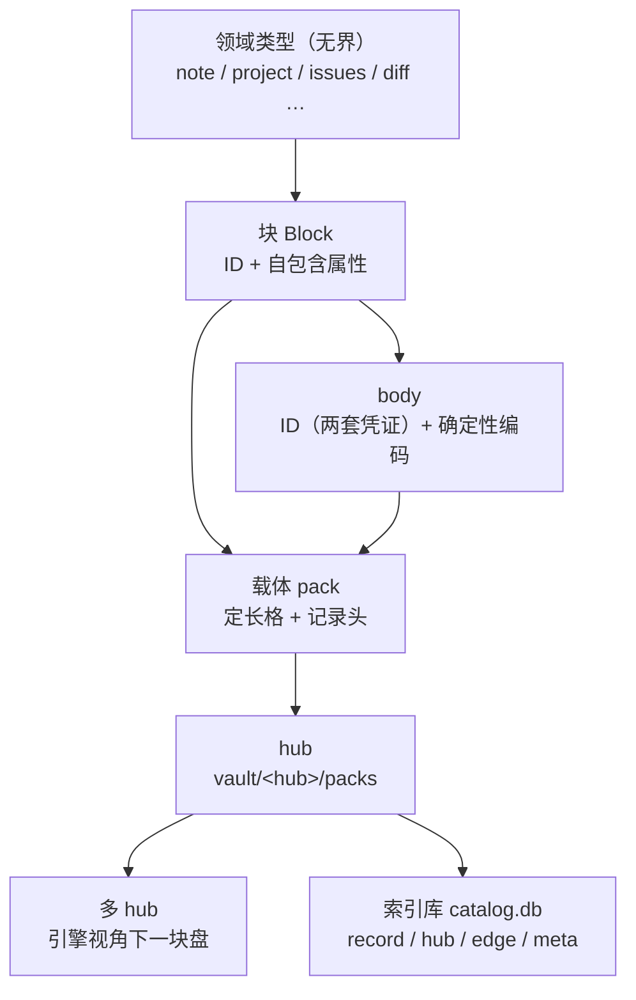

<!-- SPDX-FileCopyrightText: 2026 HanYang06 -->
<!-- SPDX-License-Identifier: Apache-2.0 -->

# L0 · 存储设计（Storage Design）

> Cairn 的最底层存储。本文是 **L0 存储的唯一事实来源**；旧篇 `storage.md` 已删除，
> [`data-model.md`](./data-model.md) 的存储态章节已按本文回写。
> 上层（领域模型、服务、界面）建立在本文之上。

状态：**已落地**（2026-09-28 设计定稿；2026-09-29 按重建后的实现回写）。
口径与实现一一对应：格模型（§5）、记录头（§5.3）、索引库三表加 `meta`（§8）、
巡检与处置（§8.7）都在 `src/core/storage/` 里；未做的只有 §12 列的那些。
权威顺序：`代码 > docs/architecture/<具体篇> > <总纲篇> > 记忆 / 其它`（`docs/architecture/index.md`）。

## 0. 摘要

一句话：**块是身份壳，body 是块自带的载荷，hub 把块装进定长格的载体，索引库是入口目录，多 hub 只是分组。**

| 层 | 一句话职责 |
|---|---|
| ID | 身份与位置：它是什么、在哪儿、何时签发 |
| 块 | 身份壳 + 自包含属性；body 靠块记录携带的**地址指针**一跳取到 |
| 载体 | 定长格的追加写文件；记录自带总长与校验和 |
| hub | 一个目录，装若干载体 |
| 多 hub | hub 的集合；引擎视角下只有一块盘 |
| 索引库 | 唯一的 `catalog.db`：hub 登记、身份到位置的定位、关系边；表结构由声明编译；**内核态可扫载体重建，领域态逐表判档、含不可重建表** |

本文相对旧篇的**决定性变动**：

1. **版本不属于存储**。存储只管 ID、地址、字节；版本归领域。
2. **载体记录自带总长与校验和**，并带 ID 两套凭证：丢索引库也能重建。
3. **物理坐标由格算术推出**，不再作为事实存进库。
4. **一个 vault 一个索引库**，不再一 hub 一库；hub 名是库里的一列。
5. **表声明化为配置**：有哪些表、每张表有哪些列，写在声明里；源码内不得出现建表 SQL（DDL）。
6. **物理地址只存在于可重建的索引投影中**，不进入 ID 与块记录。
7. 索引库裁到**三张内核表**（`record` / `hub` / `edge`）加索引库自用的 `meta`，
   以及按需声明的域表；`packs` / `body` / `block_type` / 版本表一律不保留。

## 1. 词汇表

| 术语 | 含义 |
|---|---|
| **vault** | 库根目录；内含一个索引库与若干 hub 目录 |
| **hub** | `vault/<hub>/`，装若干载体；当前只在 vault 目录内（代码里曾叫 bucket） |
| **载体 Pack** | 一个追加写的文件；定长格；写满封口 |
| **格 Slot** | 载体内的定长分配与定位单位；一条记录至少占一格（代码标识符仍用 `slot`） |
| **块 Block** | 存储单元：身份壳加自包含属性；承载类型由继承类给出 |
| **body** | 块的载荷；内容寻址；不需要 ID |
| **ID** | body 的身份证（两套凭证：分配形态与摘要形态），非裸字符串 |
| **地址 address** | 由 body 内容算出的确定性摘要，回答"是哪份内容"；即摘要形态凭证 |
| **索引库 Index** | `catalog.db`；入口目录；派生自载体 |
| **表声明** | 描述一张表的结构（表名、列、类型、约束、索引、重建档）的声明；建表由其编译 |
| **记录头** | 载体中每条记录的起始区段：总长与校验和（其后是 ID 段与载荷）；格区间不落盘，由起点与总长推出 |

## 2. 分层与总体结构



**红线**：L0 不认识 `note` / `project` 这些词。领域语义词只活在 L3；存储只认 ID、地址与字节。

**层间关系**：索引库是 **hub 的实现组件**，不是与 hub 并列的一层。由此，多 hub 对引擎只是分组，
引擎只需回答"这个 ID 在哪个 hub"，不需要管理多个库。


## 3. ID

### 3.1 定位

ID 不是"一个字段加一串内容"，而是一个对象：**身份证**。它描述**它在哪**，不描述**它是什么内容**。

### 3.2 字段全集

字段不止于标识本身。ID 是身份证：标注它是什么、在哪儿、何时签发。下表为**字段全集**
（即 `src/core/storage/format/id.py` 的 `ID`），逐项给出去留判据。

**身份段**

ID 的本体为**两套凭证，各有其作用，并存不取其一**：一套是分配来的唯一标识，一套是由内容算出的摘要。
两者都能拿来当 ID 用，如同一个人既有证件号（分配）又有账号（登记时分配、日常称呼），
互相不替代。派生与分配两种来源并存，是本层刻意的语义丰富，不构成冗余罪。

| 字段 | 含义 | 比较 | 去重 | 必需 |
|---|---|---|---|---|
| `value_uuid` | 唯一标识形态：签发时分配，与内容无关 | 有效 | **无效**（每次签发都不同） | 是 |
| `value_hash` | 摘要形态：由内容算出，同内容同值 | 无效（同内容同值，不可比） | **有效**（同内容即同值） | 是 |
| `name` | 名字；由**所在容器**得出：在 body 里叫 body ID，在块里叫块 ID | — | — | 否（可为空） |
| `birth_time` | **ID 自身**被签发的时间点（unix 纳秒） | — | — | 是 |

两个算法都收在 `format/id.py` 的 `new_uuid()` 与 `digest()` 两处：2026-09-29 作者裁定取
**`uuid4` + `sha256`**（理由：内核不需要"ID 按时间有序"，时间戳另有 `birth_time`）。
将来换算法只动这两个函数。

**位置段**（回答"在哪儿"）

| 字段 | 含义 | 必需 |
|---|---|---|
| `in_hub` | 在哪个 hub（目录名） | 否（写入后回填） |
| `in_hub_pack` | 在哪个载体文件 | 否（写入后回填） |
| `in_pack_slot` | 格区间：`(头格, 末格)`，闭区间 | 否（写入后回填） |

**来源段**（跨设备预留，当前未落地）：`issuer`（谁签发）与 `in_net_ip`（在哪台机器）见 §3.4。

三处语义须写清：

- `birth_time` **不等于**块的创建时间、对象的创建时间、数据的创建时间；它只等于 ID 被建立的时间点。
- 字段并非每一项都在某条代码路径上有读点。**调试、日志与排查是人眼读点**，同样构成保留理由；
  判据是"它是否与 ID 相关"，不是"它是否在关键路径上被读取"。
- 位置段可以比"在哪儿"所需的最小集**更全**。冗余在这里是有意为之：它使 ID 具备自描述与可观测性。
  §3.3 第 6 条给出冗余的边界——冗余只允许出现在 ID 对象内，不允许进入库与载体。

### 3.2.1 ID 的持有者

**ID 是载荷与块的身份证**：内容记录持有 body 的 ID，块记录持有块自己的 ID；ID 不下沉到更细的结构里。

| 对象 | 身份 | 记录里放什么 |
|---|---|---|
| 内容记录 | body 的 ID（摘要形态即内容地址，同内容只存一份） | 载荷就是 body 字节本身 |
| 块记录 | 块自己的 ID（摘要形态是该记录**自身载荷**的摘要） | 载荷是**指向 body 的指针** |

**指向体在哪一格**（2026-09-28 按落地情形修正，2026-09-29 按实现复核）：块记录的 `value_hash`
**恒为该记录自身载荷的摘要**——记录层的自校验就这么要求（`Record.decode` 会当场核对，§5.3），
故它无法同时承载 body 的摘要。原稿写作"一格两用"（指向身份 ＋ 内容判重），现改为
**ID 管自身、载荷管指针**：块记录的载荷里带 `body_addr`（body 的地址），
去重与反查仍走 `value_hash` 索引（内容记录的身份就是该地址）。

**这个指针用保留键**（`\x00cairn.body_addr`，带不可打印前缀）：内容记录的载荷就是业务 body，
而 body 由领域决定——若拿一个业务可能用到的普通键当判据，一份形如
`{"body_addr": "<64 位十六进制>"}` 的正文就会被误判成块记录，去重失效、列举整体报错。
前缀即"业务数据不可能占用"的命名空间。判据落在 `format/block.py` 的 `body_addr_of()`。

**指针在载荷里不影响可重建**：顺扫读出载荷即得指针，故档一（§8.5）照旧成立。

### 3.3 不变量

1. **ID 承载身份与位置**。其中摘要形态与内容寻址共用同一口径（内容变则它变）；
   **物理坐标不属于 ID**（§9.2）。
2. **全局统一**：hub 的数量不影响 ID 的形态与有效性。
3. **身份稳定**：内容变化不改变 ID；引用、关系、将来的合并裁决都以它为依据。
4. **同一 ID 恒解析为同一类型**。类型标号（`kind`）由程序给出，库与载体都不写它：
   落盘只有 ID 与 body，故"ID 到类型"的对应由程序提供（类型继承机制随领域层重建再定）。
5. **不认识的 ID 一律降级读回**（按未知类型还原为裸数据），不抛错、不丢弃：
   扫描、重建与合并都依赖它，一处抛错即断整条链。
6. **冗余的边界**：ID 对象内的字段允许冗余与可推导值（用于自描述、日志与排查）；
   但库与载体**只持久化必需子集**（§3.5），可推导值不落盘。

### 3.4 预留

- ID 的**完整体制**（编码形态、各类作用域的边界）为后续专项；本文只锁定 §3.5 的持久化子集
  与 §3.3 的不变量。**算法已裁定**（§3.2：`uuid4` + `sha256`）。
- `issuer`（谁签发）在多端同步上线后承担来源区分职责；**当前未落地**（`ID` 上没有这个字段）。
- `in_net_ip` 及后续可能出现的网络字段为**跨设备预留**，当前未落地、不落盘（§3.5），
  网络与联邦设计成稿时一并定义。
- 路径类字段（载体所在路径、文件路径 / 名称）**不设**：它们由"hub 目录 + 载体名"推出，
  落进 ID 只会多一份会不一致的拷贝。

### 3.5 持久化子集

字段全集用于 ID 对象本身（自描述、可观测）；**落盘只用必需子集**。
由 hub 名与载体名可推出位置，故载体记录头只需承载两套凭证：

| 位置 | 载体记录头取用 | 索引库取用 |
|---|---|---|
| hub | 不写（由目录推出） | `hub` 列 |
| 载体 | 不写（记录就在这个文件里） | `pack` 列 |
| 格 | 不写（由起点与总长推出） | `slot_first` / `slot_last` |
| ID 两套凭证 | `value_uuid` + `value_hash` | `value_uuid` / `value_hash` |
| 类型 / 时间 | 不写（由程序给出） | `kind` / `created` |

由此得到两条：**载体记录头只带最小集**（总长、校验和、ID 两套凭证，见 §5.3）；
**位置段与名字不落盘**——它们由"hub 目录 + 载体名 + 格算术"与所在容器推出。
`name` 同理：它由容器给出，读回时由程序补上。


## 4. 块与 body

### 4.1 类型无界

`Block` 的子类**数量不设上限**：note block、project block、issues block、diff block 等，
形态由继承层级声明；存储对子类数量与新增速度无感。

此处"子块"指**类型继承的无界**，**不是块嵌套**。跨块关系走 ID 引用或关系边（§7），块内不装块。

### 4.2 属性自包含

块自身承载列表与筛选所需的一切：类型、标题、标签、时间。因此**索引库不必为每种类型建表**，
也不必复制块内数据。领域表天然是少数派——只有确实需要可查询面的东西才建表（关系、将来的检索）。

### 4.3 body 的自由与约束

body 的承载结构**不收窄**：字符串、列表、字典，以及文本化与二进制化形态。
自由的对象是**结构**，不是**字节**：任何 body 类型都必须提供**确定性规范化**，
否则同一逻辑内容会算出不同地址，去重失效、占用回升。

规范化必须满足：同一逻辑内容恒得同一摘要；编码与实现无关；版本可辨。

### 4.4 body 与 ID

body 由**地址**定位，同时**持有 ID**（§3.2.1）：
摘要形态使同内容可判重，唯一标识形态使同内容也能被区分与引用。
故 body 不因"靠地址定位"而失去身份；相反，地址本身就是它两套凭证之一。

块**持有自己的 ID**，并在载荷里携带指向 body 的**指针**（`body_addr`），理由与分量见 §3.2.1。

于是**一个块落成两条记录**（落地见 `src/core/storage/engine.py` 的 `Storage`）：
内容记录（载荷即 body 字节，身份按内容签发，故同内容只存一份）与块记录
（载荷是指向 body 的指针，身份是块自己的）。读回是"两条一拼"：
块身份 → 读块记录 → 取指针 → 按地址读内容记录。

## 5. 载体与格

### 5.1 布局

```
vault/
  catalog.db                 # 索引库（唯一）
  <hub>/
    packs/
      <随机名>               # 载体：追加写；定长格；写满封口
```

文件名为随机串（无语义、无顺序号）；载体名是"在哪个文件"的答案，其真源是文件系统本身。

### 5.2 定长格与算术寻址

模型只有一条：**载体是一串等大的格子，记录从格边界开始写，写不下就往后拼格子**。
一条记录的位置就是它占的**头一格与末一格**两个数字（代码里是 `SlotRange(first, last)`，闭区间）：

- 格长固定（`storage.pack.slot_bytes`，代码默认 `DEFAULT_SLOT_BYTES`），故字节偏移**由算术得出**：
  `偏移 = 文件头长度 + 头格 × 格长`。**格号自文件头之后起算**，故文件头不必凑成整格；
- **定位没有第二套口径**：不存在"格内偏移"这种东西——记录起点就在格边界上，
  这正是"两个数字即精确位置"的前提；
- **写入纪律**：写完一条记录，末格空着的部分补零，使下一格重新落在格边界；
  载体尾部若不是整格，一律拒写（那是残写或外来改动，不猜从哪儿接）；
- **代价是明确的**：一条记录至少占一格，格尾写不满就空着。故**格长是"空间浪费"与"格号数量"
  之间的交换**——格小则每条浪费小、格号多；格大则相反（取值见 §5.6）；
- 由此得到一条设计边界：**物理坐标是投影，不是事实**。压缩、合并与搬移只改"抽象地址到物理坐标"的映射，
  不改记录所携带的任何内容。

> 2026-09-29 作者裁定：原稿的"紧凑排布 ＋ 三元组 `(起始格, 格数, 格内偏移)`"**作废**。
> 两数模型没有解释成本（三数那套要为"格对齐值 vs 实际占用"备两套口径，而存储最怕存得莫名其妙），
> 代价是每条记录至少占一格——取舍已写在上一条里。

### 5.3 记录头

载体中每条记录的结构如下（长度均指字节）::

    +----------------+------------------+---------------------+----------------+
    | total_len (4)  | checksum (64)    | id (canonical CBOR) | payload (rest) |
    +----------------+------------------+---------------------+----------------+
     大端无符号        摘要十六进制        落盘子集，长度自报        记录内容

头的**三项语义**（**落盘的只有前两项**：总长与校验和，其后是 ID 段与载荷）：

| 字段 | 作用 |
|---|---|
| 总长 | 自框定：记录无需外部索引即可切出，故顺扫即可重建 |
| 校验和 | 载荷的摘要凭证；自校验，且与 ID 的内容凭证同源 |
| ID | 身份与定位：段里**只写两套凭证**，位置与名字不入记录（§3.5） |

四条约定：

1. **总长在最前**：故记录自框定，顺扫一遍即得全部 `(ID, 载荷)`；
2. **ID 段取落盘子集**（§3.5）：只有两套凭证，不含位置 / 名字 / 类型 / 时间；
3. **校验和覆盖载荷**：一次比较同时验"读到的是不是原文"与"ID 声明的内容与实际内容是否一致"；
4. **类型标号不落盘**：类型由程序按 ID 给出（§3.3 第 4、5 条）。

**格区间同样不落盘**：它由记录的起点与总长推出（§5.2），索引里那一份是投影。

记录头使**载体自描述**：内核态下索引库丢失后，扫描载体即可重建（域介入后的范围见 §8.5）。
这是档一可重建成立的前提。


### 5.4 封口与目录

- 写满即封口；
- **封口不留标记**：没有封印字节、也没有封口文件——"已封口"就是"该载体已达到封口线"。
  故封口是**策略判断**，不是落盘状态：配置改了它自然跟着改，也不会出现"标记与事实不符"；
- **活跃载体＝有空间的最满者**（一个都没有就新开一个）。写入纪律是"写到满才换"，
  故这个判据不依赖时间戳，也不依赖载体名顺序（名字是随机的，见 §5.1）；
  封口线被调大后可能不止一个载体有空间，此时按同一判据仍只有一个答案；
- 封口线只管**换不换文件**，不构成硬上限：单条记录大于封口线时照样完整写入
  （否则大记录永远写不进去）。格长则是格式事实，写在文件头里（§5.5）；
- **不设封口目录**：记录自框定（总长在最前），故顺扫即可重建定位，
  目录只是"少读一遍"的性能优化，不承担"能不能读出来"的职责；
- 将来若确需加速，目录写入**文件尾**（追加写模型下文件头无法就地增长），
  且必须**可重建**：目录与记录不一致时以记录为准。该优化列为**预留**（§12）。

### 5.5 载体文件头

文件开头是定长的载体文件头（当前 24 字节：魔数 8 ＋ 格长 8 ＋ 预留 8）：

| 字段 | 作用 |
|---|---|
| 魔数 | 认得出"这是载体、且是第 1 版布局"（末位带版本号）；不符即报错，不猜 |
| 格长 | 该载体的格长（代码里是 `slot_bytes`）；**故载体自描述**，只拿到一个文件也能算偏移 |
| 预留 | 置零；将来加字段不必改已有布局（读取时不校验它的内容） |

格长随载体走（而非全局唯一）：不同批次的载体可以不同格长，而每个载体自身仍可精确算术定位。
**写入时定、读取时从文件头读**——这条与 §5.6 第 2 条互为因果，是"物理坐标只是投影"的前提。

### 5.6 配置参数

| 键 | 默认 | 含义 |
|---|---|---|
| `storage.pack.max_bytes` | 2 GiB | **封口线**：单个载体写满这个字节数即换新载体 |
| `storage.pack.slot_bytes` | 512 B | **格长**：定长分配与定位单位 |
| `storage.block.max_bytes` | 1 MiB | 分片粒度：单块超过即切片（**未落地**） |

四条规矩：

1. **封口线与格长是两个旋钮**。封口线只管"什么时候换文件"，格长只管"怎么定位"；
   不从封口线推格长（否则改一次容量参数就改掉落盘布局）；
2. **格长只在建载体时读一次**，随后写进载体文件头；**读取永远从文件头读**。
   否则改一次配置，已落盘载体的偏移会全部错位；
3. **格长要小**：两数模型下一条记录至少占一格（§5.2），格长就是每条记录的平均浪费上限——
   64 KiB 的格长配一条 200 字节的笔记等于浪费 99%；512 B 时平均浪费 256 B；
4. **不设"每载体最多多少块"**：容量由格计量，块数是派生视图，多一个旋钮就是多一处自相矛盾。

**格式常量不进配置**：载体魔数、文件头长度、记录头布局改了就坏库或换格式，
它们留在实现处（`src/core/storage/carrier.py`）。配置里出现一个代码不读的键，比没有这个键更坏。

配置引擎尚未落地，故上表两个值当前以代码常量给出（`hub.py` 的 `DEFAULT_SLOT_BYTES` /
`DEFAULT_MAX_BYTES`），由上层作为**策略参数**传进 hub；它们的最终取值仍待实测（§12）。

## 6. hub

- hub 是 `vault/` 下的一个目录，内含 `packs/`；
- **判据是形状而不是"是个目录"**：vault 下带 `packs/` 的直接子目录才算 hub。
  库里还会有别的东西，见目录就当 hub 会把它们卷进来；
- **当前 hub 只在 vault 目录内**，不预留外部形态（换盘、远端等），需要时再作增量设计；
- hub 名进入 ID 的 `in_hub`；索引库中 hub 名是 `hub` 表的主键、`record` 里的一列；
- **hub 名就是 hub 的地址**（目录名）：取人话（`main`）或取 ID 形态，对路径式查询没有区别——
  先查 hub、再按格区间读记录，两跳都是查表。hub **不持有 ID**：ID 属于载荷与块（§3.2.1），
  hub 是容器，它的标识就是它的名字；
- hub 目录本身即 hub 的存在证明，索引库的 `hub` 表是**登记**而非真源；登记一旦写下，
  再取同一个 hub **不改写**它（登记记的是"第一次见到它"的时刻与形态，改形态是显式动作）；
- **hub 没有自己的配置**：格长随载体走（写进文件头，§5.5），封口线是策略（每次写入按当前值判）。
  故 hub 这一层是无状态的：目录拷到哪里都成立，索引库丢了也能顺扫回来；
- **读路径不建 hub**：目录不见了就报错，绝不悄悄建一个空 hub 顶上——那会把"数据没了"
  伪装成"这里本来就是空的"。

## 7. 多 hub

- 物理上是多个 hub，**引擎视角下只有一块盘**：引擎只需回答"这个 ID 在哪个 hub"；
- **同一个 vault 只有一个索引库**。索引库的承载量与其体量相称（定位行与边行），
  按 hub 切分为多个库文件不带来收益；
- **路由**（已落地）：写入按 hub 名分组，读取按记录行里的 hub 名开 hub——故多 hub 对上层
  只是**一次分组**，此后全是"按格区间读记录"这一件事；
- **登记对账**（已落地）：目录是事实、登记是投影。目录里有的补登记；
  登记里有的、目录里没有的**只报告不删**（与"多出的列不静默删除"同一口径）；
- **合并**：以源 hub 的载体为真源，把记录镜像进目标 hub。内容面天然幂等（同地址只存一份）；
  身份面若同一 ID 在两侧同时存在，按 `birth_time` 裁决取较新者；语义冲突交回领域处理
  （存储不承载版本，见 §9）；
- **短时并发**：并发以**短命 hub**承接，事件结束后合并回主 hub 并销毁短命 hub。
  短命 hub 若不在合并后销毁，文件数将随并发次数单调上升，与"控制文件数"的目标相反。

上述**合并与短命 hub 列为未来项，短期不做**（`hub` 表的 `role` / `state` 两列只占位）。
理由：并发承接本身不是当前瓶颈，"文件数随并发次数上升"这个问题在没有并发写入之前不会出现；
而它一旦要做，就要顺带裁定下面这条。

其与"唯一索引库"的接线（合并期 hub 归属的改写）随之**一并推后**，取舍如下——
镜像一条记录进目标 hub 之后，`record.hub` 该写哪一个：

| 取法 | 理由 | 代价 |
|---|---|---|
| 改写为目标 hub | hub 名只是投影，改写不影响可读性；路由与"记录实际在哪"始终一致 | 需要一次"改写归属"的动作，且两 hub 若同时存在则指向其中一边 |
| 保留源 hub | 记录确实还在源 hub 里，写目标 hub 与事实不符 | 目标 hub 里出现"指向源 hub"的行，销毁源 hub 的行必须先把归属搬完 |

在合并动工之前不裁定，免得把一次取舍固化成数据格式。


## 8. 索引库

### 8.1 定位

索引库是**入口**，不是中枢。一次查询交出 ID，其后所有工作在块上完成。故库内只保留
"能被快速筛出来"的东西，正文、样式、图形、资产一律不进库。

### 8.2 表

**声明是本体**（代码里是 `src/core/storage/tables.py` 的 `KERNEL_TABLES`；配置引擎落地后
挪进声明文件），下面只是速览::

    record   value_uuid PK | value_hash | kind | hub | pack |
             slot_first | slot_last | size | issued | created | updated
    hub      name PK | role | state | created
    edge     id PK | src | dst | kind | domain | created
    meta     name PK | value          # 索引库自用：存声明签名（§8.6）

- `record`：**身份到位置**，一行一条记录（块记录与内容记录同表）。
  主键 `value_uuid`；`value_hash` 建**非唯一**索引，故"这份内容被哪些记录引用"一次查得到
  （去重与反查同一处）。位置即 `(hub, pack, slot_first, slot_last)`——四项与字节偏移一一对应（§5.2）；
  `size` 存记录字节数（便于估算与巡检），长度本身仍由记录头给出。
- `hub`：hub 登记（角色、状态、建立时间）。位置由 hub 名推出，故不存路径；真源是 hub 目录。
  **本表可整体重建**（扫 vault 下的 hub 目录即得），故"登记行丢了"不是数据损失。
- `edge`：关系边（一等行）。**边身份由 `(src, dst, kind, domain)` 算摘要**，故同一关系重复写不产生第二行。
  其可重建性取决于关系数据本身何在：若关系落在块内，则本表由载体派生、属档一；
  若关系只由用户在库内建立，则本表即真源、不可重建（§8.5 档三）。该归属为**待定**（§12）。
- `meta`：**索引库自用表**，不属任何声明集（开库流程自己保证它存在），但它的建表语句
  同样由声明编译（`tables.META_TABLE_SPEC`）——"源码内不得出现建表 SQL"这条在它身上也不破例。
  声明里占用这个名字会被 `Declaration` 直接拒绝。
- 域表：确实需要可查询面者按需声明（关系已在其一；检索为其二），走同一套声明机制。

索引：`record` 上按 `value_hash`（地址反查）、`kind`（类型筛选）、`(hub, pack)`（按载体归拢）、
`updated`（时间排序）；`edge` 上按 `(src, kind)`（出边）与 `(dst, kind)`（入边 / 反查）。
索引名由**表名与列组合**推出（`idx_<表>_<列>`，列按名排序），不手写，免漂移。
带表名是必须的：SQLite 的索引名**整库唯一**，只由列组合推出时两张表声明同一列组合即撞名，
后一条 `CREATE INDEX IF NOT EXISTS` 按名字判定为已存在而**静默跳过**——声明的唯一性随之落空，
比对又永远报"缺索引"，库卡在打不开的状态。带表名仍不足以免撞（表名与列名同用 `_` 分隔，
表 `a` 的列 `b, c` 与表 `a_b` 的列 `c` 同名），故解析口另做一次**跨表唯一性**校验。

### 8.3 索引

按入口职责建立：按类型、按时间、按 `value_hash`（地址反查）、按 `src` / `dst`（拓扑）。

### 8.4 表声明

- **表的建立由配置声明**，源码内**不得出现建表 SQL**：声明的数据模型在 `core/storage/tables.py`
  （表名 / 列 / 类型 / 约束 / 默认值 / 索引 / 重建档 / 说明），建表与建索引语句由其
  **编译**（`TableSpec.ddl()`）——方言只出现在编译器一处；
  后来加上的列由 `TableSpec.add_column_ddl()` 编译成 `ALTER TABLE … ADD COLUMN` 补齐
  （`CREATE TABLE IF NOT EXISTS` 对已存在的表是空操作，补不了列）；补不上的列
  （主键 / UNIQUE / NOT NULL 无默认值）按**破坏性差异**处置，须显式授权重建；
- **类型词汇中立**：只认文本 / 整数 / 实数 / 二进制 / 布尔五种，加新类型要过声明层，
  于是"能不能落盘"是设计问题，而不是写一句 SQL 就能决定的事；
- **登记即事实、重复即报错**：同名表声明重复且内容不一致直接抛错，不静默覆盖；
- **配置是声明本体**：表声明落在配置项 `storage.db.tables` 所指的那份 YAML 里
  （一项一张表），人写得出来、改得动、评审时一眼读完；代码只负责**读、校验、编译**。
  解析口对未知项、非法类型、重复表名一律报错，不静默忽略；
- 声明分布遵循"各管各的"：内核表写在存储自己的声明模块内，域表写在域自己的声明模块内；
- **建表只在开库与挂载时进行**，不在读写路径上，避免热路径反复执行 DDL 与提交；
- **对比与判定**：声明与实际不一致时按差异分类处置——缺失即建，**缺列即补**
  （`ALTER TABLE … ADD COLUMN`；补不上的列按重建处置），索引不符即建索引、
  **同名不同定义（唯一性变化）即拆掉重建**，多出的未声明列与未声明的表只告警、**不静默删除**；
  比对**不只看列型**：主键 / 非空 / 默认值同样比，漂移即"容器级不兼容"（须重建，见下条）；
  列级 `UNIQUE` 由声明的索引那一侧比（它才是唯一性的实际载体）；
- **破坏性动作必须显式授权**：重建**默认拒绝**（报错并列出待重建的表），
  调用方须显式给出 `RebuildPlan(tables=…, reason=…)` 才执行；授权未覆盖到的表同样拒绝；
- **重建不丢数据**：处置时旧表**改名隔离**为 `<表>__dropped_<时刻>`，不删除——
  "数据由调用方搬运"在实现里没有落点（调用方拿不到旧行），改一次列型就等于整张表消失；
  档三（真源在库内）更是只能靠备份。隔离表随后按"库里有、声明没有"处置，即**只告警不删**；
  表内容由调用方按声明重建，或从备份恢复；
- **用户可加不可改**：允许新增列、新增索引与默认值；改类型、改约束、改主键、删带约束的列一律拒绝启动。
  破坏性变更只来自发版本身；
- 领域表按需**增量构建**：领域把自身所需的表声明出来，由存储按上述流程对齐。

### 8.5 可重建的范围（分档）

**"可重建"是逐表的性质，不是索引库整体的性质。** 索引库随领域介入而改变性质，
故必须分档说明，不得笼统宣称"纯投影"。**每条表声明都必须写明自己的重建档**：
写不出重建来源的表就是不可重建表，必须纳入备份（声明层会直接拒绝含糊的档）。

**表级只有两项**（代码里的 `Tier`）：`DERIVED`（可重建，**必须**写明来源）与
`SOURCE`（真源在库内，**禁止**写来源——可重建与真源不可兼得，必须明说）。
下面说的"档二"是**领域介入后整库的性质**，不是第三种表：
领域表照样落进这两项之一，含糊的声明在解析口就被拦下。

**档一 · 内核纯净态 · 可重建**（表级 `DERIVED`）
内核自有表与由载体派生的行：hub 登记、定位（`record`）、由载体推导出的关系。
重建路径：遍历 vault 下的 hub → 扫描各 hub 载体 → 读记录头 → 重建。此档损坏可由重建修复。

**档二 · 领域加持态 · 大部分不可重建**（整库性质，不是表级档）
一旦领域挂载，索引库即增量加入领域专项表。这些表与物理存储**可以没有对应关系**，
其中来源于载体的部分可由载体重算（声明为 `DERIVED`），而**真源就在库内的部分无法由载体推出**
（声明为 `SOURCE`）。此档一旦损坏且无备份，即为**永久性损失**，重建不成立。

**档三 · 备份**
"库可重建"在领域态下是伪命题，故**备份是必需能力**，而不是可选项。

**归属判定表**

| 表 | 可重建 | 重建来源 |
|---|---|---|
| `hub` | 是（`DERIVED`） | hub 目录（§6） |
| `record` | 是（`DERIVED`） | 载体记录头 |
| `edge` | 是（`DERIVED`） | 关系数据在块内时的块记录；见 §8.2 注 |
| `meta` | 是（`DERIVED`） | 当前表声明（由程序给出） |
| 领域专项表 | 逐表而定 | 声明其重建档与来源 |
| 真源在库内的表 | **否**（`SOURCE`） | 无；只能靠备份 |

**两条硬规约**

1. **逐表声明重建档**：新增任何表，声明中必须写明它属于哪一项、重建来源是什么。
   写不出重建来源的表，即为不可重建表，纳入备份范围。
2. **可重建不得覆盖真源**：同一事实若已有真源（载体或块），库内那一份只能是派生。
   反之，库内可以存在真源，但它就丧失了可重建性——两者不可兼得，必须明说。

**档一的重建是"形状可重建"，不等于"每个格子都能还原"**：`record` 的身份、两套凭证与
格区间都在记录头里，故能顺扫回来；但 `kind`（类型由程序给出，§3.5）与落盘时刻不在记录头里，
重扫只能给空值。故落地时的口径是**只补缺行**：已有行一律不动，缺行按"类型未知"补回
（未知类型本就降级读回，§3.3 第 5 条）。清空重扫须由程序按 ID 给出类型，属 ID 专项（§12）。
落地见 `src/core/storage/rows.py` 的 `rebuild()`。

例外须写明：hub 当前只在 vault 目录内，故 hub 登记可扫描回来；一旦引入 vault 外的 hub 形态，
必须另有一份清单兜底，否则档一也将出现例外（§6）。


### 8.6 数据库配置

**库里有哪些表、每张表有哪些列，全部由声明给出**，不硬编码于读写路径。

> **现状（2026-09-29）**：配置引擎已随重建删除、正由作者重做，故本节描述的那套
> "声明落在 `config/settings/core/storage/tables.yaml`、由配置引擎读进来"尚未落地。
> **当前实现是**：声明与编译器在 `src/core/storage/tables.py`（`TableSpec` / `Declaration` /
> `KERNEL_TABLES`），开库比对与处置在 `index.py`。等配置引擎落地，声明本体搬到 YAML 即可，
> 编译器与比对逻辑不动。

**声明面**分三处，遵循"各管各的"：

| 声明面 | 内容 | 归属 |
|---|---|---|
| 内核表 | `record` / `hub` / `edge` | 存储自己的声明模块（将来是声明文件） |
| 索引库自用表 | `meta`（不属任何声明集，由开库流程保证） | 同上 |
| 通用表 / 领域表 | 确实需要可查询面者 | 同上，标 `owner: domain` |

**位置约定**（配置引擎落地后）：`config/<hub>/<包树>/<文件>`——与配置引擎的镜子约定一致
（`src/core/storage/conf.py` ↔ `config/settings/core/storage/`），故结构描述与同一包的标量配置
**分文件、同约定**，谁也不挤谁。

**声明内容**（每条表声明）：表名、`doc`、`tier`（重建档）、`owner`（归属）、
`rebuild_from`（重建来源）、`columns`、`indexes`。

**类型词汇中立**：只认有限的几个类型名（文本 / 整数 / 实数 / 二进制 / 布尔）与有限的约束开关
（主键 / 唯一 / 非空 / 默认值）。建表语句由声明**编译生成**，故源码内不出现方言与建表语句。
时间不另立类型：一律是整数（unix 毫秒），与全库口径一致。

**校验在解析口**：未知项、非法标识符、非法类型、重复表名或列名、缺必填项、
`SOURCE` 档写了重建来源、声明占用 `meta` 这个名字——一律报错，不静默忽略。

**这不锁死可扩展性**：解析器与编译器里**没有任何表名或列名的硬编码**，
加一张表、加一列都只是改声明。

**开库时的比对**（落地见 `index.py` 的 `Index.open`）：

- 库内 `meta` 存一份声明的**规范化描述**（`Declaration.signature()`，列与索引按名排序、**不含 `doc`**
  ——改一句注释不该让库打不开）；
- 开库时先看、再比、后处置：缺表即建、缺列即补、索引缺失即建、同名索引定义变了即拆掉重建、
  多出的表 / 列 / 索引**只告警不删**；
- 容器级漂移（列型 / 非空 / 主键 / 默认值 / 列级唯一）**默认拒绝**，须开库时给出
  `RebuildPlan(tables=…, reason=…)` 且覆盖每一张待重建的表；重建**改名隔离不删**
  （`<表>__dropped_<时刻>`），隔离表随后按"多出的表"只告警；
- **登记语义**：对齐全过程是"先比对、处置完再重写登记"。于是声明变了**不阻断开库**，
  只报告 `declaration_drift`（否则加一张领域表就没法开库了）；真正中断的只有
  "改不动且未授权"的破坏性差异。库与当前声明对不上时，这一条是排查的入口。
- 两处差异的口径**不同，不要混**：开库对齐的 `Difference`（声明 vs 实际结构）与
  巡检的 `Find`（库 vs 真源数据）是两套东西，见 §8.7。

### 8.7 巡检与处置

- **巡检**（`patrol()`）：比对索引库与其声称的真源（hub 目录、载体、记录头），
  **只报告、不动库**。两个方向都比——盘上有、库里没有，与库里有、盘上读不出来，
  是两种不同的毛病，修法也不同；
- **分类即处置依据**：可按"能否由重建修复"分成两类，因为档一的重建口径是**以载体为真源**
  （§8.5）。发现分**六类**（代码里是 `FindKind`）：

  | 发现 | 含义 | 可否由重建修复 |
  |---|---|---|
  | `unregistered_hub` | hub 目录在、登记缺 | 可（补登记） |
  | `missing_row` | 盘上有记录、库里没有行 | 可（按记录补行） |
  | `misplaced` | 行在、摘要对得上，但坐标与载体里的实际位置不符 | 可（只改坐标） |
  | `missing_record` | 行在、盘上读不出来（载体没了，或盘上只有摘要不符的其他版本） | **否**：内容真的没了 |
  | `missing_hub` | 登记或行指向的目录缺 | **否**：hub 没了 |
  | `corrupt_carrier` | 载体读不到底（截断 / 校验失败） | **否**：坏点位置只有人看得出来 |

- **一致要两项都对**：位置（hub / 载体 / 格区间）与**摘要凭证**
  同时与该身份的某次出现相符，才算"行指向的字节还在"。只比位置会放过这一种：
  索引行被改坏时，位置可能照样落在该身份的另一份副本上，而那份副本的内容与行声明的摘要不符——
  "库里声称的那份内容在不在盘上"正是巡检要回答的问题；
- **处置**（`repair()`）：只动"可修复"那一列，且**只补不删**；
  不可修复项一律不碰——删行等于把"丢了东西"这件事抹掉，只能报告，交由备份与人工；
- **同一身份在盘上出现多次不算差异**：更新留下的旧副本要等压实回收（§12），
  它不影响"行指向的那一份是否成立"；行指向的那一份确实没了，才报 `missing_record`；
- **坏点即停属于重建，不属于巡检**：重建拿到半份结果不能当结果，故遇错即抛；
  巡检要接着看完——"还坏在哪儿"正是它要回答的问题，故**按载体捕捉、其余照扫**；
- 巡检的覆盖面受重建档约束：`SOURCE` 档的表不参与"与真源比对"，因为无真源可比。


## 9. 横向规约

### 9.1 版本不属于存储

存储只管 ID、地址与字节。历史、回放、压实是领域策略，**不进存储**。
内容变化的记录由领域承担；存储不因此新增表、列或机制。

### 9.2 物理地址的归属

- 进入 ID 与块记录的只能是**稳定身份与摘要凭证**；
- **物理坐标只存在于可重建的索引投影中**。凡"哪个载体第几字节"的记录，一律视为当前布局的投影，
  布局变动即重写，不作为事实被信任。

### 9.3 失败处理

失败必须显式抛出，不得把落盘失败读成成功。存储不得吞掉机制性错误。

### 9.4 工程纪律

- 记录与索引的重建口径必须唯一：同一事实不得存在两个写入者。
- 能派生的不存，能算的不写，能扫的不记。

### 9.5 本地不加密

**落盘一律明文**，本机不加密、不做静态加密；加密只作用于**传输与远端副本**
（见 [`access.md`](./access.md) 的档位与信任模型）。既然明文落盘，内容地址就直接用明文摘要，
去重不存在密钥域冲突——这是本地优先的明确取舍：磁盘被拷走**明确不防**。

### 9.6 旧格式不兼容

本设计**不背兼容包袱**（§10）：旧格式的库不被读取。但**不是静默无视**，两道口子都报错：

- **索引库**：开库前先看它像不像我们的库——既没有 `meta` 表、也没有任何声明过的表，即拒开
  （`IndexSchemaError`），免得把别人的 sqlite 文件当自己的库用；
- **载体**：文件头魔数不符即报错（`RecordFormatError` → `HubShapeError`），不猜、
  也不把它当成"这里没有载体"。载体是我们自己的、只是索引丢了，则照旧打开——
  那正是档一可重建要支持的场景。

## 10. 已裁剪的决定

以下概念在本设计中**不存在**，不得复活：

| 已裁 | 理由 |
|---|---|
| 存储承载版本（版本引擎、版本表、保留窗） | 版本归领域；存储不承担历史 |
| 手工版本号（块格式号与各域结构的模式号） | 无读点的标记；发版本身即变更事件 |
| 类型码表（整数枚举） | 类型由程序给出，重复 |
| `packs` 表 | 载体元信息可由文件系统与记录头得出 |
| 独立的内容池表 | 地址到位置的映射即去重池，无需另立 |
| 库中存物理坐标作为事实 | 物理坐标是投影 |
| 一 hub 一库 | 库体量小，单库即可；一个 vault 一个库 |
| 源码内建表 SQL | 表的建立由声明给出；声明内容为表、列、类型、约束与索引 |
| 载体中的类型标号 | 类型由程序给出；不认识的 ID 降级读回 |
| 块嵌套 | 跨块关系走 ID 引用或关系边 |
| ID 内承载内容或地址 | ID 不承载**物理坐标**；摘要形态是两套凭证之一，与内容寻址同源 |
| 单一身份本体 | 两套凭证并存：分配形态与摘要形态，各有其作用 |
| ID 里的"格内偏移" | 两数格模型下记录起点就在格边界上（§5.2） |

## 11. 落地顺序（代码）

1. **基础类型与异常**：身份与地址的类型、格与位置的类型、存储侧异常。
2. **字段定义**（关键一步，字段不清则后续失序）：ID 字段、块字段、记录头字段、
   索引库各表字段、表声明字段。
3. **字段审核**：由项目负责人审核字段定义。
4. **后续逻辑**：载体读写、索引库与表声明、hub 与多 hub、重建与巡检、内核接线。

第 4 步的进度（按片推进，每片可单独回退；对应 `src/core/` 的实际模块）：

| 片 | 内容 | 状态 |
|---|---|---|
| 身份与记录 | ID 两套凭证、块载荷、记录头 | 已落地（`storage/format/`） |
| 载体读写 | 格布局、记录、载体文件、顺扫 | 已落地（`storage/carrier.py`） |
| hub 与多 hub | 单 hub 读写、多 hub 路由、hub 登记 | 已落地（`storage/hub.py`） |
| 索引库 | 声明与编译、比对 → 分类 → 处置 | 已落地（`storage/tables.py` / `index.py`） |
| 行层与重建 | 定位行 / 登记 / 边、档一补缺行 | 已落地（`storage/rows.py`） |
| 存储引擎 | 块 ⇄ 两条记录、内容去重、落盘后发事件 | 已落地（`storage/engine.py`） |
| 巡检与处置 | 六类发现、只补不删 | 已落地（`storage/patrol.py`） |
| 内核接线 | `Kernel` 装库根与两个引擎 | 已落地（`core/init.py`） |
| 表声明的配置通道 | 声明本体搬进配置引擎 | **未落地**：配置引擎重做中，声明暂在 `tables.py` |
| 合并与短命 hub | 镜像、归属改写、销毁 | 未来项，短期不做（见 §7） |

## 12. 待定与预留

| 项 | 状态 |
|---|---|
| 格长与载体字节上限的具体取值 | 待定（由实测确定；当前默认值在 `hub.py` 的 `DEFAULT_*`） |
| 摘块与巡检的相互作用 | **待定**：`drop` 只摘行、记录留在载体里，于是巡检报 `missing_row`、处置又把它补回（等于撤销摘块）。消掉它要么给 `drop` 写墓碑，要么等压实回收 |
| 封口目录（加速定位用；记录已自框定，故属优化而非必需） | 预留 |
| 合并与短命 hub（承接并发写入，合并后销毁） | **未来项，短期不做**（作者 2026-09-28 定：无所谓，记下即可） |
| 合并期 hub 归属的改写（改写为目标 hub / 保留源 hub） | 随合并一并推后（取舍见 §7） |
| 表声明与配置引擎的通道 | **未落地**：配置端那套文件引用随配置引擎一并重做（§8.6） |
| `edge` 的重建档（关系数据落在块内，还是仅在库内） | 待定（随关系归属裁定） |
| 权威重建（清空重扫）如何还原 `kind` | 待定：记录头里没有类型（§3.5），须由程序按 ID 给出，属 ID 专项 |
| `body_addr` 要不要从载荷提升成索引里的一列 | 待定（字段问题）：提升后"哪些块共用这份内容"一次查得到、列举块不必读载荷；代价是多一列，且它与载荷里的指针是同一事实的两处 |
| 属性（标题 / 标签）要不要投影进库 | 待定（字段问题）：不投影则列举块要读回每条记录；投影则多一列或一张派生表 |
| 备份（库内不可重建部分的备份方式与时机） | 预留（领域态落地前必须补） |
| ID 的编码形态与作用域边界 | 预留（专项）：**算法已裁定**为 `uuid4` + `sha256`（§3.2） |
| 跨设备字段（`issuer` / `in_net_ip` 及后续） | 预留（网络与联邦成稿时定义；当前未落地） |
| 检索 | 预留：索引为派生投影（重建档随表声明）；引第三方库须过许可关（MIT / BSD / Apache，禁 GPL / AGPL） |
| hub 的 vault 外形态 | 预留（需要时增量设计） |
| 压缩与空洞回收 | 预留：更新与摘块留下的**旧字节**现在会一直留着，等压实 |
| 事务（一次写入同时落字节与目录行） | 预留：当前是"两条记录各自提交"，中途失败留孤儿内容记录，无害且可由档一重建核对 |
| 大正文分片（`part` / `index` 块） | 预留：粒度已定（`storage.block.max_bytes`），块面尚未接 |
| 每 hub 一份配置 | **已裁**：格长随载体（§5.5）、封口线是策略（§5.4），hub 不需要自己那份配置 |
| 索引库结构版本号 | **已裁**：库与程序的脱节由**声明比对**发现（§8.6），不需要另立版本数字 |
