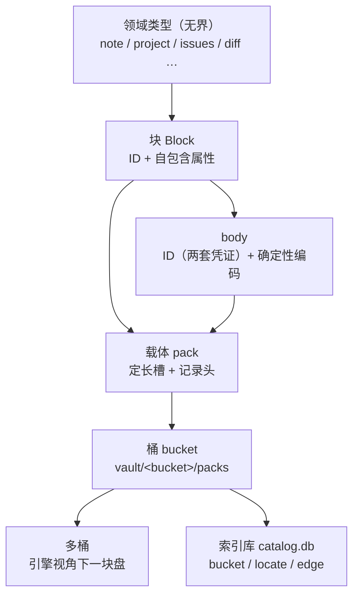

<!-- SPDX-FileCopyrightText: 2026 HanYang06 -->
<!-- SPDX-License-Identifier: Apache-2.0 -->

# L0 · 存储设计（Storage Design）

> Cairn 的最底层存储。本文是**新 L0 的设计事实来源**；旧篇 [`storage.md`](./storage.md)
> 与 [`data-model.md`](./data-model.md) 的存储态章节**待代码交付后清理**，在那之前两者并存时**以本文为准**。
> 上层（领域模型、服务、界面）建立在本文之上。

状态：**草案 v1.2**（2026-09-28 设计定稿；第 1 阶段"载体与记录层"、第 2 阶段"索引库"已落地：
`core/storage/carrier.py` / `record.py` / `io.py` / `tables.py` / `index.py`；落地顺序见 §11）
权威顺序：`代码 > docs/architecture/<具体篇> > <总纲篇> > 记忆 / 其它`（`docs/architecture/index.md`）。

> v1.1 的两处更正来自实现的实测：① 槽区间必须是 `(起始槽, 槽数, 槽内偏移)` 三元组，
> 否则同槽记录的起点无法区分（§5.2）；② 不设封口目录——记录自框定，顺扫即可重建（§5.4）。
> v1.2 补：③ 建表语句由表声明**编译**出来，源码内不出现 SQL（§8.4、§8.6）。

## 0. 摘要

一句话：**块是身份壳，body 是块自带的载荷，桶把块装进定长槽的载体，索引库是入口目录，多桶只是分组。**

| 层 | 一句话职责 |
|---|---|
| ID | 身份与位置：它是什么、在哪儿、谁签发、何时签发 |
| 块 | 身份壳 + 自包含属性；body 靠块记录携带的**ID 摘要凭证**一跳取到 |
| 载体 | 定长槽的追加写文件；记录自带总长与校验和；封口写目录 |
| 桶 | 一个目录，装若干载体 |
| 多桶 | 桶的集合；引擎视角下只有一块盘 |
| 索引库 | 唯一的 `catalog.db`：桶登记、身份到位置的定位、关系边；表结构由配置声明；**内核态可扫载体重建，领域态逐表判档、含不可重建表** |

本文相对旧篇的**决定性变动**：

1. **版本不属于存储**。存储只管 ID、地址、字节；版本归领域。
2. **载体记录自带总长与校验和**，并带 ID 两套凭证：丢索引库也能重建。
3. **物理坐标由定长槽算术推出**，不再作为事实存进库。
4. **一个 vault 一个索引库**，不再一桶一库；桶名是库里的一列。
5. **表声明化为配置**：有哪些表、每张表有哪些列，写在配置里；源码内不得出现建表 SQL（DDL）。
6. **物理地址只存在于可重建的索引投影中**，不进入 ID 与块记录。
7. 索引库裁到**两张内核表**（`bucket` / `locate`）加边表与按需声明的域表；
   `packs` / `body` / `block_type` / 版本表一律不保留。

## 1. 词汇表

| 术语 | 含义 |
|---|---|
| **vault** | 库根目录；内含一个索引库与若干桶目录 |
| **桶 Bucket** | `vault/<bucket>/`，装若干载体；当前只在 vault 目录内 |
| **载体 Pack** | 一个追加写的文件；定长槽；写满封口 |
| **槽 Slot** | 载体内的定长分配单位；小记录同槽共存，大记录跨槽 |
| **块 Block** | 存储单元：身份壳加自包含属性；承载类型由继承类给出 |
| **body** | 块的载荷；内容寻址；不需要 ID |
| **ID** | body 的身份证（两套凭证：分配形态与摘要形态），非裸字符串 |
| **地址 address** | 由 body 内容算出的确定性摘要，回答"是哪份内容"；即摘要形态凭证 |
| **参考位置 locator** | 抽象地址到物理坐标的可重建映射 |
| **索引库 Index** | `catalog.db`；入口目录；派生自载体 |
| **表声明** | 配置中描述一张表的结构（表名、列、类型、约束、索引）的声明；建表由其生成 |
| **记录头** | 载体中每条记录的固定区段：总长、校验和、ID（两套凭证）、槽数 |

## 2. 分层与总体结构



**红线**：L0 不认识 `note` / `project` 这些词。领域语义词只活在 L3；存储只认 ID、地址与字节。

**层间关系**：索引库是**桶的实现组件**，不是与桶并列的一层。由此，多桶对引擎只是分组，
引擎只需回答"这个 ID 在哪个桶"，不需要管理多个库。

## 3. ID

### 3.1 定位

ID 不是"一个字段加一串内容"，而是一个对象：**身份证**。它描述**它在哪**，不描述**它是什么内容**。

### 3.2 字段全集

字段不止于标识本身。ID 是身份证：标注它是什么、在哪儿、谁签发、何时签发。
下表为**字段全集**，逐项给出去留判据。

**身份段**

ID 的本体为**两种形态，各有其作用，并存不取其一**：一套是分配来的唯一标识，一套是由内容算出的摘要。
两者都能拿来当 ID 用，如同一个人既有证件号（分配）又有账号（登记时分配、日常称呼），
互相不替代。派生与分配两种来源并存，是本层刻意的语义丰富，不构成冗余罪。

| 字段 | 含义 | 含于 | 比较 | 去重 | 必需 |
|---|---|---|---|---|---|
| `value_uuid` | 唯一标识形态：签发时分配，与内容无关 | 是 | 有效 | **无效**（每次签发都不同） | 是 |
| `value_hash` | 摘要形态：由内容算出，同内容同值 | 是 | 无效（同内容同值，不可比） | **有效**（同内容即同值） | 是 |
| `name` | 名字；由**所在容器**得出：在 body 里叫 body ID，在块里叫 block ID，在 note 块里叫 note block ID | 是 | — | — | 是 |
| `issued` | **ID 自身**被签发的时间点 | 是 | — | — | 是 |
| `issuer` | 谁签发 | 是 | — | — | 是 |

**位置段**（回答"在哪儿"）

| 字段 | 含义 | 必需 |
|---|---|---|
| `in_bucket_name` | 在哪个桶 | 是 |
| `in_pack_name` | 在哪个载体文件 | 是 |
| `in_pack_path` | 载体所在路径 | 否 |
| `in_file_path` | 文件路径；可为多个（分片跨载体时） | 否 |
| `in_file_name` | 文件名称；可为多个 | 否 |
| `in_file_slot` | 槽位区间：`(起始槽, 槽数)`；可为多段 | 否 |

**来源段**（预留给跨设备；当前无读点）

| 字段 | 含义 | 必需 |
|---|---|---|
| `in_net_ip` | 在哪台机器 | 否（预留） |

三处语义须写清：

- `issued` **不等于**块的创建时间、对象的创建时间、数据的创建时间；它只等于 ID 被建立的时间点。
- 字段并非每一项都在某条代码路径上有读点。**调试、日志与排查是人眼读点**，同样构成保留理由；
  判据是"它是否与 ID 相关"，不是"它是否在关键路径上被读取"。
- 位置段可以比"在哪儿"所需的最小集**更全**。冗余在这里是有意为之：它使 ID 具备自描述与可观测性。
  §3.3 第 6 条给出冗余的边界——冗余只允许出现在 ID 对象内，不允许进入库与载体。

### 3.2.1 ID 的持有者

**ID 是 body 的身份证**：谁有 body，谁就持有 ID；ID 不下沉到更细的结构里。

由此得出两级关系：

| 对象 | 持有 ID | 记录里放什么 |
|---|---|---|
| body | **持有**（内含 `value_uuid` 与 `value_hash` 两套凭证） | 记录头承载完整 ID |
| 块 | 不持有自己的 ID | 它承载 body，故块记录中携带**指向该 ID 的凭证**（摘要形态） |

于是三项同源：块记录里的 body 指针、`locate` 表的 `value_hash` 列、去重键——
**同一个值，只有一个写入者**。块记录里放摘要形态而非分配形态，理由是它与去重键同源，
一格即可同时充当"指向身份"与"内容判重"。

### 3.3 不变量

1. **ID 承载身份与位置**。其中摘要形态与内容寻址共用同一口径（内容变则它变）；
   **物理坐标不属于 ID**（§9.2）。
2. **全局统一**：桶的数量不影响 ID 的形态与有效性。
3. **身份稳定**：内容变化不改变 ID；引用、关系、将来的合并裁决都以它为依据。
4. **同一 ID 恒解析为同一类型**。类型标号由继承类的名字给出（`core/types/kind.py` 的机制），
   库与载体都不写类型标号。落盘只有 ID 与 body，故"ID 到类型"的对应由程序提供。
5. **不认识的 ID 一律降级读回**（按未知类型还原为裸数据），不抛错、不丢弃：
   扫描、重建与合并都依赖它，一处抛错即断整条链。
6. **冗余的边界**：ID 对象内的字段允许冗余与可推导值（用于自描述、日志与排查）；
   但库与载体**只持久化必需子集**（§3.5），可推导值不落盘。

### 3.4 预留

- ID 的**完整体制**（`value_hash` 的算法与 `value_uuid` 的生成规则、编码形态、各类作用域的边界）为**后续专项**。
  本文只锁定 §3.5 的持久化子集与 §3.3 的不变量；格式与编码待 ID 专项裁定。
- `issuer` 在多端同步上线后承担来源区分职责；当前无读点，保留为记录字段。
- `in_net_ip` 及后续可能出现的网络字段为**跨设备预留**。当前无读点，不落盘（§3.5），
  网络与联邦设计成稿时一并定义。

### 3.5 持久化子集

字段全集用于 ID 对象本身（自描述、可观测）；**落盘只用必需子集**。
由桶名与载体名可推出位置，故载体记录头只需承载三项：

| 位置 | 载体记录头取用 | 索引库取用 |
|---|---|---|
| 桶 | 不写（由目录推出） | `bucket` 列 |
| 载体 | 不写（记录就在这个文件里） | `pack` 列 |
| 槽 | `slot_count` | `slot_start` / `slot_count` |
| ID 两套凭证 | `value_uuid` + `value_hash` | `value_uuid` / `value_hash` |
| 类型 / 时间 | 不写（由程序给出） | `kind` / `created` |

由此得到两条：**载体记录头只带最小集**（总长、校验和、ID 两套凭证、槽数，见 §5.3）；
**`in_pack_path` / `in_file_path` / `in_file_name` / `in_net_ip` 不落盘**——
前三个由"桶目录 + 载体名"推出，后者（网络字段）待跨设备设计。

## 4. 块与 body

### 4.1 类型无界

`Block` 的子类**数量不设上限**：note block、project block、issues block、diff block 等，
形态由继承层级声明；存储对子类数量与新增速度无感。

此处"子块"指**类型继承的无界**，**不是块嵌套**。跨块关系走 ID 引用或关系边（§7），块内不装块。

### 4.2 属性自包含

块自身承载列表与筛选所需的一切：类型、标题、标签、时间。因此**索引库不必为每种类型建表**，
也不必复制块内数据。领域表天然是少数派——只有确实需要可查询面的东西才建表（关系、将来的检索）。

### 4.3 body 的自由与约束

body 的承载结构**不收窄**：字符串、列表、字典，以及文本化与二进制化形态。
自由的对象是**结构**，不是**字节**：任何 body 类型都必须提供**确定性规范化**，
否则同一逻辑内容会算出不同地址，去重失效、占用回升。

规范化必须满足：同一逻辑内容恒得同一摘要；编码与实现无关；版本可辨。

### 4.4 body 与 ID

body 由**地址**定位，同时**持有 ID**（§3.2.1）：
摘要形态使同内容可判重，唯一标识形态使同内容也能被区分与引用。

故 body 不因"靠地址定位"而失去身份；相反，地址本身就是它两套凭证之一。
块不持有自己的 ID，它携带的是指向该 ID 的凭证。

## 5. 载体与槽

### 5.1 布局

```
vault/
  catalog.db                 # 索引库（唯一）
  <bucket>/
    packs/
      <随机名>               # 载体：追加写；定长槽；写满封口
```

文件名为随机串（无语义、无顺序号）；载体名是"在哪个文件"的答案，其真源是文件系统本身。

### 5.2 定长槽与算术寻址

- 槽长固定（`storage.pack.slot_bytes`），故槽 n 的字节偏移**由算术得出**，无需枚举；
- **槽是记账与定位单位，不是写入对齐单位**：记录紧接前一条连续写入，只有"起点"取整到槽边界；
- 一条记录的位置是三元组 **`(起始槽, 槽数, 槽内偏移)`**。第三项不可省——
  若只记 `(起始槽, 槽数)`，两条同槽记录的起点会撞在同一字节上，读第二条会读出第一条的头部；
  带上槽内偏移后，**字节偏移与槽区间互为逆运算**，故索引里无需另存偏移；
- 槽数由记录长度与槽长推出（向上取整，至少 1），不单独记账；
- **小记录同槽共存**，只有装不下才跨槽；跨槽表示该记录占用连续的一段槽；
- 由此得到一条设计边界：**物理坐标是投影，不是事实**。压缩、合并与搬移只改"抽象地址到物理坐标"的映射，
  不改记录所携带的任何内容。

### 5.3 记录头

载体中每条记录的结构如下（长度均指字节）::

    +----------------+------------------+---------------------+----------------+
    | total_len (4)  | checksum (64)    | id (canonical CBOR) | payload (rest) |
    +----------------+------------------+---------------------+----------------+
     大端无符号        摘要十六进制        落盘子集，长度自报        记录内容

头的**四项语义**：

| 字段 | 作用 |
|---|---|
| 总长 | 自框定：记录无需外部索引即可切出，故顺扫即可重建 |
| 校验和 | 载荷的摘要凭证；自校验，且与 ID 的内容凭证同源 |
| ID | 身份与定位（两套凭证 + 名字 + 签发信息 + 桶与载体） |
| 槽数 | 占用范围；由总长与槽长推出，存一份作自校验 |

四条约定：

1. **总长在最前**：故记录自框定，顺扫一遍即得全部 `(ID, 载荷)`；
2. **ID 段取落盘子集**（§3.5）：不含路径 / 文件名 / 网络，也**不含物理坐标**；
3. **校验和覆盖载荷**：一次比较同时验"读到的是不是原文"与"ID 声明的内容与实际内容是否一致"；
4. **类型标号不落盘**：类型由程序按 ID 给出（§3.3 第 4、5 条）。

记录头使**载体自描述**：内核态下索引库丢失后，扫描载体即可重建（域介入后的范围见 §8.5）。
这是档一可重建成立的前提。

### 5.4 封口与目录

- 写满即封口；
- **封口不留标记**：没有封印字节、也没有封口文件——"已封口"就是"该载体已达到封口线"。
  故封口是**策略判断**，不是落盘状态：配置改了它自然跟着改，也不会出现"标记与事实不符"；
- **活跃载体＝有空间的最满者**（一个都没有就新开一个）。写入纪律是"写到满才换"，
  故这个判据不依赖时间戳，也不依赖载体名顺序（名字是随机的，见 §5.1）；
  封口线被调大后可能不止一个载体有空间，此时按同一判据仍只有一个答案；
- 封口线只管**换不换文件**，不构成硬上限：单条记录大于封口线时照样完整写入
  （否则大记录永远写不进去）。槽长则是格式事实，写在文件头里（§5.5）；
- **不设封口目录**：记录自框定（总长在最前），故顺扫即可重建定位，
  目录只是"少读一遍"的性能优化，不承担"能不能读出来"的职责；
- 将来若确需加速，目录写入**文件尾**（追加写模型下文件头无法就地增长），
  且必须**可重建**：目录与记录不一致时以记录为准。该优化列为**预留**（§12）。

### 5.5 载体文件头

文件开头是定长的载体文件头（当前 24 字节）：

| 字段 | 作用 |
|---|---|
| 魔数 | 认得出"这是载体、且是第 1 版布局"；不符即报错，不猜 |
| 槽长 | 该载体的槽长；**故载体自描述**，只拿到一个文件也能算偏移 |
| 预留 | 置零；将来加字段不必改已有布局 |

槽长随载体走（而非全局唯一）：不同批次的载体可以不同槽长，而每个载体自身仍可精确算术定位。
**写入时定、读取时从文件头读**——这条与 §5.6 第 2 条互为因果，是"物理坐标只是投影"的前提。

### 5.6 配置参数

| 键 | 默认 | 含义 |
|---|---|---|
| `storage.pack.max_bytes` | 2 GiB | **封口线**：单个载体写满这个字节数即换新载体 |
| `storage.pack.slot_bytes` | 64 KiB | 槽长：定长分配与定位单位 |
| `storage.block.max_bytes` | 1 MiB | 分片粒度：单块超过即切片 + 索引块 |

三条规矩：

1. **封口线与槽长是两个旋钮**。封口线只管"什么时候换文件"，槽长只管"怎么定位"；
   不从封口线推槽长（否则改一次容量参数就改掉落盘布局）；
2. **槽长只在建载体时读一次配置**，随后写进载体文件头；**读取永远从文件头读**。
   否则改一次配置，已落盘载体的偏移会全部错位；
3. **不设"每载体最多多少块"**：容量由槽计量，块数是派生视图，多一个旋钮就是多一处自相矛盾。

**格式常量不进配置**：载体魔数、文件头长度、记录头布局改了就坏库或换格式，
它们留在实现处（`core/storage/carrier.py`）。配置里出现一个代码不读的键，比没有这个键更坏。

槽长与封口线的具体取值仍为**待定**（由实验确定；见 §12）。

## 6. 桶

- 桶是 `vault/` 下的一个目录，内含 `packs/`；
- **判据是形状而不是"是个目录"**：vault 下带 `packs/` 的直接子目录才算桶。
  库里还会有别的东西，见目录就当桶会把它们卷进来；
- **当前桶只在 vault 目录内**，不预留外部形态（换盘、远端等），需要时再作增量设计；
- 桶名进入 ID 的 `in_bucket_name`；索引库中桶名是一列；
- **桶名就是桶的地址**（目录名）：取人话（`main`）或取 ID 形态，对路径式查询没有区别——
  先查桶、再按槽区间读块，两跳都是查表。桶**不持有 ID**：ID 是 body 的身份证（§3.2.1），
  桶是容器，它的标识就是它的名字；
- 桶目录本身即桶的存在证明，索引库的桶表是**登记**而非真源；登记一旦写下，
  再取同一个桶**不改写**它（登记记的是"第一次见到它"的时刻与形态，改形态是显式动作）；
- **桶没有自己的配置**：槽长随载体走（写进文件头，§5.5），封口线是策略（每次写入按当前值判）。
  故"桶"这一层是无状态的：目录拷到哪里都成立，索引库丢了也能顺扫回来；
- **读路径不建桶**：目录不见了就报错，绝不悄悄建一个空桶顶上——那会把"数据没了"
  伪装成"这里本来就是空的"。

## 7. 多桶

- 物理上是多个桶，**引擎视角下只有一块盘**：引擎只需回答"这个 ID 在哪个桶"；
- **同一个 vault 只有一个索引库**。索引库的承载量与其体量相称（定位行与边行），
  按桶切分为多个库文件不带来收益；
- **路由**（已落地）：写入按桶名分组，读取按记录行里的桶名开桶——故"多桶"对上层
  只是**一次分组**，此后全是"按槽区间读块"这一件事；
- **登记对账**（已落地）：目录是事实、登记是投影。目录里有的补登记；
  登记里有的、目录里没有的**只报告不删**（与"多出的列不静默删除"同一口径）；
- **合并**：以源桶的载体为真源，把记录镜像进目标桶。内容面天然幂等（同地址只存一份）；
  身份面若同一 ID 在两侧同时存在，按 `issued` 裁决取较新者；语义冲突交回领域处理
  （存储不承载版本，见 §9）；
- **短时并发**：并发以**短命桶**承接，事件结束后合并回主桶并销毁短命桶。
  短命桶若不在合并后销毁，文件数将随并发次数单调上升，与"控制文件数"的目标相反。

上述**合并与短命桶列为未来项，短期不做**（`BucketRole.TRANSIENT` / `BucketState.MERGED` 只占位）。
理由：并发承接本身不是当前瓶颈，"文件数随并发次数上升"这个问题在没有并发写入之前不会出现；
而它一旦要做，就要顺带裁定下面这条。

其与"唯一索引库"的接线（合并期桶归属的改写）随之**一并推后**，取舍如下——
镜像一条记录进目标桶之后，`record.bucket` 该写哪一个：

| 取法 | 理由 | 代价 |
|---|---|---|
| 改写为目标桶 | 桶名只是投影，改写不影响可读性；路由与"记录实际在哪"始终一致 | 需要一次"改写归属"的动作，且两桶若同时存在则指向其中一边 |
| 保留源桶 | 记录确实还在源桶里，写目标桶与事实不符 | 目标桶里出现"指向源桶"的行，销毁源桶的行必须先把归属搬完 |

在合并动工之前不裁定，免得把一次取舍固化成数据格式。

## 8. 索引库

### 8.1 定位

索引库是**入口**，不是中枢。一次查询交出 ID，其后所有工作在块上完成。故库内只保留
"能被快速筛出来"的东西，正文、样式、图形、资产一律不进库。

### 8.2 表

**声明是本体的那份 YAML**（`config/settings/core/storage/tables.yaml`），下面只是速览::

    record   value_uuid PK | value_hash | kind | bucket | pack |
             slot_start | slot_head | slot_count |
             size | issued | created | updated
    bucket   name PK | role | state | created
    edge     id PK | src | dst | kind | domain | created

- `record`：**身份到位置**，一行一条记录（块记录与内容记录同表，靠 `kind` 与
  "`value_hash` 指的是载荷本身还是它携带的内容"区分）。
  主键 `value_uuid`；`value_hash` 建**非唯一**索引，故"这份内容被哪些记录引用"一次查得到（去重与反查同一处）。
  位置即 `(bucket, pack, slot_start, slot_head, slot_count)`——五项齐全才与字节偏移一一对应（§5.2）；
  `size` 存记录字节数（便于估算与巡检），长度本身仍由槽数与记录头收敛。
- `bucket`：桶登记（角色、状态、建立时间）。位置由桶名推出，故不存路径；真源是桶目录。
  **本表可整体重建**（扫 vault 下的桶目录即得），故"登记行丢了"不是数据损失。
- `edge`：关系边（一等行）。**边身份由 `(src, dst, kind, domain)` 算摘要**，故同一关系重复写不产生第二行。
  其可重建性取决于关系数据本身何在：若关系落在块内，则本表由载体派生、属档一；
  若关系只由用户在库内建立，则本表即真源、不可重建（§8.5 档三）。该归属为**待定**（§12）。
- 域表：确实需要可查询面者按需声明（关系已在其一；检索为其二），走同一套声明机制。

索引：`record` 上按 `value_hash`（地址反查）、`kind`（类型筛选）、`(bucket, pack)`（按载体归拢）、
`updated`（时间排序）；`edge` 上按 `(src, kind)`（出边）与 `(dst, kind)`（入边 / 反查）。
索引名由列组合推出（`idx_<列>_<列>`），不手写，免漂移。

### 8.3 索引

按入口职责建立：按类型、按时间、按 `value_hash`（地址反查）、按 `src` / `dst`（拓扑）。

### 8.4 表声明

- **表的建立由配置声明**，源码内**不得出现建表 SQL**：声明的数据模型在 `core/storage/tables.py`
  （表名 / 列 / 类型 / 约束 / 默认值 / 索引 / 重建档 / 说明），建表与建索引语句由其
  **编译**（`Table.ddl()`）——方言只出现在编译器一处；
- **类型词汇中立**：只认文本 / 整数 / 实数 / 二进制 / 布尔五种，加新类型要过声明层，
  于是"能不能落盘"是设计问题，而不是写一句 SQL 就能决定的事；
- **登记即事实、重复即报错**：同名表声明重复且内容不一致直接抛错，不静默覆盖；
- **配置是声明本体**：表声明落在配置项 `storage.db.tables` 所指的那份 YAML 里
  （一项一张表），人写得出来、改得动、评审时一眼读完；代码只负责**读、校验、编译**。
  解析口对未知项、非法类型、重复表名一律报错，不静默忽略；
- 声明分布遵循"各管各的"：内核表写在存储自己的声明模块内，域表写在域自己的声明模块内；
- **建表只在开库与挂载时进行**，不在读写路径上，避免热路径反复执行 DDL 与提交；
- **对比与判定**：声明与实际不一致时按差异分类处置——缺失即建，缺列即补，索引不符即建索引，
  多出的未声明列与未声明的表只告警、**不静默删除**；列的类型或约束改变属容器级不兼容；
- **破坏性动作必须显式授权**：重建**默认拒绝**（报错并列出待重建的表），
  调用方须显式给出 `RebuildPlan(tables=…, reason=…)` 才执行；授权未覆盖到的表同样拒绝；
- **用户可加不可改**：允许新增列、新增索引与默认值；改类型、改约束、改主键、删带约束的列一律拒绝启动。
  破坏性变更只来自发版本身；
- 领域表按需**增量构建**：领域把自身所需的表声明出来，由存储按上述流程对齐。

### 8.5 可重建的范围（分档）

**"可重建"是逐表的性质，不是索引库整体的性质。** 索引库随领域介入而改变性质，
故必须分档说明，不得笼统宣称"纯投影"。**每条表声明都必须写明自己属于哪一档**：
写不出重建来源的表就是不可重建表，必须纳入备份（声明层会直接拒绝含糊的档）。

**档一 · 内核纯净态 · 可重建**
内核自有表与由载体派生的行：桶登记、定位（`record`）、由载体推导出的关系。
重建路径：遍历 vault 下的桶 → 扫描各桶载体 → 读记录头 → 重建。此档损坏可由重建修复。

**档二 · 领域加持态 · 大部分不可重建**
一旦领域挂载，索引库即增量加入领域专项表。这些表与物理存储**可以没有对应关系**，
其中来源于载体的部分可由载体重算（仍属可重建），而**真源就在库内的部分无法由载体推出**。
此档一旦损坏且无备份，即为**永久性损失**，重建不成立。

**档三 · 备份**
"库可重建"在领域态下是伪命题，故**备份是必需能力**，而不是可选项。

**归属判定表**

| 表 | 可重建 | 重建来源 |
|---|---|---|
| `bucket` | 是（档一） | 桶目录（§6） |
| `record` | 是（档一） | 载体记录头 |
| `edge` | 是（档一） | 关系数据在块内时的块记录；见 §8.2 注 |
| 领域专项表 | 逐表而定 | 声明其重建档与来源 |
| 真源在库内的表 | **否**（档三） | 无；只能靠备份 |

**两条硬规约**

1. **逐表声明重建档**：新增任何表，声明中必须写明它属于哪一档、重建来源是什么。
   写不出重建来源的表，即为不可重建表，纳入备份范围。
2. **可重建不得覆盖真源**：同一事实若已有真源（载体或块），库内那一份只能是派生。
   反之，库内可以存在真源，但它就丧失了可重建性——两者不可兼得，必须明说。

**档一的重建是"形状可重建"，不等于"每个格子都能还原"**：`record` 的身份、两套凭证与
签发时刻都在记录头里，故能顺扫回来；但 `kind`（类型由程序给出，§3.5）与落盘时刻不在记录头里，
重扫只能给空值。故落地时的口径是**只补缺行**：已有行一律不动，缺行按"类型未知"补回
（未知类型本就降级读回，§3.3 第 5 条）。清空重扫须由程序按 ID 给出类型，属 ID 专项（§12）。

例外须写明：桶当前只在 vault 目录内，故桶登记可扫描回来；一旦引入 vault 外的桶形态，
必须另有一份清单兜底，否则档一也将出现例外（§6）。

### 8.6 数据库配置

**库里有哪些表、每张表有哪些列，全部由配置声明**，不再硬编码于源码。

**声明面**分三处，遵循"各管各的"：

| 声明面 | 内容 | 归属 |
|---|---|---|
| 内核表 | `record` / `bucket` / `edge` | `config/settings/core/storage/tables.yaml` |
| 通用表 | 确实需要可查询面者 | 同上 |
| 领域表 | 领域所需表的增量声明 | 同上，标 `owner: domain` |

**位置约定**：`config/<hub>/<包树>/<文件>`——与配置引擎的镜子约定一致
（`src/core/storage/conf.py` ↔ `config/settings/core/storage/`），故结构描述与同一包的标量配置
**分文件、同约定**，谁也不挤谁。仓根的 `config/theme/` 与 `config/shapes.json` 是另一类东西
（运行期资产，随程序分发、不进投影树），用途不同、互不冲突。

**配置端支持文件引用**（已落地）：配置项可以声明 `file_type`，此时
**它的值是一个引用名，值本体是被引用文件的内容**，值文件里只留这一行：

```jsonc
"storage.db.tables": "tables.yaml"
```

- 引用名**相对值文件自己所在目录**解析，默认即同层级的 `<字段名>.<类型>`；
  于是写法像 `import`，整棵配置树搬到哪里都成立（绝对路径绑死本机目录，配置文件要跟仓走，故只收相对引用）；
- 值文件里那一行**是事实、不是装饰**：改成别的相对路径即换文件，引擎不会把它改回去；
- 扩展名决定解析器：`yaml` 走安全加载，其余按 JSON；
- **文件缺失或解析失败即报错**，不退回默认——"写坏了"与"没写"必须可分；
- 该声明带值注册是禁止的（值在文件里，不设第二处默认）；
- 词表侧按**字符串**出（它确实是字符串），被引用文件的类型记在 `x-cairn-file-type` 上；
  照内容类型出词表会让值文件当场显示成错的。

**为什么结构描述用 YAML 而不是 JSON**：表声明不是标量、也不是生成物，它要人写得出来、
改得动、能写注释。JSON 写这个形态全是引号噪声、注释都没有；YAML 缩进即层级、可加注解。
故结构本体放 YAML，标量配置仍走 JSON 投影。

**声明内容**（每条表声明）：表名、`doc`、`tier`（重建档）、`owner`（归属）、
`rebuild_from`（重建来源）、`columns`、`indexes`。

**类型词汇中立**：只认有限的几个类型名（文本 / 整数 / 实数 / 二进制 / 布尔）与有限的约束开关
（主键 / 唯一 / 非空 / 默认值）。建表语句由声明**编译生成**，故源码内不出现方言与建表语句。
时间不另立类型：一律是整数（unix 毫秒），与全库口径一致。

**校验在解析口**：未知项、非法类型、重复表名、缺必填项、档三写了重建来源——一律报错，
不静默忽略；**文件缺失或写坏也报错**，绝不退回内置默认（否则"表丢了"会被伪装成正常启动）。

**这不锁死可扩展性**：解析器与编译器里**没有任何表名或列名的硬编码**，
加一张表、加一列都只是改 `config/settings/core/storage/tables.yaml`（领域表亦同）。锁死的只有"表声明长什么样"这件事。

**开库时的比对**：库内 `meta` 存一份声明的规范化描述（列与索引按名排序），
开库时与当前声明比对，不一致即报错（防"代码与库脱节"）。
### 8.7 巡检与处置

- **巡检**（`Vault.patrol`）：比对索引库与其声称的真源（桶目录、载体、记录头），
  **只报告、不动库**。两个方向都比——盘上有、库里没有，与库里有、盘上读不出来，
  是两种不同的毛病，修法也不同；
- **分类即处置依据**：可按"能否由重建修复"分成两类，因为档一的重建口径是**以载体为真源**
  （§8.5）。发现分五种：

  | 发现 | 含义 | 可否由重建修复 |
  |---|---|---|
  | `unregistered_bucket` | 桶目录在、登记缺 | 可（补登记） |
  | `missing_row` | 盘上有记录、库里没有行 | 可（按记录补行） |
  | `misplaced` | 行在、身份对得上，但坐标与载体里的实际位置不符 | 可（改坐标） |
  | `missing_record` | 行在、盘上读不出来（载体没了，或盘上只剩该身份的其他版本） | **否**：内容真的没了 |
  | `missing_bucket` | 登记在、目录缺 | **否**：桶没了 |
  | `corrupt_carrier` | 载体读不到底（截断 / 校验失败） | **否**：坏点位置只有人看得出来 |

- **处置**（`Vault.repair`）：只动"可修复"那一列，且**只补不删**；
  不可修复项一律不碰——删行等于把"丢了东西"这件事抹掉，只能报告，交由备份与人工；
- **同一身份在盘上出现多次不算差异**：更新留下的旧副本要等压实回收（§12），
  它不影响"行指向的那一份是否成立"；行指向的那一份确实没了，才报 `missing_record`；
- **坏点即停属于重建，不属于巡检**：重建拿到半份结果不能当结果，故遇错即抛；
  巡检要接着看完——"还坏在哪儿"正是它要回答的问题，故按载体捕捉、其余照扫；
- 巡检的覆盖面受重建档约束：档三的表不参与"与真源比对"，因为无真源可比。

## 9. 横向规约

### 9.1 版本不属于存储

存储只管 ID、地址与字节。历史、回放、压实是领域策略，**不进存储**。
内容变化的记录由领域承担；存储不因此新增表、列或机制。

### 9.2 物理地址的归属

- 进入 ID 与块记录的只能是**稳定身份与摘要凭证**；
- **物理坐标只存在于可重建的索引投影中**。凡"哪个载体第几字节"的记录，一律视为当前布局的投影，
  布局变动即重写，不作为事实被信任。

### 9.3 失败处理

失败必须显式抛出，不得把落盘失败读成成功。存储不得吞掉机制性错误。

### 9.4 工程纪律

- 记录与索引的重建口径必须唯一：同一事实不得存在两个写入者。
- 能派生的不存，能算的不写，能扫的不记。

## 10. 已裁剪的决定

以下概念在本设计中**不存在**，不得复活：

| 已裁 | 理由 |
|---|---|
| 存储承载版本（版本引擎、版本表、保留窗） | 版本归领域；存储不承担历史 |
| 手工版本号（块格式号与各域结构的模式号） | 无读点的标记；发版本身即变更事件 |
| 类型码表（整数枚举） | 类型由 ID 与继承类给出，重复 |
| `packs` 表 | 载体元信息可由文件系统与记录头得出 |
| 独立的内容池表 | 地址到位置的映射即去重池，无需另立 |
| 库中存物理坐标作为事实 | 物理坐标是投影 |
| 一桶一库 | 库体量小，单库即可；一个 vault 一个库 |
| 源码内建表 SQL | 表的建立由配置声明；声明内容为表、列、类型、约束与索引 |
| 载体中的类型标号 | 类型由程序给出；不认识的 ID 降级读回 |
| 块嵌套 | 跨块关系走 ID 引用或关系边 |
| ID 内承载内容或地址 | ID 不承载**物理坐标**；摘要形态是两套凭证之一，与内容寻址同源 |
| 单一身份本体 | 两套凭证并存：分配形态与摘要形态，各有其作用 |

## 11. 落地顺序（代码）

1. **基础类型与异常**：身份与地址的类型、槽与位置的类型、存储侧异常。
2. **字段定义**（关键一步，字段不清则后续失序）：ID 字段、块字段、记录头字段、
   索引库各表字段、配置声明字段。**配置属于这一步**。
3. **字段审核**：由项目负责人审核字段定义。
4. **后续逻辑**：载体读写、索引库与表声明、桶与多桶、重建与巡检。

第 4 步的进度（按片推进，每片可单独回退）：

| 片 | 内容 | 状态 |
|---|---|---|
| 载体读写 | 槽布局、记录、载体文件、顺扫 | 已落地 |
| 索引库 | 对比 → 分类 → 处置、表声明与配置通道 | 已落地 |
| 桶与多桶 | 单桶读写、多桶路由、桶登记与对账 | 已落地 |
| 合并与短命桶 | 镜像、归属改写、销毁 | 未来项，短期不做（见 §7） |
| 重建与巡检 | 档一补缺行、与真源比对 | 已落地（`Vault.patrol` / `Vault.repair`） |

审核通过前不进入第 4 步。旧篇（`storage.md` 与 `data-model.md` 的存储态章节）
在代码交付完成后清理；旧层（`catalog` 与旧 `Bucket`）的退役在接线完成后进行。

## 12. 待定与预留

| 项 | 状态 |
|---|---|
| 槽长与载体字节上限的具体取值 | 待定（由实验确定） |
| 封口目录（加速定位用；记录已自框定，故属优化而非必需） | 预留 |
| 合并与短命桶（承接并发写入，合并后销毁） | **未来项，短期不做**（作者 2026-09-28 定：无所谓，记下即可） |
| 合并期桶归属的改写（改写为目标桶 / 保留源桶） | 随合并一并推后（取舍见 §7） |
| 表声明与配置引擎的通道 | **已落地**：配置端支持文件引用，表声明本体即那份 YAML（§8.6） |
| `edge` 的重建档（关系数据落在块内，还是仅在库内） | 待定（随关系归属裁定） |
| 权威重建（清空重扫）如何还原 `kind` | 待定：记录头里没有类型（§3.5），须由程序按 ID 给出，属 ID 专项 |
| 备份（库内不可重建部分的备份方式与时机） | 预留（领域态落地前必须补） |
| ID 完整体制（生成规则、编码形态、作用域边界） | 预留（专项） |
| 跨设备字段（`in_net_ip` 及后续） | 预留（网络与联邦成稿时定义） |
| 检索 | 预留：索引为派生投影（重建档随表声明）；引第三方库须过许可关（MIT / BSD / Apache，禁 GPL / AGPL） |
| 桶的 vault 外形态 | 预留（需要时增量设计） |
| 压缩与空洞回收 | 预留（与槽的复用一并设计） |
| 事务（一次写入同时落字节与目录行） | 预留：当前是"先落字节、后记目录"，中途失败留孤儿字节，由档一重建收编 |
