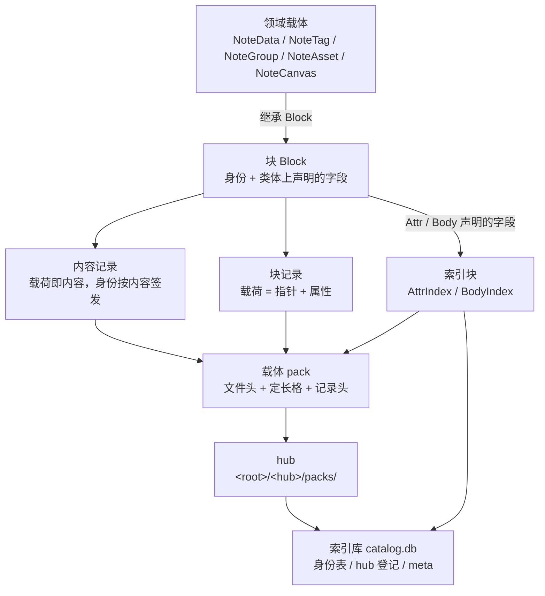
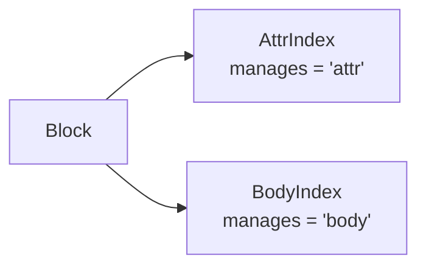

<!-- SPDX-FileCopyrightText: 2026 HanYang06 -->
<!-- SPDX-License-Identifier: Apache-2.0 -->

# L0 · 存储设计（Storage Design）

> Cairn 的最底层存储。本文是 **L0 存储的唯一事实来源**；旧篇 `storage.md` 已删除。
> 上层（领域模型、服务、界面）建立在本文之上。

状态：**现行**（2026-10-02 按整条重写后的存储层回写）。

口径与实现一一对应，落点如下：

| 篇中的东西 | 实现处 |
|---|---|
| 格与格算术 | `py_src/core/storage/slot.py` |
| 载体：文件头、记录框定、追加写、顺扫 | `py_src/core/storage/pack.py` |
| hub：挑活跃载体、封口换份 | `py_src/core/storage/hub.py` |
| 存储引擎：块 ↔ 记录 | `py_src/core/storage/engine.py` |
| 索引库与身份 | `py_src/core/storage/db/` |
| 两类索引块 | `py_src/core/storage/index/` |
| 字段落点声明 | `py_src/core/storage/types.py` |
| 存储那一层的配置声明 | `py_src/core/storage/conf.py` |
| 字节回收 | `py_src/core/storage/gc.py` |
| 内核装配与命令面 | `py_src/core/init.py`、`py_src/core/api.py` |

**未落地项**（§11 列全）：领域载荷的规范化字节层（`py_src/model/note/format/`）、
跨行事务、备份、重建与巡检的显式入口。

权威顺序：`代码 > docs/architecture/<具体篇> > <总纲篇> > 记忆 / 其它`（[架构索引](index.md)）。

## 0. 摘要

**块继承 `Block`，字段在类体上声明落点；一个块落成两条记录；库的结构只有一条来路：ID；
索引直接继承 `Block`，与任何块平级；字节由 GC 回收。**

四层各管下一层，外加两处辅助：

| 层 | 管什么 | 实现处 |
|---|---|---|
| 格 | 一个文件内的等长格：算术定位 | `slot.py` |
| 载体 | 一个文件：记录框定与身份、追加写、顺扫 | `pack.py` |
| hub | 一个目录：挑活跃载体、封口换份 | `hub.py` |
| 存储引擎 | 块 ↔ 记录：分配、编码、落盘、读回 | `engine.py` |
| （辅助）数据库引擎 | 索引库：一个类型一张身份表、`hub` 登记、`meta` | `db/` |
| （辅助）索引 | 两类索引块：`AttrIndex`（属性）、`BodyIndex`（内容） | `index/` |

`gc.py` 与四层走**同一条路**（hub / pack / slot），只是换一套判据；它是引擎的另一种确定性形态，
入口是模块级的 `sweep(engine)`（§8.6）。

本文相对上一版的**决定性变动**（2026-10-02 值范式落地）：

1. **字段声明写在类体上**：`title: str = Attr("")`（可索引，进反表）、
   `lines: list[str] = Body([])`（进内容记录）、裸赋值（照样落盘，没有索引加持）。
   **没有 `indexed=` 这个开关**——用了 `Attr` 就是要索引。
2. **表名只由类名算出**（`type(self).__name__.lower()`）：没有 `__table__`，没有覆盖口子。
3. **没有表结构声明文件**：`config/tables.yaml` / `type.yml` 不再被读写。
   库的结构由"这个类型用没用 ID"决定。
4. **索引块与任何块同路**：`AttrIndex` / `BodyIndex` 直接继承 `Block`，各有自己的身份表。
5. **正表存在索引块的载荷里，反表在读的时候现算**：反表**不落盘**。
6. **删除 = 追加一条墓碑 ＋ 摘掉索引行**；字节由 GC 回收（`sweep`，§8.6）。
7. **内核不再有 `store` / `patrol` / `repair` / `compact` / `reindex` / `survey` / `locate`**：
   写由块自己发起（`block.save()`），命令面是读与诊断；回收是模块级的 `sweep(engine)`。

## 1. 词汇表

词的定义以本文与代码为准；简表另见[术语表](../reference/glossary.md)。

| 术语 | 含义 |
|---|---|
| **vault** | 库根目录；内含一个索引库与若干 hub 目录 |
| **hub** | `<root>/<hub>/packs/`，装若干载体；`packs/` 的存在即"这个目录算 hub"的判据 |
| **载体 Pack** | 一个追加写的文件；定长格；写满封口线即换新的一份 |
| **格 Slot** | 载体内的等长分配与定位单位；一条记录至少占一格 |
| **格区间 SlotRange** | 一条记录占的**头格与末格**两个整数，闭区间；字节偏移由算术得出 |
| **记录 record** | 载体里的一条自框定记录：总长 ＋ 校验和 ＋ 身份段长度 ＋ 身份段 ＋ 载荷 |
| **块 Block** | 存储单元的基座：拿到 ID 才有表、才能落盘与读回 |
| **内容记录 / 块记录** | 前者载荷即内容、身份按内容签发；后者载荷是指向内容的指针加属性。判据在载荷的保留键 |
| **ID** | 身份本身：两套凭证 ＋ 名字 ＋ 签发时刻 ＋ 位置段（`db/id.py`） |
| **身份表** | 一个用了 ID 的类型在库里占的那张表；表名＝类型名，列＝`ID_FIELDS` |
| **索引库 Index** | `<root>/catalog.db`；身份到位置的定位，加两类索引的正表；**可重建的投影** |
| **墓碑 tombstone** | 追加在载体末尾的一条机制记录，标记某个载荷摘要已被删除 |

## 2. 分层与总体结构



**红线**：L0 不认识 `note` / `project` 这些词。存储只认 ID、字节与格；
领域语义只活在领域类与载荷里。

**两个引擎，分工不重叠**：

- **存储引擎**（`engine.py`）面向载体：管 hub、写字节、读字节，**不认识数据库**；
- **数据库引擎**（`db/engine.py`）面向索引库：管行、建表、按身份查位置，
  **不认识 slot / pack / hub**。

两者只经"身份"接头。

## 3. 字段的落点

字段进哪一边，由**类体上的声明**定（`storage/types.py`）。三条判据：

| 写法 | 落点 |
|---|---|
| `title: str = Attr("")` | 进块记录载荷的属性，**并且进反表**（能按它的值查回块） |
| `lines: list[str] = Body([])` | 进**内容记录**（按内容地址去重） |
| `self.title = ""`（裸赋值） | 照样进块记录载荷，**没有索引加持** |

```python
class Note(Block):
    title: str = Attr("")  # 声明在类体上
    lines: list[str] = Body([])


note.title = "标题"  # 实例里存的是裸值
assert note.title == "标题"  # 读出来也是裸值
```

三条语义，缺一条这套写法就不成立：

1. **类体上的声明就是声明**：它描述落点，不是"所有实例共用的一份值"；
2. **实例的值存在实例自己的 `__dict__` 里**：`note.lines.append(...)` 改的是这个实例的列表，
   既不污染类属性，也不串到别的实例（容器默认值在实例第一次取值时现拷一份）；
3. **声明活得比赋值更久**：`note.lines = [...]` 只换值，落点仍由类体上的声明说了算。

**`Attr` 与 `Body` 是描述符，不是类型判据**：类型只活在注解里（mypy 用），运行期不认注解。
`Attr` 只对标量有意义——容器不可哈希，按它查只能是"包含"式。

**声明必须放类体、不放 `__init__`**：放进构造里，那个实例字段的静态类型会变成声明类型，
此后 `note.title = "标题"` 与它不符。

**普通赋值照样落盘**：`_fields_of` 会并上实例上多出来的公开字段（`_` 开头与 `id` 除外），
故"声明了却不索引"是个假问题——不要索引就不要声明。反过来，**没显式赋过值的声明字段也在
落盘之列**：声明一律取出（取值即触发描述符给出那份默认值），否则"带默认值就存"的字段会被整个漏掉。

## 4. 块与身份

### 4.1 基座：`Block`

```python
self.id = ID(self)  # 调用方签发身份
note = Note(self.id)  # 递给基座
note.title = "标题"
note.save()  # 引擎接手：分配、编码、落盘、回填摘要与位置
```

**身份由调用方给**，只有两条路，都写在 `Block.__init__` 一处：

- `self.id = ID(self)` 自签，再 `super().__init__(self.id)` 递给基座；
- 或把签好的递进来（`Note(self.id)`）。

**零参构造也是一个块**：`Block.__init__(id=None)` 会自己现签一个（`ID(self)`）。
`AttrIndex()` / `BodyIndex()` 走的就是这条路——索引块自己签身份，于是它自然进库、有表。

**没有 ID 就没有一切**：不递 ID 的对象不入库、不建表、不产生任何关系。

`Block` 上的能力（`save` / `fetch` / `find` / `delete`）经模块级的一根线接到库上
（`bind(engine)`）：**一个进程接一个引擎**，绑了别的库即报错，`close()` 解开。
理由是引擎（哪个库根、哪个 hub）是**运行时**的事实，而类定义在 import 时就发生了。

### 4.2 表名

**表名只由类名算出**：`type(self).__name__.lower()`。`class NoteData` → `notedata`。

没有第二个口子：**不提供 `__table__` 一类覆盖**，也没有声明文件。
身份的名字（`ID.name`）与它同一个来源（`ID(self)` 解析持有者）。

领域专属的类型以**域名开头**（`NoteData` → `notedata`），故 `project` 那边可以做出
同名概念而互不相干，两张表不会撞。

### 4.3 `ID` 的字段

| 字段 | 何时定 | 之后 |
|---|---|---|
| `value_uuid` | **创建那一刻**（`uuid4()`） | 锁死（只读属性） |
| `birth_time` | **创建那一刻**（unix 纳秒） | 锁死（只读属性） |
| `value_hash` | **内容算出来那一刻**（`sha256`） | 锁死；只有 `ID.bind` 一条路能写进去 |
| `name` | 由持有者解析出来那一刻 | 锁死 |
| `in_hub` / `in_hub_pack` / `in_pack_slot` | 写完回填 | **可改**——它们是投影，搬移后重算即得 |

**两套凭证并存，不取其一**：

- `value_uuid`：签发时分配，与内容无关——比较有效、去重无效；
- `value_hash`：由内容算出——去重有效、比较无效。

**`birth_time` 不等于任何"创建时间"**：它只等于这个 ID 被签发的时刻。
领域字段（如 `NoteData.created`）是另一回事，见 §6.4。

**位置段是投影**：它写在 ID 对象与索引行上，盘上没有任何一份字节依赖它。
加载时引擎把它回填到调用方递进来的那个 ID 上（`engine._place`）。

**落盘的那部分 ID**（`ID.to_record()`）只带两套凭证、名字与签发时刻，
**位置段不带**——记录在哪儿由"它是在哪个载体的哪一格被扫到"给出。

### 4.4 不变量

1. **表名恒等于类名的小写形态**，一处算出，无第二来源。
2. **内容记录与块记录各有自己的身份**：前者的摘要形态是内容地址，后者是块载荷的摘要。
3. **删掉位置段不影响读回**：顺扫即得坐标。
4. **同一个块改了字段再存一次，块身份随载荷而变**：引擎为此开 `rebind=True`
   （`ID.bind` 的唯一例外入口，只给引擎用）。
5. **不认识的类型降级读回**：按表名找不到类时用通用块，属性照旧齐全，只是没有那个类的行为方法。

## 5. 载体与格

### 5.1 布局

```text
vault/
  catalog.db                 # 索引库（唯一）
  <hub>/
    packs/
      <随机名>               # 载体：追加写；定长格；写满封口线即换份
```

文件名是随机串（无语义、无顺序号）；载体名是"在哪个文件"的答案，其真源是文件系统本身。

### 5.2 格与算术定位

模型只有一条：**载体是一串等大的格，记录从格边界开始写，按需占用连续的多个格**。

- 一条记录的位置就是它占的**头一格与末一格**两个数字（`SlotRange(first, last)`，闭区间）；
- 字节偏移**由算术得出**：`偏移 = 文件头长度 + 格号 × 格长`（`slot.offset_of`）；
  **格号自文件头之后起算**，故文件头不必凑成整格；
- **定位没有第二套口径**：不存在"格内偏移"——记录起点就在格边界上，
  这正是"两个数字即精确位置"的前提；
- **写入纪律**：写完一条记录，末格空着的部分补零，使下一格重新落在格边界；
  载体尾部若不是整格，一律拒写（那是残写或外来改动，不推断续写起点）；
- **代价明确**：一条记录至少占一格，格尾写不满就空着。故**格长是"空间浪费"与"格号数量"
  之间的交换**——格小则每条浪费小、格号多；格大则相反。

`Slot` 是"一条记录占的那一段"，不是"一个格子"：一条记录跨 N 格时只有**头格**写着总长，
中间与末格除了补零什么都没有。它**不持有可变状态**，任何缓存在它上面的状态都会在压实、
追加、删墓碑之后与文件分叉，而且不报错——只是读出来不对。故它只**代理** pack 的读写。

### 5.3 载体文件头

文件开头是定长的载体文件头（24 字节：魔数 8 ＋ 格长 8 ＋ 预留 8）：

| 字段 | 作用 |
|---|---|
| 魔数 | `CairnPk1`（末位是布局版本号）；不符即报错，不作推断，也不当作"此处没有载体" |
| 格长 | 该载体的格长；**故载体自描述**，仅凭该文件即可算偏移 |
| 预留 | 置零；将来加字段不必改已有布局（读取时不校验它的内容） |

格长随载体走（而非全局唯一）：不同批次的载体可以不同格长，而每个载体自身仍可精确算术定位。
**写入时定、读取时从文件头读**——改一次配置不会让已落盘的载体错位。

### 5.4 记录头

一条记录的字节布局（长度均指字节）：

```text
+---------------+---------------+--------------+----------+----------------+--------------+
| total_len (4) | crc32 (4)     | id_len (4)   | 预留 (4) | 身份段 (自报)  | 载荷 (余下)  |
+---------------+---------------+--------------+----------+----------------+--------------+
```

| 字段 | 作用 |
|---|---|
| 总长 | 自框定：记录无需外部索引即可切出，故顺扫即可重建 |
| 校验和 | `crc32` 覆盖**载荷**，验"读到的是不是原文" |
| 身份段长度 | 身份段（canonical CBOR）跟在定长部分之后，长度自报 |
| 身份段 | `ID` 的落盘部分：两套凭证、名字、签发时刻；位置不入记录 |

四条约定：

1. **总长在最前**：故记录自框定，顺扫一遍即得全部记录；
2. **校验和不承担内容寻址**：内容凭证走 ID 的摘要形态，两件事不该由一处兼职；
3. **身份必须在记录里**：否则索引库一丢，"这一格是谁"就无从复原；
4. **三项都定长于格边界之前**，故记录起点永远落在格边界上，且**单格记录也不浪费一格**
   （身份段与载荷都在 16 字节的定长头之后）。

记录头使**载体自描述**：索引库丢失后，扫描载体即可重建定位。这是 §8.2 的前提。

### 5.5 封口与活跃载体

- **封口是策略，不是状态**：文件里不留任何封印标记——"已封口"就是"这个载体达到了封口线"。
  故改封口线不会出现"标记与事实不符"；
- **判据是"剩下的地方装不下下一格"**（`Pack.sealed`），不是"长度达到了封口线"：
  一条记录至少占一格，故还剩格子就不该封；
- **活跃载体＝有空间的最满者**（`Hub.active`）；一份都没有就是 `None`，写入时新开一份。
  这个判据不依赖时间戳，也不依赖载体名的顺序（名字是随机的）；
- **封口线不拦单条记录**：一条记录大于封口线时照旧整条写入——否则大记录永远写不进去。
  "封口"管的是下次换不换文件，不是这一次能不能写；
- **先判再写**：`Hub.append` 先看活跃载体是否封口，封了就当场另开一份，
  不把这条记录塞进那份满载的。

### 5.6 配置参数

存储那一层的四条在 `core/storage/conf.py` 声明，内核自身那条在 `core/conf/params.py`。
取值与落盘口径见[配置引擎](py_core/config.md)与[配置项参考](../reference/config.md)。

| 键 | 默认 | 含义 |
|---|---|---|
| `slot.max.byte.{b,kb,mb,gb,tb}` | `b` 档 512 B，其余四档 0 | **格长**：五档**相加**为格长；**五档全不写即错** |
| `pack.max.byte` | 2 GiB | **封口线**：单个载体写满这个数即换新的一份 |
| `hub.default` | `main` | **默认 hub 名**：写入不点名就进这一个 |
| `index.max.byte` | 64 MiB | **一个索引块的上限**：写到这个数由引擎自动续下一块 |
| `core.log.level` | `WARNING` | 内核日志级别（内核自身的键，不属存储那一层） |

四条约定：

1. **五档相加，不写即零，全不写即错**：相加是为了用整数精确表示——只给一个"带小数的兆"
   就得碰浮点，而格长是**格式事实**，浮点误差会直接错位到偏移算术里；
2. **另外三条是策略，不是格式事实**：它们只决定"什么时候换文件 / 换块"，改大改小都不会让
   已落盘的字节错位。故它们读的是当前值，不缓存；
3. **策略值在装配时定下**：`Engine` 构造一次读一次配置面，此后这一次装配里的每个 hub 与载体
   都按同一组数判；
4. **格式常量（魔数、文件头长度、记录头布局）故意不进配置**：它们留在实现处
   （`pack.py` 的 `MAGIC` / `HEADER_SIZE` / `RECORD_HEAD_SIZE`）。

## 6. 存储引擎

### 6.1 一个块落两条记录

```python
identity = block.id
fields = _fields_of(block)  # 声明字段 + 实例上多出来的
content = encode_content(_content_of(block, fields))  # 内容字段的值，按字段次序
content_id = ID.of(content, name="body")  # 内容身份：按内容签发
payload = encode_block(_attrs_of(block, fields), ContentRef(...))
record = target_hub.append(identity, payload)  # 块记录
identity.bind(payload, rebind=True)  # 块摘要随载荷而变
_place(identity, target, record.owner, record.span)  # 回填位置段
```

- **内容记录**：载荷即内容本身，身份按内容签发，**同内容只存一份**
  （去重判据是内容摘要，不是分配形态——分配形态与内容无关，判不了重）；
- **块记录**：载荷是一个映射，带**保留键** `\x00cairn.ref`（指向内容的两套凭证）
  与 `\x00cairn.attrs`（块的属性）；
- **两条记录各自提交，不是一次事务**（§11）。

**内容字段的次序即声明次序**：多个 `Body` 字段装进**同一份**内容记录，
回读时按 `\x00cairn.body_fields` 那一份名单对应回去。故一份正文挂在两个不同名字的字段上，
仍然只算一份内容（内容身份取自值，字段名只是装载方式）。

**块记录自足**：每个属性落成 `{"v": 值}`，内容字段再加一个 `"body": true` 标记。
落点必须与值一起存下来——赋值一步就会覆盖 `Body(...)` 的声明，
不分清就不知道回读时该往哪几个字段填内容记录里的值。

**规范化编码是必须的**：块载荷与内容都用 canonical CBOR 编（`cbor2` 保证映射键按长度与
字节序排），否则同一份载荷会算出不同摘要，身份与去重一起失效。

### 6.2 保留键即记录判据

一条记录是块记录、内容记录、索引条目还是墓碑，**靠载荷里的保留键分辨**：

| 保留键 | 记录 |
|---|---|
| `\x00cairn.ref` ＋ `\x00cairn.attrs` | 块记录 |
| `\x00cairn.body_fields` | 内容字段的名单（块记录载荷里的一部分） |
| `\x00cairn.index` | 索引条目 |
| `\x00cairn.tombstone` | 墓碑 |
| 以上都没有 | 内容记录（载荷就是领域说了算的那份结构） |

判据只此一条：**带保留键、且 `\x00cairn.ref` 下是两套凭证**才算块记录。
拿一个业务可能用到的普通键当判据，一份形如 `{"body_ref": …}` 的正文就会被误判成块记录，
去重失效、列举整体报错。`\x00` 前缀即"业务数据不可能占用"的命名空间。

**块名不写进载荷**：写进去会让"同一份属性"因类名不同而算出两个摘要，去重被类名切碎。
块的类型由调用它的那个类给出。

### 6.3 读回

`Engine.load(identity, owner=...)`：按身份找块记录 → 解码 → 造对象 → 按指针读内容记录 → 填字段。

**先问索引库**：身份表里有这一行，就照它记的坐标直接去读那一格；库里没有（或还没有库）
才回退到顺扫。库里那一行是投影，坐标会随载体重写失效，故**读完要核对身份**——
记录头里本来就带着身份，这一步不要额外的 IO。

**`owner` 由调用方给**（`NoteData.fetch()` 就是 `NoteData`）：名字相同的类型满仓都是
（两个文件各有一个 `NoteData`），按表名去猜会挑错那一个。不给才按表名找注册过的类；
都找不到就用一个通用块——那是"不认识的类型降级读回"那条路。

**取回来的字段是裸值**：声明 `Attr("标题")` 的字段，`block.title` 是 `"标题"` 而不是声明对象。

**同一个身份在盘上可能有多条**（更新留下的旧副本等 GC 回收），
故顺扫取**最后**那一条——那是最近的写法。

### 6.4 领域字段与身份字段的分工

`NoteData` 上的 `created` / `updated` 是**字段值**，只在块**自签身份**那一刻盖上
（零参构造算自签）。身份由调用方递进来时一律照用，不覆盖读回来的值。

**`birth_time` 顶不了这个位置**：每存一次块身份都随载荷重绑，`birth_time` 也跟着换，
当不了"创建时间"。

### 6.5 删除与墓碑

载体是追加写，旧字节删不掉，故删除要落两处：

- **一条墓碑**（追加在载体末尾，载荷是 `{TOMBSTONE_KEY: 载荷摘要}`）：
  顺扫认得出"这一条不算数了"；
- **摘掉索引行**：库里那一行是给"按身份问路"用的，留着它就会把已删的块又读回来。

**墓碑必须落盘**：位置本来就是投影，只清内存里的位置等于没删。
**墓碑认的是载荷摘要，不是分配形态**：块身份随载荷，同一份载荷只会有一份块记录，记摘要即够。

删除是**语义上不再存在**，不是字节消失；真正抹掉字节要走一趟 GC（§8.6）。
**删除本身不回收空间**：只写一条墓碑（几十字节）并摘掉一行，
故"删了很多"之后载体文件不会变小，直到有人发起 `sweep`。

### 6.6 写路径的事件

落盘之后发 `object.put`（`data` 带表名与内容地点）、摘掉之后发 `object.deleted`。
总线是可选的：**不给就没人在听，写照样成立**——通知不该成为写成功的前提。
事件目录当前只有这两条（`core/event/catalog.py`）。

## 7. hub

- hub 是库根下的一个目录，内含 `packs/`；
- **判据是形状，不是"是个目录"**：带 `packs/` 的直接子目录才算 hub。
  库根下还会有别的东西，见目录就当 hub 会把它们卷进来；
- **读路径不建 hub**：目录不在即报错，绝不悄悄建一个空的顶上——那会把"数据没了"
  伪装成"这里本来就是空的"。建立是显式动作（`Hub.create`，幂等）；
- **hub 名就是目录名**，也是身份里 `in_hub` 那一项。**hub 不持有 ID**：
  它是容器，它的标识就是它的名字；
- **hub 无状态、无自己的配置**：格长随载体走（写在文件头里），封口线是每次写入按当前值判的策略。
  故这一层挪到哪儿都成立，索引库丢了也能顺扫回来；
- **它自己一行字节都不写**：写是 `Pack` 的事，hub 只把请求转过去。
  判据很直白：整个存储里只有 `pack.py` 以写方式打开载体文件；
- **`packs/` 里混着不是载体的东西即报错**（临时文件、人手工放的说明、子目录都算）：
  判据是**文件头认不认得出这是载体**，不是"它是不是一个文件"。跳过是巡检的策略，
  不是这一层的——这一层看见了就说；
- **多 hub 对上层只是一次分组**：引擎只需回答"这个身份在哪个 hub"。

## 8. 索引库与索引

### 8.1 库的结构只有一条来路：ID

**用了 ID，库里就产生一张真正意义上的身份表；不用 ID，那张表自然不产生。**

库的形状定死了，就三样：

| 库里的东西 | 来路 |
|---|---|
| 每个用 ID 的类型一张**身份表**（`notedata` / `attrindex` / `notegroup` …） | 表名 = 类型名；列 = `ID_FIELDS` |
| `hub` 登记 | 目录是事实，登记是投影 |
| `meta` | 库自用（记录本库属于本设计） |

**列全部以 ID 为事实结构**：`ID` 有几个字段就有几列，一个不多、一个不少。
这在列数上是奢侈的，但它换来一条：**库里的行是 ID 的镜像**，
"某个字段进不去库"这个问题在代码上不成立（`ID_FIELDS` 是从 `ID` 上数出来的）。

**列类型一律按文本落**：两套凭证、名字、hub 名、载体名本来就是字符串；
`birth_time` 与格区间是整数，但落成文本不影响"按值相等"的查询。
格区间那一对落成 `"头:末"`。取舍是刻意的：镜像不该有自己的类型体系。

**锚定是"用没用 ID"，不是"是不是 Block"**：`Block` 只是契约。
故 `NoteData` 继承了它、又用了 ID，库里就有一张 `notedata` 表；`attrindex` 与它完全同路。

**载荷不进库**：正文、属性值都在块记录的载荷里（在载体上）。库只回答两件事——
"这个身份在哪儿"，以及由索引块提供的"按这个值能查到谁"。

**库里的一切都能从载体算回来**：库是纯投影——缺表即建、缺行即补。
故库丢了不是数据丢失，只是"查得慢"。判据：库里出现一个推不回来的值，它就不再是索引。

**不再有表结构声明文件**：表由"类型用了 ID"这件事诞生，不由文件声明。
`config/tables.yaml` 与 `type.yml` 一类文件**不再被读写**。

### 8.2 可重建的范围

- **身份表是纯投影**：每一行都要能从载体顺扫回来（身份字段与位置段都在记录里，
  或由扫描这一动作给出）。故重建的取数口是 `Engine.scan()`——**它不依赖索引库**；
- **索引块的正表也是投影**：正表行由块的字段算出（`Attr` / `Body` 声明），
  故丢了可以由块重算；
- **顺扫有两个粒度**：`scan()` 交出全部记录（含索引条目与墓碑），
  `block_records()` 只交块记录。数"盘上有几个块"要用后者，前者会把索引条目也算进去。

**当前没有"重建"这条命令**：读路径已经能在库缺失时回退顺扫（§6.3），
而"清空重扫、把库补齐"作为一个显式动作**尚未落地**（§11）。
GC 那一趟**顺带扶正**索引库（§8.6），但它不是重建：它只改活口那一行的坐标、
摘掉已消失的身份，不会把"库里缺的行"补回来。

### 8.3 两类索引块



两个索引**直接继承 `Block`**，彼此平级，也与任何块同路：它们有 ID，
因此自己就落进库里那张身份表——"索引一多，查它的时候得知道它搁哪儿"靠的就是这一条。

**继承关系没有第二条要记**；共用逻辑放在 `index/index.py` 的模块级函数上，
不放一个中间基类——那会多出一层"只为放代码而存在"的继承。

每个索引块只声明两样：

| 声明 | 含义 |
|---|---|
| `manages` | 它管哪一类落点（`'attr'` / `'body'`） |
| `holds(block)` | 正表那一行长什么样（字段名 → 值） |

**身份按块的标准用法来**：

```python
class AttrIndex(Block):
    def __init__(self, id: ID | None = None) -> None:
        self.id = ID(self) if id is None else id
        super().__init__(self.id)
```

**这两行是必然条件**：没有它，"有 ID 才有表"这条就落不下来，索引块也不会进库——
那就会出现"查索引时不知道它搁哪儿"。引擎只在需要时**造一个空索引块**（`AttrIndex()`），
用它的身份去落盘与登记。

**索引类型的发现靠 `manages`，不靠继承**：`index.owners()` 的判据是
"它声明了自己管哪一类字段"。按继承找会一个都找不到（两个索引直接继承 `Block`），
而且整条索引链会**静默失效**——表不建、行不写，只是查不到。
为此 `owners()` 用了一次运行期导入，理由写在那个函数的 docstring 里。

### 8.4 正表与反表

| | 是什么 | 谁持有 |
|---|---|---|
| **正表** | 某个块的某一列等于某个值（一行） | **索引块的载荷**（存下来） |
| **反表** | 值 → 哪些块 | **现算**，不存 |

**为什么不把反表存下来**：存下来的反表要在写路径上增量维护，而对不上的时候**不报错**，
只是查不到。由正表翻过来的反表每次都是同一个答案——确定、稳定。

一条正表行编成载荷 `{INDEX_KEY: {owner, field, value, blocks, values}}`：
`value` 带类型名（判据用，免得 `1` 与 `True` 相撞），`values` 是给人看的原样文本。
**一条行一条记录**，故写路径只有追加、没有改动——不会出"改漏一处"的事故。

**多块合并**：同一类索引可以有好几块（上个满了就开了下一个），并起来才是完整的正表。
同一个块同一字段若被写过多次，**最后写的那一条说了算**（块身份随载荷，改了字段就换了值）。

用法（都在 `IndexEngine` 上）：

| 方法 | 做什么 |
|---|---|
| `record` | 把一个块的正表行写进对应索引（满了自动续块） |
| `search` | 按（字段，值）翻出块的行 |
| `count` | 数一数某个值被几行指着（`BodyIndex` 的引用数靠它） |
| `field_names` | 这类索引里有哪些字段可查 |

### 8.5 两处辅助的边界

- **数据库引擎不知道 slot / pack / hub**：它只回答"这个身份在哪儿"；
- **索引块不知道内容语义**：它拿到的每一行都是"某个块在某个索引里的一行"；
- **引擎不为"哪个字段该不该索引"写一行判断**：哪些字段进哪一类索引，
  由索引块自己声明的 `manages` 与 `holds` 决定。

### 8.6 字节回收（GC）

入口是 `core/storage/gc.py` 的 **`sweep(engine)`**，返回一份 `SweepReport`
（前后两套数字：载体份数、记录条数、总字节数，外加 `reclaimed` 与 `cancelled`）。
它**不在命令面上、也不在 `Kernel` 上**：回收是整库动作，由调用方显式发起。

**它是引擎的另一种确定性形态**：走同一条 slot / pack / hub 的路，换一套判据——
写入按"写进来就落"，GC 按"谁还活着"。故它不新开一套机制：读用 `pack.scan`，
写用 `pack.append`，位置回填照引擎那一套办。

**四条判据，一条都不能少**：

| 记录 | 活着的意思 |
|---|---|
| 块记录 | 同一个身份**最后**写的那一条，且没有被墓碑标记过 |
| 内容记录 | 被某条活着的块记录的指针指着（内容按摘要寻址，同一份只留一条） |
| 索引条目 | 它指的那个块还活着（指着已删的块的那一行是死重量） |
| 墓碑 | **不保留**：它标记的那些字节这一趟就没了，留着它只是死重量 |

六条口径：

1. **判活按载荷摘要**：块身份随载荷，故"最后一条说了算"在摘要上判得准；
   而索引块的身份是个容器（一块装很多行），它自己那份摘要没有意义；
2. **开头只扫一遍**：全库记录连"它在哪个 hub 的哪份载体里"一起收下来，
   此后的判活、重写、报数字都读这一份抄本。分散去扫会出现"两处判得不一样"，
   而这种不一致不报错，只是多删或少删几条；
3. **墓碑要等扫完再比**：墓碑总排在它标记的那条记录之后，边扫边比会把已删的块留成活的；
4. **挑载体由 GC 自己办**：它写的是**新的一份**（`Hub.new_pack`），不参与 `hub.active` 的挑选——
   若交给 hub 去挑，它会挑中那些还没清干净的旧载体，把新记录又写回待删的文件里。
   **没有死记录的载体原地不动**，否则每一趟 GC 都要把整库抄一遍；
5. **崩在半路不坏库**：新字节全部落盘之后才删旧载体，故最坏的情形是"新旧两份并存、
   白占一份空间"，而两份内容逐字相同——记录自带身份，读哪一份都是同一个答案。
   下一趟 GC 会把重出来的那一份判成死记录收掉；
6. **库一并扶正**：活着的身份按新坐标重写行、消失的身份摘掉行。这一步不是可选的：
   坐标一旦失效，"按身份问路"就走空（引擎会回退顺扫，故不至于读错，但每次都退化成扫全库）。

**可叫停**：`should_stop` 在每个 hub 开始之前问一次，返回真即停下，
**已处理的那几个 hub 保持不变**；`on_progress` 每处理完一个 hub 报一次进度。

## 9. 内核装配与命令面

### 9.1 `Kernel`

`core/init.py` 的 `Kernel` **只做四件事**：

1. **路径约定**：库根之下哪儿是索引库（`catalog.db`）、哪儿是载体（`<hub>/packs/`）。
   这两条只在 `core/storage/` 里各写一次，本模块不抄第二份；
2. **把能力接上**：`bind(engine)` 之后 `Block.save()` 才有地方落盘。
   **一个进程一根线**，故 `close()` 把它解开；
3. **把事件接上日志**：造一份 `EventLog`（§9.3）——订阅目录里全部事件，按分流表走
   诊断 / 落盘 / 反馈。**订阅只在这一处发生**；落盘与否只看调用方给没给落点；
4. **把失败接上**：事件总线的失败钩子接日志——通知层出岔子不该影响写路径。

两个入口：`Kernel.create(root)` 建库（**建的是目录，不是索引库**——索引库由引擎在第一次
真正要用它时开出来）、`Kernel.open(root)` 开既有库（库根不在即报错）；
两者都可选给 `event_log=`（事件日志的落点）与 `logger=`。

属性只有 `root` / `catalog_path` / `engine` / `bus` / `event_log`（另有 `logger`）。

**没有 `store` / `load` / `patrol` / `repair` / `reindex` / `survey` / `compact` / `locate`
这些方法**：写由块自己发起（`block.save()`），读由块自己发起（`Note.fetch(identity)`），
整库的诊断走命令面，回收走 `gc.sweep`。

### 9.2 命令面

`core/api.py` 的 `Api` 是**读与诊断**，方法表只有七个：

| 方法 | 参数 | 交出什么 |
|---|---|---|
| `tables` | — | 身份表名（不含 `hub` / `meta`） |
| `hubs` | — | 已登记的 hub 名 |
| `rows` | `table` | 某张身份表的行 |
| `locate` | `uuid` | 这个身份在哪张表、哪个 hub / 载体 / 格区间；没有即 `None` |
| `record` | `uuid` | 块记录的**载荷原文**（base64），外带身份两套凭证与坐标 |
| `stats` | — | 整库计数：记录 / 块 / 内容 / 索引条目 / 墓碑 / hub |
| `delete` | `uuid` | 是否确实摘掉了一个 |

**结果必须落在 JSON 域里**，故这一面只交出四样东西——身份、位置、计数、记录的原文（base64）。
它**不解领域载荷**：把载荷解成领域结构是领域格式层（`model/note/format/`）的活，
尚未落地，这里就不假装解得出。

**命令面里没有 `store`**：写由领域块自己发起，不能因为命令面里放一个 `store` 就绕过领域——
那样"谁决定落点"这条就断了。删除是例外：它是整库动作，落在这里。
**回收与索引查询也不在命令面上**：`gc.sweep` 与 `IndexEngine.search` 目前只有库级入口。

### 9.3 事件日志

`core/event/logs.py` 的 `EventLog` 是**订阅事件的唯一一处**：装配时订阅 `catalog.ALL`，
按分流表 `ROUTES`（事件类型 → 级别 ＋ 去向）把每条事件送到三路：

| 去向 | 是什么 | 开关 |
|---|---|---|
| 诊断 | 折成一行交给记录器 `cairn.events` | 分流表给级别，`core.log.level` 说不说话 |
| 落盘 | 折成一行 JSON（JSON Lines）追加到文件 | **调用方给了落点才开；不给不建文件** |
| 反馈 | 推给注册进来的回调（边车的通知帧接这一路） | 注册即生效，撤掉即止 |

四条判据：

1. **分流表与事件目录同源**：`ROUTES` 的键集等于 `catalog.ALL`，由用例拦下；
   加了事件而漏登记，属"记漏了却不报错"那一类故障；
2. **日志层绝不回流**：它的任何失败只写诊断，不抛回发布者，**也不发事件**（否则自激）；
3. **去向次序定死**：诊断 → 落盘 → 反馈，不靠 `set` 的迭代序；
4. **同步写、一行一条、不轮转**：事件在写路径里同步触发，故落盘也同步；
   轮转与上限尚无调用方，不预埋。

**事件日志不是存储**：它是一份追加写的文本文件，不进载体、不建表、不占任何 ID，
故"事件不进存储"这一条仍然成立（见 `core/event/events.py`）。
机制层的事实（库在哪一刻被改成什么）记在这里；**业务语义**（谁把哪条数据改成什么）
是领域活动日志，属领域层，两者分属两层、不互相替代。

行缓冲是刻意的（一行写完即 flush，不做 `fsync`）：日志的价值在"事后还能读到"，
而每条事件一次同步落盘会把写路径拖慢。

## 10. 横向规约

### 10.1 版本不属于存储

存储只管 ID、地址与字节。历史、回放、压实是领域策略，**不进存储**。
内容变化的记录由领域承担；存储不因此新增表、列或机制。

### 10.2 物理地址是投影

- 进入载体记录的只能是**推不出来的那些**：两套凭证、名字、签发时刻；
  **位置段不进记录**——记录被扫到时，它在哪儿已经由扫描这一动作给出；
- **位置（`in_hub` / `in_hub_pack` / `in_pack_slot`）写在 ID 对象与索引行上**，
  但盘上没有任何一份字节依赖它；布局变动即重写，不作为事实被信任。

### 10.3 失败处理

失败必须显式抛出，不得把落盘失败读成成功。存储不得吞掉机制性错误。
读路径**不建东西**：载体不在、hub 不在、库不在都各自报错，不悄悄补一个空的顶上。

异常按层分族（`core/exc.py`）：

| 族 | 基类 | 成员 |
|---|---|---|
| 标识 | `CairnError` ＋ `ValueError` | `InvalidIdError` |
| 存储 | `StorageError` | `AttrTypeError` / `RecordFormatError` / `SlotError` / `SlotSizeError` / `HubNotFoundError` / `HubShapeError` / `IndexNotFoundError` / `IndexSchemaError` / `ObjectNotFoundError` |
| 配置 | `ConfigError` | `ConfigTypeError` / `ConfigDuplicateError` / `ConfigKeyError` / `ConfigFileError` / `ConfigReferenceError` |
| 命令面 | `CallError` | `UnknownMethodError` / `InvalidParamsError` |

### 10.4 工程纪律

- **同一事实不得存在两个写入者**：记录与索引的重建口径必须唯一；
- **能派生的不存，能算的不写，能扫的不记**；
- **一个进程一根线**：`Block` 的能力接到哪个库由装配时接一次，不静默切库。

### 10.5 本地不加密

**落盘一律明文**，本机不加密、不做静态加密；加密只作用于**传输与远端副本**。
既然明文落盘，内容地址就直接用明文摘要，去重不存在密钥域冲突——这是本地优先的明确取舍。

## 11. 未落地与预留

以下各项**当前没有代码**（或只有形状），不得按已实现使用。

| 项 | 现状 |
|---|---|
| **领域载荷的规范化字节层** | `py_src/model/note/format/` **不存在**。`cbor2` 编不出 dataclass，故 `NoteData.lines` 里放 `NoteLine` 对象时**存不下去**；今天能往返的只有标量属性与纯 JSON 值（如 `NoteTag.entries` 的 `dict[str, list[str]]`） |
| **命令面契约** | 命令面交出的是**载荷原文（base64）**，不是领域结构；"命令面契约"的其余部分（版本化、能力协商）未定 |
| **跨行事务** | 一个块的两条记录**各自提交**：中途失败会留下孤儿内容记录——无害（无块指向它），但占空间，等下一趟 GC |
| **重建 / 巡检 / 备份** | 没有 `patrol` / `repair` / `reindex` 这些入口。读路径已能在库缺失时回退顺扫（§6.3），但"清空重扫、把库补齐"作为一个**显式动作**尚未落地；库内没有真源，故当前也不需要备份 |
| **回收的调度** | `sweep` 存在（§8.6），但**没有触发点**：命令面七个方法里没有它，内核也不自动跑。谁在什么时候发起回收尚未定 |
| **多模态二进制通道** | 资产分片（`NoteAsset` 的 `chunks` 清单）只设计了形状，**大二进制怎么进载体未落地**；`NoteLine.data` 里的 dataclass 同样受规范化字节层缺失所限 |
| **索引的查询面** | `IndexEngine.search` / `count` / `field_names` 已可用，但**没有命令面入口**：界面按属性查块这条路尚未接线 |
| **hub 合并与短命 hub** | 无：多 hub 目前只是一次分组，没有镜像、归属改写与销毁 |
| **跨设备字段** | ID 上没有 `issuer` / `in_net_ip` 一类字段 |
| **检索** | 无。索引是派生投影，引第三方库须过许可关（MIT / BSD / Apache，禁 GPL / AGPL） |

## 12. 已裁剪的决定

以下概念在本设计中**不存在**，不得重新引入：

| 已裁 | 理由 |
|---|---|
| **表结构声明文件**（`config/tables.yaml` / `type.yml`） | 表由"类型用了 ID"这件事诞生，不由文件声明。声明文件即便写出，系统也不读它——那正是"文件与代码各说一套"的来源 |
| **类型登记表**（`registry.py`） | 类的子类清单在运行期就能算出（`Block.__subclasses__()`），不必另存一份登记 |
| **`__table__` 覆盖口子** | 表名只由类名算出，一处来源；两个口子必然分叉 |
| **`attr(...)` 标记 ＋ `indexed=` 开关** | 落点由类体上的 `Attr` / `Body` 描述符声明；用了 `Attr` 就是要索引，"声明了却不索引"是个假问题 |
| **`core/attr/`** | 字段声明搬到 `core/storage/types.py`——它描述的是存储落点，不是属性语义 |
| **`core.storage.format/`** | 身份在 `db/id.py`、载荷在 `db/payload.py`、记录在 `pack.py`：一层的字节就在那一层的模块里，不再另开一个"格式"包 |
| **`carrier.py` / `rows.py`** | 载体是 `pack.py`；行层并入 `db/engine.py` 的 `Index`（它本来就只管行） |
| **`patrol()` / `repair()`** | 零调用方（诊断入口已由命令面承担），且它们服务的机制（`FindKind` 六类发现）随旧库结构一并作废 |
| **`compact()` / `survey()`** | 随压实实现一起删：回收这条路重做成 GC 的形态（`sweep`，§8.6），入口从"内核的方法"改成"模块级函数 + 一份报告对象" |
| **`budget.exhausted` 事件** | 配额 / 档位那套机制不存在了 |
| **`BlockShapeError` / `BlockTooLargeError` / `BudgetExhaustedError` / `TableDeclarationError`** | 都没有抛出点。异常层只声明当前确有抛出点的异常，尚无抛出点的层不得预先占位 |
| **`tools/mypy_plugin.py`** | 字段可见类型由 `Attr` / `Body` 描述符自己给出，不需要插件 |
| **`adopt()` / `install_core_types()`** | 类型按"用没用 ID"自动进库，不需要一个显式的收养动作 |
| **手工版本号**（块格式号与各域结构的模式号） | 无读点的标记；发版本身即变更事件。载体魔数末位是布局版本号，那是格式事实，两回事 |
| **类型码表（整数枚举）** | 类型由类名给出，重复 |
| **`packs` 表** | 载体元信息由文件系统与记录头得出 |
| **独立的内容池表** | 内容地址到位置的映射即去重池，无需另立 |
| **库中存物理坐标作为事实** | 物理坐标是投影 |
| **一 hub 一库** | 库体量小，单库即可；一个库一个 `catalog.db` |
| **源码内建表 SQL** | 建表语句由 `Index.ensure_table` 从 `ID_FIELDS` 现算，没有第二份列清单 |
| **ID 里的"格内偏移"** | 两数格模型下记录起点就在格边界上（§5.2） |
| **`record` 单表 ＋ `name` 判别列** | 一个类型一张表；判别落在载荷的保留键上（§6.2） |
| **旧格式兼容** | 不兼容。索引库缺 `meta` 即拒开（`IndexSchemaError`），载体魔数不符即报错（`HubShapeError`）——两处都**报错**，不静默忽略，也不当作"此处没有载体" |

## 13. 另见

- 块范式的收敛过程与判据理由：[块范式](block-model.md)
- 各页的现状 / 意图对照：[架构索引](index.md)
- 内核装配与命令面的签名：[core（底座）](../api/core.md)
- 配置面：[配置引擎](py_core/config.md)、[配置项参考](../reference/config.md)
- 术语：[术语表](../reference/glossary.md)
